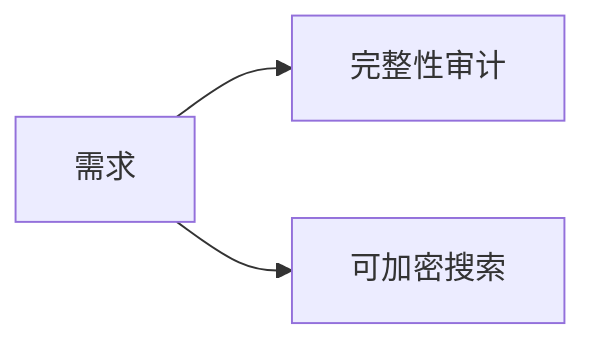
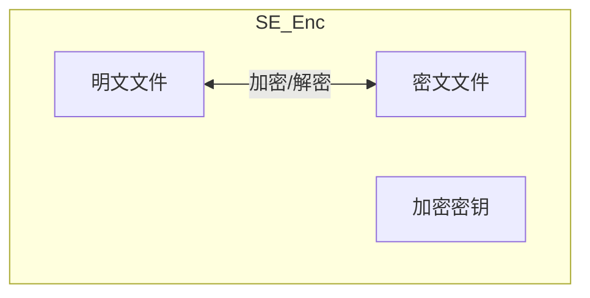
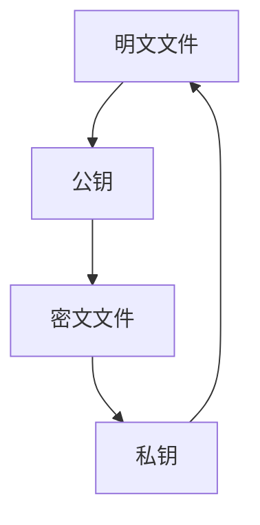

# 1. 背景知识（为什么）
- 研究背景

- 现存方案缺陷
- 数学理论知识(一句话解释/解释对应的)
	- 双线性配对
	- 对称加密，密钥安全就能保证密文安全
	- 哈希算法
	- 非对称加密，同样对称加密类似

# 2. 方案做了什么，保证了安全（实现了什么）
1. 关键词安全。
2. 前向安全。
3. 加密搜索证明的集中化。
4. 数据完整性可验证。
5. 

# 3. 方案怎么做的
## 3.1.  关键词安全性
对称加密，密钥只要安全就你能保证安全性
## 3.2 前向安全
1. 一句话解释
2. 介绍ptr状态链
## 3.3 加密搜索过程与证明生成的大致过程介绍
search过程的大致介绍

### 搜索证明
#### 伪代码
>$Res, PS, AS ← ∅,st_\alpha ← st_d$
>while true:
>	// step1:Get IDs and st
>	$\overline{T}^{(\alpha)} ← H_2(T||st_a)$
>	$(ptr^{\alpha-1},op,kt,ID_F) ← DB[T_{\alpha}]$
>	$st_{\alpha-1}←SE.Dec(H_3(st_{\alpha}),ptr^{\alpha-1})$
>	$AS←AS\cup ID_F$
>	// step2:Get proof params of a file
>	$if \   op == valid:$
>		$\theta←RandomSeed()$
>		$\psi_{\alpha}=\sum_{i=1}^{n}\sum_{j=1}^{s}\pi(\theta||ID_{F_\alpha,i})*c_{i,j}^{(\alpha)}$
>		$\varphi_{\alpha}=\prod_{i=1}^n(\sigma_i^{(\alpha)})^{\pi(\theta||ID_{F_\alpha},i)}$
>		$PS←PS\cup(ID_{F_\alpha},\psi_\alpha,\varphi_\alpha)$
>	// Step3: End Condition
>	$if\ st_{\alpha-1} == st_\alpha: \ break;$
>	$else:\ st_{\alpha}=st_{\alpha-1}$
>$PS←PS\cup\varphi = \prod_{ID_{F_\alpha}\in AS}kt_{\alpha}^{(w)}$
>Pubish $(T,st_d,Res,PS)$ to blockchain.

#### 搜索验证伪代码
> Get $(T,st_d,Res,PS)$ from blockchain
> Init: $\zeta_1,\zeta_2,\zeta_3,\rho$
> 	$\zeta_1\leftarrow\prod_{ID_{F_{\alpha}}}\prod_{i=1}^n H_2(ID_{F_\alpha}||i)^{\pi(\theta||ID_{F_\alpha})}$
> 	$\zeta_2 \leftarrow \prod_{ID_{F_{\alpha}}}H_2(ID_{F_\alpha})$
> 	$\zeta_3 \leftarrow\prod_{ID_{F_{\alpha}}}\varphi_\alpha*\varphi$
> 	$\rho\leftarrow\sum_{ID_{F_\alpha}}\psi_\alpha$
> Compute pairing
> 	$e(\zeta_3,g)?=e(\zeta_1*\zeta_2*H_2(st_d||T)*\mu^{\rho},pk)$
> Publish the result 0/1 to blockchain.
## 3.4 数据完整性介绍/单个文件的完整性审计
单个文件的审计过程与证明过程
>Input:  $ID_F,C=\{c_i\}_{i=1}^n,TS_F=\{\sigma\}_{i=1}^n$
>Init: $\psi,\varphi$
>	$\psi \leftarrow \sum_{i=1}^n\sum_{j=1}^s\pi(\theta||ID_F,i)*c_{i,j}$
>	$\varphi\leftarrow\prod_{i=1}^n\theta_i^{\pi(\theta||ID_F),i}$
>$Proof = (\psi,\varphi)$
>Publish $(ID_F,Proof)$ to blockchain.

证明验证过程
>Get $Proof(\psi,\varphi)$ 
>Init: $\zeta$
>	$\zeta \leftarrow\prod_{i=1}^nH_2(ID_F||i)^{\pi(\theta||ID_F,i)}$
>Pairing Verify:
>	$e(\varphi,g)?=e(\zeta*\mu^\psi,pk)$
>Publish result 0/1 to blockchain.
# 4. 本方案的性能优势

## 4.1 base line 介绍
1. Enabling reliable keyword search in encrypted decentralized storage with fairness
	- 一个可搜索加密的方案
2. Provable data possession at untrusted stores
	- 一个基于默克尔树的方案。
	- 计算性能好，效率高。
3. Enabling secure and efficient decentralized storage auditing with blockchain
	- 文件完整性审计方案。
	- 达到最佳的上链消费。
4. 1+2 组成baseline 1。
5. 1+3 组成base line 2。
## 4.2 阶段性能分析 (计算性能与gas消费)
### 密钥初初始化阶段
![[../../../assets/pics/Pasted image 20251124110340.png]]

### 委托存储能计算
#### 客户端
计算信息的时间消耗
传输信息的时间消耗

#### 服务端
计算信息的时间消耗
接收信息的时间消耗

#### 区块链
由于不需要对于索引数据库的每一项都进行哈希存储，索引gas消耗渐少。
![[../../../assets/pics/Pasted image 20251124152602.png]]

### 可验证搜索与完整性审计
![[../../../assets/pics/Pasted image 20251124152617.png]]