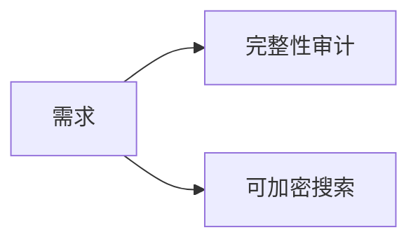
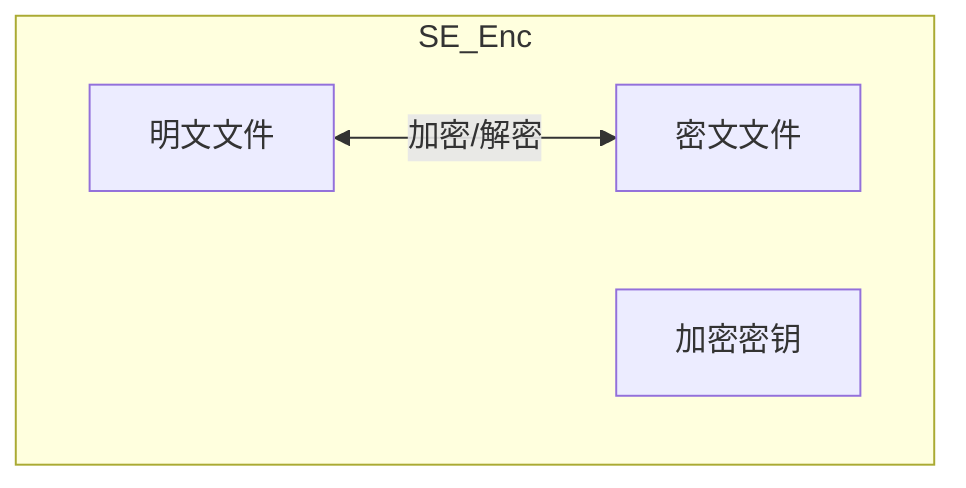
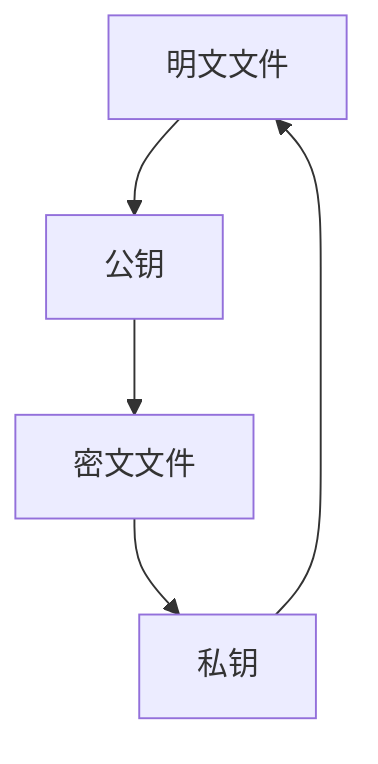

# 1. 背景知识（为什么）
- 研究背景

- 现存方案缺陷
- 数学理论知识(一句话解释/解释对应的)
	- 双线性配对
	- 对称加密，密钥安全就能保证密文安全
	- 哈希算法
	- 非对称加密，同样对称加密类似

# 2. 方案做了什么，保证了安全（实现了什么）
1. 关键词安全。
2. 前向安全。
3. 加密搜索证明的集中化。
4. 数据完整性可验证。
5. 

# 3. 方案怎么做的
## 3.1.  关键词安全性
对称加密，密钥只要安全就你能保证安全性
## 3.2 前向安全
1. 一句话解释
2. 介绍ptr状态链
## 3.3 加密搜索过程与证明生成的大致过程介绍
search过程的大致介绍

## 3.4 数据完整性介绍/单个文件的完整性审计
单个文件的审计过程与证明过程

# 4. 本方案的性能优势

## 4.1 base line 介绍
1. Enabling reliable keyword search in encrypted decentralized storage with fairness
	- 一个可搜索加密的方案
2. Provable data possession at untrusted stores
	- 一个基于默克尔树的方案。
	- 计算性能好，效率高。
3. Enabling secure and efficient decentralized storage auditing with blockchain
	- 文件完整性审计方案。
	- 达到最佳的上链消费。
4. 1+2 组成baseline 1。
5. 1+3 组成base line 2。
## 4.2 阶段性能分析 (计算性能与gas消费)
### 密钥初初始化阶段
![[../../../assets/pics/Pasted image 20251124110340.png]]

### 委托存储能计算
#### 客户端
计算信息的时间消耗
传输信息的时间消耗

#### 服务端
计算信息的时间消耗
接收信息的时间消耗

#### 区块链
由于不需要对于索引数据库的每一项都进行哈希存储，索引gas消耗渐少。
![[../../../assets/pics/Pasted image 20251124152602.png]]

### 可验证搜索与完整性审计
![[../../../assets/pics/Pasted image 20251124152617.png]]