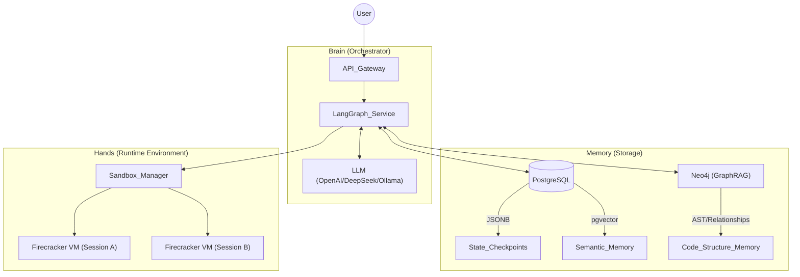

没问题。既然你是计算机硕士背景，我们就不玩虚的了。我会把这份计划细化到 **“代码实现粒度”**，通过拆解关键 Class、函数逻辑和架构图，让你不仅知道“做什么”，更知道“怎么写”。

这是 **Self-Correcting Coding Agent (v1.0)** 的详细开发手册。

---

### **Week 1: 驾驭 LangGraph (从 Chain 到 Graph 的思维重构)**

**核心目标**：理解 `State`（状态）如何在节点间流转，实现一个带有“记忆”和“路由”功能的简单 Agent。

#### **Day 1-2: 环境与状态定义**

LangGraph 的核心是 `State`。不同于 LangChain 的隐式传递，LangGraph 要求显式定义状态。

- **Task**: 定义全局状态 `AgentState`。
    
- **代码思路**:
    
    Python
    
    ``` python
    from typing import TypedDict, Annotated, List, Union
    from langchain_core.messages import BaseMessage
    import operator
    
    # 这里的 add_messages 是关键，它负责把新消息 merge 到历史记录中，而不是覆盖
    from langgraph.graph.message import add_messages
    
    class AgentState(TypedDict):
        # 消息历史：存储 User, Assistant, Tool 的所有对话
        messages: Annotated[List[BaseMessage], add_messages]
        # 迭代次数：用于防止 Agent 陷入死循环
        iterations: int
        # 当前生成的代码（临时存储）
        current_code: str
        # 最后的执行结果
        execution_output: str
    ```
    

#### **Day 3-5: 节点 (Nodes) 与 边 (Edges) 的实现**

- **Task**: 实现一个基础的 `chatbot` 节点和一个 `router`（路由器）。
    
- **关键逻辑**:
    
    - **Nodes**: 只是标准的 Python 函数，输入是 `State`，输出是 `State` 的更新量（Dict）。
        
    - **Conditional Edges**: 判断逻辑。比如“用户是否想要写代码？是 -> 进 Coder 节点；否 -> 进 Chat 节点”。
        
- **练习**: 跑通一个简单的图：`Start -> Router -> (Chat / Coder) -> End`。
    

---

### **Week 2: 构建核心工具——Docker 沙箱 (The Executor)**

**核心目标**：实现 `Process Isolation`（进程隔离）。LLM 生成的代码必须在监狱（Docker）里跑，不能炸了你的宿主机。

#### **Day 1-2: Dockerfile 设计**

你需要一个轻量级但环境齐全的镜像。

- **Task**: 编写 `Dockerfile`。
    
    Dockerfile
    
    ```
    FROM python:3.10-slim
    WORKDIR /workspace
    # 预装常用库，避免每次运行都要 pip install，浪费时间
    RUN pip install numpy pandas matplotlib requests
    # 限制非 root 用户，防止提权攻击
    RUN useradd -m appuser
    USER appuser
    ```
    

#### **Day 3-5: 编写 Python 沙箱接口 (Sandbox Wrapper)**

这是本周最硬核的部分。你需要用 `docker-py` SDK 管理容器生命周期。

- **Task**: 实现 `execute_code_in_docker` 函数。
    
- **代码逻辑详解**:
    
    1. **启动容器**: `client.containers.run(..., detach=True, network_disabled=True)` (断网是为了安全，除非你需要联网)。
        
    2. **写入代码**: 不要用 `volume` 挂载（那是持久化用的），用 `container.put_archive` 将 LLM 生成的代码字符串打包成 `.tar` 流，直接写入容器内存文件系统。
        
    3. **执行命令**: `container.exec_run(cmd="python script.py", workdir="/workspace")`。
        
    4. **捕获输出**: 获取 `exit_code` (0 是成功，非 0 是失败) 和 `output` (stdout + stderr)。
        
    5. **资源清理**: 无论成功失败，必须 `container.remove(force=True)`。
        
- **CS 考点**: 处理 **Timeout**。如果 LLM 写了个 `while True: pass`，你的 Python 脚本必须能通过 `try...except TimeoutError` 强杀容器。
    

---

### **Week 3: 架构组装——自修正闭环 (The Self-Correction Loop)**

**核心目标**：把 LLM、Docker 工具和逻辑流串起来，形成 Project 的灵魂。

#### **Day 1: 设计 Graph 拓扑**

你需要实现的图结构如下：

1. **Generate**: 生成代码。
    
2. **Execute**: 运行代码。
    
3. **Reflect (Conditional)**:
    
    - 如果 `exit_code == 0`: 结束。
        
    - 如果 `exit_code != 0`: 进入 Reflector 节点。
        
    - 如果 `iterations > 3`: 强制结束（熔断机制）。
        

#### **Day 2-3: 提示词工程 (Prompt Engineering for Agents)**

不要只写 "You are a coder"。你需要结构化的 Prompt。

- **Coder Prompt**:
    
    > "Context: {history}. Previous Errors: {error_logs}. Plan: Write python code to solve the user problem. Ensure you fix the errors mentioned."
    
- **Reflector Prompt (关键)**:
    
    > "Code: {code}. Traceback: {stderr}. Task: Analyze why the code failed. Provide **specific actionable steps** to fix it. Do NOT write full code, just logic."
    
    - _注_：为什么 Reflector 不直接改代码？因为让它先“思考”原因（Chain of Thought），再让 Coder 去改，效果比直接改好得多。
        

#### **Day 4-5: 调试死循环**

- **场景**: LLM 经常会反复犯同一个错。
    
- **Task**: 在 `State` 中加入 `past_errors` 列表。每次 Coder 生成代码前，System Prompt 必须强制它读取 `past_errors`，避免重蹈覆辙。
    

---

### **Week 4: 进阶优化——AST 检查与依赖管理**

**核心目标**：增加系统鲁棒性，体现计算机专业的深度。

#### **Day 1-2: 静态代码分析 (Static Analysis)**

在扔进 Docker 之前，先用极低的成本过滤低级错误。

- **Task**: 在 `Coder` 和 `Executor` 之间插入一个轻量级检查。
    
    Python
    
    ```
    import ast
    def check_syntax(code_str):
        try:
            ast.parse(code_str)
            return True, ""
        except SyntaxError as e:
            return False, f"Syntax Error on line {e.lineno}: {e.msg}"
    ```
    
- 如果 AST 检查失败，直接弹回给 Coder，**根本不要启动 Docker**。这能显著降低延迟。
    

#### **Day 3-4: 动态依赖安装**

如果用户让 Agent 画图，它需要 `pip install seaborn` 怎么办？

- **策略**: 让 LLM 识别出 `ImportError`。
    
- **实现**: 在 Reflector 中加入逻辑——如果是 `ModuleNotFoundError`，自动生成一条建议：“Need to install package X”。或者更高级一点，允许 Agent 调用一个 `install_package` 的 Tool（注意安全限制）。
    

---

### **Week 5: 评测与可观测性 (Evaluation)**

**核心目标**：用数据说话。

#### **Day 1-3: 集成 LangSmith**

- **Task**: 配置 `LANGCHAIN_TRACING_V2`。
    
- **分析**: 观察一个复杂的任务（例如：“写一个贪吃蛇游戏”）。
    
    - 它循环了多少次？
        
    - Reflector 的建议是否有效？
        
    - Token 消耗是多少？（GPT-4o 跑死循环会很贵）。
        

#### **Day 4-5: 跑分 (HumanEval)**

- **Task**: 写一个脚本，自动从 HuggingFace 加载 HumanEval 数据集。
    
- **流程**:
    
    1. 取 20 道题。
        
    2. Loop: 把题目输入给你的 Agent -> 拿到最终 Code。
        
    3. 验证: 运行 HumanEval 自带的单元测试。
        
    4. 计算 Pass@1。
        
- **预期结果**: 你的 Self-Correcting Agent 应该能解决一些 Zero-shot 无法解决的题目（特别是那些也就是差个符号、变量名写错的题）。
    

---

### **Week 6: 封装与演示 (The Portfolio Piece)**

**核心目标**：做一个能拿出来展示的 GUI。

#### **Day 1-3: Chainlit 界面开发**

- **Task**: 使用 `chainlit` 库。
    
- **亮点功能**:
    
    - **Step Expansion**: 利用 `cl.Message().send()` 的 sub-process 功能，把 "Executing Code...", "Analyzing Error..." 这些中间步骤折叠起来，只展示结果，点击可展开详情。
        
    - **代码高亮**: 漂亮的显示生成的 Python 代码。
        

#### **Day 4-5: 整理 README 与 架构图**

- 画一张清晰的 **Mermaid 流程图**（如前文所示）。
    
- 写明：如何处理安全性（Docker）、如何处理循环（LangGraph）、性能指标（HumanEval）。
    

---



