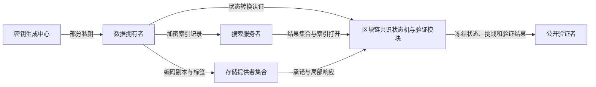
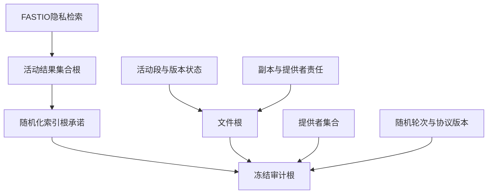
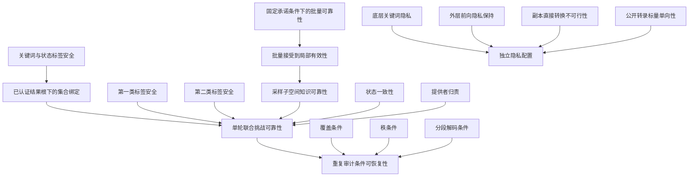

# 面向加密去中心化存储的可验证关键词搜索与多副本完整性联合审计方案

## 摘要

加密去中心化存储需要同时保证关键词检索正确性、多副本数据持有性和公开状态一致性。现有方案通常分别验证搜索结果或远程数据，直接组合会产生结果子集替换、跨副本冒充、批量错误抵消和混合快照等问题。**本文提出一种冻结状态下的可验证关键词搜索与多副本联合审计方案**。方案复用已有前向私有动态可搜索加密完成隐私检索，以规范压缩稀疏默克尔集合认证完整活动结果；通过分段纠删编码、版本根和副本分配根绑定文件当前状态，并以联合验收的双分量证书无关同态认证分别处理公钥替换攻击者与掌握主密钥的第二类攻击者。查询阶段把搜索结果、文件根、全部活动副本、提供者集合、规范挑战策略、随机轮次和协议版本冻结到同一审计根。各提供者先对局部响应签名承诺，待承诺集合关闭后再由独立随机信标产生批量系数，从而阻止多提供者协调错误抵消并支持责任区分。安全分析首先证明单轮联合挑战可靠性，即一次接受能够认证冻结状态及本轮被挑战线性关系；进一步在多轮独立审计满足覆盖、秩和分段解码条件时给出条件可恢复性。代数核心为常数大小，但完整证明和验证前处理仍随结果数、副本数、挑战数及提供者数增长。

**关键词：** 去中心化存储；可搜索加密；完整性审计；多副本；证书无关密码；区块链

## 1 引言

### 1.1 研究背景

数据拥有者将文件加密并外包至去中心化存储网络后，不再直接控制远程数据。存储节点可能因硬件故障、软件异常或经济动机而删除、篡改或仅保留部分数据。可证明数据持有和可恢复性证明通过随机抽查文件块，使验证者无需下载完整文件即可检查远程数据是否仍被保存[5-8]。然而，当系统同时支持加密关键词检索时，仅验证返回文件的数据完整性并不足以保证检索正确性：恶意搜索服务者可能遗漏匹配文件、插入不匹配文件、重放旧结果，或者只返回其仍然保存完整的文件。

多副本机制能够提高数据可用性和容灾能力，但也带来新的真实性问题。若不同副本在编码、标签或挑战上下文中不可区分，多个存储提供者可以共享同一份数据并声称保存了多个副本[9-11]。若副本分配、文件版本和关键词结果集合分别维护，攻击者还可能在搜索、挑战和证明生成之间替换某一层状态，使每个局部证明单独有效而联合陈述不成立。

区块链能够保存不可篡改的公开状态并执行确定性验证逻辑，从而缓解可信第三方审计者的单点故障和合谋问题[1-3]。但是，简单地把搜索证明、多副本证明和链上日志并列存储，会造成重复证明材料、状态语义不一致和线性增长的链上负担。更重要的是，区块链透明性会放大更新轨迹泄露：若每次关键词关系更新都公开固定关键词叶的位置，则历史搜索一旦暴露该叶，后续更新会被直接关联到已搜索关键词，从而破坏前向隐私[14-20]。

### 1.2 研究问题

本文研究如下问题：在不依赖固定可信第三方审计者的加密去中心化存储中，如何使公开验证者在同一冻结查询上下文中确认四类事实：

1. 返回集合恰好等于目标关键词在冻结时刻的完整活动结果集合；
2. 返回文件的当前版本、全部活动副本和对应存储提供者责任均被纳入挑战；
3. 索引、文件、副本分配、密钥时期、挑战随机性和协议版本在证明完成前不可替换；
4. 中继者可以代为提交消息，但不能获得拥有者授权或冒充存储提供者，同时历史搜索不能关联未来索引更新。

### 1.3 设计挑战

**联合状态一致性。** 搜索证明和数据持有证明若不共享冻结状态，攻击者可以返回可通过审计的结果子集，或在搜索、挑战和证明之间替换文件版本、副本分配及提供者责任。

**证书无关多副本认证。** 副本标识必须同时进入编码、标签上下文、挑战系数和责任分配；认证结构还应分别抵抗公钥替换攻击者与掌握主密钥的第二类证书无关攻击者。

**可归责批量验证。** 多个提供者若在已知批量系数后生成响应，可以协调错误抵消；承诺阶段若不认证提供者身份，中继者还可抢占位图并制造错误归责。

**动态状态与隐私。** 文件和索引状态必须经拥有者授权原子切换，而链上更新不能公开稳定关键词位置。本文复用已有前向私有动态可搜索加密，仅设计其外层认证与冻结接口。

### 1.4 主要贡献

1. **冻结状态下的搜索—多副本联合审计。** 方案先验证关键词活动全集，再把关键词目录根、文件根、版本、副本分配、提供者集合、挑战策略和协议版本固定到同一审计根，消除搜索验证与多副本审计之间的状态替换窗口。

2. **证书无关的副本特定同态认证。** 方案采用联合验收的用户秘密值分量和部分私钥分量，将拥有者身份、密钥时期、文件、副本、段位置和版本统一绑定到标签上下文，并在标准第一类公钥替换攻击和第二类主密钥知悉攻击下分别证明新认证上下文不可伪造性；持有真实标签但缺失数据的攻击由独立证明知识可靠性处理。

3. **可归责的先承诺后随机化批量机制。** 每个提供者在承诺阶段签署承诺消息，全部承诺关闭后再由独立随机信标派生批量系数；揭示阶段另行签署完整响应。该机制同时阻止提供者间错误抵消、承诺索引抢占和跨查询栽赃。

4. **分层联合安全证明。** 方案以拥有者授权和必要提供者确认实现原子状态转换，先证明单轮搜索全集、冻结状态、局部挑战关系和提供者归责的联合可靠性，再在多轮覆盖、秩和分段解码条件下给出条件可恢复性。隐私检索层采用已有前向私有动态可搜索加密，本文只证明外层认证状态的扩展泄露边界。

### 1.5 论文结构

第2节讨论相关工作；第3节给出密码学预备知识和记号；第4节定义系统、攻击者和安全目标；第5节说明总体设计；第6节给出具体构造；第7节分析正确性和理论开销；第8节给出安全定义与证明；第9节讨论实现和部署边界；第10节总结全文。主要算法、不变量、状态机和完整归约置于文末补充材料；正式投稿时从同一源文件拆分为独立补充文件。

---

## 2 相关工作

### 2.1 可证明数据持有与可恢复性证明

阿特尼西等提出可证明数据持有模型，使客户端能够通过随机抽查验证不可信存储中的远程数据[5]。朱尔斯和卡利斯基提出可恢复性证明，强调从高成功率证明者中恢复完整文件[6]。沙查姆和沃特斯进一步构造紧凑可恢复性证明，以同态认证器和随机线性组合降低通信开销[7]。厄韦等提出动态可证明数据持有，利用认证字典支持块插入、删除和修改[8]；石等进一步给出实用动态可恢复性证明，表明纠删码布局、认证结构与更新接口需要协同设计[41]。上述工作奠定了随机审计、同态聚合、动态更新和知识提取基础，但不处理加密搜索结果集合、多副本责任分配或区块链冻结状态。

### 2.2 多副本与多云审计

柯特莫拉等提出多副本可证明数据持有，通过副本特定变换防止一个副本冒充多个副本[9]。李继国等研究多云环境中的基于身份多副本数据持有证明，使多个云服务器协同生成聚合证明[4]。张庆阳等面向去中心化存储使用多项式承诺和区块链实现多文件、多副本批量审计[2]。这些工作证明了副本区分和跨提供者聚合的重要性，但尚未统一处理关键词结果全集、前向私有索引和证书无关拥有者认证。

### 2.3 区块链辅助完整性审计

区块链辅助审计通常把挑战、证明或验证结果写入公开账本，并由链上验证模块或智能合约执行确定性裁决。张庆阳等重点降低多副本批审计的链上状态开销[2]；朱晨等使用区块链替代固定第三方审计者，并强化了“保留标签但删除数据”场景下的审计证明安全模型[3]；宋明阳等进一步把可验证搜索和完整性审计合入一个证明流程[1]。本文在这些工作基础上进一步处理多个提供者之间的错误抵消、拥有者授权的原子状态更新以及密钥时期冻结。

### 2.4 可搜索加密、前向隐私与公开可验证性

柯特莫拉等形式化了可搜索对称加密的适应性安全定义[14]，后续动态方案进一步研究更新、搜索和访问泄露[15-17]。博斯特提出前向私有构造，使历史搜索令牌不能关联未来插入记录[18]；宋向福等提出FAST和FASTIO，仅使用对称密码原语实现前向隐私，其中FASTIO在保持FAST安全与通信特征的基础上进一步优化输入输出效率[21]。本文选定 **FASTIO** 作为默认隐私检索实例，FAST仅作为兼容替换配置；二者均不作为本文创新。

前向私有可验证动态搜索已经形成独立研究分支。郭程等构造支持高效合取查询的前向私有可验证DSSE[42]；郭宇等利用区块链保存公开摘要并实现公开可验证的前向私有加密搜索[43]；朱晓洁等进一步同时考虑动态数据集的前向、后向隐私和结果验证[44]。这些方案解决的是加密索引返回结果的可验证性，尚未把搜索全集与文件当前版本、全部活动副本、存储提供者责任、挑战随机性和批量归责共同冻结为一个数据持有陈述。

本文只使用单关键词、插入前向隐私接口。关系删除以追加删除事件表示，不声明后向隐私。本文在FASTIO外部维护认证关键词状态和结果集合根，但其目的不是重新提出可验证DSSE，而是把已经验证的搜索全集接入多副本审计状态。底层动态可搜索加密负责隐私检索，外层认证结构负责将结果集合、文件状态和提供者责任纳入同一 `AuditRoot`；二者的泄露边界分别建模。

### 2.5 证书无关密码与公开审计

阿尔—里亚米和帕特森提出证书无关公钥密码，通过密钥生成中心部分私钥和用户自选秘密值同时避免证书管理和完全密钥托管[22]。黄欣等重新审视证书无关签名安全模型，强调公钥替换和主密钥知悉的第二类证书无关攻击者的不同能力[23]。朱晨等将两类攻击者模型用于完整性审计[3]。张晓军等进一步研究区块链支持的动态证书无关外包数据审计和多所有权转移[45]。这些方案说明了证书无关认证、动态责任和公开裁决可以结合，但未处理前向私有搜索全集与多副本数据持有的冻结联合验证。

现有部分审计构造将同一个部分私钥群元素直接乘入标签，若标签结构和查询模型处理不当，可能遭受公钥替换后的因子提取。本文采用联合验收的两个配对认证分量，并明确区分新认证上下文不可伪造性与使用真实标签伪造缺失数据证明的知识可靠性。该双分量结构是联合协议的认证组件，本文的主要创新仍是冻结联合陈述和可归责的多提供者批量审计，而非把两个基础认证分量本身包装为独立通用原语。

### 2.6 认证数据结构与随机信标

默克尔树和认证数据结构通过抗碰撞哈希把大型状态压缩为短根值[25-26]。以太坊使用改进的默克尔—帕特里夏树维护公开状态[27]。本文使用普通默克尔树维护块版本、固定深度稀疏默克尔树维护关键词目录，并使用规范化压缩稀疏默克尔集合绑定完整搜索结果。随机信标方面，分布式随机协议能够提供公开可验证、不可预测和抗偏置输出[28]。本文不限定具体信标实现，只要求正式安全配置在预定轮次前对存储攻击者不可预测且不能被其单独偏置。

### 2.7 与最接近工作的差异

| 方案 | 搜索结果公开可验证 | 前向隐私 | 多副本/多提供者 | 证书无关 | 冻结文件与责任状态 | 承诺后随机化与归责 |
|---|---:|---:|---:|---:|---:|---:|
| 宋明阳等[1] | 是 | 是（插入型） | 否 | 否 | 文件动态状态 | 否 |
| 郭程等[42] | 是 | 是 | 否 | 否 | 否 | 否 |
| 郭宇等[43] | 是 | 是 | 否 | 否 | 仅搜索摘要 | 否 |
| 张庆阳等[2] | 不适用 | 不适用 | 是 | 否 | 文件/副本摘要 | 否 |
| 朱晨等[3] | 不适用 | 不适用 | 否 | 是 | 否 | 否 |
| 李继国等[4] | 不适用 | 不适用 | 是 | 基于身份 | 否 | 否 |
| 本文 | 是 | 继承FASTIO | 是 | 是 | 是 | 是 |

表中能力只依据原论文明确给出的安全定义和协议接口；未被正式建模的能力不根据题名或实现截图推断。

本文的差异不在于重新设计每个底层原语，而在于三个协议机制：第一，把已经验证的搜索全集、文件版本、全部活动副本和提供者责任冻结为不可替换的联合陈述；第二，以双分量证书无关同态认证实现副本特定、版本特定的数据持有验证；第三，以提供者签名承诺和承诺后随机化实现可归责的多提供者批量验证。

## 3 预备知识与记号

### 3.1 非对称双线性群与计算假设

令 \(G_1\)、\(G_2\) 和 \(G_T\) 为阶为素数 \(p\) 的循环群，\(g_1\in G_1\)、\(g_2\in G_2\) 为生成元，存在高效可计算、非退化的双线性映射

\[
e:G_1\times G_2\rightarrow G_T,
\]

满足对任意 \(a,b\in\mathbb Z_p\) 和 \(U\in G_1,V\in G_2\)，有

\[
e(U^a,V^b)=e(U,V)^{ab}.
\]

本文采用三型非对称配对群，不假设存在从 \(G_1\) 到 \(G_2\) 或从 \(G_2\) 到 \(G_1\) 的高效同态。

**辅助验证公钥输入的 \(G_1\)-CDH 假设。** 为精确匹配“认证元素位于 \(G_1\)、验证公钥位于 \(G_2\)”的公开验证接口，本文显式采用以下计算假设：给定

\[
(g_1,A=g_1^\alpha,g_2,Y=g_2^\alpha,U),\qquad U\leftarrow G_1,
\]

其中 \(\alpha\leftarrow\mathbb Z_p^*\) 未知，计算 \(U^\alpha\) 对任意概率多项式时间算法均为困难。本文将该精确接口记为

\[
\mathsf{AI\mbox{-}G1\mbox{-}CDH},
\]

其中“AI”表示归约额外获得与同一未知指数一致的辅助验证公钥表示 \(Y=g_2^\alpha\)。该名称只用于避免把本接口与文献中输入不同的 co-CDH 变体混同；本文不声称它与普通 \(G_1\)-CDH 完全等价，也不把该假设作为创新贡献。其额外输入正对应协议公开验证密钥中已经存在的跨源群表示。双分量上下文认证的安全归约明确以该假设为前提；公开审计转录的标量单向性另依赖 \(G_1\) 上的离散对数困难性。BLS型配对认证及其常用计算假设背景见文献[24]，本文定理均以此处给出的精确输入接口为准。

### 3.2 分段可恢复编码

为避免一般全文件纠删码与局部追加、截断操作不一致，本文先对文件执行认证加密，再把认证密文划分为固定容量逻辑段：

\[
F^{enc}=(Seg_1,\ldots,Seg_L).
\]

每个新段使用单调递增且永久不复用的段计数器和随机数生成唯一标识：

\[
segment\_id_{f,\ell}=H(\text{“段标识”}\parallel fid\parallel segment\_counter_{f,\ell}\parallel segment\_nonce_{f,\ell}).
\]

活动段按逻辑位置形成规范向量

\[
SegmentVector_f=\bigl\{(pos_\ell,segment\_counter_{f,\ell},segment\_id_{f,\ell},valid\_length_{f,\ell})\bigr\}_{\ell=1}^{L_f}.
\]

对每个条目计算

\[
SegmentLeaf_{f,\ell}=H(\text{“段目录叶”}\parallel \mathsf{Encode}(pos_\ell,segment\_counter_{f,\ell},segment\_id_{f,\ell},valid\_length_{f,\ell})),
\]

\[
SegmentRoot_f=\mathsf{MerkleRoot}(SegmentLeaf_{f,1},\ldots,SegmentLeaf_{f,L_f}).
\]

文件元数据另保存单调递增的 `next_segment_counter`。完整删除的段从活动向量移除，但计数器不得回退；后续追加即使再次占据相同逻辑位置，也必须使用新的计数器和新的段标识。旧文件根保留被删除段的历史承诺。

每个活动段独立调用同一线性纠删码

\[
\mathsf{EC.Enc}_{seg}:\mathbb Z_p^{K_s}\rightarrow\mathbb Z_p^{n_s},
\qquad
\mathsf{EC.Dec}_{seg}:\mathbb Z_p^{\ge K_s}\rightarrow\mathbb Z_p^{K_s}.
\]

记段标识为 \(sid\) 的编码符号为

\[
C_{f,sid}=\{c_{f,sid,1},\ldots,c_{f,sid,n_s}\}.
\]

任意不少于 \(K_s\) 个满足解码条件的同段编码符号可以恢复该段的认证密文符号。最后一段不足 \(K_s\) 个符号时使用长度承诺和规范填充；有效长度进入 `SegmentVector`，填充规则、编码参数和 `next_segment_counter` 进入文件元数据。

分段编码只保证更新局部性，不自动给出抽查可恢复性。本文正式证明采样子空间知识可靠性：提取器首先恢复满足覆盖和秩条件的副本编码块；拥有者去除副本掩码后，只有在同一段获得不少于 \(K_s\) 个可用编码符号时，才能调用 \(\mathsf{EC.Dec}_{seg}\) 恢复该段。完整文件恢复要求每个活动段均达到相应解码条件。

### 3.3 密码学原语

本文使用以下原语：

- 伪随机函数、密钥派生函数和文件认证加密算法；
- 输出到 \(G_1\) 的域分离哈希 \(H_x,H_d\)；
- 输出到 \(\mathbb Z_p^*\) 的域分离哈希 \(H_p\)，其中“部分密钥”“挑战”“掩码”和“批量”使用独立域；
- 输出固定长度比特串的抗碰撞哈希 \(H\)；
- 满足选择消息攻击下存在性不可伪造的提供者签名；
- 在预定轮次前不可预测、不可由存储攻击者单独偏置的最终确认随机信标或可验证随机函数。

隐私检索层采用已有前向私有动态可搜索对称加密

\[
\mathsf{FPDSSE}=(\mathsf{Setup},\mathsf{Update},\mathsf{Token},\mathsf{Search}),
\]

其中初始化算法输出客户端状态 \(St\) 和加密数据库 \(EDB\)；更新算法把关系事件转换为更新令牌；令牌算法根据关键词和客户端状态生成搜索令牌；搜索算法返回与该关键词相关的事件序列。默认实例固定为FASTIO[21]；FAST仅作为具有相同前向隐私目标但输入输出效率不同的兼容配置。本文不依赖其内部地址、指针或密文格式，只要求其满足原论文定义的适应性关键词隐私和插入前向隐私。若替换为其他实例，应在实验和泄露表中显式记录其搜索模式、访问模式、更新长度、客户端状态及删除泄露。

为隐藏未打开的目录根，定义随机化根承诺

\[
\mathsf{RootCom.Commit}(ctx,D;\rho)=H(\text{“随机化根承诺”}\parallel ctx\parallel\rho\parallel D),
\]

其中 \(\rho\leftarrow\{0,1\}^{\lambda}\)。打开算法接收 \((D,\rho)\) 并重算承诺。其绑定性归约为规范编码下的哈希碰撞；在随机预言机模型中，只要 \(\rho\) 在打开前保持秘密，承诺值对 \(D\) 具有计算隐藏性。该原语只用于封装目录根，不替代目录树本身的集合绑定性。

所有哈希输入均采用第9节规定的规范编码和独立域标签。

### 3.4 认证数据结构

文件块版本使用普通默克尔树；关键词目录使用固定深度稀疏默克尔树；关键词活动关系集合使用确定性压缩稀疏默克尔集合。压缩集合可视为由完整键比特串唯一确定的二进制压缩前缀树：每个内部节点记录全部后代键的最长公共前缀长度和前缀值，左右子树分别包含下一分歧比特为0和1的非空键集合；禁止单子节点、依赖插入顺序的旋转和实现私有节点编号。空集合、叶和分支使用独立域标签。

### 3.5 主要记号

| 记号 | 含义 |
|---|---|
| \(s,mpk\) | 密钥生成中心主密钥和主公钥 |
| \(PPK_{ID,e},UPK_{ID,e}\) | 不可替换的部分公开参数与可替换的用户公开密钥 |
| \(St,EDB\) | 前向私有动态可搜索加密的客户端状态与加密数据库 |
| \(d,R\) | 拥有者部分私钥标量和部分公开值 |
| \(x,X\) | 拥有者自选秘密值和用户公开密钥 |
| \(Y_{ID}\) | 由身份、时期和部分公开值导出的部分验证公钥 |
| \(key\_epoch\) | 拥有者密钥时期 |
| \(KeyDigest_e\) | 绑定时期、部分公开参数、用户公钥和验证公钥的规范摘要 |
| \(ActiveRel[kw\_id,fid]\) | 关键词—文件对当前唯一活动关系随机数，未激活时为 \(\bot\) |
| \(fid\) | 文件标识 |
| \(segment\_id,k\) | 永久不复用的段标识与段内编码符号编号 |
| \(K_s,n_s\) | 单段原始符号数与编码符号数 |
| \(copy\_id_{f,j}\) | 文件 \(f\) 第 \(j\) 个副本标识 |
| \(provider\_ref_q\) | 绑定提供者身份、注册时期和签名公钥的引用 |
| \(ver_{f,sid,k}\) | 文件 \(f\) 的段 \(sid\) 内第 \(k\) 个编码符号版本 |
| \(DirRoot\) | 关键词稀疏目录树的内部规范根 |
| \(IndexRoot\) | 带全局新鲜随机数的链上索引根承诺 |
| \(index\_seq,index\_nonce\) | 全局索引状态序号与每次根转换的新鲜随机数 |
| \(ResultSetRoot_w\) | 关键词 \(w\) 的活动关系集合根 |
| \(state\_seq_w,leaf\_nonce_w\) | 关键词外层状态序号与每次更新的新鲜叶随机数 |
| \(SegmentVector_f,SegmentRoot_f\) | 活动段目录及其承诺根 |
| \(VersionVector_f,VersionRoot_f\) | 活动编码位置版本向量及其承诺根 |
| \(ReplicaVector_f,ReplicaRoot_f\) | 活动副本—提供者责任向量及其承诺根 |
| \(FileMeta_f,FileRoot_f\) | 文件活动元数据及其规范状态根 |
| \(KwCtx_w\) | 关键词当前外层认证上下文 |
| \(rel\_key\) | 关键词活动关系在压缩集合中的规范键 |
| \(ChallengePolicy,ChallengePolicyDigest\) | 每文件挑战规模、抽样模式、段范围和副本范围的规范策略及其摘要 |
| \(AuditRoot\) | 冻结查询根 |
| \((\sigma^x,\sigma^d)\) | 数据块双分量同态标签 |
| \((\kappa^x,\kappa^d)\) | 关键词状态双分量标签 |
| \((\tau^x,\tau^d)\) | 状态转换双分量认证器 |
| \(\Omega_q\) | 由冻结状态和挑战确定的提供者 \(q\) 责任范围 |
| \(LocalScopeDigest_q\) | \(\Omega_q\) 的规范摘要 |
| \(S_q^x,S_q^d,R_q^x,R_q^d,z_q\) | 提供者 \(q\) 的局部审计响应 |
| \(\gamma_q\) | 可分叉掩码挑战 |
| \(\beta_q\) | 批量随机系数 |
| \(\Pi\) | 完整公开证明 |

---

## 4 系统模型与安全目标

### 4.1 系统实体

系统包含密钥生成中心、数据拥有者、搜索服务者、存储提供者以及区块链共识状态机五类实体。密钥生成中心生成公共参数和部分私钥，但不知道拥有者自选秘密值。数据拥有者加密、编码和复制文件，维护关键词状态并授权更新。搜索服务者保存前向私有索引，可遗漏、替换或重放结果。全部存储提供者可合谋、删除数据、保留标签或协调响应。区块链保存活动状态根、提供者注册信息、未完成查询的最小共识状态和审计结果；确定性验证模块执行根转换、查询冻结、签名、位图及配对裁决，本文假设共识与验证模块代码正确执行。

**拥有者信任边界。** 本文假设数据拥有者在文件预处理、关键词关系语义、活动结果集合维护和状态授权方面诚实。公开验证证明的是：恶意搜索服务者、存储提供者或中继者不能把与拥有者已授权状态不一致的结果或数据响应作为有效证明接受；协议不判断拥有者是否主动登记了错误文件、错误关键词关系或错误副本内容。第一类和第二类证书无关游戏用于刻画拥有者密钥材料受到攻击时的认证不可伪造性，并不把协议扩展为恶意数据拥有者安全。

任何主体均可读取链上状态和证明并执行公开验证。交易发送地址只表示提交者，不表示证书无关拥有者或存储提供者身份。中继者可以代为提交更新、承诺和揭示，但拥有者授权由双分量状态转换认证器验证，提供者身份由登记签名验证。



### 4.2 攻击者模型

**第一类证书无关攻击者。** 不知道主密钥，可替换目标身份的用户公开密钥 \(UPK_{ID,e}=X\)，但不能替换密钥生成中心产生的部分公开参数 \(PPK_{ID,e}\)，可控制搜索和存储角色，并可在替换后继续请求合法认证对象；但不能获得目标部分私钥 \(d\) 或完整私钥。

**第二类证书无关攻击者。** 知道主密钥和目标部分私钥，可生成部分认证分量，但不能替换目标用户公开密钥 \(UPK_{ID,e}\)，也不知道目标用户秘密值 \(x\)。

**存储攻击者。** 搜索服务者与全部存储提供者合谋，可删除数据、保留标签、协调局部响应、延迟消息或选择性退出。

**协议攻击者。** 可重复、换序、延迟或丢弃消息，但不能修改已最终确认的共识状态。

**公开转录观察者。** 能读取全部公开状态、搜索打开材料和审计转录，但不持有目标提供者的被挑战数据块、拥有者副本掩码密钥或提供者内部随机数。第8.10节的标量单向性只针对该观察者；持有目标数据的提供者本身能够直接计算相应线性组合，不属于该性质的保护对象。

### 4.3 安全目标

本文把安全目标划分为六类，具体游戏和定理在第8节给出。

1. **检索隐私。** 底层FASTIO满足适应性关键词隐私和插入前向隐私；外层认证状态不得增加未声明的关键词—未来更新关联。
2. **搜索与状态完整性。** 返回集合必须等于冻结关键词的完整活动集合，文件根、段目录、版本、副本分配和提供者集合必须与冻结状态一致。
3. **证书无关认证安全。** 第一类攻击者不能在替换用户公开密钥后伪造新的部分私钥认证分量；掌握主密钥的第二类攻击者不能伪造新的用户秘密值认证分量。
4. **单轮联合挑战可靠性。** 一次公开验证接受必须保证搜索全集、冻结文件状态、全部活动副本责任以及本轮被挑战线性关系同时成立；该目标不把一次抽查等同于完整文件持有或恢复。
5. **重复审计条件可恢复性。** 对同一活动数据状态执行多轮独立审计后，仅在挑战覆盖、线性系统秩和分段纠删码解码条件同时成立时，才声明相应采样子空间、分段或完整文件可恢复。
6. **分布式协议一致性与归责。** 批量错误不能在承诺后随机系数下抵消；状态切换必须获得拥有者授权和必要提供者确认；承诺、揭示和超时事件能够归责到唯一登记提供者。

### 4.4 泄露边界与非目标

允许泄露搜索模式、访问模式、搜索链长度、结果数量、结果文件标识、副本数量、提供者分配、文件更新标识、更新批次大小以及链上时序。关系更新不公开被修改的固定关键词叶位置，但链上观察者能够看到旧、新全局索引根、转换类型以及索引更新是否与文件状态变更处于同一逻辑批次；这些关联被显式纳入第8.4节的泄露函数。

审计记录允许导出 \((u_x)^{\gamma_q\mu_q}\) 和 \((u_d)^{\gamma_q\mu_q}\) 的群元素形式；公开转录观察者可以针对已知候选值执行等值测试。本文只证明不持有目标数据的公开观察者在离散对数困难性下难以从单次转录恢复标量 \(\mu_q\)，不对生成响应的提供者声明该性质，也不声明选择文件不可区分性。

方案保证与诚实拥有者已授权状态不一致的搜索结果和数据响应不能被接受，但不验证拥有者自行授权的数据语义，也不保证持续服务可用性。恶意搜索服务者可以拒绝保存更新记录、拒绝响应或返回损坏密文；恶意存储提供者也可以选择性退出。此类行为由状态机记录为可用性失败或协议违约，但密码学机制不能强制其继续服务。方案还不证明副本位于特定物理设备，也不阻止网络层转包；提供者签名只能证明登记主体提交了某个响应。

### 4.5 直接组合失效分析

| 直接组合方式 | 产生的问题 | 本文机制 |
|---|---|---|
| 搜索后再选择审计对象 | 恶意搜索者可只返回可通过审计的子集 | 先验证全集并冻结，再生成挑战 |
| 多副本共用标签上下文 | 一个副本可响应多个副本 | 编码、标签、系数和分配根同时绑定副本标识 |
| 单因子证书无关标签 | 替换公钥后可从标签中分离部分私钥因子 | 双分量认证器，两个秘密指数不可由同类攻击者同时获得 |
| 先公布批量系数 | 多提供者可协调错误抵消 | 先承诺完整响应，后派生批量系数 |
| 索引和文件分别激活 | 查询可能读取混合快照 | 拥有者认证的原子根转换 |
| 公开固定关键词叶更新 | 历史搜索可关联未来更新 | 链上只公开整个索引根转换 |

---

## 5 方案总体设计

### 5.1 四层状态结构

方案由四层组成。第一层采用FASTIO保存加密关系事件并提供插入前向隐私；第二层以关键词状态标签和规范压缩稀疏默克尔集合认证当前活动结果；第三层以文件根统一绑定活动段、块版本、副本标识和存储责任；第四层在查询开始时把上述状态、提供者集合、随机轮次和协议版本冻结为同一 `AuditRoot`。



协议只维护以下核心不变量：活动状态绑定唯一拥有者与密钥时期；任意 \((kw\_id,fid)\) 在任一时刻至多存在一个活动关系实例；根切换必须获得拥有者授权和必要提供者确认；候选状态不得进入查询；冻结查询只读取最终确认的活动状态；规范挑战策略、提供者集合、随机轮次和验证代码在冻结后不可替换；终态标识不得复用。

### 5.2 证书无关认证层

密钥生成中心为拥有者产生不可替换的部分公开参数和部分私钥，拥有者另行选择可替换用户公钥对应的秘密值。数据标签、关键词状态标签和状态转换认证均包含用户秘密值分量与部分私钥分量，协议仅在两个分量同时通过时接受。第一类攻击者可以替换用户公钥但不知道部分私钥；第二类攻击者掌握主密钥和部分私钥，但不能替换目标用户公钥且不知道用户秘密值。具体密钥和标签公式见第6.1—6.4节。

### 5.3 文件、多副本与动态状态

文件先认证加密，再按固定容量分段纠删编码。每个新段获得永久不复用的 `segment_id`，块版本、段目录、副本标识和提供者分配共同进入文件状态。副本通过独立伪随机掩码区分，同一编码符号在不同副本中具有不同块值和认证上下文。段内修改只重编码目标段；完整删除的段从活动目录移除且标识不得复用。文件、副本或责任变化先形成候选状态，只有拥有者授权和相应提供者确认齐全后才原子激活。

### 5.4 隐私检索与结果认证

FASTIO只负责返回关系事件。拥有者按规范事件语义维护活动集合，并为每个关键词生成结果集合根和双分量关键词状态标签。关键词目录的内部根不直接上链，而是使用第3.3节的随机化根承诺封装；更新交易只公开新旧承诺及批次元数据。搜索时证明方打开当前目录根、随机数、关键词叶和路径，验证者重建结果集合根并检查关键词标签。这样，隐私检索、集合完整性和链上状态承诺分别承担独立职责。

### 5.5 冻结查询与可归责批量流程

查询冻结时，共识验证模块从活动状态读取索引根和文件根，验证搜索结果、活动段、副本向量、提供者集合及规范 `ChallengePolicy`，并生成 `AuditRoot`。挑战随机性在冻结交易最终确认后产生。每个提供者根据冻结责任范围计算局部响应并签名承诺；全部承诺关闭后，系统再确定第二随机轮次和批量系数；随后提供者签名揭示完整响应。最终验证把关键词状态和所有局部响应聚合到两个固定数量的配对等式中。

该流程重点区分三类事件：未提交有效承诺、已承诺但未揭示、以及中继者提交无效材料。只有前两类能够归责到登记提供者。完整状态字段和转换条件见第6节与补充材料A。

## 6 具体构造

### 6.1 系统初始化与注册

系统初始化选择三型非对称双线性群和主密钥 \(s\leftarrow\mathbb Z_p^*\)，设置

\[
mpk=g_2^s,
\]

并输出

\[
PP=(p,G_1,G_2,G_T,e,g_1,g_2,mpk,u_x,u_d,H_x,H_d,H_p,H,\mathsf{PRF},\mathsf{KDF},\mathsf{AE},\mathsf{FPDSSE},\mathsf{Sig}).
\]

其中 \(u_x,u_d\leftarrow G_1\) 为独立随机生成元。对拥有者 \(owner\_id\) 的密钥时期 \(e\)，密钥生成中心选择 \(r_e\leftarrow\mathbb Z_p^*\)，计算

\[
R_e=g_2^{r_e},
\qquad
h_{ID,e}=H_p(\text{“部分密钥”}\parallel owner\_id\parallel e\parallel\mathsf{EncPoint}(R_e)),
\]

\[
d_e=r_e+s h_{ID,e}\pmod p,
\qquad
Y_{ID,e}=R_e\,mpk^{h_{ID,e}}=g_2^{d_e}.
\]

拥有者验证 \(g_2^{d_e}=Y_{ID,e}\)，再选择 \(x_e\leftarrow\mathbb Z_p^*\)，设置 \(X_e=g_2^{x_e}\)。不可替换部分公开参数、可替换用户公钥和完整验证信息分别为

\[
PPK_{ID,e}=(R_e,e),
\qquad
UPK_{ID,e}=X_e,
\qquad
VK_{ID,e}=(R_e,e,X_e,Y_{ID,e}).
\]

当前时期摘要定义为

\[
\begin{aligned}
KeyDigest_e=H(&\text{“密钥时期摘要”}\parallel owner\_id\parallel e\parallel
\mathsf{EncPoint}(R_e)\parallel\mathsf{EncPoint}(X_e)\\
&\parallel\mathsf{EncPoint}(Y_{ID,e})\parallel\mathsf{EncPoint}(mpk)).
\end{aligned}
\]

所有数据、关键词和状态转换上下文均绑定 \(KeyDigest_e\)，从而不能把旧时期标签解释为新时期标签。拥有者另行保存关键词标识密钥 \(K_{kw,e}\) 和副本掩码主密钥 \(K_{mask,e}\)；二者不公开，也不直接进入公开验证密钥。 在固定密钥时期内，后文无歧义时将 \(x_e,d_e,X_e,Y_{ID,e}\) 简写为 \(x,d,X,Y_{ID}\)。

每个存储提供者生成签名密钥对 \((sk_q,pk_q)\)，并将 \((provider\_id_q,pk_q,registry\_epoch_q)\) 登记到时期化注册表。所有签名消息均绑定链标识、验证模块标识、协议版本和相应注册时期。

### 6.2 文件、副本状态与双分量数据标签

对文件 \(f\)，定义编码参数

\[
ECParams_f=(segment\_size,K_s,n_s,padding\_rule\_id).
\]

活动段目录 \(SegmentVector_f\) 和 \(SegmentRoot_f\) 按第3.2节生成。对活动段 \(sid\) 的第 \(k\) 个编码符号，记基础编码值为 \(c_{f,sid,k}\)，版本为 \(ver_{f,sid,k}\)。版本向量按 \(SegmentVector_f\) 的逻辑位置和段内索引规范排序：

\[
VersionVector_f=\mathsf{SortUnique}(\{(sid,k,ver_{f,sid,k})\}).
\]

版本叶和版本根定义为

\[
VersionLeaf_{f,sid,k}=H(\text{“版本叶”}\parallel fid\parallel sid\parallel k\parallel ver_{f,sid,k}),
\]

\[
VersionRoot_f=\mathsf{MerkleRoot}(VersionLeaf_{f,sid,k}\text{ 按规范顺序排列}).
\]

每个活动副本使用永久唯一的 \(copy\_id_{f,j}\)。拥有者从副本掩码主密钥派生

\[
K_{f,j}=\mathsf{KDF}(K_{mask,e},\text{“副本掩码密钥”}\parallel owner\_id\parallel e\parallel fid\parallel copy\_id_{f,j}),
\]

并计算

\[
\rho_{f,j,sid,k}=\mathsf{PRF}_{K_{f,j}}(fid\parallel copy\_id_{f,j}\parallel sid\parallel k\parallel ver_{f,sid,k}),
\]

\[
m_{f,j,sid,k}=c_{f,sid,k}+\rho_{f,j,sid,k}\pmod p.
\]

副本重新创建必须使用新的 \(copy\_id\)；仅提供者责任迁移可以保留原 \(copy\_id\) 和数据块。活动副本条目为

\[
ReplicaEntry_{f,j}=(copy\_id_{f,j},provider\_ref_{f,j},assignment\_epoch_{f,j},\text{active}),
\]

\[
ReplicaVector_f=\mathsf{SortUnique}(\{ReplicaEntry_{f,j}\}_{j=1}^{N_f}),
\]

其中按 \(copy\_id\) 的规范字节序排序，并拒绝重复副本标识或重复责任条目。计算

\[
ReplicaLeaf_{f,j}=H(\text{“副本责任叶”}\parallel fid\parallel\mathsf{Encode}(ReplicaEntry_{f,j})),
\]

\[
ReplicaRoot_f=\mathsf{MerkleRoot}(ReplicaLeaf_{f,1},\ldots,ReplicaLeaf_{f,N_f}).
\]

文件活动元数据固定为

\[
\begin{aligned}
FileMeta_f=(&owner\_id,e,KeyDigest_e,fid,encrypted\_length_f,ECParams_f,SegmentRoot_f,\\
&VersionRoot_f,ReplicaRoot_f,next\_segment\_counter_f,file\_status_f),
\end{aligned}
\]

其中 \(file\_status_f\in\{\text{active},\text{tombstone}\}\)。文件状态根为

\[
FileRoot_f=H(\text{“文件状态”}\parallel\mathsf{Encode}(FileMeta_f)).
\]

墓碑文件使用规范空段根、空版本根和空副本根，并保留原 \(fid\)、密钥时期和删除状态；墓碑不得进入新查询。

对段标识为 \(sid\) 的副本编码块定义

\[
DataCtx_{f,j,sid,k}=(owner\_id,e,KeyDigest_e,fid,copy\_id_{f,j},sid,k,ver_{f,sid,k}).
\]

计算

\[
A_{f,j,sid,k}=H_x(\text{“数据用户分量”}\parallel \mathsf{Encode}(DataCtx_{f,j,sid,k})),
\]

\[
B_{f,j,sid,k}=H_d(\text{“数据部分密钥分量”}\parallel \mathsf{Encode}(DataCtx_{f,j,sid,k})).
\]

数据标签为

\[
\sigma^x_{f,j,sid,k}=(A_{f,j,sid,k}u_x^{m_{f,j,sid,k}})^{x_e},
\]

\[
\sigma^d_{f,j,sid,k}=(B_{f,j,sid,k}u_d^{m_{f,j,sid,k}})^{d_e}.
\]

单标签验证检查

\[
e(\sigma^x_{f,j,sid,k},g_2)=e(A_{f,j,sid,k}u_x^{m_{f,j,sid,k}},X_e),
\]

\[
e(\sigma^d_{f,j,sid,k},g_2)=e(B_{f,j,sid,k}u_d^{m_{f,j,sid,k}},Y_{ID,e}).
\]

每个不可变 \(DataCtx\) 只允许认证一个由诚实外包或合法更新算法生成的消息块。本文不额外引入链上标签注册表：唯一性由诚实拥有者、单调版本、永久段标识以及原子文件根转换共同保证；安全游戏中的 `AuthTable` 记录全部合法认证查询。段内修改提高版本，完整删除后重新追加使用新的 \(segment\_id\)，因此旧标签不能被解释为新状态标签。第8.6节证明新认证上下文不可伪造；持有真实标签但缺少消息块的攻击由第8.7节处理。

### 6.3 关键词状态标签

拥有者对规范化关键词 \(w\) 计算时期化伪名

\[
kw\_id=\mathsf{PRF}_{K_{kw,e}}(\text{“关键词标识”}\parallel owner\_id\parallel e\parallel\mathsf{Normalize}(w)).
\]

对活动关系 \((fid,rel\_nonce)\) 定义

\[
rel\_key=H(\text{“关系键”}\parallel kw\_id\parallel fid\parallel rel\_nonce),
\]

并以 \(rel\_key\) 作为确定性压缩稀疏默克尔集合的固定长度规范键；\((fid,rel\_nonce)\) 是验证者重算该键的打开材料。拥有者为每个关键词—文件对维护唯一活动关系映射

\[
ActiveRel[kw\_id,fid]\in\{\bot,rel\_nonce\}.
\]

任一时刻只允许一个活动随机数：插入要求当前值为 \(\bot\)，删除必须引用并匹配当前活动随机数，重插必须在旧关系完成删除后生成新的 \(rel\_nonce\)。重复插入、删除不存在关系或使用旧随机数删除新关系均被规范事件解释和原子根转换拒绝。当前关键词外层上下文固定为

\[
KwCtx_w=(owner\_id,e,KeyDigest_e,kw\_id,state\_seq_w,leaf\_nonce_w,ResultSetRoot_w).
\]

其中 \(state\_seq_w\) 单调增加，\(leaf\_nonce_w\leftarrow\{0,1\}^{\lambda}\) 在每次关键词状态变化时重新采样；从未初始化关键词使用规范空集合根和序号0。

定义

\[
A_{kw}=H_x(\text{“关键词用户分量”}\parallel \mathsf{Encode}(KwCtx_w)),
\]

\[
B_{kw}=H_d(\text{“关键词部分密钥分量”}\parallel \mathsf{Encode}(KwCtx_w)).
\]

关键词状态标签为

\[
\kappa^x_w=A_{kw}^x,
\qquad
\kappa^d_w=B_{kw}^d.
\]

验证等式为

\[
e(\kappa^x_w,g_2)=e(A_{kw},X),
\qquad
e(\kappa^d_w,g_2)=e(B_{kw},Y_{ID}).
\]

关键词目录位置和关键词叶分别为

\[
KeywordDirKey_w=H(\text{“关键词目录键”}\parallel kw\_id),
\]

\[
KeywordLeaf_w=H(\text{“关键词叶”}\parallel \mathsf{Encode}(KwCtx_w)\parallel \mathsf{EncPoint}(\kappa^x_w)\parallel \mathsf{EncPoint}(\kappa^d_w)).
\]

目录树在 `KeywordDirKey_w` 处保存该叶并得到内部根 \(DirRoot\)。每次全局目录状态变化生成新的 \(index\_seq\) 和 \(index\_nonce\)，链上只保存

\[
IndexRoot=\mathsf{RootCom.Commit}((owner\_id,e,index\_seq),DirRoot;index\_nonce).
\]

更新阶段不公开 \(DirRoot\)、目录键、叶或路径；搜索冻结时才打开当前 \((index\_seq,index\_nonce,DirRoot)\) 和关键词路径。

### 6.4 拥有者认证的原子状态转换

对每个文件变更定义

\[
AckItem_{f,q}=(provider\_id_q,registry\_epoch_q,ack\_type,candidate\_digest_q).
\]

提供者确认的候选摘要必须覆盖其实际收到并验证的数据、标签和责任分配：

\[
DataDigest_q=H(\text{“候选数据”}\parallel \mathsf{Encode}(\mathsf{Sort}(\{fid,copy\_id,sid,k,H(m)\}_q))),
\]

\[
TagDigest_q=H(\text{“候选标签”}\parallel \mathsf{Encode}(\mathsf{Sort}(\{fid,copy\_id,sid,k,H(\sigma^x\parallel\sigma^d)\}_q))),
\]

\[
AssignmentDigest_q=H(\text{“候选责任”}\parallel \mathsf{Encode}(\mathsf{Sort}(\{copy\_id,provider\_ref_q,assignment\_epoch\}_q))),
\]

\[
candidate\_digest_q=H(\text{“提供者候选确认”}\parallel new\_FileRoot_f\parallel DataDigest_q\parallel TagDigest_q\parallel AssignmentDigest_q).
\]

提供者只有在本地收到相应数据、验证标签并确认责任分配后才签署该摘要。必要确认摘要为

\[
ReqAckDigest_f=H(\text{“必要确认集合”}\parallel \mathsf{Encode}(\mathsf{SortUnique}(\{AckItem_{f,q}\}))).
\]

文件变更集合为

\[
\Delta_F=\mathsf{SortUnique}(\{(fid,old\_FileRoot_f,new\_FileRoot_f,ReqAckDigest_f)\}),
\]

其默克尔根为 \(FileDeltaRoot\)。状态转换上下文为

\[
StateTransCtx=(owner\_id,e,KeyDigest_e,update\_id,update\_type,old\_IndexRoot,new\_IndexRoot,FileDeltaRoot,deadline).
\]

计算

\[
A_{st}=H_x(\text{“状态转换用户分量”}\parallel \mathsf{Encode}(StateTransCtx)),
\]

\[
B_{st}=H_d(\text{“状态转换部分密钥分量”}\parallel \mathsf{Encode}(StateTransCtx)),
\]

\[
\tau^x_{st}=A_{st}^x,
\qquad
\tau^d_{st}=B_{st}^d.
\]

验证模块检查

\[
e(\tau^x_{st},g_2)=e(A_{st},X),
\qquad
e(\tau^d_{st},g_2)=e(B_{st},Y_{ID}).
\]

提供者确认消息为

\[
AckMsg_q=(chain\_id,verifier\_module\_id,protocol\_version,update\_id,FileDeltaRoot,ack\_type,candidate\_digest_q,provider\_id_q,registry\_epoch_q).
\]

不同更新类型使用以下确认规则：

| 更新类型 | 必须确认的主体 | 确认对象 |
|---|---|---|
| 初始外包 | 全部新存储提供者 | 副本块、标签和候选文件根 |
| 段修改 | 保存受影响副本的全部提供者 | 新段编码块、新标签和候选摘要 |
| 新增副本 | 新提供者 | 完整新副本及标签 |
| 删除副本 | 拥有者授权；旧提供者确认可选 | 责任终止摘要 |
| 副本重新分配 | 新提供者必须确认；旧提供者签署责任释放 | 新旧责任切换 |
| 文件墓碑删除 | 当前责任提供者确认或按超时违约规则处理 | 删除候选状态 |
| 纯索引关系更新 | 不要求搜索服务者成为安全确认方 | 仅验证拥有者根转换授权 |
| 密钥时期迁移 | 全部活动提供者 | 新时期标签集合和候选根 |

共识验证模块只有在以下条件同时成立时才原子激活候选状态：

1. 双分量状态转换认证均有效；
2. 旧索引根及全部旧文件根等于链上当前活动状态；
3. 表中要求的确认签名齐全、唯一且注册时期有效；
4. \(update\_id\) 未使用且未过期；
5. 候选状态未进入中止或过期终态。

仅索引关系更新时 \(\Delta_F\) 为空；仅文件更新时新旧索引根相同。搜索服务者不确认索引记录只造成可用性失败，不影响拥有者对活动根的密码学授权。大规模更新可分阶段准备数据和确认，但只有最终根切换交易改变活动状态。

### 6.5 初始外包

拥有者执行：

1. 对文件认证加密，执行规范域元素映射并划分固定容量段；
2. 对每段独立执行 \(\mathsf{EC.Enc}_{seg}\)，生成 \(n_s\) 个基础编码符号；
3. 为每个活动副本生成永久唯一 \(copy\_id\)，按第6.2节派生副本掩码密钥并生成副本块；
4. 生成 \(SegmentRoot_f\)、\(VersionRoot_f\)、\(ReplicaRoot_f\)、\(FileMeta_f\)、\(FileRoot_f\) 和全部双分量数据标签；
5. 向目标提供者发送对应副本、标签和候选文件元数据；
6. 由提供者验证标签并签署“初始存储确认”；
7. 生成从空文件状态到新文件根的双分量状态转换认证；
8. 共识验证模块在授权和确认齐全后激活文件根；
9. 通过同一或后续原子转换激活关键词关系。

在必要提供者确认齐全前，候选文件不得进入新查询。拥有者可在外包完成后删除本地明文，但必须保留文件加密密钥、副本掩码主密钥、编码参数和必要恢复元数据；否则无法执行后续密钥迁移。

### 6.6 关系更新与搜索

**唯一活动关系状态。** 对每个 \((kw\_id,fid)\)，拥有者维护

\[
ActiveRel[kw\_id,fid]\in\{\bot,rel\_nonce\}.
\]

关系状态转换只有以下三类合法操作：

- 插入：要求 \(ActiveRel[kw\_id,fid]=\bot\)，采样新 \(rel\_nonce\) 并写入该值；
- 删除：要求事件携带的随机数等于当前活动值，完成后写回 \(\bot\)；
- 重插：必须先完成旧关系删除，再采样从未使用的新 \(rel\_nonce\) 执行插入。

因此重复插入、删除不存在关系、使用历史随机数删除新关系以及同一关键词—文件对的双重活动状态均为非法事件。该映射由拥有者的规范事件解释和已认证索引根状态共同维护，不额外引入逐关系链上数据库。

**关系更新。** 拥有者把合法插入、删除或重插编码为关系事件，并调用默认FASTIO实例的 \(\mathsf{Update}\) 产生更新令牌。拥有者在本地先按上述规则更新 `ActiveRel`，再由所有非空项构造活动集合

\[
Active_w=\{(fid,ActiveRel[kw\_id,fid]):ActiveRel[kw\_id,fid]\ne\bot\}.
\]

活动集合必须满足

\[
\forall fid,\quad \#\{(fid,rel\_nonce)\in Active_w\}\le 1.
\]

拥有者据此重算 \(ResultSetRoot_w\)，递增 \(state\_seq_w\)，采样新的 \(leaf\_nonce_w\)，更新关键词叶和内部 \(DirRoot\)；随后递增 \(index\_seq\)、采样新的 \(index\_nonce\)，计算候选 \(IndexRoot\)，再通过双分量状态转换认证授权整个索引根承诺变更。底层FASTIO的内部地址、密钥和缓存结构不进入本文协议状态。

**空关键词。** 从未初始化的关键词在首次外层认证时创建合法空状态：

\[
ResultSetRoot_w=H(\text{“空压缩集合”}),\qquad state\_seq_w=0,
\]

并采样新的 \(leaf\_nonce_w\)，生成对应的 \(KwCtx_w\)、关键词标签和目录叶。

**搜索。** 拥有者调用 \(\mathsf{FPDSSE.Token}\)，搜索服务者调用 \(\mathsf{FPDSSE.Search}\) 获得关系事件序列，并按同一规范状态机解释插入和删除，得到

\[
Res=\{(fid_\ell,rel\_nonce_\ell)\}_{\ell=1}^{r}.
\]

验证者除要求 \(Res\) 按 \(rel\_key\) 严格递增且无重复外，还检查文件标识唯一性，即不存在相同 \(fid\) 对应两个活动随机数。搜索服务者同时返回当前 \((index\_seq,index\_nonce,DirRoot)\)、关键词叶和稀疏默克尔路径 \(\Pi_{idx}\)。验证者先检查这些打开值重算得到链上当前 \(IndexRoot\)，再检查关键词叶属于 \(DirRoot\)，验证双分量关键词标签，并由完整 \(Res\) 重建压缩集合根。任何遗漏、插入、重复、同文件多活动实例、乱序或非规范前缀编码都会导致验证失败，除非发生相应认证伪造或哈希碰撞。

底层搜索解密失败、令牌无效或事件解析失败时，搜索服务者只能返回错误或拒绝服务；该行为不能通过外层结果集合验证。

### 6.7 查询冻结

冻结算法由共识状态机读取活动状态，而不接受调用者自由指定状态根。对每个结果文件 \(f\)，查询发起者提交挑战参数

\[
PolicyItem_f=(fid,c_f,sampling\_mode_f,segment\_scope_f,replica\_scope_f),
\]

其中主配置固定 \(segment\_scope_f=\text{全部活动段}\)、\(replica\_scope_f=\text{全部活动副本}\)，且 \(1\le c_f\le |\mathcal I_f|\)。规范挑战策略及其摘要为

\[
ChallengePolicy=\mathsf{SortUnique}(\{PolicyItem_f:f\in Res\}),
\]

\[
ChallengePolicyDigest=H(\text{“挑战策略”}\parallel\mathsf{Encode}(ChallengePolicy)).
\]

验证模块执行：

1. 读取当前活动 \(IndexRoot\)，验证 \((index\_seq,index\_nonce,DirRoot)\) 的根承诺打开，并在 \(DirRoot\) 下验证 \(\Pi_{idx}\)；
2. 验证两个关键词状态标签和结果集合根，检查每个 \(fid\) 至多对应一个活动关系实例；
3. 对每个 \(fid\) 读取当前活动 \(FileRoot_f\)，按第6.2节规范重算并检查 \(FileMeta_f\)，包括 \(KeyDigest_e\)、编码参数、活动段根、版本根、副本根、长度、段计数器和文件状态；
4. 从完整 \(SegmentVector_f\) 和 \(ReplicaVector_f\) 分别重建 \(SegmentRoot_f\) 与 \(ReplicaRoot_f\)，并检查段位置连续、计数器严格小于 `next_segment_counter`、段标识唯一且活动向量规范；
5. 检查 `ChallengePolicy` 恰好覆盖 \(Res\) 中的每个不同文件一次，且每个 \(PolicyItem_f\) 的挑战规模和范围合法；
6. 收集所有不同的 \(provider\_ref\)，按字节序规范排序并编号为 \(0,\ldots,P-1\)；
7. 对每个索引 \(i\) 计算

\[
ProviderLeaf_i=H(\text{“提供者索引”}\parallel i\parallel provider\_ref_i),
\]

并得到 \(ProviderSetDigest\)；
8. 计算

\[
StateDigest=H(\mathsf{SortUnique}(\{fid_\ell\parallel active\_FileRoot_{fid_\ell}\}));
\]

9. 等冻结交易达到最终确认后，以最终确认高度 \(h_f\) 确定

\[
challenge\_round=h_f+\Delta_{chal};
\]

10. 计算

\[
\begin{aligned}
AuditRoot=H(&\text{“冻结审计”}\parallel chain\_id\parallel verifier\_module\_id\parallel protocol\_version\parallel verifier\_code\_hash\parallel query\_id\\
&\parallel owner\_id\parallel e\parallel KeyDigest_e\parallel kw\_id\parallel active\_IndexRoot\parallel StateDigest\\
&\parallel ProviderSetDigest\parallel P\parallel ChallengePolicyDigest\parallel challenge\_round);
\end{aligned}
\]

11. 写入

\[
\begin{aligned}
QueryState=(&AuditRoot,ProviderSetDigest,P,ChallengePolicyDigest,challenge\_round,\\
&batch\_round,commit\_deadline,reveal\_deadline,phase,protocol\_version,verifier\_code\_hash).
\end{aligned}
\]

完整结果、挑战策略、文件元数据、活动段向量、副本向量和带索引的提供者列表是 \(AuditRoot\) 的打开见证。每个提供者在提交承诺时必须给出对应 \(ProviderLeaf_i\) 的成员证明；位图第 \(i\) 位只对应该叶，验证模块拒绝重复索引、同一提供者多个索引和集合外提供者。

### 6.8 挑战生成

验证者首先重算并检查冻结的 \(ChallengePolicyDigest\)。在预定随机轮次最终确认后，计算

\[
seed_{chal}=H(\text{“挑战种子”}\parallel chain\_id\parallel verifier\_module\_id\parallel AuditRoot\parallel ChallengePolicyDigest\parallel challenge\_round\parallel BeaconValue).
\]

对每个文件，从冻结的活动段向量和对应 \(PolicyItem_f\) 唯一导出允许位置集合

\[
\mathcal I_f=\{(sid,k):sid\in segment\_scope_f,1\le k\le n_s\}.
\]

主配置在全部活动段上按 `sampling_mode_f` 无放回抽取 \(c_f\) 个位置：

\[
I_f=\mathsf{SampleWithoutReplacement}(seed_{chal}\parallel fid\parallel sampling\_mode_f,\mathcal I_f,c_f).
\]

同一文件全部活动副本共享段内位置集合，但使用副本特定系数

\[
v_{f,j,sid,k}=H_p(\text{“挑战系数”}\parallel seed_{chal}\parallel ChallengePolicyDigest\parallel fid\parallel copy\_id_{f,j}\parallel sid\parallel k).
\]

若指定随机轮次在期限前未产生可验证值，查询进入不可逆中止状态，不得更换轮次并复用原查询标识。任何挑战规模、抽样模式、段范围或副本范围的改变都会改变 \(ChallengePolicyDigest\) 和 \(AuditRoot\)，不能在冻结后单独替换。

### 6.9 局部响应与可分叉掩码

令 \(\Omega_q\) 为由冻结副本向量、带索引提供者列表和挑战位置确定性导出的提供者 \(q\) 责任范围。其元素为 \((fid,copy\_id,sid,k)\)。验证者和提供者均计算

\[
LocalScopeDigest_q=H(\text{“局部范围”}\parallel \mathsf{Encode}(\mathsf{Sort}(\Omega_q))).
\]

完整 \(\Omega_q\) 不作为重复证明材料传输。提供者计算

\[
S_q^x=\prod_{(f,j,sid,k)\in\Omega_q}(\sigma^x_{f,j,sid,k})^{v_{f,j,sid,k}},
\]

\[
S_q^d=\prod_{(f,j,sid,k)\in\Omega_q}(\sigma^d_{f,j,sid,k})^{v_{f,j,sid,k}},
\]

\[
\mu_q=\sum_{(f,j,sid,k)\in\Omega_q}v_{f,j,sid,k}m_{f,j,sid,k}\pmod p.
\]

选择 \(\varepsilon_q\leftarrow\mathbb Z_p\)，设置

\[
R_q^x=u_x^{\varepsilon_q},
\qquad
R_q^d=u_d^{\varepsilon_q}.
\]

计算

\[
\begin{aligned}
\gamma_q=H_p(&\text{“掩码挑战”}\parallel AuditRoot\parallel provider\_id_q\parallel S_q^x\parallel S_q^d\\
&\parallel R_q^x\parallel R_q^d\parallel LocalScopeDigest_q),
\end{aligned}
\]

\[
z_q=\varepsilon_q+\gamma_q\mu_q\pmod p.
\]

令

\[
A_{data,q}=\prod_{(f,j,sid,k)\in\Omega_q}A_{f,j,sid,k}^{v_{f,j,sid,k}},
\qquad
B_{data,q}=\prod_{(f,j,sid,k)\in\Omega_q}B_{f,j,sid,k}^{v_{f,j,sid,k}}.
\]

单个提供者的正式局部验证关系为

\[
e((S_q^x)^{\gamma_q},g_2)e(R_q^x,X)
\stackrel{?}{=}
e((A_{data,q})^{\gamma_q}u_x^{z_q},X),
\tag{Lx}
\]

\[
e((S_q^d)^{\gamma_q},g_2)e(R_q^d,Y_{ID})
\stackrel{?}{=}
e((B_{data,q})^{\gamma_q}u_d^{z_q},Y_{ID}).
\tag{Ld}
\]

式(Lx)和式(Ld)是第8.7节知识提取器唯一使用的局部关系。全局验证默认不逐个执行它们，而是在承诺固定后通过随机 \(\beta_q\) 聚合为第6.11节的两个统一等式。

若在相同 \((S_q^x,S_q^d,R_q^x,R_q^d,LocalScopeDigest_q)\) 上分叉得到 \(\gamma_q\neq\gamma'_q\) 和两个接受响应，则

\[
\mu_q=(z_q-z'_q)(\gamma_q-\gamma'_q)^{-1}\pmod p.
\]

同一查询中若出现重复的 \((R_q^x,R_q^d)\)，验证模块直接拒绝，以避免随机掩码复用。

### 6.10 提供者签名承诺、批量随机化与揭示

提供者先计算

\[
\begin{aligned}
C_q=H(&\text{“局部响应承诺”}\parallel AuditRoot\parallel idx_q\parallel provider\_id_q\parallel registry\_epoch_q\\
&\parallel S_q^x\parallel S_q^d\parallel R_q^x\parallel R_q^d\parallel z_q\parallel LocalScopeDigest_q).
\end{aligned}
\]

为防止中继者抢占提供者索引或制造“承诺后未揭示”的错误归责，提供者在承诺阶段签署

\[
\begin{aligned}
CommitMsg_q=(&chain\_id,verifier\_module\_id,protocol\_version,verifier\_code\_hash,query\_id,\\
&AuditRoot,idx_q,provider\_id_q,registry\_epoch_q,C_q,commit\_deadline),
\end{aligned}
\]

\[
sig^{commit}_q=\mathsf{Sign}_{sk_q}(H(\text{“提供者承诺签名”}\parallel\mathsf{Encode}(CommitMsg_q))).
\]

承诺交易携带 \(ProviderLeaf_{idx_q}\) 的成员证明、\(C_q\) 和 \(sig^{commit}_q\)。验证模块只有在成员证明、固定索引、注册时期、承诺期限和承诺签名均有效时才设置承诺位图。无效中继提交不会占用位图，也不能被记录为提供者违约。

全部 \(P\) 个规范索引恰好提交一次有效签名承诺后，验证模块关闭承诺集合并计算

\[
C_{all}=H(\mathsf{Encode}(C_0,\ldots,C_{P-1})).
\]

承诺关闭交易达到最终确认后，以其最终确认高度 \(h_c\) 确定

\[
batch\_round=h_c+\Delta_{batch}.
\]

待该轮随机值最终确认后，计算

\[
seed_{batch}=H(\text{“批量种子”}\parallel AuditRoot\parallel C_{all}\parallel batch\_round\parallel BeaconValue(batch\_round)),
\]

\[
\beta_q=H_p(\text{“批量系数”}\parallel AuditRoot\parallel C_{all}\parallel seed_{batch}\parallel idx_q\parallel provider\_id_q).
\]

兼容配置可令

\[
seed_{batch}=H(\text{“非交互批量”}\parallel AuditRoot\parallel C_{all}),
\]

但必须显式计入攻击者尝试多个候选承诺摘要的 \(Q_H/(p-1)\) 项，并由不可复用查询标识和每索引唯一有效承诺限制试探次数。

揭示阶段，提供者签署

\[
\begin{aligned}
RevealMsg_q=(&chain\_id,verifier\_module\_id,protocol\_version,verifier\_code\_hash,query\_id,AuditRoot,C_{all},seed_{batch},\\
&idx_q,provider\_id_q,registry\_epoch_q,LocalScopeDigest_q,S_q^x,S_q^d,R_q^x,R_q^d,z_q,C_q).
\end{aligned}
\]

\[
sig^{reveal}_q=\mathsf{Sign}_{sk_q}(H(\text{“提供者揭示签名”}\parallel\mathsf{Encode}(RevealMsg_q))).
\]

验证模块检查揭示签名、承诺一致性、提供者成员证明、承诺与揭示位图以及范围摘要。协议明确区分：未提交有效承诺；已提交有效承诺但未揭示；中继者提交无效承诺或无效揭示。只有前两类事件可归责到对应提供者。

### 6.11 双等式统一聚合证明

定义

\[
\Sigma_x=\kappa_w^x\prod_q(S_q^x)^{\beta_q\gamma_q},
\qquad
\Sigma_d=\kappa_w^d\prod_q(S_q^d)^{\beta_q\gamma_q},
\]

\[
R_x=\prod_q(R_q^x)^{\beta_q},
\qquad
R_d=\prod_q(R_q^d)^{\beta_q},
\]

\[
z=\sum_q\beta_qz_q\pmod p.
\]

令

\[
A_{data}=\prod_{(f,j,sid,k)}A_{f,j,sid,k}^{\beta_{provider(f,j)}\gamma_{provider(f,j)}v_{f,j,sid,k}},
\]

\[
B_{data}=\prod_{(f,j,sid,k)}B_{f,j,sid,k}^{\beta_{provider(f,j)}\gamma_{provider(f,j)}v_{f,j,sid,k}}.
\]

公开验证检查两个固定数量的配对等式：

\[
e(\Sigma_x,g_2)e(R_x,X)
\stackrel{?}=
e(A_{kw}A_{data}u_x^z,X),
\tag{1}
\]

\[
e(\Sigma_d,g_2)e(R_d,Y_{ID})
\stackrel{?}=
e(B_{kw}B_{data}u_d^z,Y_{ID}).
\tag{2}
\]

代数核心为

\[
CoreAccumulator=(\Sigma_x,\Sigma_d,R_x,R_d,z),
\]

其大小与结果数、副本数和提供者数无关。完整证明还包含冻结根打开、随机信标打开、搜索结果、关键词路径、文件元数据、完整副本向量、版本多重证明、局部范围摘要、签名承诺和揭示签名，因此完整通信并非常数。

### 6.12 验证算法

验证者按以下顺序执行：

1. 检查查询状态、阶段、期限、协议版本、验证代码哈希、两个确定性随机轮次和信标打开；
2. 重建 \(AuditRoot\)，检查所有打开材料与冻结根一致；
3. 验证关键词目录路径、两个关键词状态标签和完整结果集合根；
4. 验证每个文件根、活动段向量、版本证明和完整副本向量；
5. 根据副本向量和挑战位置重建全局挑战宇宙；
6. 确定性重建各 \(\Omega_q\)，检查两两不交且并集恰好等于挑战宇宙，并计算 \(LocalScopeDigest_q\)；
7. 重算 \(C_q,C_{all},\gamma_q,\beta_q\)，验证带索引的提供者成员证明、位图和签名；
8. 重算 \(A_{kw},B_{kw},A_{data},B_{data},\Sigma_x,\Sigma_d,R_x,R_d,z\)；
9. 验证式(1)和式(2)；
10. 全部成立时接受，否则拒绝。

提供者不再传输完整局部范围列表，范围事实只有冻结副本向量和挑战这一组数据源。

### 6.13 动态更新

**段内块修改。** 任一原始符号修改都会重新编码其所在段的全部 \(n_s\) 个编码符号。该段保留原 `segment_id`，但所有受影响编码符号提高版本；对全部活动副本重算掩码块和标签，并更新版本根。

**文件追加。** 若最后一段未满，则保留其 `segment_id`，更新有效长度并重新编码尾段。若追加内容产生新段，则递增文件段计数器、采样新随机数并生成永久唯一的新 `segment_id`，再为新段生成编码符号、版本叶和标签。

**文件截断。** 截断落在某段内部时，保留该段标识并按新有效长度重新编码；被完全删除的尾段从活动 `SegmentVector` 中移除，其删除事件进入本次状态转换摘要，旧 `FileRoot` 由链上历史状态保留。`next_segment_counter` 不回退，后续追加即使占据相同逻辑位置，也必须生成新的 `segment_id`。活动段向量不保存删除墓碑。

**副本增加、删除和重新分配。** 新提供者先接收并签署“新副本接收确认”；副本根激活后，旧提供者才可签署“责任释放确认”。删除副本必须满足拥有者策略规定的最小副本数。

**文件删除。** 文件删除使用墓碑文件根，并与全部相关关键词关系删除放入同一逻辑转换。关系记录和确认可以分阶段准备，但只有最终原子根切换改变活动状态。历史事件和旧文件根保留，墓碑文件不得进入新查询。

**并发规则。** 冻结交易排序之前已激活的状态进入查询；冻结交易之后激活的状态不影响该查询；候选状态和待确认状态永不进入查询。

若一次逻辑更新涉及 \(s_u\) 个段，数据重编码和重标签复杂度为 \(O(s_un_sN)\)。段目录更新还需要 \(O(s_u\log L_f)\) 个哈希；不能只按被修改原始符号数估计更新成本。

### 6.14 密钥轮换

新时期由密钥生成中心产生新的 \((d',R')\)，拥有者产生新的 \((x',X')\)。定义

\[
\begin{aligned}
KeyMigrationCtx=(&owner\_id,e_{old},e_{new},KeyDigest_{old},KeyDigest_{new},old\_state\_digest,\\
&new\_state\_digest,RelabelAckDigest,migration\_id,deadline).
\end{aligned}
\]

旧时期迁出和新时期迁入使用不同域标签：

\[
\tau^{x,old}_{out}=H_x(\text{“密钥迁出用户分量”}\parallel\mathsf{Encode}(KeyMigrationCtx))^{x_{old}},
\]

\[
\tau^{d,old}_{out}=H_d(\text{“密钥迁出部分分量”}\parallel\mathsf{Encode}(KeyMigrationCtx))^{d_{old}},
\]

\[
\tau^{x,new}_{in}=H_x(\text{“密钥迁入用户分量”}\parallel\mathsf{Encode}(KeyMigrationCtx))^{x_{new}},
\]

\[
\tau^{d,new}_{in}=H_d(\text{“密钥迁入部分分量”}\parallel\mathsf{Encode}(KeyMigrationCtx))^{d_{new}}.
\]

验证模块分别使用旧、新时期的 \((X,Y_{ID})\) 验证四个配对等式，缺少任一时期授权均不得切换。

第一版采用“恢复后全局重标签”配置，不引入代理重签名。拥有者先用旧时期标签验证候选恢复块，无效块立即排除，并从其他副本或提供者补充同段编码符号；只有取得不少于 \(K_s\) 个可验证符号时才解码该段，否则迁移中止。恢复全部活动认证密文段后，拥有者按冻结的 `SegmentVector` 重新编码，重算全部活动副本块，在新时期下生成数据标签和关键词状态标签，并收集全部活动提供者的重标签确认。确认摘要形成 \(RelabelAckDigest\)。

迁移期间普通更新暂停，但已经冻结的旧时期查询可以继续验证。共识验证模块只在数据恢复、全局重标签、全部必要确认和四个迁移认证均完成后，原子切换当前时期、新索引根和全部新文件根。迁移中止后旧时期继续有效，不允许部分文件使用新时期而关键词目录仍使用旧时期。密钥轮换成本至少线性于全部活动数据规模，本文不把它表述为轻量更新。

## 7 正确性与理论开销

### 7.1 正确性

**引理1 搜索状态正确性。** 若FASTIO按其规范执行，拥有者对关系事件的解释正确，且结果集合使用规范排序和CSMT构建，则诚实搜索返回的活动集合重建为当前 \(ResultSetRoot_w\)。当前 \((index\_seq,index\_nonce,DirRoot)\) 能够打开链上 \(IndexRoot\)，关键词叶路径和双分量关键词标签均通过验证。

**引理2 状态转换正确性。** 若拥有者对同一 `StateTransCtx` 生成两个认证分量，所有必要提供者对规范 `candidate_digest` 签名，且旧根等于链上活动根，则原子转换算法把全部候选根同时激活；任何缺失确认或局部候选状态不会进入活动状态。

**引理3 范围划分正确性。** 给定冻结的 `ReplicaVector`、带索引提供者集合和挑战位置，确定性算法生成的 \(\Omega_q\) 两两不交且并集等于全局挑战宇宙，因此每个被挑战副本块恰好归属一个登记提供者。

**引理4 局部与批量聚合正确性。** 诚实提供者的局部响应满足两个局部配对等式；在承诺集合关闭后使用相同 \(\beta_q\) 聚合全部局部等式，得到第6.11节的两个统一配对等式。

**定理1 诚实执行正确性。** 若拥有者、搜索服务者和存储提供者按协议执行，两个随机信标值在期限内可验证地产生，且所有打开材料对应同一冻结状态，则验证算法接受。

**证明。** 由引理1，搜索结果、关键词标签和索引根承诺打开一致；由引理2，冻结读取的文件根、段目录根和副本责任均属于同一已授权活动状态；由引理3，全部活动副本挑战被无遗漏、无重复地划分到各提供者。对任一数据标签，双线性性给出

\[
e(\sigma^x,g_2)=e(Au_x^m,X),\qquad e(\sigma^d,g_2)=e(Bu_d^m,Y_{ID}).
\]

提供者把被挑战标签按系数聚合，并用 \(z_q=\varepsilon_q+\gamma_q\mu_q\) 消去随机掩码；由引理4，局部等式在批量系数下相乘得到两个统一等式。全部路径、签名、位图、随机轮次和状态检查也由诚实执行满足，因此验证接受。

### 7.2 理论操作数

记 \(M=\sum_{f\in Res}N_f c_f\) 为被挑战副本编码块项总数，\(S=\sum_{f\in Res}L_f\) 为活动段条目总数，\(P\) 为不同提供者数，\(H_G\) 表示一次哈希到 \(G_1\)，\(E_1\) 表示一次 \(G_1\) 标量乘，\(Pair\) 表示一次配对。下表忽略可并行化和多标量乘优化，只给出保守基本操作数。

| 算法 | 哈希到群 | \(G_1\)标量乘/多标量乘 | 配对 | 其他主要操作 |
|---|---:|---:|---:|---:|
| 单编码块双分量标签生成 | 2 | 4 | 0 | 常数哈希 |
| 单编码块标签验证 | 2 | 2 | 4 | 常数哈希 |
| 关键词状态标签生成 | 2 | 2 | 0 | 常数哈希 |
| 状态转换认证生成 | 2 | 2 | 0 | \(O(|\Delta_F|)\) 哈希 |
| 查询冻结 | 0 | 0 | 4 | \(O(rN+S+P)\) 哈希及路径检查 |
| 提供者局部证明 | 0 | 两个规模为 \(|\Omega_q|\) 的多标量乘+2 | 0 | \(O(|\Omega_q|)\) 域乘加 |
| 完整公开验证前处理 | \(2M+2\) | 两个规模为 \(M\) 的多标量乘及聚合 | 6 | \(O(M+rN+S+P)\) 哈希、恰好 \(2P\) 次commit/reveal验签、成员证明和两个信标打开验证 |
| 关系集合重建 | 0 | 0 | 0 | 验证者 \(O(r)\) 哈希，服务者排序 \(O(r\log r)\) |
| 单次关系更新 | 2 | 2 | 激活时4 | 一次底层动态可搜索加密更新、集合根和目录根转换 |
| 修改 \(s_u\) 个段 | \(2s_un_sN\) | \(4s_un_sN\) | 提供者逐块验收至多 \(4s_un_sN\)，激活4个配对项 | \(O(s_un_sN+s_un_s\log(L_fn_s))\) 哈希及受影响提供者确认验签 |
| 新增或重新分配副本 | 每新副本块2 | 每新副本块4 | 新提供者逐块验收每块4，激活4个配对项 | 新旧责任确认验签和副本根更新 |
| 全局密钥迁移 | 全部活动块与关键词各2 | 全部活动标签对应标量乘 | 四个迁移授权等式共8个配对项，另加恢复块标签验证 | 至少线性于活动数据规模和活动提供者数 |

共识状态成本还包括：冻结时写入一条 `QueryState`；承诺和揭示阶段分别写入 \(P\) 个承诺项和 \(P\) 个响应项，并更新两个 \(P\) 位位图；关闭阶段写入 \(C_{all}\) 和 `batch_round`；验证阶段写入聚合终态及责任事件。分块配置把上述映射和累加器分散到多笔事务，但总写入量仍为相应分块数量，不改变渐近复杂度。

两个最终等式可由多配对接口计算为六个配对项的乘积检查。若验证者依赖冻结阶段已经由共识验证模块接受的关键词标签，最终审计只需这六个配对项；若进行完全自包含离线验证，还需重新验证两个关键词标签，共增加四个配对项。协议生命周期中的冻结与最终验证成本必须分开报告，不能把六个最终配对项表述为全部生命周期成本。

### 7.3 通信与状态公式

协议生命周期材料分为冻结、承诺、揭示和最终验证四类：

\[
\Pi_{life}=\Pi_{freeze}\parallel\Pi_{commit}\parallel\Pi_{reveal}\parallel\Pi_{verify}.
\]

冻结材料包括 \(Res\)、`ChallengePolicy`、关键词叶和目录路径、文件元数据、活动段向量、副本向量、版本多重证明、带索引提供者集合及两个随机轮次的初始承诺。承诺材料为

\[
\Pi_{commit}=\{idx_q,\Pi_{member,q},C_q,sig^{commit}_q\}_{q=1}^{P}.
\]

揭示材料为

\[
\Pi_{reveal}=\{S_q^x,S_q^d,R_q^x,R_q^d,z_q,LocalScopeDigest_q,sig^{reveal}_q\}_{q=1}^{P}.
\]

最终验证还使用 \(C_{all}\)、两个信标打开和链上 \(QueryState\)。若构造完全自包含离线证明，则将上述生命周期材料合并；若验证者直接读取链上已经接受的冻结和承诺状态，则无需重复传输已持久保存的成员证明、承诺签名和位图事件。

完全自包含证明的保守大小为

\[
\begin{aligned}
|\Pi_{public}|={}&|Res|+|ChallengePolicy|+|index\_seq|+|index\_nonce|+|DirRoot|+|KeywordLeaf|+|\Pi_{idx}|+|\Pi_{beacon}|+|C_{all}|\\
&+\sum_{f\in Res}(|FileMeta_f|+|SegmentVector_f|+|ReplicaVector_f|+|\Pi_{ver,f}|)\\
&+\sum_{q=1}^{P}(4|G_1|+|\mathbb Z_p|+|LocalScopeDigest_q|+|C_q|\\
&\qquad\qquad+|sig^{commit}_q|+|sig^{reveal}_q|+|\Pi_{member,q}|+|idx_q|).
\end{aligned}
\]

这里不再使用未定义的每文件 \(\Pi_{state,f}\)：文件状态由链上冻结的 \(AuditRoot\)、\(StateDigest\) 和给出的文件元数据共同打开。完整局部范围 \(\Omega_q\) 不重复传输，验证者从冻结副本向量和挑战重建，因此范围附加通信为 \(O(P)\) 个摘要，而范围重建计算仍为 \(O(M)\)。代数核心为

\[
|CoreAccumulator|=4|G_1|+|\mathbb Z_p|.
\]

链上调用数据可扣除已经持久保存且验证模块可直接读取的密钥时期、注册表、查询状态、有效承诺和位图，但不能扣除链上无法重算的结果集合、文件打开、版本证明、响应群元素和信标打开。永久状态主要包括活动根、注册表、协议版本和终态审计摘要；承诺映射、位图、\(C_{all}\) 和分块累加器属于可清理临时状态。

### 7.4 检测概率

对文件 \(f\) 的一个活动副本，设活动编码位置总数为 \(n_f\)，其中 \(b_{f,j}\) 个位置损坏，无放回抽取 \(c_f\) 个位置时未检测到损坏的概率为

\[
P^{miss}_{f,j}=\frac{\binom{n_f-b_{f,j}}{c_f}}{\binom{n_f}{c_f}}.
\]

若各文件—副本损坏事件在给定攻击策略下可视为条件独立，则全部挑战均未命中的近似概率为

\[
P^{miss}_{all}=\prod_{f\in Res}\prod_{j=1}^{N_f}P^{miss}_{f,j},
\qquad
P^{detect}_{all}=1-P^{miss}_{all}.
\]

一般合谋攻击下不要求独立性，保守分析应按攻击者损坏集合直接计算挑战与损坏集合不相交的组合概率。近似式 \(1-(1-b/n)^c\) 只用于单对象参数估计。检测概率描述单轮发现损坏的能力，不替代知识提取或文件恢复定理。对同一活动数据状态执行 \(t\) 轮独立审计时，恢复结论还必须同时考虑第8.7节定义的覆盖失败、秩失败和分段解码失败；单轮检测概率不能直接外推为完整持有证明。

## 8 安全性分析

本节采用“性质分离、先定义游戏、再给归约、最后组合”的写法。宋明阳等[1]分别定义关键词隐私、前向安全、数据完整性和搜索结果正确性；张庆阳等[2]先证明标签不可伪造，再通过连续游戏把证明伪造归约到标签安全与知识可靠性；朱晨等[3]把证书无关标签和审计证明分别置于第一类、第二类攻击模型下；李继国等[4]则在多云多副本威胁模型中给出CDH归约。本文沿用这些组织原则，但不使用单一“证明不可伪造”概念覆盖所有攻击，而是分别证明检索隐私、已认证结果根下的集合绑定、双分量认证、局部知识可靠性、批量可靠性、状态一致性和归责；随后先组合为单轮联合挑战可靠性，再在覆盖、秩和分段解码条件下给出重复审计可恢复性。

### 8.1 安全实验、预言机、坏事件与优势职责

统一预言机包括：创建用户、取得部分私钥、取得完整私钥、替换用户公开密钥、数据标签查询、关键词状态标签查询、状态转换认证查询、索引更新、搜索、审计响应，以及各域分离随机预言机。记查询预算为

\[
q_{id},q_{ep},q_{partial},q_{full},q_{replace},q_{data},q_{kw},q_{st},q_{search},q_{audit},q_{H_x},q_{H_d},q_{mask},q_{batch}.
\]

所有验证算法首先执行规范编码、群成员、目标子群、非单位元和有限域范围检查。非规范对象在进入密码学等式前即被拒绝，因此安全证明不把无效曲线攻击吸收到抽象困难假设中。

认证查询记录授权对象

\[
AuthItem=(owner\_id,key\_epoch,domain,ctx,m),
\]

其中关键词状态和状态转换域令 \(m=0\)。公开同态聚合允许对已授权对象作协议规定的线性组合。攻击者在以下任一情形获胜：其一，接受对象中含有非零系数的新上下文；其二，对已经授权的数据上下文给出不同消息指数；其三，在真实标签不变的情况下，缺失数据却使局部审计关系接受。前两类属于标签认证安全，第三类属于证明知识可靠性。

后续归约区分以下坏事件：

- \(Bad_{guess}\)：归约猜错目标身份、时期、认证域、伪造分支或目标哈希位置；
- \(Bad_{prog}\)：归约需要编程的随机预言机输入已经以不一致输出存在；
- \(Bad_{auth}\)：目标认证查询违反游戏限制，导致归约无法继续；
- \(Bad_{zero}\)：目标聚合系数或消息差为零；
- \(Bad_{coll}\)：规范哈希、目录哈希或随机预言机表发生碰撞；
- \(Bad_{noquery}\)：攻击者未查询目标随机预言机，却直接猜中接受群元素；
- \(Bad_{beacon}\)：随机信标在承诺关闭前被预测或单方偏置；
- \(Bad_{finality}\)：已经用于冻结或关闭承诺的状态失去最终确认。

各优势项只覆盖下表中的事件，并在联合上界中至多出现一次。

| 优势项 | 唯一职责 |
|---|---|
| \(Adv_{HashState}\) | 索引承诺、文件、段、版本、副本、提供者集合及挑战策略摘要的错误打开 |
| \(Adv_{Tag-I}\) | 第一类攻击下的新认证上下文或同上下文消息偏移 |
| \(Adv_{Tag-II}\) | 第二类主密钥知悉攻击下的新认证上下文或同上下文消息偏移 |
| \(Adv_{CSMT}\) | 已认证 \(ResultSetRoot_w\) 下不同规范活动集合通过验证 |
| \(Adv_{Sig}\) | 提供者确认、承诺或揭示签名被伪造或错误归责 |
| \(Adv_{Batch\mid FixedCommit}\) | 有效承诺固定后，错误局部关系通过随机批量聚合 |
| \(Adv_{Subspace\mid Auth}\) | 标签真实且局部关系成立条件下，采样线性知识提取失败 |
| \(Adv_{Finality}\) | 已最终确认状态被回滚或分叉 |

副本PRF和公开转录单向性属于辅助机密性性质，不进入单轮联合挑战可靠性上界。除特别说明外，优势均对安全参数 \(\lambda\) 取值，证明处于随机预言机模型。

### 8.2 第一类攻击实验的替换后查询语义

第一类攻击者只能调用

\[
\mathcal O_{ReplacePublicKey}(ID,e,X')
\]

替换用户公开密钥 \(UPK_{ID,e}=X\)。部分公开参数 \(PPK_{ID,e}=(R,e)\)、由其导出的 \(Y_{ID}\) 和密钥时期由密钥生成中心产生并可公开验证，不属于可替换对象。

若目标用户公开密钥未被替换，认证预言机返回完整双分量标签。若已经替换，攻击者提交用户分量及其声明消息，预言机先在当前 \(X'\) 下检查用户分量，再返回由目标部分私钥产生的部分私钥分量，并记录完整 \(AuthItem\)。该接口允许替换后的自适应认证查询，不通过禁止关键查询回避第一类攻击。目标限制仅禁止攻击者取得目标部分私钥或完整私钥；已经冻结的文件、关键词和查询继续使用创建时绑定的密钥时期和验证信息，后续公钥替换不能改变旧 \(AuditRoot\) 的验证语义。

### 8.3 底层关键词隐私

设FASTIO的泄露函数为

\[
\mathcal L_{DSSE}=(L^{DSSE}_{setup},L^{DSSE}_{update},L^{DSSE}_{search}).
\]

本文直接采用FASTIO[21]原始适应性安全和插入前向隐私定义，不重新证明其内部地址、缓存和密文链。

**定理2（底层隐私继承）。** 若FASTIO在泄露 \(\mathcal L_{DSSE}\) 下安全，则仅从搜索服务者所见动态加密索引视图区分两个具有相同允许泄露的挑战关键词，其优势不超过底层FASTIO攻击优势。

**证明。** 构造归约算法 \(\mathcal B\)，把本文攻击者 \(\mathcal A\) 作为子程序。\(\mathcal B\) 将所有更新令牌、搜索令牌和加密数据库视图原样转发给FASTIO挑战者；关键词结果集合根、双分量关键词标签和共识状态转换由 \(\mathcal B\) 使用独立随机性模拟，并不包含FASTIO客户端秘密状态。若 \(\mathcal A\) 能仅利用动态索引视图区分挑战关键词，则 \(\mathcal B\) 以相同优势破坏FASTIO。证毕。

### 8.4 随机化根承诺与外层前向隐私

公开层额外泄露根更新时间、更新批次大小、索引与文件是否同批变化、搜索时间、结果标识和提供者数量，记为 \(L_{outer}\)。更新阶段不公开目录根、目录键、关键词叶或路径。

**引理1（随机化根承诺的绑定与隐藏）。** 对

\[
C=\mathsf{RootCom.Commit}(ctx,D;\rho),\qquad \rho\leftarrow\{0,1\}^{\lambda},
\]

若攻击者为同一 \(C\) 给出两个不同有效打开，则可构造哈希碰撞；若 \(\rho\) 在打开前保持秘密，则在随机预言机模型中区分任意两个候选目录根承诺的优势至多为 \(q_H/2^\lambda\)。

**证明。** 两个不同打开具有不同的规范编码输入，产生相同输出即为哈希碰撞。隐藏性实验中，若攻击者从未查询包含真实 \(\rho\) 的承诺输入，则承诺输出是独立随机值；其唯一额外成功方式是在至多 \(q_H\) 次查询中猜中 \(\lambda\) 比特随机数。证毕。

**定理3（外层前向隐私保持）。** 若FASTIO满足插入前向隐私，目录键伪随机函数安全，引理1成立，关键词状态标签和状态转换认证不可伪造，则历史搜索不能把未来更新关联到已搜索关键词，除非该关联由 \(\mathcal L_{DSSE}\cup L_{outer}\) 显式泄露。

**证明。** 采用以下混合游戏。

- \(F_0\)：真实外层协议。
- \(F_1\)：用FASTIO理想模拟器替换全部底层更新和搜索视图。区分优势至多为 \(Adv_{FASTIO}\)。
- \(F_2\)：把未打开关键词的目录键从PRF输出替换为独立随机键。区分优势至多为 \(Adv_{PRF}\)。
- \(F_3\)：对每个尚未打开的索引状态，以独立随机串替代 \(IndexRoot\)。由引理1，除提前命中承诺输入外不可区分。
- \(F_4\)：当某状态首次被搜索或冻结时，模拟器依据已泄露活动集合构造规范目录树，并一致生成该状态的 \((index\_nonce,DirRoot)\) 和关键词路径。一个状态内后续打开其他关键词时复用已有共享路径，只为未打开子树分配随机子根。
- \(F_5\)：完全由 \(\mathcal L_{DSSE}\cup L_{outer}\) 生成的理想视图。

每个新索引状态使用新的 \(index\_nonce\)，每个关键词状态使用新的 \(leaf\_nonce\)，因此历史打开不包含未来承诺输入。定义：\(N_{com}\) 为混合游戏中创建且可能在后续被打开的不同随机化目录根承诺总数；\(N_{node}\) 为模拟器最终需要固定的不同目录叶和内部Merkle节点总数；\(N_{prog}\) 为其中首次采用延迟定义、且攻击者可能在编程前查询其完整真实输入的承诺或节点数。必有

\[
N_{prog}\le N_{com}+N_{node},
\]

但三者不被视为相等。模拟器维护“已公开节点永久固定、未公开子树只保存随机子根、后续打开只在尚未查询的输入上编程”的不变量。每次打开共享路径时复用已有节点值，只为新的未公开分支生成随机子根。设尚未公开的 \(index\_nonce\)、\(leaf\_nonce\) 或隐藏子树输入在攻击者当前视图下的条件最小熵为 \(h_{min}\)。则提前查询任一待编程真实输入的概率至多为

\[
\Pr[Bad_{prequery}]\le \frac{N_{prog}q_H}{2^{h_{min}}}.
\]

主配置中随机数独立均匀且长度为 \(\lambda\)，故 \(h_{min}\ge\lambda\)。若攻击者使一个根同时打开为两个状态，得到承诺或Merkle哈希碰撞；若其在未获授权时替换关键词叶或状态根，得到双分量认证伪造。因此

\[
\begin{aligned}
Adv_{OuterFP}\le{}&Adv_{FASTIO}+Adv_{PRF}+Adv_{RootCom}^{bind}+Adv_{StateAuth}\\
&+Adv_H^{coll}+\frac{N_{prog}q_H}{2^{h_{min}}}.
\end{aligned}
\]

本定理不声明后向隐私，也不隐藏根更新时间、结果标识或同批更新关联。证毕。

### 8.5 已认证结果根下的规范集合绑定性

**定义3（已认证结果根集合绑定游戏）。** 挑战者先固定一个已经通过双分量关键词状态认证的上下文 \(KwCtx_w\) 及其中的 \(ResultSetRoot_w\)。攻击者不得改变该已认证根，只能输出活动关系集合 \(Res^*\) 及其规范打开材料。若 \(Res^*\) 与拥有者授权的活动集合不同，但严格排序、文件标识唯一、无重复和 \(\mathsf{CSMT.VerifySet}(Res^*,ResultSetRoot_w)\) 全部通过，则攻击者获胜。

**定理4（已认证结果根下的规范集合绑定性）。** 若关系键和节点编码无歧义，且底层哈希抗碰撞，则攻击者赢得定义3游戏的优势 \(Adv_{CSMT}\) 可忽略。

**证明。** 关键词状态标签真实性已经在本游戏之前固定 \(ResultSetRoot_w\)，因此攻击者不能通过同时替换关键词标签和结果根规避集合绑定。分别构造真实活动集合和 \(Res^*\) 的唯一规范CSMT，从根向下寻找第一个不同节点。若差异位于叶，两个不同关系键或域标签产生相同叶哈希；若差异位于分支，前缀长度、前缀值、左右顺序或子根至少一项不同而分支哈希相同；空集合、单叶和分支使用独立域标签，不能跨类型混淆。任一情形均导出哈希碰撞。关键词状态标签伪造、目录根错误打开和文件状态错误打开分别由 \(Adv_{Tag-I/II}\) 与 \(Adv_{HashState}\) 处理，不计入 \(Adv_{CSMT}\)。证毕。

### 8.6 双分量上下文标签不可伪造性

对数据域定义

\[
M_x(ctx,m)=H_x(ctx)u_x^m,\qquad M_d(ctx,m)=H_d(ctx)u_d^m.
\]

关键词和状态转换域令 \(m=0\)。授权空间由已查询 \((ctx,m)\) 及其公开线性组合构成。

**定义4（第一类标签不可伪造性）。** 第一类攻击者可以替换目标 \(UPK\)，并在替换后继续请求合法认证。其输出接受的部分私钥分量，且满足以下至少一项时获胜：存在非零系数的新上下文；或某个已查询数据上下文对应的消息指数不等于唯一授权消息。

**定义5（第二类标签不可伪造性）。** 第二类攻击者获得主密钥和目标部分私钥，但不能替换目标 \(UPK\)。其输出满足相同新上下文或消息偏移条件的接受用户秘密值分量时获胜。

#### 8.6.1 第一类归约

**定理5（第一类安全）。** 在 \(\mathsf{AI\mbox{-}G1\mbox{-}CDH}\) 假设和随机预言机模型下，双分量认证器满足定义4。

**证明。** 先考虑选择性目标。归约 \(\mathcal B_I\) 得到

\[
(g_1,g_1^\alpha,g_2,g_2^\alpha,U)
\]

并需要计算 \(U^\alpha\)。它选择已知主密钥 \(s\)，把目标部分验证公钥设为 \(Y^*=g_2^\alpha\)。为生成可公开验证的部分公开参数，先取随机 \(h^*\)，再设置

\[
R^*=g_2^\alpha/mpk^{h^*},\qquad H_p(owner^*,e^*,R^*)=h^*.
\]

这样 \(R^*mpk^{h^*}=Y^*\)，但归约不知道对应部分私钥标量 \(d^*=\alpha\)。用户公开密钥分量由归约正常生成；若攻击者替换它，替换只影响用户分量，不影响目标部分私钥分量模拟。

对普通认证查询，\(\mathcal B_I\) 编程目标部分基点为 \(M_d=g_1^r\)，并返回

\[
(M_d)^\alpha=(g_1^\alpha)^r.
\]

对于最终伪造的两种分支：

1. **新上下文分支。** 对目标新上下文编程 \(M_d^*=Ug_1^r\)。若其在聚合伪造中的系数为 \(a^*\ne0\)，移除全部已知普通项后得到 \((U^\alpha)^{a^*}\)，取 \((a^*)^{-1}\) 次幂得到 \(U^\alpha\)。
2. **同上下文消息偏移分支。** 令公共消息基点 \(u_d=U\)。对授权消息 \(m\) 编程 \(H_d(ctx)=g_1^rU^{-m}\)，于是合法标签仍可计算为 \((g_1^\alpha)^r\)。若伪造消息为 \(m^*\ne m\)，除去合法标签后得到 \((U^\alpha)^{m^*-m}\)，再除以非零差值恢复 \(U^\alpha\)。

若攻击者未查询目标哈希却使等式接受，其成功概率至多为 \(1/p\)。由此选择性第一类伪造以相同量级优势求解 \(\mathsf{AI\mbox{-}G1\mbox{-}CDH}\)。证毕。

#### 8.6.2 第二类归约

**定理6（第二类安全）。** 在相同的 \(\mathsf{AI\mbox{-}G1\mbox{-}CDH}\) 假设下，双分量认证器满足定义5。

**证明。** 第二类攻击者知道主密钥，归约因此正常生成全部部分私钥和部分认证分量。\(\mathcal B_{II}\) 把目标用户公开密钥设为 \(X^*=g_2^\alpha\)，但不知道用户秘密值 \(x^*=\alpha\)。普通用户分量查询通过编程 \(M_x=g_1^r\) 并返回 \((g_1^\alpha)^r\) 模拟。新上下文分支编程 \(M_x^*=Ug_1^r\)；消息偏移分支令 \(u_x=U\)，并对授权消息编程 \(H_x(ctx)=g_1^rU^{-m}\)。与定理5相同，从接受伪造中移除已知项并除以非零聚合系数或消息差，即得到 \(U^\alpha\)。第二类主密钥知悉攻击者已知 \(d\) 不会帮助其计算目标 \(x\) 分量。证毕。

#### 8.6.3 自适应优势界

对自适应攻击者，归约猜测目标身份、时期、三个认证域、两种伪造分支，以及规范排序后第一个目标哈希位置。令 \(Q_d=q_{H_d}+q_{data}+q_{kw}+q_{st}\)，\(Q_x=q_{H_x}+q_{data}+q_{kw}+q_{st}\)。主文只保留可追踪的优势结构：

\[
\begin{aligned}
Adv_{Tag-I}\le{}&6q_{id}q_{ep}(Q_d+1)Adv_{AI-G1-CDH}+Adv_H^{coll}\\
&+\Pr[Bad_{prog,I}]+\Pr[Bad_{auth,I}]+\Pr[Bad_{zero,I}]+\Pr[Bad_{noquery,I}],
\end{aligned}
\]

\[
\begin{aligned}
Adv_{Tag-II}\le{}&6q_{id}q_{ep}(Q_x+1)Adv_{AI-G1-CDH}+Adv_H^{coll}\\
&+\Pr[Bad_{prog,II}]+\Pr[Bad_{auth,II}]+\Pr[Bad_{zero,II}]+\Pr[Bad_{noquery,II}].
\end{aligned}
\]

各坏事件的定义、查询处理、人工中止条件、成功概率和运行时间见补充材料C。这里不再用一个无法区分编程冲突、禁止查询和零系数退化的总括 \(\epsilon\) 项代替全部安全损失。

### 8.7 局部关系与采样子空间知识可靠性

对提供者 \(q\)，令 \(\mathcal R_q\) 表示式(Lx)和式(Ld)同时成立的局部关系。稳定数据陈述和单次查询上下文分别为

\[
DataStmt_q=(owner\_id,e,KeyDigest_e,ChallengePolicyDigest,\{FileRoot_f,SegmentRoot_f,VersionRoot_f,ReplicaRoot_f,ECParams_f\}_{f\in Res},provider\_scope_q),
\]

\[
QueryCtx_t=(query\_id_t,AuditRoot_t,seed_t,LocalScopeDigest_{q,t}).
\]

提取实验允许验证者对同一活动数据状态发起多个独立查询；查询标识、随机轮次和 \(AuditRoot\) 可以变化，但文件根、段目录根、副本根和提供者责任保持不变。

**定义6（采样子空间知识可靠性）。** 在所有标签真实且冻结状态正确的条件下，若提供者以概率 \(\epsilon_{acc}\) 使 \(\mathcal R_q\) 接受，则存在期望多项式时间提取器，对每个接受查询输出真实线性组合

\[
\mu_t=\langle\mathbf v_t,\mathbf m_q\rangle.
\]

对多个接受查询，提取器恢复由挑战矩阵行空间唯一确定的线性信息；只有目标列达到满秩时才声称恢复相应块。

**定理7（局部知识可靠性）。** 若标签真实、\(H_{mask}\) 为随机预言机，且 \(u_x,u_d,X,Y_{ID}\) 为有效非单位群元素，则定义6成立。

**证明。** 分四步进行。

1. **定位目标随机预言机查询。** 接受响应中的 \(\gamma_t\) 由完整局部承诺计算。若攻击者未查询该输入而直接猜中，成功概率至多为 \(1/(p-1)\)。
2. **分叉提取。** 固定攻击者随机带、\(S_t^x,S_t^d,R_t^x,R_t^d\) 和全部先前查询，在目标 \(H_{mask}\) 查询处返回不同 \(\gamma_t'\)。标准分叉引理给出

\[
\epsilon_{fork}\ge \epsilon_{acc}\left(\frac{\epsilon_{acc}}{q_{mask}}-\frac1p\right).
\]

两份接受响应满足

\[
z_t-z_t'=(\gamma_t-\gamma_t')\mu_t,
\]

故可提取

\[
\mu_t=(z_t-z_t')(\gamma_t-\gamma_t')^{-1}\pmod p.
\]

3. **证明提取值为真实线性组合。** 由真实标签的同态关系，存在真实 \(\mu_t^{real}=\sum_i v_{t,i}m_{q,i}\)，使

\[
S_t^x=(A_{data,t}u_x^{\mu_t^{real}})^x,
\qquad
S_t^d=(B_{data,t}u_d^{\mu_t^{real}})^d.
\]

把它代入式(Lx)或式(Ld)，并使用 \(R=u^\varepsilon\) 与配对非退化性，得到接受必然要求

\[
z_t=\varepsilon_t+\gamma_t\mu_t^{real}\pmod p.
\]

因此分叉提取的 \(\mu_t\) 等于真实线性组合；否则可导出非单位生成元的零指数关系。
4. **多查询恢复。** 对同一 \(DataStmt_q\) 收集 \(t\) 个独立接受查询，得到

\[
V_q\mathbf m_q=\boldsymbol\mu_q.
\]

提取器每加入一行即计算秩。若 \(rank(V_q)=r\)，只恢复秩为 \(r\) 的采样子空间；当某段目标编码符号列满秩时，才唯一解出这些符号。

当 \(\epsilon_{acc}>q_{mask}/p\) 时，\(\epsilon_{fork}>0\)，重复执行期望 \(O(1/\epsilon_{fork})\) 次即可得到一对有效分叉转录；因此提取器为期望多项式时间。若接受概率低于该阈值，则提供者本身不能以非可忽略概率通过审计。综上，在标签真实性条件下，错误接受而提取失败的优势至多为分叉失败项与 \(1/(p-1)\) 猜测项。证毕。

若文件 \(f\) 每轮从 \(n_f\) 个活动位置抽取 \(c_f\) 个位置，则经过 \(t\) 轮仍未覆盖某一位置的保守并合界为

\[
\delta_{cover}(t)\le
\min\left\{1,
\sum_{(f,j)\in\mathcal F_q}n_f\left(1-\frac{c_f}{n_f}\right)^t
\right\}.
\]

对协议实际挑战分布 \(\mathcal D_{chal}\)，定义条件秩失败概率

\[
\delta_{rank}(t;\mathcal D_{chal})
=\Pr_{V_q\leftarrow\mathcal D_{chal}}
[\operatorname{rank}(V_q)<d_{covered}].
\]

本文不为一般非均匀稀疏矩阵声称未证明的闭式满秩概率。正式定理只保证对实际满秩列空间进行提取；参数实验可用Monte Carlo估计给定 \(n_f,c_f,t\) 和抽样模式下的 \(\delta_{rank}\)，该估计不替代理论条件。拥有者只有在同一段取得不少于 \(K_s\) 个满足解码条件的编码符号时，才调用 \(\mathsf{EC.Dec}_{seg}\)；完整文件恢复要求全部活动段均满足条件。

### 8.8 版本新鲜性与副本直接转换不可行性

**定理8（版本新鲜性）。** 若哈希抗碰撞且双分量标签不可伪造，则旧版本、已删除段或废弃 \(segment\_id\) 的块和标签不能在新的冻结段目录根和版本根下通过验证。

**证明。** 若旧对象被接受，则其活动段打开、版本叶或文件根必须与当前冻结状态相同。若上下文不同而根相同，得到哈希碰撞；若攻击者为当前版本或新段标识构造标签，得到定理5或定理6中的新上下文伪造。证毕。

副本安全的联合完整性目标不是“目标副本块对所有观察者绝对隐藏”，而是其他副本不能直接替代冻结目标副本通过局部关系。该目标已经由副本特定块值、\(copy\_id\) 绑定的 `DataCtx`、真实双分量标签、挑战系数和局部知识可靠性共同保证。下面只给出一个不进入联合可靠性上界的辅助机密性性质。

**定理9（副本直接转换不可行性，辅助性质）。** 设目标副本掩码PRF安全，目标块或其掩码在攻击者视图下具有足够条件最小熵，且 \(G_1\) 上离散对数困难。给定其他副本、公开标签和历史证明，攻击者把已知副本块直接转换为目标副本块的优势满足

\[
Adv_{CopyConvert}\le Adv_{PRF}+Adv_{DLP}+Adv_{guess},
\]

其中 \(Adv_{guess}\) 表示对低熵候选块或掩码的枚举成功概率。

**证明。** 首先用PRF安全把目标副本掩码替换为独立随机域元素，产生差异至多 \(Adv_{PRF}\)。在该混合中，其他副本块只揭示与目标独立的掩码值；公开标签虽然允许对候选消息执行等值测试，但不能在离散对数困难和候选空间不可有效枚举的条件下直接恢复目标消息。因此剩余优势由 \(Adv_{DLP}+Adv_{guess}\) 上界。无论该辅助隐藏性质是否使用，跨副本替代若要通过审计，仍必须同时满足目标 \(copy\_id\) 的文件根、标签上下文、挑战系数和局部关系，故联合挑战可靠性不依赖本定理。证毕。

### 8.9 承诺后随机化的批量可靠性

对承诺集合关闭时固定的局部响应，定义两个局部误差元素 \(E_q^x,E_q^d\in G_T\)。局部关系正确当且仅当 \((E_q^x,E_q^d)=(1,1)\)。全局接受等价于

\[
\prod_q(E_q^x)^{\beta_q}=1,
\qquad
\prod_q(E_q^d)^{\beta_q}=1.
\]

**引理2（批量接受到局部有效性）。** 若全部 \(C_q\) 和 \(C_{all}\) 在 \(\beta_q\) 产生前固定，且 \(H_{batch}\) 对不同提供者索引输出独立非零域元素，则除至多 \(2/(p-1)\) 的概率外，全局双等式接受蕴含每个提供者的两个局部关系均成立。

**证明。** 若至少一个误差向量非单位，选取其中一个在某个坐标非单位的提供者 \(q^*\)。固定其他全部系数后，使该坐标乘积为单位的 \(\beta_{q^*}\) 至多有一个取值。对两个坐标作保守并合，概率至多为 \(2/(p-1)\)。证毕。

**定理10（固定承诺条件下的信标批量可靠性）。** 条件于以下事件均未发生：提供者签名伪造、承诺哈希碰撞、承诺关闭后状态被改写。若批量系数在全部有效承诺关闭后，由不可预测且不可由存储攻击者单方偏置的信标与独立随机预言机派生，则存在错误局部关系时全局接受的条件优势满足

\[
Adv_{Batch\mid FixedCommit}\le \frac{2}{p-1}+Adv_{beacon}.
\]

**证明。** 在条件事件下，\(C_0,\ldots,C_{P-1}\) 与 \(C_{all}\) 在信标输出前已经唯一固定。用信标安全把关闭后的种子替换为独立随机值，再把 \(H_{batch}\) 输出视为按提供者索引独立采样的非零系数，应用引理2即可。签名和哈希失败不在本条件优势中重复计入，而由定理14和联合定理单独处理。证毕。

**定理11（非交互兼容配置）。** 在相同固定承诺条件下，若批量系数由 \(AuditRoot\) 和 \(C_{all}\) 经随机预言机派生，攻击者对同一目标查询至多尝试 \(Q_H\) 个候选承诺集合，则条件错误接受优势至多为

\[
Adv_{Batch\mid FixedCommit}^{NI}\le \frac{2Q_H}{p-1}.
\]

主配置使用定理10，定理11只用于工程兼容分析；签名、承诺绑定和查询标识唯一性仍由其他模块独立保证。

### 8.10 公开审计转录的标量单向性

该性质只针对第4.2节定义的公开转录观察者，不针对持有目标数据块的提供者。单次响应公开 \(R_q^x=u_x^{\varepsilon_q}\)、\(R_q^d=u_d^{\varepsilon_q}\) 和 \(z_q=\varepsilon_q+\gamma_q\mu_q\)。观察者可计算

\[
(u_x)^{\gamma_q\mu_q}=(u_x)^{z_q}/R_q^x,
\]

但不能直接获得 \(\mu_q\)。

**定理12（标量单向性）。** 若 \(G_1\) 上离散对数困难，\(\gamma_q\ne0\)，且观察者不持有目标数据块或响应随机数，则其从单次诚实公开转录恢复 \(\mu_q\) 的优势可忽略。

**证明。** 假设存在观察者 \(\mathcal A\) 能从完整合法转录恢复 \(\mu_q\)，构造离散对数求解器 \(\mathcal B\)。给定挑战

\[
(u,Y=u^{\mu^*})\in G_1^2,
\]

\(\mathcal B\) 需要输出 \(\mu^*\)。它设置 \(u_x=u\)，随机选择 \(a,x,d\leftarrow\mathbb Z_p^*\)，令

\[
u_d=u^a,\qquad X=g_2^x,\qquad Y_{ID}=g_2^d.
\]

然后把非空聚合范围中的至少一个域分离数据哈希输入编程为独立随机基点，使聚合后的 \(A_{data},B_{data}\) 与真实随机预言机模型中的分布一致；等价地，在归约描述中记 \(A_{data},B_{data}\leftarrow G_1\)。再选择 \(\gamma,z\leftarrow\mathbb Z_p^*\)，并计算

\[
R_x=u^zY^{-\gamma},\qquad R_d=R_x^a,
\]

\[
S_x=(A_{data}Y)^x,\qquad S_d=(B_{data}Y^a)^d.
\]

\(\mathcal B\) 把目标 \(H_{mask}\) 输入编程为 \(\gamma\)，并用自己生成的提供者签名密钥、承诺和状态材料补齐公开转录。令隐含随机数

\[
\varepsilon=z-\gamma\mu^*\pmod p.
\]

则 \(R_x=u_x^{\varepsilon}\)、\(R_d=u_d^{\varepsilon}\)，且

\[
S_x=(A_{data}u_x^{\mu^*})^x,
\qquad
S_d=(B_{data}u_d^{\mu^*})^d.
\]

直接代入可知式(Lx)和式(Ld)均成立。由于 \(z\) 均匀，\(\varepsilon\) 也均匀，因此该转录与真实协议分布相同。若 \(\mathcal A\) 输出 \(\mu_q=\mu^*\)，\(\mathcal B\) 即求得 \(Y\) 关于基 \(u\) 的离散对数，矛盾。故恢复优势至多为离散对数优势加随机预言机编程失败概率。

该性质允许观察者对低熵候选值执行等值测试，不提供数据不可区分性。若同一 \(\varepsilon_q\) 被复用，两份转录会泄露线性关系，因此协议要求每次独立采样并拒绝重复承诺。证毕。

### 8.11 状态一致性与提供者归责

补充材料A.10给出更新、查询和密钥迁移的状态转换关系。记核心不变量为：活动根只能由合法转换写入；候选状态不得被查询读取；冻结字段在终态前不可改变；终态不可逆且标识不可复用。

**定理13（状态一致性）。** 若状态转换认证不可伪造、提供者签名安全、哈希抗碰撞、共识满足最终确认且验证模块按补充材料A.10执行，则全部核心不变量始终成立。

**证明。** 对状态转换次数归纳。初始状态没有候选活动根和未完成查询，不变量成立。更新激活同时检查旧活动根、拥有者双分量授权、必要确认、期限和新鲜标识，并在同一确定性事务中写入全部新根；查询冻结只读取最终确认活动状态，后续只允许写入承诺、随机轮次、揭示和终态字段；密钥迁移只有在旧时期迁出、新时期迁入和全部重标签确认同时成立时切换时期。任何不满足前置条件的事件返回错误且不写状态，超时和主动中止只能进入不可逆失败终态。因此每个合法转移保持不变量。链重组只影响未最终确认事件，已冻结查询通过协议版本和验证模块代码哈希保持历史语义。证毕。

**定理14（提供者不可栽赃性）。** 若提供者签名满足EUF-CMA，则攻击者不能未经授权占用提供者承诺位图、把无效中继消息记录为提供者行为、跨链或跨查询迁移承诺与揭示，或在没有有效承诺签名时声称提供者“承诺后未揭示”。

**证明。** 任一被归责事件都必须包含注册时期、固定提供者索引、查询标识、\(AuditRoot\)、验证模块标识和阶段期限，并通过对应承诺或揭示签名。若攻击者生成新的有效责任记录，则得到提供者签名伪造；若复用旧签名，则至少一个绑定字段不同，验证失败或导出哈希碰撞。证毕。

### 8.12 单轮联合挑战可靠性

在组合定理中，各优势按第8.1节的互斥职责定义：\(Adv_{HashState}\) 覆盖索引承诺、文件、段、版本、副本、提供者集合和挑战策略摘要的错误打开；\(Adv_{CSMT}\) 只覆盖已认证 \(ResultSetRoot_w\) 下的集合差异；\(Adv_{Batch\mid FixedCommit}\) 条件于签名和承诺绑定已经成立；\(Adv_{Subspace\mid Auth}\) 只负责从有效局部关系提取本轮真实采样线性组合。副本PRF辅助隐藏、关键词隐私、外层前向隐私和标量单向性均不进入单轮错误接受上界。

**定理15（单轮联合挑战可靠性）。** 在前述假设下，攻击者使一次公开验证接受，但下列任一单轮联合陈述为假的优势可忽略：搜索集合不是已认证完整活动集合；文件、段、版本、副本、提供者责任或挑战策略不属于同一冻结状态；某个被挑战局部关系不对应冻结目标副本的真实采样线性组合；或责任事件未由对应登记提供者授权。其优势满足

\[
\begin{aligned}
Adv_{JointChal}\le{}&Adv_{Finality}+Adv_{HashState}+Adv_{Tag-I}+Adv_{Tag-II}+Adv_{Sig}\\
&+Adv_{CSMT}+Adv_{Batch\mid FixedCommit}+Adv_{Subspace\mid Auth}.
\end{aligned}
\]

**证明。** 使用以下游戏序列。

| 游戏 | 相对上一游戏的修改 | 成功概率差 |
|---|---|---|
| \(G_0\) | 真实单轮联合挑战游戏 | — |
| \(G_1\) | 若冻结或承诺关闭所依赖的最终确认状态被回滚则中止 | \(Adv_{Finality}\) |
| \(G_2\) | 若随机化索引承诺、文件根、段根、版本根、副本根、提供者集合根或挑战策略摘要以错误打开被接受则中止 | \(Adv_{HashState}\) |
| \(G_3\) | 若未授权的状态转换、关键词状态、数据上下文、同上下文消息偏移，或未经提供者签名的确认、承诺和揭示被接受，则中止 | \(Adv_{Tag-I}+Adv_{Tag-II}+Adv_{Sig}\) |
| \(G_4\) | 在关键词状态标签已经认证固定 \(ResultSetRoot_w\) 的条件下，若不同活动集合仍通过规范CSMT验证则中止 | \(Adv_{CSMT}\) |
| \(G_5\) | 若全局批量接受但某个提供者的式(Lx)或式(Ld)不成立则中止 | \(Adv_{Batch\mid FixedCommit}\) |
| \(G_6\) | 若局部关系成立但提取器不能得到本轮真实采样线性组合则中止 | \(Adv_{Subspace\mid Auth}\) |

在 \(G_6\) 中，所有活动根、唯一活动关系、挑战策略和提供者责任来自同一最终确认状态；关键词状态标签认证唯一结果根，CSMT打开给出完整活动集合；`FileMeta`和copy-specific `DataCtx`唯一绑定时期、活动段、版本和副本责任；每个提供者局部关系包含冻结挑战下的真实标签和真实采样线性组合；批量聚合不能隐藏错误局部关系；状态机保持补充材料B中的不变量。因此上述单轮联合陈述不存在未被前序游戏排除的错误接受事件。对相邻游戏概率差求和即得结论。证毕。

本定理只证明本轮挑战覆盖到的线性关系，不声称一次接受即可证明全部未挑战块均被持有或可以恢复。

### 8.13 重复审计下的条件可恢复性

对同一个最终确认活动数据状态执行 \(t\) 次独立查询。不同查询具有不同 \(query\_id\)、\(AuditRoot\)、信标随机性和挑战矩阵，但必须绑定相同的 \(FileRoot\)、\(SegmentRoot\)、\(VersionRoot\)、\(ReplicaRoot\)、提供者责任和 `ChallengePolicy` 分布。

定义：

- \(\delta_{cover}(t)\)：目标位置在 \(t\) 轮后未被挑战覆盖的概率；
- \(\delta_{rank}(t;\mathcal D_{chal})\)：已覆盖列对应挑战矩阵未达到恢复所需秩的概率；
- \(\delta_{decode}(t)\)：提取出的有效编码符号仍不足以使一个或多个活动段达到 \(K_s\) 解码阈值的概率。

**定理16（重复审计条件可恢复性）。** 若每轮均满足定理15，且对同一数据状态收集的挑战和响应满足第8.7节的覆盖、秩及分段解码条件，则存在期望多项式时间提取器恢复相应采样子空间；当每个活动段均取得不少于 \(K_s\) 个可验证且可解码的编码符号时，可以恢复完整认证密文文件。总体失败优势满足

\[
\begin{aligned}
Adv_{Recover}(t)\le{}&Adv_{JointChal}
+\delta_{cover}(t)
+\delta_{rank}(t;\mathcal D_{chal})
+\delta_{decode}(t).
\end{aligned}
\]

**证明。** 对每轮先应用定理15，排除错误搜索集合、错误冻结状态、标签伪造、错误批量关系和错误责任归属。随后对每个接受局部关系应用定理7，得到真实挑战线性组合。把同一数据状态下的多轮系数向量组成挑战矩阵；若覆盖事件和秩事件成功，则解出对应满秩列空间中的副本编码块。拥有者去除副本掩码后，对每个活动段收集可验证编码符号；若达到 \(K_s\) 且满足纠删码解码条件，则恢复该段。全部活动段成功时恢复完整认证密文。对单轮联合失败、覆盖失败、秩失败和解码失败作并合即得上界。证毕。

该定理是条件可恢复性结论。本文不把实验估计的 \(\delta_{rank}\) 当作无条件密码学证明，也不把一次抽查接受表述为完整数据持有证明。

## 9 实现与部署约束

### 9.1 参考部署配置与职责划分

为避免理论配置和实验平台不一致，本文固定一个参考实现口径：采用 **CometBFT驱动的应用专用BFT状态机**，密码学验证逻辑作为确定性原生模块运行；曲线采用BLS12-381，哈希到曲线遵循RFC 9380，群运算与配对使用固定版本的原生库。CometBFT负责复制确定性应用状态机，应用模块负责根转换、查询状态、位图、签名和配对裁决[47]。随机性采用按轮输出、可公开验证的阈值BLS随机信标，参考实现接入drand并把轮次、网络标识和 `ChallengePolicyDigest` 写入 `QueryState`[48]。BLS12-381底层运算可采用blst实现，但库版本和测试向量必须固定到协议配置摘要[49]。

该选择只用于明确主实验和复现路径，不把共识平台或随机信标本身作为本文贡献。职责划分如下。

| 操作 | 链下准备 | 共识状态机职责 |
|---|---|---|
| 文件加密、分段编码、副本掩码和标签生成 | 数据拥有者 | 保存并原子更新活动根 |
| FASTIO更新与搜索 | 拥有者、搜索服务者 | 保存随机化索引根承诺 |
| CSMT、目录路径和文件打开 | 中继者准备材料 | 重建根、检查规范编码和冻结状态 |
| 局部证明 | 存储提供者 | 验证承诺/揭示签名、位图和双配对等式 |
| 随机性 | 外部信标提供按轮证明 | 验证轮次、信标签名和最终确认 |
| 归责 | 任意中继者提交证据 | 依据签名、期限和位图写入唯一终态 |

大规模验证可以拆成多笔确定性事务并保存累加器，但总计算复杂度不变。SNARK、可信执行环境和链下委员会不属于当前核心方案。

### 9.2 提供者集合、签名承诺与位图

冻结查询生成规范排序的提供者引用列表，并计算

\[
ProviderLeaf_i=H(\text{“提供者索引”}\parallel i\parallel provider\_ref_i),
\qquad
ProviderSetDigest=\mathsf{MerkleRoot}(ProviderLeaf_0,\ldots,ProviderLeaf_{P-1}).
\]

提供者提交承诺时给出提供者引用和注册时期、固定索引 \(i\)、成员证明、\(C_q\) 以及 \(sig^{commit}_q\)。验证模块在验签成功后才设置第 \(i\) 位承诺位图；重复索引、注册时期不匹配、集合外提供者或无效中继签名均不占用位图。揭示阶段维护独立位图并验证 \(sig^{reveal}_q\)。若 \(P\) 超过单字位图容量，使用固定大小分块位图，并在查询状态中保存分块数量。

局部责任范围不由提供者自报。验证者从冻结副本向量、挑战位置和带索引提供者列表确定性重建 \(\Omega_q\)，并检查 \(LocalScopeDigest_q\)。查询终结后清理承诺映射、位图和分块累加器，但保留足以区分责任事件的终态摘要。

### 9.3 曲线、哈希到群与随机信标

参考配置使用BLS12-381三型配对群，并为用户分量、部分私钥分量和提供者签名设置独立域分离标签。\(H_x,H_d\) 按RFC 9380的哈希到曲线流程实现，所有输入先进行规范编码，再执行群成员、子群和无穷点检查[46]。协议配置摘要固定曲线标识、哈希套件、域标签、原生库版本和验证代码哈希；已经冻结的查询不得随软件升级改变这些参数。

随机信标接口只要求三个性质：轮次在冻结时确定；轮次输出在截止前不可预测且不能由存储攻击者单独偏置；执行层能够验证轮次证明。参考实现使用drand的按轮阈值BLS输出，但安全定理只依赖上述接口，不依赖特定运营网络[48]。

传统EVM/BN254只作为工程对照。若执行环境无法按同一规范重算哈希到群或验证信标证明，则不继承第8节完整安全结论，也不得与参考配置的性能结果混用。

### 9.4 规范编码

跨语言实现必须遵循统一编码：

- 整数和有限域元素使用固定宽度大端规范表示；
- 群点使用唯一编码，并拒绝无穷点、非规范点和非目标子群点；
- 字符串、数组和可变长字段使用无歧义长度前缀；
- 枚举类型使用固定整数编码，未知值一律拒绝；
- \(fid\)、\(copy\_id\)、提供者引用和哈希根使用固定长度；
- 压缩集合前缀长度使用固定宽度整数，未使用尾部比特必须为零；
- 空集合、叶、分支、数据用户分量、数据部分密钥分量、关键词、状态转换、挑战、掩码和批量随机化使用独立域标签；
- 所有签名和承诺绑定 \(chain\_id\)、\(verifier\_module\_id\) 及协议版本。

Solidity、Rust或其他实现必须通过跨语言黄金向量验证全部叶、根、挑战和签名消息一致性。

### 9.5 中继者与身份边界

中继者不进入任何拥有者或提供者安全上下文。拥有者验证信息由

\[
(owner\_id,e,PPK_{ID,e},UPK_{ID,e})
\]

确定，其中只有 \(UPK\) 可在第一类攻击模型中被替换；拥有者授权由双分量认证器验证。提供者身份由时期化注册表、承诺签名和揭示签名共同确定，验证模块不得把交易发送地址直接解释为拥有者授权或提供者响应身份。

提供者撤销只影响撤销后创建的新查询。已经冻结的查询继续使用冻结时的注册时期和签名公钥，否则撤销操作会改变历史承诺和响应的验证语义。

### 9.6 部署边界

第一版方案限定为单拥有者、单关键词查询和“审计结果集合全部活动副本”策略。复杂布尔查询、跨拥有者聚合、隐藏结果数量、物理位置证明、细粒度访问控制、匿名提供者和零知识链上简洁验证不进入核心构造。

隐私检索默认采用FASTIO[21]，其泄露与性能参数直接沿用原方案；FAST只作为兼容替换配置，不能在同一组安全定理或实验数据中与FASTIO混用。理论与主实验配置固定为CometBFT应用专用状态机、BLS12-381、RFC 9380哈希到曲线和可验证按轮信标；传统EVM/BN254仅作为工程对照，不继承第8节完整安全结论。

动态文件采用永久段标识的固定容量分段纠删编码。段内修改需要重编码目标段；追加和截断只在尾段或段边界具有局部性。密钥轮换要求拥有者恢复全部活动认证密文并全局重标签，成本至少线性于活动数据规模。双分量认证使每个编码块保存两个群标签；第二随机信标增加一轮最终确认延迟；完整证明随结果、段目录、版本和副本打开材料增长。

方案保证错误结果不能被接受，但不保证搜索服务者或存储提供者持续在线。这些限制是换取公钥替换安全、段/版本不可重放、状态一致性和分布式批量可靠性的明确设计取舍。

## 10 结论

本文提出一种冻结状态下的可验证关键词搜索与多副本联合审计方案。方案复用FASTIO完成前向私有检索，以规范结果集合根认证搜索全集；分段编码、版本根和副本分配根绑定文件当前状态；双分量证书无关认证分别处理公钥替换攻击者与掌握主密钥的第二类攻击者；`AuditRoot`进一步冻结搜索结果、全部活动副本、提供者集合、规范挑战策略、随机轮次和协议版本。

为防止多提供者根据批量系数协调错误，协议要求提供者先签名承诺，承诺关闭后再产生批量随机系数，并在揭示阶段签署完整响应。安全分析首先把批量接受还原为各提供者局部关系，再调用采样子空间知识提取器。本文严格区分两类结论：单轮联合挑战可靠性保证冻结状态和本轮被挑战线性关系同时成立；重复审计只有在覆盖、秩和分段解码条件满足时才推出相应数据子空间、分段或完整文件的条件可恢复性。

方案代价包括双分量标签存储、两阶段随机性带来的额外延迟、随结果数和挑战规模线性增长的验证前处理，以及至少线性的密钥迁移成本。后续实验应据此量化标签与状态开销、冻结和验证时延、提供者数量扩展性、多轮覆盖与秩概率以及动态段更新成本；在获得真实结果前，本文不预填定量性能结论。

## 补充材料A 主要算法

### A.1 系统初始化与用户密钥生成

```text
算法：系统初始化
输入：安全参数 λ
输出：公共参数 PP，主密钥 msk

1. 生成三型非对称双线性群 (G1,G2,GT,p,e,g1,g2)；
2. 选择独立随机生成元 ux,ud ∈ G1；
3. 选择主密钥 s ← Zp*，计算 mpk=g2^s；
4. 初始化域分离哈希、伪随机函数、认证加密和签名方案；
5. 发布 PP，秘密保存 s。
```

```text
算法：部分私钥与用户密钥生成
输入：owner_id，key_epoch=e，msk
输出：SK_e=(x_e,d_e,K_kw,e,K_mask,e)，PPK_e，UPK_e，KeyDigest_e

1. KGC选择 r_e ← Zp*，计算 R_e=g2^r_e；
2. 计算 h_e=Hp("部分密钥" || owner_id || e || EncPoint(R_e))；
3. 计算 d_e=r_e+s·h_e mod p，Y_e=R_e·mpk^h_e；
4. 拥有者验证 g2^d_e=Y_e；
5. 拥有者选择 x_e ← Zp*，计算 X_e=g2^x_e；
6. 采样关键词标识密钥 K_kw,e 和副本掩码主密钥 K_mask,e；
7. 计算 KeyDigest_e=H("密钥时期摘要" || owner_id || e || R_e || X_e || Y_e || mpk)；
8. 返回 PPK_e=(R_e,e)，UPK_e=X_e 及上述秘密状态。
```

### A.2 分段编码、副本与数据标签

```text
算法：分段编码和文件状态生成
输入：认证密文 Fenc，owner_id，时期 e，KeyDigest_e，K_mask,e，
      段参数 ECParams=(segment_size,Ks,ns,padding_rule_id)，副本责任列表
输出：SegmentVector，VersionVector，ReplicaVector，副本块，FileMeta，FileRoot

1. 把 Fenc 规范划分为固定容量段；
2. 对每个新段递增 segment_counter，采样 segment_nonce，生成永久唯一 segment_id；
3. 构造 SegmentVector=(position,counter,segment_id,valid_length)，计算 SegmentRoot；
4. 对每个活动段执行 EC.Enc_seg，得到 c[f,sid,1..ns]；
5. 初始化每个位置版本 ver[f,sid,k]，生成 VersionVector 和 VersionRoot；
6. 对每个副本 j 生成永久唯一 copy_id，并派生
   K[f,j]=KDF(K_mask,e,"副本掩码密钥" || owner_id || e || fid || copy_id)；
7. 对每个 (j,sid,k) 计算
   rho=PRF_K[f,j](fid || copy_id || sid || k || ver)，m=c+rho mod p；
8. 构造 ReplicaEntry=(copy_id,provider_ref,assignment_epoch,active)，
   规范排序得到 ReplicaVector 和 ReplicaRoot；
9. 构造 FileMeta=(owner_id,e,KeyDigest_e,fid,encrypted_length,ECParams,
   SegmentRoot,VersionRoot,ReplicaRoot,next_segment_counter,active)；
10. 计算 FileRoot=H("文件状态" || Encode(FileMeta))；
11. 返回全部状态和副本块。
```

```text
算法：数据标签生成
输入：SK=(x_e,d_e)，DataCtx=(owner_id,e,KeyDigest_e,fid,copy_id,sid,k,version)，消息块 m
输出：(σx,σd)

1. A=Hx("数据用户分量" || Encode(DataCtx))；
2. B=Hd("数据部分密钥分量" || Encode(DataCtx))；
3. σx=(A·ux^m)^x_e；
4. σd=(B·ud^m)^d_e；
5. 返回 (σx,σd)。
```

同一 DataCtx 只能由诚实外包或合法更新算法注册一次。完整删除的段从活动向量移除，但 next_segment_counter 不回退，后续不得复用其标识；删除后新建副本必须使用新的 copy_id。

### A.3 关键词状态与前向私有关系更新

```text
算法：关系插入、删除或重插
输入：FASTIO客户端状态 St，关键词 w，文件 fid，操作 op，关系随机数
输出：更新令牌 ut，候选关键词状态和候选 IndexRoot

1. 计算 kw_id，并读取 ActiveRel[kw_id,fid]；
2. 插入要求当前值为 ⊥；删除要求事件随机数匹配当前值；重插必须先删除旧关系再生成新 rel_nonce；
3. 将合法操作编码为关系事件 evt；
4. (St',ut)=FASTIO.Update(St,op,w,evt)，把 ut 发送给搜索服务者更新 EDB；
5. 更新 ActiveRel，并由全部非空项构造活动集合；检查同一 fid 至多出现一次；
6. 对每个活动关系计算 rel_key，并重建 ResultSetRoot；
7. state_seq_w ← state_seq_w+1，采样新的 leaf_nonce_w；
8. 生成 KwCtx=(owner_id,e,KeyDigest_e,kw_id,state_seq_w,leaf_nonce_w,ResultSetRoot)；
9. 生成双分量关键词标签和关键词叶，更新目录树并得到候选 IndexRoot；
10. 返回候选状态，由原子状态转换算法授权激活。

算法：关键词搜索
输入：FASTIO客户端状态 St，关键词 w，加密数据库 EDB
输出：规范结果集合 Res

1. tok=FASTIO.Token(St,w)；
2. EventList=FASTIO.Search(EDB,tok)；
3. 按FASTIO事件语义解释插入和删除；
4. 检查每个 (kw_id,fid) 至多一个活动随机数；
5. 输出按 rel_key 严格排序、关系键无重复且 fid 唯一的活动结果集合 Res。
```

FASTIO内部地址、密钥、缓存和密文格式引用其原方案，不在本文重复定义。

### A.4 原子状态转换

```text
算法：准备并激活状态转换
输入：StateTransCtx，(τx,τd)，文件变更集合，提供者确认集合
输出：已激活或拒绝

1. 检查 update_id 未使用且未过期；
2. 检查 key_epoch 为拥有者当前活动时期；
3. 验证 τx 和 τd 两个配对等式；
4. 检查 old_IndexRoot 等于链上活动 IndexRoot；
5. 对每个文件检查 old_FileRoot 等于链上活动文件根；
6. 按更新类型重算 ReqAckDigest，验证必要确认签名、注册时期和唯一性；
7. 若任一检查失败，拒绝且不改变活动状态；
8. 在同一原子事务中写入 new_IndexRoot 和全部 new_FileRoot；
9. 将 update_id 标记为已激活并清理临时确认状态；
10. 返回已激活。
```

### A.5 查询冻结

```text
算法：冻结查询
输入：query_id，Res，关键词叶和路径，文件元数据，副本向量，ChallengePolicy
输出：AuditRoot，challenge_round，ProviderSetDigest，ChallengePolicyDigest

1. 从共识状态机读取当前活动 IndexRoot；
2. 验证关键词叶路径、双分量关键词标签和 ResultSetRoot；
3. 检查 Res 严格排序、无重复并重建压缩集合根；
4. 对每个 fid 从共识状态机读取活动 FileRoot；
5. 验证 FileMeta、SegmentVector、ReplicaVector 和当前文件状态；
6. 检查ChallengePolicy恰好覆盖每个结果文件一次并重算ChallengePolicyDigest；
7. 规范排序不同 provider_ref，为其分配索引并构建 ProviderSetDigest；
8. 计算 StateDigest；
9. 等冻结交易最终确认后固定 challenge_round；
10. 计算 AuditRoot，绑定ChallengePolicyDigest、protocol_version和verifier_code_hash；
11. 写入 QueryState 并进入已冻结阶段。
```

### A.6 局部证明、签名承诺和揭示

```text
算法：局部证明与承诺
输入：AuditRoot，挑战，冻结副本向量，提供者局部块和标签
输出：Cq，sig_commit 与揭示响应

1. 从冻结分配和挑战确定性重建 Ωq；
2. 计算 LocalScopeDigest_q；
3. 计算 Sx_q、Sd_q 和 μq；
4. 选择 εq，计算 Rx_q、Rd_q、γq 和 zq；
5. 按式(Lx)和式(Ld)自检局部关系，失败则不提交承诺；
6. 计算绑定 idx_q、注册时期和完整局部响应的 Cq；
7. 构造 CommitMsg_q 并生成 sig_commit；
8. 提交成员证明、固定索引、Cq 和 sig_commit；
9. 等待全部有效承诺关闭及 seed_batch 固定；
10. 构造 RevealMsg_q 并生成 sig_reveal；
11. 揭示响应、范围摘要和 sig_reveal。
```

验证模块只有在承诺签名有效时才设置承诺位图；无效中继提交不能占用提供者索引。

### A.7 公开验证

```text
算法：公开验证
输入：完整证明 Π，链上 QueryState
输出：接受或拒绝

1. 验证冻结根、协议版本、验证代码哈希和两个随机信标；
2. 验证搜索结果、关键词标签和压缩集合根；
3. 验证文件根、版本证明、副本向量和提供者集合；
4. 重建全部 Ωq，检查精确覆盖并计算 LocalScopeDigest；
5. 验证承诺签名、揭示签名、位图、承诺一致性和批量系数；
6. 重算全部认证基点、聚合量和指数；
7. 检查两个统一配对等式；
8. 全部成立则接受，否则拒绝。
```

### A.8 分段动态更新

```text
算法：修改、追加或截断
输入：文件活动状态，SegmentVector，操作和目标数据
输出：候选 FileRoot 与必要确认集合

1. 定位受影响 segment_id；
2. 段内修改或段内截断：保留 segment_id，重新编码目标段并提高版本；
3. 追加至未满尾段：保留尾段标识，更新有效长度并重新编码；
4. 产生新段：递增段计数器，生成新的永久 segment_id；
5. 完整删除尾段：从活动向量移除，但保持 next_segment_counter 单调，禁止未来复用；
6. 重算所有受影响副本块和标签；
7. 更新 SegmentRoot、VersionRoot、FileMeta 和 FileRoot；
8. 收集受影响提供者对 candidate_digest 的确认；
9. 通过原子状态转换激活。
```

### A.9 密钥轮换

```text
算法：恢复后全局密钥时期迁移
输入：旧时期、新时期、全部活动状态摘要、迁移标识
输出：新时期激活或中止

1. 验证新部分私钥和新用户公钥；
2. 暂停产生新活动状态的普通更新；
3. 从提供者取得候选副本编码块，并用旧时期标签逐项验证；
4. 排除无效块，从其他副本或提供者补充，直至每段取得至少 Ks 个可验证符号；
5. 去除副本掩码并恢复认证密文段；
6. 按现有 SegmentVector 重新编码并重算全部活动副本块；
7. 为全部活动数据块和关键词状态生成新时期标签；
8. 收集全部活动提供者重标签确认，计算 RelabelAckDigest；
9. 构造同一 KeyMigrationCtx；
10. 生成旧时期 (τ_out_x,τ_out_d) 和新时期 (τ_in_x,τ_in_d)；
11. 验证旧状态摘要与链上活动状态一致，并验证四个迁移配对等式；
12. 原子写入新时期、新索引根和全部新文件根；
13. 禁止旧时期创建新状态，但保留旧冻结查询验证；
14. 任一步骤失败则中止，旧时期保持活动并恢复普通更新。
```

### A.10 形式状态转换关系

所有状态转换均写为

\[
State\xrightarrow{Event}State'.
\]

**更新状态机**

| 当前状态 | 事件与前置条件 | 后继状态 | 主要写入 |
|---|---|---|---|
| `None` | `Prepare`，`update_id`未使用 | `Prepared` | 候选根、`FileDeltaRoot`、截止时间 |
| `Prepared` | 首个有效提供者确认 | `AckCollecting` | 确认集合摘要 |
| `Prepared/AckCollecting` | 必要确认齐全且拥有者双分量授权有效 | `Ready` | 完整`ReqAckDigest` |
| `Ready` | 旧活动根匹配且未过期 | `Activated` | 原子写入新索引根和文件根 |
| 非终态 | 截止前主动取消 | `Aborted` | 中止原因摘要 |
| 非终态 | 超过截止时间 | `Expired` | 超时摘要 |

**查询状态机**

| 当前状态 | 事件与前置条件 | 后继状态 | 主要写入 |
|---|---|---|---|
| `None` | `Freeze`，全部打开验证通过 | `Frozen` | `AuditRoot`、提供者集合、挑战轮次 |
| `Frozen` | 挑战信标最终确认 | `CommitOpen` | 挑战摘要、承诺截止时间 |
| `CommitOpen` | 有效承诺签名 | `CommitOpen` | 承诺位图和`C_q` |
| `CommitOpen` | 全部承诺齐全且关闭交易最终确认 | `CommitClosed` | `C_all`、`batch_round` |
| `CommitClosed` | 批量信标最终确认 | `RevealOpen` | 批量种子 |
| `RevealOpen` | 有效揭示签名 | `RevealOpen` | 揭示位图和局部响应 |
| `RevealOpen` | 全部揭示齐全 | `Verifying` | 聚合累加器 |
| `Verifying` | 全部检查通过 | `Accepted` | 审计终态摘要 |
| 任一非终态 | 检查失败或相应阶段超时 | `Rejected/Aborted` | 责任事件和失败原因 |

**密钥迁移状态机**

| 当前状态 | 事件与前置条件 | 后继状态 | 主要写入 |
|---|---|---|---|
| `Idle` | 注册新时期并暂停普通更新 | `Recovering` | 迁移上下文、截止时间 |
| `Recovering` | 全部活动段恢复完成 | `Relabeling` | 恢复摘要 |
| `Relabeling` | 新时期数据与关键词标签生成完成 | `AckCollecting` | 新根和标签摘要 |
| `AckCollecting` | 全部活动提供者确认齐全 | `Ready` | `RelabelAckDigest` |
| `Ready` | 旧迁出和新迁入四分量授权均有效 | `Activated` | 原子写入新时期及全部新根 |
| 任一非终态 | 任一步骤失败或过期 | `Aborted/Expired` | 保持旧时期活动并清理临时状态 |

终态 `Activated`、`Accepted`、`Rejected`、`Aborted` 和 `Expired` 不可逆；重复事件、与当前根不匹配的事件、过期事件以及复用终态标识的事件均被拒绝且不改变状态。上述表是定理13状态不变量归纳证明的状态转移关系。

### A.11 压缩稀疏默克尔集合算法

```text
算法：CSMT.Build
输入：严格递增且无重复的固定长度键集合 K
输出：规范压缩树 T 与根 root

1. 若 K 为空，返回域分离空根；
2. 若 |K|=1，返回域分离叶 H("CSMT叶" || K[0])；
3. 计算全部键的最长公共前缀 p；
4. 按下一分歧比特把 K 唯一划分为非空 K0、K1；
5. 递归构建左右子树；
6. 返回 H("CSMT分支" || |p| || p || left_root || right_root)。

算法：CSMT.VerifySet
输入：规范结果键集合 K，声明根 root
输出：接受或拒绝

1. 检查键固定长度、严格递增、无重复；
2. 调用 CSMT.Build(K)；
3. 当且仅当重建根等于 root 时接受。

算法：CSMT.Update
输入：当前规范键集合 K，插入或删除事件
输出：新集合 K' 与新根

1. 按事件语义更新集合；
2. 拒绝重复插入、删除不存在键和非规范键；
3. 调用 CSMT.Build(K')得到新根。
```

正文协议允许实现使用路径化增量更新以降低拥有者开销，但公开验证语义始终由 `VerifySet` 的唯一规范根定义；任何实现优化不得改变空根、叶、前缀和分支域标签。

## 补充材料B 安全不变量与定理依赖

### B.1 核心安全不变量

| 不变量 | 共识状态机或密码学机制 |
|---|---|
| 拥有者语义状态可信 | 拥有者诚实维护文件预处理、关键词关系和活动集合；协议验证其授权状态的一致性 |
| 同一关键词—文件对至多一个活动关系 | `ActiveRel[kw_id,fid]`唯一值、规范事件解释和原子索引根转换 |
| 活动状态绑定唯一密钥时期 | `KeyDigest_e`进入 `FileMeta_f`、`KwCtx_w`、数据上下文和转换上下文 |
| 同一数据上下文只认证一个消息 | 块修改提高版本；删除后重建使用新段标识 |
| 状态变更必须由拥有者授权 | 联合验收的双分量状态转换认证 |
| 存储责任变更必须被提供者确认 | 按更新类型定义的`ReqAckDigest`和提供者签名 |
| 查询只使用最终确认的活动状态 | 共识状态机在冻结时读取当前根，最终确认后确定高度 |
| 全部活动副本进入挑战 | 完整副本向量和确定性范围重建 |
| 局部范围只有一个数据源 | `Ωq`由冻结状态和挑战导出，仅传输`LocalScopeDigest` |
| 挑战策略在冻结后不可替换 | `ChallengePolicyDigest`进入`AuditRoot`和挑战种子 |
| 挑战在冻结后产生 | `challenge_round`预先绑定 |
| 批量系数在响应承诺后产生 | `C_all`关闭后确定`batch_round` |
| 提供者位图无歧义且不可抢占 | 带索引`ProviderLeaf_i`、成员证明和承诺签名 |
| 查询不可试探重用 | 终态`query_id`永久不可重用 |
| 验证模块升级不改变历史查询 | `protocol_version`和`verifier_code_hash`进入冻结状态 |
| 中继者不能冒充主体 | 拥有者认证与提供者签名不依赖交易发送者 |
| 活动段向量不含删除墓碑 | 完整删除段从`SegmentVector`移除，旧`FileRoot`保留历史承诺 |
| 段标识永久不复用 | `next_segment_counter`单调、随机段标识和SegmentRoot |
| 单轮与多轮结论分离 | 单轮只认证本轮挑战关系；多轮恢复显式加入覆盖、秩和解码条件 |
| 全局批量接受先还原为局部关系 | 承诺后随机系数与引理2排除错误局部等式的随机抵消 |
| 密钥迁移不产生混合活动时期 | 恢复、重标签、旧迁出/新迁入四分量授权和根切换原子完成 |
| 局部知识提取关系唯一 | 式(Lx)和式(Ld)是知识提取器使用的唯一局部验证关系 |
| 标量单向性仅保护公开观察者 | 该性质不适用于持有目标数据块的提供者，不进入单轮联合挑战可靠性定理 |

### B.2 定理依赖关系



单轮联合挑战可靠性只组合影响本轮错误接受的完整性、认证、批量和局部知识定理。副本PRF辅助隐藏、关键词隐私、前向隐私和标量单向性属于独立机密性配置。重复审计条件可恢复性在单轮定理之外显式加入覆盖、秩和纠删码解码条件。

## 补充材料C 完整安全归约

### C.1 第一类与第二类预言机模拟

| 预言机 | 第一类归约 \(\mathcal B_I\) | 第二类归约 \(\mathcal B_{II}\) |
|---|---|---|
| 创建非目标用户 | 正常生成全部密钥 | 正常生成全部密钥 |
| 创建目标用户 | 设置 \(Y^*=g_2^\alpha\)，正常生成或接收 \(X\) | 正常生成部分私钥，设置 \(X^*=g_2^\alpha\) |
| 部分私钥查询 | 目标查询被获胜条件禁止；非目标正常回答 | 使用已知主密钥正常回答 |
| 完整私钥查询 | 目标查询被获胜条件禁止；非目标正常回答 | 目标查询被获胜条件禁止；非目标正常回答 |
| 替换用户公钥 | 允许；只改变用户分量 | 目标替换被第二类游戏禁止 |
| 普通数据标签 | 编程 \(M_d=g_1^r\)，用 \((g_1^\alpha)^r\) 回答部分分量 | 编程 \(M_x=g_1^r\)，用 \((g_1^\alpha)^r\) 回答用户分量 |
| 普通关键词/转换标签 | 与普通数据标签相同，令消息指数为0 | 与普通数据标签相同，令消息指数为0 |
| 目标新上下文 | 编程 \(M_d=Ug_1^r\) | 编程 \(M_x=Ug_1^r\) |
| 目标消息偏移 | 设置 \(u_d=U\)，对授权消息编程 \(H_d=g_1^rU^{-m}\) | 设置 \(u_x=U\)，对授权消息编程 \(H_x=g_1^rU^{-m}\) |

归约为每个随机预言机维护独立表，键包含域标签、拥有者、时期和规范上下文。相同输入必须返回相同群元素；跨域输入不得共享表项。替换后标签查询只有在攻击者提交的用户分量通过当前 \(X'\) 验证时才记录为已授权。

### C.2 坏事件与保守概率界

| 坏事件 | 含义 | 保守界或归约 |
|---|---|---|
| \(Bad_{guess}\) | 目标身份、时期、认证域、伪造分支或目标位置猜测失败 | 命中概率至少 \(1/(6q_{id}q_{ep}(Q+1))\) |
| \(Bad_{coll}\) | 两个不同规范输入产生相同哈希或普通随机预言机表发生碰撞 | \(Adv_H^{coll}\) |
| \(Bad_{prog}\) | 目标编程输入已被攻击者以不一致输出查询 | 由目标位置猜测和人工中止单独计入，不与生日碰撞混同 |
| \(Bad_{auth}\) | 攻击者对目标对象发起游戏禁止的秘密或认证查询 | 归约中止；概率由目标猜测与查询预算计算 |
| \(Bad_{noquery}\) | 未查询目标群哈希却猜中接受对象 | 至多 \(1/p\) |
| \(Bad_{zero}\) | 最终目标聚合系数或消息差为0 | 至多 \(1/(p-1)\)；定义中优先选择非零目标项 |
| \(Bad_{parse}\) | 非规范群点、非子群点或单位元进入等式 | 验证前拒绝，概率为0 |
| \(Bad_{beacon}\) | 承诺关闭前预测或偏置批量随机性 | \(Adv_{beacon}\) |
| \(Bad_{finality}\) | 最终确认状态被回滚 | \(Adv_{Finality}\) |

这里 \(Q\) 表示对应域的哈希与认证查询总数。主文中的安全损失按 `Bad_guess`、`Bad_prog`、`Bad_auth`、`Bad_zero`、`Bad_coll` 和 `Bad_noquery` 分项累计，不再用一个无法追踪含义的总括坏事件替代全部中止原因。

### C.3 目标猜测、编程冲突与优势损失

归约在开始时猜测目标拥有者 \(ID^*\)、密钥时期 \(e^*\)、认证域 \(dom^*\in\{data,kw,state\}\)、伪造分支 \(br^*\in\{newctx,offset\}\)，以及该域规范排序后的目标哈希位置 \(i^*\)。若身份数、时期数和目标域查询数分别至多为 \(q_{id},q_{ep},Q+1\)，则

\[
\Pr[\neg Bad_{guess}]\ge \frac{1}{6q_{id}q_{ep}(Q+1)}.
\]

归约维护独立的 \(H_x,H_d,H_p\) 和普通哈希表。对于非目标输入，采样随机指数并返回相应群元素；对于目标位置，按定理5或定理6嵌入 \(U\)。处理顺序如下：

1. **直接哈希查询。** 若输入不是目标位置，正常惰性采样；若恰为目标位置且尚未编程，写入嵌入值；若已存在不一致输出，触发 \(Bad_{prog}\)。
2. **认证查询。** 先检查其是否命中目标禁止对象。若攻击者请求目标部分私钥、目标完整私钥，或要求归约在新上下文目标位置同时给出会消除挑战的认证对象，触发 \(Bad_{auth}\)；其余查询通过预言机表和已知指数模拟。
3. **替换公钥查询。** 第一类游戏允许替换 \(UPK\)，归约更新当前用户公钥但不改变目标 \(PPK\) 和部分验证公钥；第二类游戏禁止替换目标 \(UPK\)。
4. **最终伪造。** 对全部新上下文或消息偏移项按规范字节序排序，选择第一个非零目标系数项。若猜中的域、分支或位置不匹配，归约因 \(Bad_{guess}\) 中止；若系数或消息差为零，触发 \(Bad_{zero}\)。

多个新上下文同时出现时，规范排序保证归约和安全游戏选择同一目标项。获胜定义保证至少存在一个新上下文非零项或一个非零消息差，因此在没有 \(Bad_{zero}\) 时可除以该系数并提取 \(U^\alpha\)。不同规范输入产生相同哈希计入 \(Bad_{coll}\)；攻击者未查询目标群哈希却猜中有效对象计入 \(Bad_{noquery}\)。

因此，对第一类攻击可写成可追踪的保守界

\[
\begin{aligned}
Adv_{Tag-I}\le{}&6q_{id}q_{ep}(Q_d+1)Adv_{AI-G1-CDH}
+Adv_H^{coll}\\
&+\Pr[Bad_{prog,I}]+\Pr[Bad_{auth,I}]
+\Pr[Bad_{zero,I}]+\Pr[Bad_{noquery,I}],
\end{aligned}
\]

第二类攻击具有对称界

\[
\begin{aligned}
Adv_{Tag-II}\le{}&6q_{id}q_{ep}(Q_x+1)Adv_{AI-G1-CDH}
+Adv_H^{coll}\\
&+\Pr[Bad_{prog,II}]+\Pr[Bad_{auth,II}]
+\Pr[Bad_{zero,II}]+\Pr[Bad_{noquery,II}].
\end{aligned}
\]

其中 \(Bad_{auth}\) 对违反获胜条件的目标秘密查询由游戏直接排除；对合法替换后认证查询，归约按补充材料C.1模拟而不自动中止。\(Bad_{prog}\) 的具体概率由目标位置猜测、直接哈希查询顺序和采用的人工中止策略共同确定，不能仅用生日碰撞项替代。归约运行时间为攻击者运行时间加所有预言机查询的多项式群运算开销。

### C.4 局部关系与批量组合顺序

联合证明必须按以下顺序调用子定理：

1. 提供者签名和承诺一致性固定每个 \(C_q\)；
2. 第二随机轮次产生 \(\beta_q\)；
3. 引理2把全局接受还原为每个提供者的式(Lx)与式(Ld)；
4. 对目标提供者固定局部陈述和攻击者随机带，在 \(H_{mask}\) 查询处执行分叉；
5. 定理7提取真实 \(\mu_q\)；
6. 多个独立查询形成线性系统，按实际秩声明采样子空间或条件段恢复。

不能直接对完整批量协议重放分叉，因为改变 \(z_q\) 会改变 \(C_q\)、\(C_{all}\)、批量种子和 \(\beta_q\)。先进行批量到局部还原，能够把知识提取器与批量编译器的随机性分离。

### C.5 公开转录标量单向性的完整模拟

给定离散对数挑战 \((u,Y=u^{\mu^*})\)，归约选取一个非空聚合范围，并在至少一个域分离数据哈希输入上编程独立随机基点；随后选择 \(a,x,d,\gamma,z\leftarrow\mathbb Z_p^*\)，设置 \(u_x=u\)、\(u_d=u^a\)、\(X=g_2^x\)、\(Y_{ID}=g_2^d\)，由被编程基点及其余正常随机预言机输出形成与真实协议同分布的聚合基点 \(A_{data},B_{data}\in G_1\)。随后计算

\[
R_x=u^zY^{-\gamma},\quad R_d=R_x^a,
\quad S_x=(A_{data}Y)^x,
\quad S_d=(B_{data}Y^a)^d.
\]

归约把目标掩码哈希输入编程为 \(\gamma\)，并自行生成提供者签名、承诺和揭示。隐含 \(\varepsilon=z-\gamma\mu^*\) 使两条局部关系严格成立。因为 \(z\) 均匀，\(\varepsilon\) 也均匀，模拟转录与真实诚实转录同分布。任何输出 \(\mu^*\) 的观察者都直接求解挑战离散对数。该归约只针对不持有目标数据块的观察者；持有数据的提供者本来就能计算自己的线性组合，不属于该隐私游戏。

## 参考文献

[1] 宋明阳，华中云，郑逸峰，廖青，贾晓华，“在加密去中心化存储中利用单一证明实现可验证搜索与完整性审计”，《IEEE计算机汇刊》，第74卷，第8期，2025年，第2731-2744页，DOI：10.1109/TC.2025.3569182。

[2] 张庆阳，张志明，崔杰，钟宏，李阳，顾成杰，何德彪，“面向去中心化存储的高效区块链多副本数据完整性审计”，《IEEE并行与分布式系统汇刊》，第34卷，第12期，2023年，第3162-3175页，DOI：10.1109/TPDS.2023.3323155。

[3] 朱晨，卢阳，夏念，李继国，孙银霞，“无第三方审计者的轻量区块链辅助证书无关云数据完整性审计方案”，《IEEE信息取证与安全汇刊》，第21卷，2026年，第976-991页，DOI：10.1109/TIFS.2026.3652010。

[4] 李继国，严浩，张逸晨，“多云存储中的高效基于身份的多副本数据持有证明”，《IEEE云计算汇刊》，第10卷，第1期，2022年，第356-370页，DOI：10.1109/TCC.2019.2929045。

[5] G. Ateniese，R. Burns，R. Curtmola，J. Herring，L. Kissner，Z. Peterson，D. Song，“不可信存储上的可证明数据持有”，第14届ACM计算机与通信安全会议，2007年，第598-609页，DOI：10.1145/1315245.1315318。

[6] A. Juels，B. S. Kaliski，“面向大文件的可恢复性证明”，第14届ACM计算机与通信安全会议，2007年，第584-597页。

[7] H. Shacham，B. Waters，“紧凑可恢复性证明”，亚洲密码学会议，2008年，第90-107页，DOI：10.1007/978-3-540-89255-7_7。

[8] C. C. Erway，A. Küpçü，C. Papamanthou，R. Tamassia，“动态可证明数据持有”，第16届ACM计算机与通信安全会议，2009年，第213-222页，DOI：10.1145/1653662.1653688。

[9] R. Curtmola，O. Khan，R. Burns，G. Ateniese，“多副本可证明数据持有”，第28届IEEE分布式计算系统国际会议，2008年，第411-420页，DOI：10.1109/ICDCS.2008.68。

[10] Y. Zhu，H. Hu，G.-J. Ahn，M. Yu，“多云存储中的协作式可证明数据持有”，《IEEE并行与分布式系统汇刊》，第23卷，第12期，2012年，第2231-2244页，DOI：10.1109/TPDS.2012.66。

[11] H. Wang，“多云存储中的基于身份分布式可证明数据持有”，《IEEE服务计算汇刊》，第8卷，第2期，2015年，第328-340页。

[12] Q. Wang，C. Wang，J. Li，K. Ren，W. Lou，“云存储安全中的公开可验证性与数据动态”，欧洲计算机系统安全研究会议，2009年，第355-370页。

[13] C. Wang，S. S. M. Chow，Q. Wang，K. Ren，W. Lou，“安全云存储的隐私保护公开审计”，《IEEE计算机汇刊》，第62卷，第2期，2013年，第362-375页。

[14] R. Curtmola，J. Garay，S. Kamara，R. Ostrovsky，“可搜索对称加密：改进定义与高效构造”，第13届ACM计算机与通信安全会议，2006年，第79-88页，DOI：10.1145/1180405.1180417。

[15] S. Kamara，C. Papamanthou，T. Roeder，“动态可搜索对称加密”，第19届ACM计算机与通信安全会议，2012年。

[16] E. Stefanov，C. Papamanthou，E. Shi，“低泄露的实用动态可搜索加密”，网络与分布式系统安全会议，2014年。

[17] D. Cash，J. Jaeger，S. Jarecki，C. Jutla，H. Krawczyk，M.-C. Roşu，M. Steiner，“面向超大数据库的动态可搜索加密：数据结构与实现”，网络与分布式系统安全会议，2014年。

[18] R. Bost，“Sophos：前向安全可搜索加密”，第23届ACM计算机与通信安全会议，2016年，DOI：10.1145/2976749.2978303。

[19] R. Bost，B. Minaud，O. Ohrimenko，“基于受限密码原语的前向与后向私有可搜索加密”，第24届ACM计算机与通信安全会议，2017年。

[20] M. Etemad，A. Küpçü，C. Papamanthou，D. Evans，“具有前向隐私的高效动态可搜索加密”，《隐私增强技术会议论文集》，2018年。

[21] X. Song，C. Dong，D. Yuan，Q. Xu，M. Zhao，“具有优化输入输出效率的前向私有可搜索对称加密”，《IEEE可靠与安全计算汇刊》，第17卷，第5期，2020年，第912-927页，DOI：10.1109/TDSC.2018.2822294。

[22] S. S. Al-Riyami，K. G. Paterson，“证书无关公钥密码”，亚洲密码学会议，2003年，第452-473页，DOI：10.1007/978-3-540-40061-5_29。

[23] X. Huang，Y. Mu，W. Susilo，D. S. Wong，W. Wu，“重新审视证书无关签名”，澳大利亚信息安全与隐私会议，2007年，第308-322页，DOI：10.1007/978-3-540-73458-1_23。

[24] D. Boneh，B. Lynn，H. Shacham，“基于韦伊配对的短签名”，亚洲密码学会议，2001年，第514-532页，DOI：10.1007/3-540-45682-1_30。

[25] R. C. Merkle，“基于传统加密函数的数字签名”，密码学年会，1987年，第369-378页，DOI：10.1007/3-540-48184-2_32。

[26] R. Tamassia，“认证数据结构”，欧洲算法研讨会，2003年，第2-5页，DOI：10.1007/978-3-540-39658-1_2。

[27] G. Wood，“以太坊：安全去中心化通用交易账本”，以太坊黄皮书，2025年修订版。

[28] E. Syta，P. Jovanovic，E. K. Kogias，N. Gailly，L. Gasser，I. Khoffi，M. J. Fischer，B. Ford，“可扩展抗偏置分布式随机性”，IEEE安全与隐私研讨会，2017年。

[29] A. Fiat，A. Shamir，“如何证明自己：身份协议与签名的实用方案”，密码学年会，1986年，第186-194页。

[30] M. Bellare，P. Rogaway，“随机预言机是实用的：高效协议设计范式”，第1届ACM计算机与通信安全会议，1993年。

[31] J.-S. Coron，“全域哈希的精确安全性”，密码学年会，2000年，第229-235页。

[32] Y. Dodis，S. Vadhan，D. Wichs，“通过困难性放大的可恢复性证明”，密码学理论会议，2009年，第109-127页。

[33] M. B. Paterson，D. R. Stinson，J. Upadhyay，“一般无条件安全可恢复性证明分析的编码理论基础”，《数学密码学杂志》，2013年。

[34] D. Cash，A. Küpçü，D. Wichs，“通过不经意随机存取机实现动态可恢复性证明”，欧洲密码学会议，2013年。

[35] K. D. Bowers，A. Juels，A. Oprea，“HAIL：云存储的高可用性与完整性层”，第16届ACM计算机与通信安全会议，2009年，第187-198页。

[36] Y. Ming，W. Shi，“面向云存储的高效隐私保护证书无关可证明数据持有”，《IEEE开放获取期刊》，第7卷，2019年，第122091-122105页。

[37] X. Zhang，X. Wang，D. Gu，J. Xue，W. Tang，“支持数据动态的条件匿名证书无关公开审计”，《IEEE网络与服务管理汇刊》，第19卷，第4期，2022年，第5333-5347页，DOI：10.1109/TNSM.2022.3189650。

[38] J. Yu，K. Ren，C. Wang，V. Varadharajan，“支持密钥暴露抵抗的云存储审计”，《IEEE信息取证与安全汇刊》，第10卷，第6期，2015年，第1167-1179页，DOI：10.1109/TIFS.2015.2400425。

[39] M. Etemad，A. Küpçü，“透明、分布式和复制型动态可证明数据持有”，应用密码学与网络安全会议，2013年。

[40] Q. Zheng，S. Xu，“公平动态可恢复性证明”，ACM数据与应用安全和隐私会议，2011年，第237-248页。

[41] E. Shi，E. Stefanov，C. Papamanthou，“实用动态可恢复性证明”，第20届ACM计算机与通信安全会议，2013年，第325-336页，DOI：10.1145/2508859.2516669。

[42] C. Guo，W. Li，X. Tang，K.-K. R. Choo，Y. Liu，“支持高效合取查询的前向私有可验证动态可搜索对称加密”，《IEEE可靠与安全计算汇刊》，第21卷，第2期，2024年，第746-763页，DOI：10.1109/TDSC.2023.3262060。

[43] Y. Guo，C. Zhang，C. Wang，X. Jia，“利用区块链实现公开可验证与前向私有的加密搜索”，《IEEE可靠与安全计算汇刊》，第20卷，第3期，2023年，第2111-2126页，DOI：10.1109/TDSC.2022.3173291。

[44] X. Zhu，J. Zhou，Y. Dai，P. Shen，S. K. Kermanshahi，J. Hu，“面向动态数据集、同时具有前向与后向隐私的可验证高效对称可搜索加密方案”，《IEEE可靠与安全计算汇刊》，第22卷，第3期，2025年，第2741-2755页，DOI：10.1109/TDSC.2024.3521423。

[45] X. Zhang，Q. Liu，B. Liu，Y. Zhang，J. Xue，“支持区块链多所有权转移的动态证书无关外包数据审计机制”，《IEEE网络与服务管理汇刊》，第22卷，第2期，2025年，第2017-2030页，DOI：10.1109/TNSM.2025.3525462。

[46] A. Faz-Hernandez，S. Scott，N. Sullivan，R. S. Wahby，C. A. Wood，“哈希到椭圆曲线”，RFC 9380，互联网工程任务组，2023年。

[47] CometBFT项目，“CometBFT文档：面向确定性应用状态机的拜占庭容错复制与ABCI++接口”，Cosmos/CometBFT官方文档，2026年访问。

[48] drand项目，“drand密码学、协议规范与安全模型”，League of Entropy官方文档，2026年访问。

[49] Supranational，“blst：BLS12-381高性能密码学实现库”，官方项目文档与源代码仓库，2026年访问。
