# paper\_cn

## 面向相似性去重物联网对象的证书绑定公共完整性审计

**作者：** 匿名作者

### 摘要

物联网（IoT）与工业物联网（IIoT）平台持续产生大量结构化感知记录，相似性去重能够降低冗余，但 representative 与 delta/fallback payload 之间的内部依赖使普通文件级或块级审计难以证明 payload、映射和链上状态处于同一可验证上下文中。本文提出一种证书绑定的对象级公共完整性审计方案，将每个相似类建模为 similarity-class storage object，并基于双线性映射同态认证器、长度分隔的域分离编码和统一 AuditMHT，将代表根、审计根、形成摘要和策略哈希绑定为对象根，再通过状态令牌绑定链上版本状态。FullAudit 验证被挑战 representative 持有性、delta/fallback payload 持有性、AuditMHT 映射一致性和链上状态一致性；FastAudit 仅执行链下轻量 payload 持有性、证书绑定和基础状态一致性检查；SampleCheck 只对抽样集合声明分类正确性、差分边界和重构可靠性。基于 HAI `train1.csv` 的实验表明，本文原型可在 Full 规模的 216,001 条记录和 1,190 个对象上完成对象级公共审计，链上 `VerifyFullAudit` gas 为 2,241,581，AuditMHT multiproof 在 $c=300$ 时相对 single-path opening 减少 41.3% 证明开销。本文公共审计层不公开验证隐藏明文语义，也不将未抽样记录纳入语义正确性结论。

### 关键词

物联网数据去重，相似性去重，公共完整性审计，区块链，对象证书

***

## I. 引言

物联网（Internet of Things, IoT）和工业物联网（Industrial IoT, IIoT）平台正在持续产生大规模结构化感知记录，例如温度、湿度、气体浓度、振动、电流、电压和设备状态等。与普通非结构化文件不同，这类记录通常遵循固定模式，并按照稳定的采样周期生成。同一设备在相邻时间窗口内产生的数据，或同一区域内同类型设备采集的数据，往往并非字节级完全一致，却在数值分布、字段结构和变化趋势上高度接近。已有 IIoT 相似去重研究也观察到常规工业感知数据具有固定结构和显著相似性 \[gao2024]。这一特征使 IoT 数据更适合按照“相似对象”进行管理，而不是仅按照完全重复文件或数据块进行处理。

云存储为 IoT 数据的长期保存、集中分析和跨域共享提供了便利，但数据一旦被外包，所有者便失去对云端副本的直接控制。云服务提供商（Cloud Service Provider, CSP）可能因硬件故障、软件错误、攻击入侵或节省成本而删除、篡改或回放旧版本数据。因此，远程完整性审计成为外包存储安全中的基本机制。已有 PDP/PoR 及其公共审计扩展能够通过随机挑战验证外包文件或密文块是否仍被保存 \[ateniese2007, juels2007, shacham2008]；进一步地，区块链和智能合约被引入审计过程，用于替代或监督集中式第三方审计者，提供公开挑战、证明验证和审计结果记录 \[zhang2023, tian2022, zhu2026]。

与此同时，数据去重被广泛用于降低云端存储冗余。传统安全去重通常依赖收敛加密或消息锁定加密，使相同明文产生可去重的密文，并通过所有权证明限制未持有数据的用户滥用源端去重接口 \[bellare2013, dupless2013, pow2011]。但其适用对象主要是完全相同的文件或数据块。对于 IoT 场景，这种精确去重并不足够：大量常规感知记录只是在时间、位置或传感环境上存在轻微差异，仍然包含明显的近似重复内容。近似重复检测、模糊提取器和相似保持标签等技术为相似数据处理提供了基础 \[manku2007, dodis2008]。Gao _et al._ 针对 IIoT 数据的结构化与周期性特点提出 IIoT-Simhash、边缘侧相似去重框架和相似性所有权证明，说明相似性去重能够同时降低存储和传输开销 \[gao2024]。FuzzyDedup 进一步利用相似保持哈希、模糊提取器、FuzzyMLE 和 FuzzyPoW 支持相似文件、分块或数据块的安全去重 \[jiang2023]。这些工作表明，相似去重是 IoT 云存储中的重要优化方向。

然而，相似去重也改变了完整性审计的对象形态。相似记录被归并后，云端保存的不再是每条原始记录的独立副本，而是由 representative、delta/fallback payload、对象目录、局部索引、认证器和状态令牌共同构成的相似类对象。尤其是 representative 与 delta/fallback payload 存在单向依赖：delta 只记录相对于 representative 的差异，若 representative 丢失或被替换，即使所有 delta payload 仍被保存，相似类中依赖该代表的记录也可能无法被正确恢复。由此产生的审计目标不再只是“某些密文块是否存在”，而是“representative、payload、映射和状态是否在同一对象上下文中保持一致”。现有区块链辅助去重审计方案能够支持密钥去重、认证器去重、批量审计、细粒度块去重、动态操作或隐私保护 \[miao2024, zhang2023, zhang2025, liu2025, pan2026]，但其审计对象仍主要是精确文件、精确密文块或单用户/跨用户重复块，不能直接推出相似类对象中的 $\mathsf{PayloadPoss}\land\mathsf{MapCons}\land\mathsf{StateCons}$。

直接扩展现有审计机制并不能解决上述问题。仅审计 representative payload，无法发现 CSP 删除 delta/fallback payload 但保留代表和哈希路径的情况；仅审计 delta/fallback payload，则无法保证其依赖的 representative 仍与当前对象一致；仅将映射关系放入 Merkle 树，也不能证明被挑战 payload 本身仍然可用；仅验证块持有性，则无法排除旧版本状态重放、跨相似类证明拼接或越权边缘生成对象等问题。因此，相似去重 IoT 存储需要一个更明确的审计边界：将相似类作为独立对象进行建模，并把代表持有性、payload 持有性、映射一致性和对象状态一致性绑定到同一公开可验证上下文中。

本文关注的问题是：在不重新设计相似分类算法、且不依赖零知识证明公开验证隐藏语义的前提下，如何为相似去重后的 IoT 云存储对象提供公开可审计的存储与状态完整性保证。为此，本文提出一种证书绑定的相似类对象级完整性审计方案。该方案将每个相似类建模为 similarity-class storage object，并通过链上对象根绑定 representative root、unified AuditRoot、对象版本、策略哈希、边缘授权范围和对象状态。基于该对象根，公共审计层验证代表持有性、payload 持有性、映射一致性和状态一致性；对于分类正确性、差分边界有效性和重构可靠性等涉及明文语义的性质，则由所有者/网关侧抽样复核给出边界明确的语义保证。

本文的主要贡献如下。

* 第一，本文提出面向 IoT 相似去重的可审计相似类对象模型。该模型将相似去重后的数据表示为由 representative payload、delta/fallback payload、映射关系、认证器和状态令牌组成的 similarity-class storage object，使相似类不再只是分类结果或压缩单元，而成为具有明确边界的完整性审计对象。
* 第二，本文设计上下文绑定的对象级 FullAudit 机制。该机制通过对象根联合绑定 representative root、unified AuditRoot、对象版本、策略哈希和对象状态，使公开审计能够同时验证代表持有性、payload 持有性、映射一致性和状态一致性，从而覆盖传统精确块审计难以表达的相似类对象完整性语义。
* 第三，本文设计面向边缘生成相似类对象的授权与可追责机制。考虑到 IoT 场景中相似分类、delta/fallback 编码和认证标签生成通常由边缘节点完成，本文通过范围绑定的边缘授权限制边缘节点只能在指定框架、周期、范围和策略下生成相似类对象，并通过对象形成摘要和边缘转录记录绑定记录标识、相似类标签、代表引用、记录承诺、payload 哈希和对象版本，为对象形成约束、审计上下文绑定以及后续抽样复核和责任定位提供依据。

此外，本文给出链下 FastAudit 轻量变体、抽样语义复核、批量对象审计、冻结/回滚和无需重新标记的前向状态转移机制，用于明确轻量 payload 审计、完整对象级审计与语义可恢复性之间的边界，并支持相似类对象在云存储环境中的持续状态演化。

## II. 相关工作

本节从相似数据去重、区块链辅助完整性审计、去重与完整性审计三个方向回顾现有研究，并进一步说明本文方案与这些工作的关系。

### A. 相似数据去重

数据去重最初主要关注完全重复数据。收敛加密和消息锁定加密使相同明文能够产生可比较或可合并的密文，从而支持密文侧安全去重 \[bellare2013]；DupLESS 通过服务器辅助密钥生成缓解低熵数据上的暴力枚举风险 \[dupless2013]；所有权证明用于防止攻击者仅凭文件标签声明拥有完整文件 \[pow2011]。在大文件场景下，BL-MLE 将消息锁定加密扩展到块级去重，并同时考虑块密钥管理、文件级/块级去重和所有权证明 \[chen2015]。面向云端和雾辅助环境的系统研究进一步讨论了大数据去重、分布式去重和地理空间数据去重等工程场景 \[boafft2020, geobd22021]。这些工作奠定了安全去重和系统去重的基础，但其去重条件仍然主要是明文或密文块的精确相等。

相似数据去重进一步关注近似重复数据。Manku _et al._ 研究了 Web 数据中的近似重复检测，为相似标签和相似查找提供了经典基础 \[manku2007]。Generalized Deduplication 将数据分块表示为基准项与偏差项，通过对基准项去重并保存偏差项实现无损恢复 \[talasila2019]。FuzzyDedup 将相似保持哈希、模糊提取器、FuzzyMLE 和 FuzzyPoW 结合起来，支持相似文件、分块或数据块的安全模糊去重 \[jiang2023, dodis2008]。Gao _et al._ 面向 IIoT 云管理系统设计 IIoT-Simhash、边缘侧并行相似去重和相似性所有权证明，证明结构化工业感知数据可以从相似性去重中获得显著存储和传输收益 \[gao2024]。

上述研究解决了相似性判定、密文相似去重、所有权证明或代表—偏差式存储表示问题，但通常不把去重后形成的相似类作为公开完整性审计对象。换言之，它们能够说明相似数据如何被识别和压缩，却不能直接证明云端仍然保存了 representative payload、delta/fallback payload、映射关系和状态令牌的完整组合。

### B. 区块链辅助完整性审计

远程完整性审计允许数据所有者在不下载完整文件的情况下验证外包数据。Ateniese _et al._ 提出了可证明数据持有（PDP），通过随机抽样检查服务器是否保存指定数据块 \[ateniese2007]；Juels 和 Kaliski 提出了可恢复性证明（PoR），强调完整性验证与数据可恢复性的结合 \[juels2007]；Shacham 和 Waters 进一步给出了紧凑的 PoR 构造，提高了证明与验证效率 \[shacham2008]。这些方案为后续公共审计、批量审计和动态审计提供了基础。

传统公共审计通常依赖第三方审计者（Third-Party Auditor, TPA），但中心化 TPA 可能引入单点故障、合谋和审计结果可信性问题。区块链的不可篡改记录、公开可验证执行和智能合约机制为降低 TPA 依赖提供了路径。Zhang _et al._ 在区块链链下存储场景中利用智能合约实现公开完整性验证 \[zhang2023]；Zhu _et al._ 提出轻量级区块链辅助无证书云数据完整性审计方案，以区块链执行挑战和验证，避免单一 TPA 带来的性能瓶颈和单点失效 \[zhu2026]。这类工作提高了审计过程的透明性和可追溯性，但其验证对象仍通常是普通文件块或密文块，尚未覆盖相似去重对象中的 payload 持有性、映射一致性和对象状态一致性。

### C. 去重与完整性审计

为了同时降低存储冗余并保证数据完整性，许多研究将去重与审计结合。Tian _et al._ 在去中心化存储中提出基于区块链的安全去重与共享审计方案，通过双服务器存储模型、轻量认证器生成和双向共享审计降低单点失效、重复审计和元数据冗余 \[tian2022]。Miao _et al._ 提出基于区块链的共享数据完整性审计与去重方案，支持用户侧密钥去重、CSP 侧认证器去重、去中心化审计和批量审计 \[miao2024]。Zhang _et al._ 针对区块链链下存储提出带客户端去重的完整性审计机制，利用消息锁定加密和改进认证器生成算法减少数据与认证器冗余 \[zhang2023]。

后续工作进一步考虑隐私、细粒度去重和动态数据。Zhang _et al._ 通过随机化文件标签和审计证明保护文件所有权隐私，同时支持认证标签去重和区块链辅助审计 \[zhang2025]。Liu _et al._ 提出 BA-FGDIA，通过稀疏求和密文树、向量承诺、重构矩阵和 Bloom 过滤器实现大规模外包数据的细粒度去重与区块链辅助完整性审计 \[liu2025]。Pan _et al._ 研究动态云数据中的高效去重与混合审计，支持单用户文件级/块级去重、明密文混合审计、动态操作和所有权转移 \[pan2026]。在 IoT 和边缘场景中，FVC-Dedup 面向雾辅助车联网众感系统提供隐私保护的报告去重 \[fvcdedup2022]；Pan _et al._ 进一步讨论边缘辅助去重、可委托审计和基于区块链的激励与抽样日志验证 \[edgeauditiot]。

这些方案与本文最为接近，因为它们同时考虑了去重和完整性审计。然而，它们主要处理完全重复文件、精确密文块、单用户或跨用户重复块，以及认证器/密钥/标签的去重问题。其审计结论通常是文件级或块级持有性，不能直接推出相似类对象中 representative payload、delta/fallback payload、映射关系、认证器和状态令牌之间的联合一致性；对于 Liu2025 和 Pan2026 等细粒度或动态审计方案，本文仅指出其原始审计语义不以相似类对象为单位，也不显式承诺本文定义的代表—差分绑定、映射一致性和链上对象状态一致性。

### D. 本文定位

本文并不重新设计相似性检测算法，也不把目标限定为传统精确文件或块级去重审计。与相似数据去重工作相比 \[jiang2023, gao2024, talasila2019]，本文关注相似记录被归并之后形成的 representative-delta/fallback-mapping-state 对象如何被定义、绑定和审计。与区块链辅助审计工作相比 \[ateniese2007, shacham2008, zhu2026]，本文的审计目标不仅包括被挑战密文块的持有性，还包括对象内 payload 持有性、映射一致性、对象版本和链上状态一致性。与去重结合完整性审计方案相比 \[miao2024, zhang2023, zhang2025, liu2025, pan2026]，本文将每个相似类建模为对象级审计单元，并通过对象根同时绑定代表根、统一审计根、策略哈希、授权范围和对象状态。

表 1 从审计语义角度概括本文与相关工作的定位差异。该表只比较公开审计目标和对象绑定范围，不评价相关方案在其原始问题设定下的完整系统性能。

| Scheme family                                                 | Audit object                             | Similarity-class object | Rep-delta binding            | Payload possession | Mapping consistency | Chain-state consistency | On-chain verification |
| ------------------------------------------------------------- | ---------------------------------------- | ----------------------- | ---------------------------- | ------------------ | ------------------- | ----------------------- | --------------------- |
| PDP/PoR \[ateniese2007, juels2007, shacham2008]               | file/block                               | no                      | no                           | yes                | no                  | no                      | no                    |
| Similarity dedup \[gao2024, jiang2023, talasila2019]          | similar data / ownership                 | partial                 | partial storage semantics    | no public audit    | no                  | no                      | no                    |
| Blockchain audit with dedup \[miao2024, zhang2023, zhang2025] | file/block or duplicate block            | no                      | no                           | yes                | no                  | partial                 | yes                   |
| Fine-grained / mixed audit \[liu2025, pan2026]                | fine-grained block or dynamic cloud data | no                      | no                           | yes                | no                  | partial dynamic state   | partial               |
| Ours-FastAudit                                                | similarity-class payload                 | yes                     | certificate/basic state only | yes                | partial             | partial                 | no                    |
| Ours-FullAudit                                                | similarity-class storage object          | yes                     | yes                          | yes                | yes                 | yes                     | yes                   |

因此，本文方案的核心定位是为相似性去重后的 IoT 云存储提供证书绑定的对象级公共审计。公共层验证代表持有性、payload 持有性、映射一致性和状态一致性；边缘授权与转录记录约束相似类对象的生成过程；所有者/网关侧抽样复核则用于处理分类正确性、差分边界有效性和重构可靠性等无法在非零知识条件下完全公开验证的语义属性。

## III. 系统模型与问题定义

本节给出当前方案使用的实体边界、对象定义、敌手能力、审计目标和核心符号。本文的审计对象不是普通文件，也不是独立密文块，而是相似去重之后形成的 similarity-class storage object。该对象由 representative payload、delta/fallback payload、对象目录、局部索引、认证器、形成摘要和状态信息组成。当前方案使用统一审计根 $\rho\_\tau^{audit}$ 绑定 payload 持有性元数据与映射信息，并通过对象根和链上状态绑定对象版本与状态。

### A. 系统实体与信任边界

系统由 User/Gateway、Edge、CSP 和 Blockchain/Smart Contract 四类实体组成。各实体的职责和信任边界如下。

| Entity                    | Role                                                                                       | Trust boundary                       |
| ------------------------- | ------------------------------------------------------------------------------------------ | ------------------------------------ |
| User/Gateway              | 定义框架模板、注册策略、管理签名密钥和框架密钥，向 Edge 发放范围绑定授权，并执行 `SampleCheck`                                  | 信任根；其签名密钥和抽样复核结果不被敌手伪造               |
| Edge                      | 在授权上下文内执行相似类标签生成、representative 选择、delta/fallback 编码、认证器生成和对象证书材料生成                        | 半可信；可能错分、错误选择代表或越权尝试，但不能伪造 User 授权签名 |
| CSP                       | 保存 representative payload、delta/fallback payload、对象目录、局部索引、认证器、AuditMHT 节点和对象证书材料，并按挑战生成证明 | 不可信；可能删除、替换、回放或拼接外包对象材料              |
| Blockchain/Smart Contract | 保存对象根、代表根、统一审计根、策略哈希、状态令牌、对象叶数量和审计公钥，生成挑战并执行公开验证                                           | 可信公开状态机；已确认状态不可篡改，合约按部署逻辑执行          |

User/Gateway 是对象形成和语义复核的信任根。其负责确定框架模板、策略边界、授权范围和抽样复核规则；分类正确性、差分边界有效性和重构可靠性等隐藏语义性质，只能由 User/Gateway 侧 `SampleCheck` 对抽样集合给出结论。

Edge 在授权上下文 $(FID,EID,epoch,scope,PolicyHash)$ 内执行相似类对象形成。Edge 不被假设为完全可信：它可能因错误、被攻破或自利行为而进行恶意错分、错误代表引用、错误 delta 编码或越权生成对象。本文通过范围绑定授权、对象形成摘要和对象证书将 Edge 的输出绑定到可追责上下文中，但公共审计本身不覆盖 Edge 的全部语义错误。

CSP 是主要被审计对象的持有者。审计时，CSP 根据链上挑战生成聚合证明、被挑战 audit leaves 和 indexed AuditMHT multiproof。Blockchain/Smart Contract 负责读取当前对象状态、重算挑战、验证 multiproof、执行 BN254 pairing equation，并检查对象版本、状态令牌和冻结状态。

### B. 相似类存储对象

相似类对象记为 $O\_\tau$：

$$
O_\tau=(FT_F,C_\tau^{rep},\{C_\ell^\Delta\},\{C_\ell^{fb}\},\mathcal I_\tau,st_\tau).
$$

其中，$FT\_F$ 为框架模板，$C\_\tau^{rep}$ 为 representative payload 密文，$C\_\ell^\Delta$ 为 delta payload 密文，$C\_\ell^{fb}$ 为 fallback 完整 payload 密文，$\mathcal I\_\tau$ 为对象目录和对象内局部索引，$st\_\tau$ 为对象状态。

逻辑对象证书为：

$$
OC_\tau^{logical}=(FID,\tau,ver,data\_ver_\tau,ref_\tau,\rho_\tau^F,\rho_\tau^{rep},\rho_\tau^{audit},\psi_{\tau,ver},PolicyHash,st_\tau,prevRoot_\tau).
$$

其中，$\rho\_\tau^F$ 为框架模板根，$\rho\_\tau^{rep}$ 为代表根，$\rho\_\tau^{audit}$ 为统一审计根，$\psi\_{\tau,ver}$ 为对象形成摘要。对象根定义为：

$$
object\_root_\tau=H_4(\textsf{OBJ\_ROOT}\parallel enc(\rho_\tau^F)\parallel enc(\rho_\tau^{rep})\parallel enc(\rho_\tau^{audit})\parallel enc(\psi_{\tau,ver})\parallel enc(data\_ver_\tau)\parallel enc(PolicyHash)\parallel enc(st_\tau)\parallel enc(prevRoot_\tau)).
$$

其中，$\textsf{OBJ\_ROOT}$ 是对象根的域分离标签，$enc(\cdot)$ 是带类型标记和长度分隔的无歧义编码。

链上记录为：

$$
ChainRoot[\tau,ver]\leftarrow object\_root_\tau.
$$

当前完整公共审计接受语义为：

$$
\mathsf{AcceptFullAudit}=1
\Rightarrow
\mathsf{RepInt}\land\mathsf{PayloadPoss}\land\mathsf{MapCons}\land\mathsf{StateCons}.
$$

链下轻量审计接受语义为：

$$
\mathsf{AcceptFastAudit}=1
\Rightarrow
\mathsf{PayloadPoss}\land\mathsf{CertBind}\land\mathsf{BasicStateCons}.
$$

FastAudit 不返回 AuditMHT multiproof，也不声明完整 $\mathsf{MapCons}$；完整对象级结论只由 FullAudit 给出。

### C. 威胁模型与敌手能力

敌手记为 PPT 算法 $\mathcal A$。本文主要考虑恶意或被攻破的 CSP，同时允许 $\mathcal A$ 诱导或控制半可信 Edge 产生错误对象形成材料。$\mathcal A$ 可以观察公开链上状态、历史对象根、历史审计记录和公开认证材料，也可以完全控制 CSP 的外包存储状态，包括任意删除、替换、回放或跨对象拼接 representative、delta/fallback payload、认证器、对象目录、AuditMHT 节点和证书材料。

对于 Edge，$\mathcal A$ 可以导致恶意错分、错误 representative 选择、错误 delta/fallback 路径选择或越权对象形成尝试；但 $\mathcal A$ 不能伪造 User/Gateway 的授权签名，不能把未授权的 $AuthCtx$ 绑定为有效对象上下文，也不能篡改已经确认的链上对象根。Edge 作恶造成的分类正确性或重构可靠性问题，不能由 CSP 侧公共审计完全阻止，只能由 User/Gateway 的 `SampleCheck` 对抽样集合进行兜底。

对于 Blockchain/Smart Contract，本文假设已确认链上状态不可篡改，合约按固定部署代码执行对象状态读取、挑战生成、multiproof 验证、pairing 验证和冻结状态检查。$\mathcal A$ 不能在对象根固定前预测链上挑战集合和挑战系数，也不能绕过当前版本的 $ChainRoot\[\tau,ver]$、$state\_token\_\tau$ 或冻结状态检查。

### D. 审计目标与安全边界

本文公共审计只声明对象级公开完整性，不声明隐藏明文语义：

$$
\mathsf{AcceptFullAudit}=1
\nRightarrow
\mathsf{ClassSound}\land\mathsf{ReconSound}\land\mathsf{SemBound}.
$$

当 User/Gateway 对抽样集合 $S\_\tau^{sample}$ 执行语义复核并通过时，仅对被抽样记录有：

$$
\mathsf{AcceptFullAudit}=1\land\mathsf{SampleCheck}=1
\Rightarrow
\mathsf{SampleSem}_\tau(S_\tau^{sample}).
$$

### E. 符号说明

| 符号                        | 含义                                  |
| ------------------------- | ----------------------------------- |
| $FID$                     | 框架标识                                |
| $PolicyHash$              | 框架策略哈希                              |
| $AuthCtx$                 | Edge 授权上下文                          |
| $\mathcal A$              | 敌手                                  |
| $\tau$                    | 相似类对象标识                             |
| $ref\_\tau$               | representative 引用                   |
| $sid\_\tau^{rep}$         | representative payload 的局部索引        |
| $C\_\tau^{rep}$           | representative payload 密文           |
| $C\_\ell^\Delta$          | delta payload 密文                    |
| $C\_\ell^{fb}$            | fallback payload 密文                 |
| $\rho\_\tau^{rep}$        | representative root                 |
| $\rho\_\tau^{audit}$      | unified AuditMHT root               |
| $\psi\_{\tau,ver}$        | formation digest                    |
| $data\_ver\_\tau$         | payload/mapping 认证版本                |
| $object\_root\_\tau$      | 对象根                                 |
| $ChainRoot\[\tau,ver]$    | 链上对象根记录                             |
| $currentVer\_\tau$        | 链上当前版本号                             |
| $state\_token\_\tau$      | 对象状态令牌                              |
| $update\_nonce\_\tau$     | 对象更新计数器                             |
| $\sigma\_i$               | payload 认证器                         |
| $\mu\_j$                  | 聚合扇区响应                              |
| $\Phi\_\tau$              | 聚合认证器                               |
| $\mathsf{CertBind}$       | 证明携带的 compact certificate 与当前对象证书一致 |
| $\mathsf{BasicStateCons}$ | 版本、状态令牌和对象 active 状态一致              |

## IV. 方案构造

### A. 方案概述

本文首先把结构化 IoT 记录划分为 FRAME、CLASS 和 DELTA 三类字段；然后由 Edge 在授权范围内形成相似类对象；接着为 representative、delta 和 fallback payload 生成认证器，并将 payload 持有性元数据和映射位置统一写入 AuditMHT；最后通过对象根和链上状态支持完整 FullAudit，并通过不返回 multiproof 的 FastAudit 提供链下轻量 payload 审计。

当前方案只有一个对象内统一审计根 $\rho\_\tau^{audit}$。对象目录负责定位，完整性绑定由 unified audit leaf、AuditMHT multiproof、对象根和链上状态共同完成。

协议流程分为六个步骤。`Setup/Auth` 生成公共参数和边缘授权上下文；`ObjectFormation` 将结构化记录形成 representative-delta/fallback 对象；`BuildAuditMHT` 为 payload 持有性元数据和对象内映射生成统一审计根；`FastAudit` 执行链下轻量 payload 审计；`FullAudit` 执行链上对象级审计；`LifecycleUpdate` 处理冻结、回滚和前向状态转移。下面的算法框给出各步骤的输入、输出和关键检查。

### B. 系统初始化与边缘授权

系统输入安全参数 $1^\lambda$，生成公共参数：

$$
Para=(p,\mathbb G,\mathbb G_T,e,g,\{u_j\}_{j=1}^{s},H_0,H_1,H_2,H_3,H_4,H_{\mathbb G_1},H_{\mathbb Z},H_{\mathbb Z_p},\mathsf{AEAD},\mathsf{KDF},\mathsf{Sig}).
$$

User 注册框架模板：

$$
F=(FID,Schema,\Theta,\Omega,\mathcal E,Policy),
$$

并计算：

$$
PolicyHash=H_0(FID\parallel Schema\parallel\Theta\parallel\Omega\parallel\mathcal E\parallel Policy).
$$

User 为 Edge 构造授权上下文：

$$
AuthCtx=(FID,EID,ep,ScopeHash,PolicyHash),
$$

派生边缘标签密钥和审计指数：

$$
K_e^{tag}=\mathsf{KDF}(K_F,\textsf{tag}\parallel AuthCtx),
$$

$$
x_e^{aud}=H_{\mathbb Z_p}(x_F\parallel\textsf{audit}\parallel AuthCtx),
\qquad pk_e^{aud}=x_e^{aud}\cdot g.
$$

后续对象形成、认证器生成、对象证书构造和公共审计均绑定 $AuthCtx$。

**Algorithm 1：SystemInitAndAuthorize**

```
Input: security parameter 1^lambda, framework F, user key material, edge identity EID
Output: public parameters Para, policy hash PolicyHash, authorization context AuthCtx, audit public key pk_e^aud
1. Generate Para = (p, G, G_T, e, g, {u_j}, H_0, ..., H_4, H_G1, H_Z, H_Zp, AEAD, KDF, Sig).
2. Register F = (FID, Schema, Theta, Omega, CalE, Policy).
3. Compute PolicyHash = H_0(FID || Schema || Theta || Omega || CalE || Policy).
4. Set AuthCtx = (FID, EID, ep, ScopeHash, PolicyHash).
5. Derive K_e^tag = KDF(K_F, "tag" || AuthCtx).
6. Derive x_e^aud = H_Zp(x_F || "audit" || AuthCtx) and pk_e^aud = x_e^aud * g.
7. Bind AuthCtx to later object formation, authenticator generation and audit proofs.
```

### C. 相似类对象形成

一条结构化记录表示为：

$$
r_\ell=(RID_\ell,t_\ell,g_\ell,X_\ell,b_\ell,nonce_\ell).
$$

记录承诺为：

$$
RC_\ell=H_0(RID_\ell\parallel t_\ell\parallel g_\ell\parallel X_\ell\parallel b_\ell\parallel nonce_\ell).
$$

结构化字段划分为：

$$
X_\ell=X_\ell^F\cup X_\ell^C\cup X_\ell^D.
$$

其中，FRAME 字段形成框架模板 $FT\_F$，CLASS 字段用于生成相似类标签，DELTA 字段用于无损 delta 或 fallback 恢复。Edge 在授权上下文内调用：

$$
\tau=\mathsf{SimTag}_F(r_\ell;K_e^{tag}).
$$

本文不限定相似分类算法，可由 IIoT-Simhash、FuzzyDedup-style tag、量化分桶或其他相似分类方法实例化。

对相似类 $O\_\tau$，representative 选择为：

$$
rep_\tau=\arg\min_{r\in O_\tau}\sum_{r_\ell\in O_\tau}\mathsf{DeltaSize}(r_\ell,r).
$$

对于非 representative 记录，若 $\Delta\_\ell=\mathsf{Diff}(r\_\ell,rep\_\tau)$ 满足策略边界并具有存储收益，则进入 delta 路径；否则进入 fallback 路径。Fallback 保证无损恢复能力。

**Algorithm 2：BuildSimilarityObject**

```
Input: structured records {r_l}, framework F, authorization context AuthCtx
Output: similarity-class object O_tau and formation digest psi_{tau,ver}
1. For each record r_l, compute record commitment RC_l.
2. Split X_l into FRAME, CLASS and DELTA fields.
3. Compute tau = SimTag_F(r_l; K_e^tag) under AuthCtx.
4. Group records by tau and choose rep_tau by the minimum total DeltaSize rule.
5. For each non-representative record, compute Delta_l = Diff(r_l, rep_tau).
6. If Delta_l satisfies the policy boundary and saves storage, store delta payload; otherwise store fallback payload.
7. Build object directory, local index and formation digest psi_{tau,ver}.
```

### D. 压缩结构索引

对象索引定义为：

$$
\mathcal I_\tau=(ObjectDirectory_\tau,LocalIndex_\tau).
$$

对象目录只负责定位：

$$
ObjectDirectory_\tau=(object\_id_\tau,ref_\tau,base\_offset,size_\tau).
$$

对象内局部索引为：

$$
LocalIndex_\tau=\{(sid_\ell,storage\_type_\ell,off_\ell,len_\ell)\}_{r_\ell\in O_\tau},
$$

其中 $storage\_type\_\ell\in{\textsf{rep},\textsf{delta},\textsf{fallback\}}$。代表 payload 的局部索引记为 $sid\_{\tau}^{rep}$，并满足 $storage\_type\_{sid\_\tau^{rep\}}=\textsf{rep}$；对象目录中的 $ref\_\tau$ 与 $sid\_\tau^{rep}$ 共同固定 representative 在相似类对象中的恢复依赖位置。逻辑映射关系由对象目录、局部索引和对象证书共同确定：

$$
RID_\ell\mapsto(\tau,ref_\tau,storage\_type_\ell,off_\ell,len_\ell).
$$

索引主要负责定位；完整性绑定并入统一审计叶 $L\_i^{audit}$。对象版本与状态由 $object\_root\_\tau$ 和链上 $ChainRoot\[\tau,ver]$ 绑定。Representative 是 delta/fallback 重构的依赖中心，但本轮协议仍保持随机挑战集合，不把 representative 强制加入每轮挑战。

### E. 统一审计叶与对象根

每个 representative、delta 或 fallback payload 被视为一个可审计单元。设可审计 payload 被划分为 $s$ 个扇区：

$$
C_i=(c_{i,1},\ldots,c_{i,s}).
$$

认证器所在曲线群采用加法记号，标量乘法记为 $a\cdot P$。本文将 payload/mapping 认证版本记为 $data\_ver\_\tau$；只有 payload 内容或映射位置发生变化时，$data\_ver\_\tau$ 才递增，普通状态更新不改变该值。第 $i$ 个 payload 的认证标签定义为：

$$
T_i=\textsf{TAG\_BL}\parallel enc(FID)\parallel enc(\tau)\parallel enc(data\_ver_\tau)\parallel enc(sid_i)\parallel enc(storage\_type_i)\parallel enc(off_i)\parallel enc(len_i)\parallel enc(PolicyHash).
$$

其中，$FID$ 防止跨框架复用，$\tau$ 防止跨对象复用，$data\_ver\_\tau$ 防止跨 payload/mapping 版本重放，$sid\_i$、$storage\_type\_i$、$off\_i$ 和 $len\_i$ 防止跨位置拼接，$PolicyHash$ 防止跨策略复用。认证器为：

$$
\sigma_i=x_e^{aud}\cdot\left(H_{\mathbb G_1}(T_i)+\sum_{j=1}^{s}c_{i,j}u_j\right).
$$

统一审计叶定义为：

$$
L_i^{audit}=H_3(\textsf{AUDIT\_LEAF}\parallel enc(FID)\parallel enc(\tau)\parallel enc(sid_i)\parallel enc(storage\_type_i)\parallel enc(off_i)\parallel enc(len_i)\parallel enc(H_0(C_i))\parallel enc_{\mathbb G_1}(\sigma_i)).
$$

其中，$enc(\cdot)$ 表示带类型标记和长度分隔的无歧义编码，$enc\_{\mathbb G\_1}(\cdot)$ 表示曲线点的规范编码。$\textsf{AUDIT\_LEAF}$ 与对象根、状态令牌、挑战种子等哈希域分离，防止不同类型材料在同一哈希输入空间中被混淆。

统一审计根为：

$$
\rho_\tau^{audit}=\mathsf{MHTRoot}(\{L_i^{audit}\}_{i\in O_\tau}).
$$

该根同时绑定 payload 持有性元数据、记录级认证器、记录到对象的映射以及记录到 payload 位置的映射。Representative payload、delta payload 和 fallback payload 均属于同一个 AuditMHT 挑战域；同时，representative 还通过 $\rho\_\tau^{rep}$ 和 $object\_root\_\tau$ 被对象根固定，以反映 representative 缺失会影响 delta/fallback 重构的内部依赖。FullAudit 只需要返回一组 AuditMHT multiproof。

**BuildAuditMHT 子过程**

```
Input: payloads {C_i}, local index entries, audit secret x_e^aud
Output: authenticators {sigma_i}, audit leaves {L_i^audit}, audit root rho_tau^audit
1. Split each auditable payload C_i into s sectors.
2. Construct T_i = TAG_BL || enc(FID) || enc(tau) || enc(data_ver_tau) || enc(sid_i) || enc(storage_type_i) || enc(off_i) || enc(len_i) || enc(PolicyHash).
3. Generate sigma_i for each representative, delta or fallback payload using T_i.
4. Encode each audit leaf as AUDIT_LEAF || enc(FID) || enc(tau) || enc(sid_i) || enc(storage_type_i) || enc(off_i) || enc(len_i) || enc(H_0(C_i)) || enc_G1(sigma_i).
5. Build AuditMHT over all L_i^audit.
6. Output rho_tau^audit and retain the indexed tree information for FullAudit multiproof generation.
```

逻辑对象证书和对象根为：

$$
OC_\tau^{logical}=(FID,\tau,ver,data\_ver_\tau,ref_\tau,\rho_\tau^F,\rho_\tau^{rep},\rho_\tau^{audit},\psi_{\tau,ver},PolicyHash,st_\tau,prevRoot_\tau),
$$

$$
object\_root_\tau=H_4(\textsf{OBJ\_ROOT}\parallel enc(\rho_\tau^F)\parallel enc(\rho_\tau^{rep})\parallel enc(\rho_\tau^{audit})\parallel enc(\psi_{\tau,ver})\parallel enc(data\_ver_\tau)\parallel enc(PolicyHash)\parallel enc(st_\tau)\parallel enc(prevRoot_\tau)).
$$

链上发布对象状态时，合约保存 $object\_root\_\tau$、$\rho\_\tau^{rep}$、$\rho\_\tau^{audit}$、$PolicyHash$、$data\_ver\_\tau$、$st\_\tau$、$state\_token\_{\tau,ver}$、$update\_nonce\_\tau$、对象叶数量和审计公钥 $pk\_e^{aud}$。

### F. 链下 FastAudit

FastAudit 是本文实现中的链下轻量审计变体，用于低通信开销的 payload possession 检查和实验四中的性能对照。FastAudit 复用同态认证器、聚合响应和 compact certificate，但不返回 AuditMHT multiproof，也不在验证阶段重建 $\rho\_\tau^{audit}$。因此，FastAudit 不能替代完整对象级 FullAudit。

给定挑战集合 $Q\_\tau={(idx\_i,\nu\_i)}\_{i=1}^{c}$，CSP 仍然生成：

$$
\Phi_\tau=\sum_{i=1}^{c}\nu_i\sigma_{idx_i},
\qquad
\mu_j=\sum_{i=1}^{c}\nu_i c_{idx_i,j}\pmod p.
$$

FastAudit 证明为：

$$
Proof_\tau^{fast}=(\tau,ver,round,\Phi_\tau,\{\mu_j\}_{j=1}^{s},\mathsf{ChallengedAuth},\mathsf{ChallengedPayloadHash},CompactCert_\tau,state\_token_\tau).
$$

验证者执行聚合持有性验证，并检查 $CompactCert\_\tau$、版本号和状态令牌是否与当前对象元数据一致。若全部通过，则：

$$
\mathsf{AcceptFastAudit}=1.
$$

其语义为：

$$
\mathsf{AcceptFastAudit}=1
\Rightarrow
\mathsf{PayloadPoss}\land\mathsf{CertBind}\land\mathsf{BasicStateCons}.
$$

由于 FastAudit 不验证 $\mathsf{AuditMHT}$ membership，不检查 indexed multiproof，也不重建对象根，因此它不声明完整 $\mathsf{MapCons}$，也不作为链上验证路径。本文实验中的 `Ours-FastAudit` 仅表示该轻量链下变体。

**Algorithm 3：FastAudit.Prove/Verify**

```
Input: object tau, version ver, challenge Q_tau, compact certificate and state token
Output: AcceptFastAudit or Reject
1. CSP computes Phi_tau and {mu_j} over challenged payloads.
2. CSP returns Proof_tau^fast with challenged payload hashes, challenged authenticator data, CompactCert_tau and state_token_tau.
3. The verifier checks the aggregate authenticator equation.
4. The verifier checks that CompactCert_tau, ver and state_token_tau match the current object metadata.
5. If all checks pass, output AcceptFastAudit; otherwise output Reject.
```

### G. 链上 FullAudit

合约读取链上对象状态：

$$
\mathsf{ObjState}[\tau,currentVer_\tau]=(object\_root_\tau,\rho_\tau^{rep},\rho_\tau^{audit},PolicyHash,st_\tau,state\_token_{\tau,currentVer_\tau},update\_nonce_\tau,n_\tau,pk_e^{aud}).
$$

合约生成审计种子。$R\_{round}$ 表示该审计轮使用的公开随机源；生产部署中可由延迟区块随机性、commit-reveal 或 VRF 提供，当前 Ganache 原型中由合约测试环境模拟。安全要求是：在 $object\_root\_\tau$ 固定之后、CSP 生成 proof 之前，CSP 不能预测 $R\_{round}$ 及其派生出的挑战索引和系数。审计种子采用域分离编码：

$$
\eta_{\tau,round}=H_0(\textsf{CHAL\_SEED}\parallel enc(R_{round})\parallel enc(object\_root_\tau)\parallel enc(\tau)\parallel enc(ver)\parallel enc(round)\parallel enc(c)).
$$

第 $i$ 个挑战位置和系数为：

$$
idx_i=H_{\mathbb Z}(\eta_{\tau,round}\parallel\textsf{idx}\parallel i)\bmod n_\tau,
$$

$$
\nu_i=H_{\mathbb Z_p}(\eta_{\tau,round}\parallel\textsf{coef}\parallel i).
$$

CSP 不上传原始 payload sector，而是上传聚合认证器和聚合响应：

$$
\Phi_\tau=\sum_{i=1}^{c}\nu_i\sigma_{idx_i},
\qquad
\mu_j=\sum_{i=1}^{c}\nu_i c_{idx_i,j}\pmod p.
$$

链上证明包含：

$$
Proof_\tau^{on}=(\tau,ver,round,\Phi_\tau,\{\mu_j\}_{j=1}^{s},\mathsf{ChallengeLeaves},\mathsf{UniqueAuditLeaves},\mathsf{AuditMultiProof}_{on},CompactCert_\tau,\rho_\tau^{audit},state\_token_\tau).
$$

合约执行以下检查：

1. proof round 与最新链上 challenge round 一致；
2. challenged indexes 等于链上派生结果；
3. indexed AuditMHT multiproof 重建根等于 $\rho\_\tau^{audit}$；
4. object state、version 和 state token 与 $ChainRoot\[\tau,ver]$ 的当前状态一致；
5. $CompactCert\_\tau$ 中的对象标识、版本、策略哈希和授权上下文摘要与链上对象状态一致；
6. randomized aggregate pairing equation 成立。

具体地，合约从 proof calldata 中解析 $\Phi\_\tau$、${\mu\_j}_{j=1}^{s}$、被挑战 audit leaves、去重后的 unique leaves、indexed multiproof、$CompactCert_\tau$ 和 $state\_token\_\tau$。根据当前对象根重算挑战后，合约重建聚合认证基：

$$
B_\tau=\sum_{i=1}^{c}\nu_iH_{\mathbb G_1}(T_{idx_i})+\sum_{j=1}^{s}\mu_ju_j.
$$

随后调用 EVM 地址 `0x08` 的 BN254/alt\_bn128 pairing precompile 检查。由于该预编译验证的是 pairing product，合约中的检查等价写为：

$$
e(\Phi_\tau,g)=e(B_\tau,pk_e^{aud}).
$$

即：

$$
e(\Phi_\tau,g)\cdot e(-B_\tau,pk_e^{aud})=1.
$$

该等式只验证被挑战 payload 的聚合持有性，且 pairing precompile 调用次数为常数级；映射一致性由 AuditMHT multiproof 与 $\rho\_\tau^{audit}$ 负责，状态一致性由 $ChainRoot\[\tau,ver]$、$state\_token\_\tau$ 和对象证书上下文负责。

若全部通过，则：

$$
\mathsf{AcceptFullAudit}_{on}=1.
$$

其语义为：

$$
\mathsf{AcceptFullAudit}_{on}=1
\Rightarrow
\mathsf{ChallengeCons}\land\mathsf{AuditMemMulti}\land\mathsf{RepInt}\land\mathsf{PayloadPoss}\land\mathsf{MapCons}\land\mathsf{StateCons}.
$$

**Algorithm 4：FullAudit.Prove/Verify**

```
Input: object tau, version ver, round, challenge size c, chain object state
Output: AcceptFullAudit_on or Reject
1. The contract derives eta_{tau,round}, challenged indexes and coefficients from the current object root.
2. CSP computes Phi_tau and {mu_j} over the challenged payloads.
3. CSP returns challenged audit leaves, unique audit leaves, indexed AuditMHT multiproof, CompactCert_tau and state_token_tau.
4. The verifier reads the current ChainRoot[tau,ver], state token and frozen flag; if the object is frozen, reject.
5. The verifier checks round consistency and recomputes challenged indexes and coefficients.
6. The verifier rebuilds rho_tau^audit from the indexed multiproof.
7. The verifier checks CompactCert_tau, object state, version and state_token_tau against ChainRoot[tau,ver].
8. The verifier reconstructs B_tau and calls the 0x08 BN254/alt_bn128 pairing precompile to check e(Phi_tau, g) * e(-B_tau, pk_e^aud) = 1.
9. If all checks pass, output AcceptFullAudit_on; otherwise output Reject.
```

### H. 生命周期辅助操作

公共审计不证明隐藏明文语义。因此，分类正确性、差分边界有效性和重构可靠性由 User/Gateway 侧抽样复核给出样本级结论。

对象生命周期使用四类状态。`active` 表示对象可接受 FullAudit、FastAudit 和前向状态更新；`frozen` 表示对象已因公共审计或抽样复核失败而暂停审计接受；`updated` 表示对象进入新版本并重新锚定对象根；`rolled-back` 表示对象状态回退到历史有效根。冻结对象不能绕过状态检查生成有效 FullAudit，回滚对象只能指向链上已有的历史有效版本。

链上状态维护当前版本号 $currentVer\_\tau$ 和严格单调递增的更新计数器 $update\_nonce\_\tau$。状态令牌定义为：

$$
state\_token_{\tau,ver}=H_0(\textsf{STATE}\parallel enc(\tau)\parallel enc(ver)\parallel enc(st_\tau)\parallel enc(object\_root_\tau)\parallel enc(prevRoot_\tau)\parallel enc(data\_ver_\tau)\parallel enc(update\_nonce_\tau)).
$$

其中，$update\_nonce\_\tau$ 用于把同一对象的多次状态转移串接为哈希链式上下文，防止旧版本 proof、前向回滚或交易排序造成的跨状态拼接。

若公共审计或抽样复核失败，系统可将对象冻结：

$$
st_\tau\leftarrow frozen.
$$

若存在历史有效版本 $ver'$，则允许回滚，但回滚不是把历史根直接恢复为当前根，而是创建一个新版本。新版本的 payload/audit roots 可取自历史有效版本，$prevRoot\_\tau$ 必须等于更新前的当前根，且新版本重新计算 $state\_token\_{\tau,currentVer\_\tau+1}$ 和 $object\_root\_{\tau,currentVer\_\tau+1}$：

$$
ChainRoot[\tau,currentVer_\tau+1]\leftarrow object\_root_{\tau,currentVer_\tau+1}.
$$

状态转移不改变 representative payload；若 payload 和映射位置不变，统一审计根也保持不变：

$$
\rho_\tau^{rep,new}=\rho_\tau^{rep},\qquad \rho_\tau^{audit,new}=\rho_\tau^{audit}.
$$

此时只递增 $update\_nonce\_\tau$，并重新计算状态令牌和对象根；$data\_ver\_\tau$ 保持不变。若 payload 内容或映射位置发生变化，则先递增 $data\_ver\_\tau$，重新构造对应统一审计叶并更新 $\rho\_\tau^{audit,new}$。具体而言，Edge 或授权更新过程先重新计算受影响 payload 的认证器和 $L\_i^{audit,new}$，再从这些叶节点沿 AuditMHT 路径向上逐层重算父节点，直到得到新的 $\rho\_\tau^{audit,new}$；未受影响的兄弟子树可直接复用其旧根。合约侧不重建完整树，只校验提交更新时引用的旧根等于 $ChainRoot\[\tau,currentVer\_\tau]$ 或 rollback 目标属于历史有效版本，并将新的对象根锚定到 $ChainRoot\[\tau,currentVer\_\tau+1]$。

**Algorithm 5：LifecycleUpdate**

```
Input: object tau, current version currentVer_tau, operation op in {freeze, rollback, update}
Output: updated chain state or Reject
1. Reject the operation if prevRoot_tau != ChainRoot[tau,currentVer_tau].
2. If op = freeze, set st_tau = frozen, increment update_nonce_tau, recompute state_token_tau,currentVer_tau+1 and object_root_tau,currentVer_tau+1, then publish ChainRoot[tau,currentVer_tau+1].
3. If op = rollback, check that target version ver' is historical valid; create a new version currentVer_tau+1 whose payload/audit roots point to that historical valid root context, increment update_nonce_tau, recompute state_token_tau,currentVer_tau+1 and object_root_tau,currentVer_tau+1, then publish ChainRoot[tau,currentVer_tau+1].
4. If op = update and payload/mapping are unchanged, keep data_ver_tau, rho_tau^rep and rho_tau^audit, then increment update_nonce_tau and recompute state token and object root.
5. If op = update and payload or mapping changes, increment data_ver_tau and update_nonce_tau, recompute affected authenticators and audit leaves, bubble updated hashes to a new rho_tau^audit, and publish the new object root.
6. Reject any audit proof whose version, state token, prevRoot, update nonce or frozen status is inconsistent with the current chain state, and reject FullAudit when the current state is frozen.
```

## V. 正确性与安全性分析

### A. 安全性假设与证明范围

本文依赖以下标准假设。

**Assumption 1（签名不可伪造）。** User 和 Edge 使用的签名方案满足存在性不可伪造性。

**Assumption 2（哈希绑定安全）。** 哈希函数满足抗碰撞性，且本文所有根、叶节点和状态材料均采用域分离编码，编码结果无歧义。

**Assumption 3（Merkle membership 绑定安全）。** AuditMHT 的 Merkle membership 绑定安全，即攻击者不能为同一根构造两个语义不同但均可接受的叶成员关系。

**Assumption 4（同态认证器不可伪造）。** 攻击者在不知道被挑战 payload 扇区值或有效认证器的情况下，不能以非可忽略概率构造通过聚合验证的认证证明。

**Assumption 5（链上状态不可篡改）。** 已确认链上状态不可篡改，智能合约按固定逻辑读取对象根、版本号、状态令牌和冻结状态。

**Assumption 6（挑战不可预测）。** 在对象根固定之后，链上挑战集合和挑战系数对 CSP 不可预测。

本节证明范围限于公共对象级完整性。FullAudit 目标是验证被挑战范围内的 representative 持有性 $\mathsf{RepInt}$、delta/fallback payload 持有性 $\mathsf{PayloadPoss}$、映射一致性 $\mathsf{MapCons}$ 和链上状态一致性 $\mathsf{StateCons}$。本文不在公共审计层证明隐藏明文语义、相似分类算法正确性、未抽样记录的重构可靠性，也不证明附录 S-PoW 访问控制接口的完整所有权安全性。分类正确性、差分边界有效性和重构可靠性只由 User/Gateway 侧抽样复核对样本集合给出结论。

### B. FullAudit 攻击游戏

本文以恶意 CSP 作为主要敌手 $\mathcal A$，并与第 III-C 节的威胁模型保持一致。敌手可以观察公开链上状态、历史对象根、历史审计记录和公开认证材料，也可以删除、替换、回放或拼接其保存的外包对象材料；若敌手控制或诱导 Edge 产生错误对象形成材料，则其仍不能伪造 User/Gateway 授权签名、篡改已确认的链上状态，或在对象根固定前预测链上挑战。

FullAudit 攻击游戏由挑战者 $\mathcal C$ 与敌手 $\mathcal A$ 交互完成。

**Setup.** $\mathcal C$ 生成系统参数、审计公私钥、对象证书、对象根和链上状态。对于对象 $O\_\tau$，链上记录包括 $object\_root\_\tau$、$\rho\_\tau^{rep}$、$\rho\_\tau^{audit}$、$data\_ver\_\tau$、当前版本号、状态令牌、更新计数器、对象叶数量和审计公钥。

**Query.** $\mathcal A$ 可以观察公开链上状态、历史版本、历史 proof 和公开认证材料，也可以查询非目标对象材料。对于目标对象，$\mathcal A$ 可以持有其历史版本和公开认证材料，但不能通过查询获得目标挑战中缺失 payload 的扇区值作为伪造辅助。该阶段刻画 CSP 可能长期保存历史对象、历史根和历史审计材料的现实场景。

**Challenge.** 在目标对象根固定后，链上生成挑战集合与挑战系数，得到被挑战 payload 索引集合和系数 ${\nu\_i}$。挑战生成晚于对象根提交，因此 CSP 不能根据挑战预先选择性保留对象材料。

**Forge.** $\mathcal A$ 输出 FullAudit proof，包括聚合认证器 $\Phi\_\tau$、聚合响应 ${\mu\_j}$、被挑战 audit leaves、indexed AuditMHT multiproof、对象证书材料、状态令牌和链上验证所需的上下文。

**Verify.** 若智能合约或公共验证者输出 $\mathsf{AcceptFullAudit}=1$，且以下任一目标性质失败，则 $\mathcal A$ 赢得游戏。

第一类是 payload possession forgery。一个或多个被挑战 representative、delta 或 fallback payload 未被 CSP 保存，但 proof 仍通过聚合认证器验证。该攻击对应 $\mathsf{RepInt}$ 或 $\mathsf{PayloadPoss}$ 失败但 FullAudit 接受。

第二类是 mapping substitution forgery。被挑战 leaf 中的 $FID$、$\tau$、$sid$、$storage\_type$、$off$、$len$、payload hash 或认证器摘要与链上绑定的 $\rho\_\tau^{audit}$ 所承诺的对象映射不一致，但被挑战 audit leaves 和 indexed multiproof 仍被接受。该攻击对应 $\mathsf{MapCons}$ 失败但 FullAudit 接受。

第三类是 state rollback / cross-object splicing forgery。proof 使用旧版本、其他对象、其他策略或其他授权上下文中的材料，却仍通过当前对象根、状态令牌和链上 $ChainRoot\[\tau,ver]$ 检查。该攻击对应 $\mathsf{StateCons}$ 或证书上下文绑定失败但 FullAudit 接受。

FullAudit 安全目标是：在第 A 节假设下，任意 PPT 敌手赢得上述攻击游戏的概率均为可忽略。

**序列游戏与优势分解。** 为了将不同内部原语的安全作用分离，本文定义从真实攻击实验到受限攻击实验的一组序列游戏。令 $\mathsf{Adv}\_i$ 表示敌手 $\mathcal A$ 在 $\mathbf{Game}\_i$ 中获胜的概率，并将真实 FullAudit 攻击优势简写为 `Adv_A^FullAudit(lambda)`。

**`Game_0`（真实实验）。** 该游戏即上述真实 FullAudit 攻击实验。因此：

$$
\mathsf{Adv}_0=\Pr[\mathcal A\ wins\ \mathbf{Game}_0]=\mathsf{Adv}_{\mathcal A}^{FullAudit}(\lambda).
$$

**`Game_1`（哈希碰撞剥离）。** 该游戏与 $\mathbf{Game}_0$ 相同，但挑战者记录对象根、状态令牌、统一审计叶、AuditMHT 内部节点和 $H_{\mathbb G\_1}(T\_i)$ 的所有哈希输入。若敌手使两个语义不同的输入映射到同一哈希值，并借此让对象根、状态令牌、audit leaf 或 AuditMHT root 通过验证，则挑战者终止并输出失败。由 Assumption 2 可得：

$$
|\mathsf{Adv}_1-\mathsf{Adv}_0|\le Adv_H^{coll}(\lambda).
$$

**`Game_2`（签名伪造剥离）。** 该游戏与 $\mathbf{Game}\_1$ 相同，但若敌手在没有 User/Gateway 授权密钥的情况下输出可验证的边缘授权、对象证书或 $AuthCtx$ 签名，则挑战者终止并输出失败。由 Assumption 1 可得：

$$
|\mathsf{Adv}_2-\mathsf{Adv}_1|\le Adv_{\mathsf{Sig}}^{euf}(\lambda).
$$

**`Game_3`（链上状态回放剥离）。** 该游戏与 $\mathbf{Game}_2$ 相同，但验证算法显式读取当前链上状态。若 proof 中的 $ver$、$state\_token_\tau$、$update\_nonce\_\tau$、$prevRoot\_\tau$ 或冻结状态与 $ChainRoot\[\tau,currentVer\_\tau]$ 不一致，则验证算法确定性拒绝。该步骤只显化合约已有的当前状态读取和确定性检查，不引入新的密码学损失，因此：

$$
\mathsf{Adv}_3=\mathsf{Adv}_2.
$$

经过上述游戏转换，在 $\mathbf{Game}\_3$ 中仍能获胜的敌手只可能通过三类剩余路径成功：伪造被挑战 payload 的持有性证明、替换 AuditMHT 映射关系，或拼接旧版本、跨对象、跨策略、跨授权上下文的状态材料。下面三个引理分别处理这三类事件。

### C. 正确性

首先，认证器正确性保证诚实 CSP 能通过聚合验证。对每个被挑战 payload，诚实 CSP 使用正确认证器和正确扇区值生成 $\Phi\_\tau$ 与 ${\mu\_j}$。由于认证器满足：

$$
\sigma_i=x_e^{aud}\cdot \left(H_{\mathbb G_1}(T_i)+\sum_{j=1}^{s}c_{i,j}u_j\right),
$$

按链上挑战系数聚合后，有：

$$
\Phi_\tau=x_e^{aud}\cdot\left(\sum_{i=1}^{c}\nu_iH_{\mathbb G_1}(T_{idx_i})+\sum_{j=1}^{s}\mu_ju_j\right).
$$

因此，令 $B\_\tau=\sum\_{i=1}^{c}\nu\_iH\_{\mathbb G\_1}(T\_{idx\_i})+\sum\_{j=1}^{s}\mu\_ju\_j$，有 $e(\Phi\_\tau,g)=e(B\_\tau,pk\_e^{aud})$，BN254 pairing equation 能够通过。

其次，AuditMHT 正确性保证诚实 CSP 返回的 audit leaves 与 indexed multiproof 能重建到 $\rho\_\tau^{audit}$。由于统一审计叶由 $FID$、$\tau$、$sid$、$storage\_type$、$off$、$len$、payload hash 和认证器摘要确定，诚实 proof 中的叶节点与链上绑定的统一审计根一致。

最后，状态正确性保证诚实 proof 中的对象根、状态令牌、版本号和链上 $ChainRoot\[\tau,ver]$ 一致。诚实生成的 FullAudit proof 同时通过聚合认证器验证、AuditMHT multiproof 验证和链上状态检查，因此必然被接受。诚实生成的 FastAudit proof 只执行轻量 payload 审计和基础证书/状态绑定检查，其接受语义仍限于 $\mathsf{PayloadPoss}\land\mathsf{CertBind}\land\mathsf{BasicStateCons}$。

### D. 关键安全引理

**引理 1（认证器与 payload 持有性）。** 若存在 PPT 敌手在未保存一个或多个被挑战 representative、delta 或 fallback payload 的情况下，仍以非可忽略概率输出可通过聚合认证器验证的 $\Phi\_\tau$ 和 ${\mu\_j}$，则可以构造算法破坏 Assumption 4 或 Assumption 6。

证明思路如下。反设存在敌手 $\mathcal A$ 以非可忽略概率完成 payload possession forgery。在 $\mathbf{Game}\_3$ 中，哈希碰撞、签名伪造和链上状态回放已经被排除，因此敌手若仍能通过聚合认证器验证，只剩两类失败事件。

第一类事件记为 $E\_{auth}$。敌手缺失一个或多个被挑战 representative、delta 或 fallback payload，或缺失对应有效认证器组合，却仍输出可接受的聚合认证器 $\Phi\_\tau$。由于认证标签

$$
T_i=\textsf{TAG\_BL}\parallel enc(FID)\parallel enc(\tau)\parallel enc(data\_ver_\tau)\parallel enc(sid_i)\parallel enc(storage\_type_i)\parallel enc(off_i)\parallel enc(len_i)\parallel enc(PolicyHash)
$$

显式绑定框架、对象、payload/mapping 认证版本、对象内位置和策略上下文，旧版本、其他对象、其他位置或其他策略下的认证器不能作为当前挑战认证器重放。若 $E\_{auth}$ 仍发生，则可构造算法在不知道有效 payload 扇区或有效认证器组合的情况下生成通过聚合验证的认证证明，从而破坏 Assumption 4。

第二类事件记为 $E\_{resp}$。敌手不伪造认证器，而是试图在不知道缺失 payload 扇区值的情况下构造聚合响应 ${\mu\_j}$，使 pairing equation 仍然成立。链上挑战系数在对象根固定后生成，敌手不能根据挑战选择性保留 payload，也不能预先计算缺失扇区在随机线性组合中的贡献。因此，$E\_{resp}$ 等价于猜中未知扇区值参与的随机线性组合，与 Assumption 6 矛盾。

由事件并集界，聚合认证器验证接受但被挑战 payload 未被保存的概率可界为：

$$
\Pr[\mathsf{Forge}_{pos}]\le Adv_{\mathsf{Auth}}^{uf}(\lambda)+\epsilon_{\mathsf{chal}}(\lambda),
$$

其中 $Adv\_{\mathsf{Auth\}}^{uf}$ 表示同态认证器不可伪造优势，$\epsilon\_{\mathsf{chal\}}$ 表示在未知缺失扇区值时猜中随机挑战线性组合的概率；二者在本文假设下均为可忽略。因此，FullAudit 的聚合认证器验证推出被挑战范围内的 representative 和 delta/fallback payload 持有性。

**引理 2（AuditMHT 映射绑定）。** 若存在 PPT 敌手在替换记录到对象、对象到 payload 或 payload 到位置的映射后，仍以非可忽略概率使被挑战 audit leaves 和 indexed AuditMHT multiproof 重建到链上绑定的 $\rho\_\tau^{audit}$，则可以构造算法破坏 Assumption 2 或 Assumption 3。

证明思路如下。反设存在敌手 $\mathcal A$ 以非可忽略概率完成 mapping substitution forgery。本文将统一审计叶中的 $FID$、$\tau$、$sid$、$storage\_type$、$off$、$len$、payload hash 和 authenticator encoding 作为 $\mathsf{MapCons}$ 的判定字段集合。任何对对象编号、记录标识、payload 类型、偏移、长度、payload hash 或认证器编码的替换，都会改变对应叶节点编码。

若敌手提交伪造叶 $L\_i^{audit\*}\neq L\_i^{audit}$ 和 `indexed multiproof*`，但验证者仍重建出链上绑定的 $\rho\_\tau^{audit}$，则可以执行自顶向下分歧回溯。挑战者保存诚实 AuditMHT 树 $\mathcal T$ 及其根 $\rho\_\tau^{audit}$，并根据敌手 proof 重建伪造路径 $\mathcal T^_$。由于底部叶节点不同而根相同，沿根到叶比较 $\mathcal T$ 与 $\mathcal T^_$ 时，必然存在第一个父节点哈希相同但子节点输入不同的位置。也就是说，存在一层内部节点满足：

$$
H_3(left\_child\parallel right\_child)=H_3(left\_child^*\parallel right\_child^*),
$$

且：

$$
(left\_child\parallel right\_child)\neq(left\_child^*\parallel right\_child^*).
$$

算法输出这两个不同输入串，即得到 $H\_3$ 的碰撞。若敌手不是通过内部节点碰撞成功，则其必须为不属于该 AuditMHT 的叶伪造成员关系，破坏 Merkle membership 绑定安全。因此，AuditMHT 验证接受推出被挑战范围内的映射一致性。该类伪造成功概率可界为：

$$
\Pr[\mathsf{Forge}_{map}]\le Adv_{H}^{coll}(\lambda)+Adv_{\mathsf{MHT}}^{mem}(\lambda),
$$

其中 $Adv\_H^{coll}$ 为哈希碰撞优势，$Adv\_{\mathsf{MHT\}}^{mem}$ 为 Merkle membership 伪造优势。

**引理 3（对象根、证书上下文与链上状态绑定）。** 若存在 PPT 敌手使用旧版本、其他对象、其他策略或其他授权上下文中的材料，仍以非可忽略概率通过当前 FullAudit 验证，则可以构造算法破坏 Assumption 1、Assumption 2 或 Assumption 5。

证明思路如下。反设存在敌手 $\mathcal A$ 以非可忽略概率完成 state rollback / cross-object splicing forgery。对象根绑定 $\rho\_\tau^F$、$\rho\_\tau^{rep}$、$\rho\_\tau^{audit}$、$\psi\_{\tau,ver}$、$data\_ver\_\tau$、$PolicyHash$、$st\_\tau$ 和 $prevRoot\_\tau$，对象证书进一步绑定对象标识、版本、策略和授权上下文。链上 $ChainRoot\[\tau,currentVer\_\tau]$、$state\_token\_{\tau,currentVer\_\tau}$ 和 $update\_nonce\_\tau$ 共同固定当前对象版本、状态令牌、冻结状态和审计公钥。

若敌手回放旧版本 proof，则 proof 中携带的版本、对象根或状态令牌会在 $currentVer\_\tau$、$ChainRoot\[\tau,currentVer\_\tau]$ 或 $state\_token\_{\tau,currentVer\_\tau}$ 检查处失败。若敌手尝试前向回滚或利用交易排序进行跨状态拼接，则其提交的 $prevRoot\_\tau$ 不能等于更新前的当前链上根，或 $update\_nonce\_\tau$ 不满足单调递增。若敌手跨对象拼接 proof，则对象标识、对象叶数量、$\rho\_\tau^{audit}$ 或 $object\_root\_\tau$ 至少有一项与当前对象状态不一致。若敌手跨策略拼接 proof，则 $PolicyHash$ 检查失败。若敌手跨授权上下文拼接 proof，则对象证书签名或 $AuthCtx$ 检查失败。若验证仍接受，则意味着敌手找到了对象根或证书上下文的哈希绑定碰撞，伪造了有效签名，或篡改了已确认链上状态。这与 Assumption 1、Assumption 2 或 Assumption 5 矛盾。因此，FullAudit 接受推出当前对象上下文和链上状态一致。该类伪造成功概率可界为：

$$
\Pr[\mathsf{Forge}_{state}]\le Adv_{\mathsf{Sig}}^{euf}(\lambda)+Adv_H^{coll}(\lambda)+Adv_{\mathsf{Chain}}^{tamper}(\lambda).
$$

### E. FullAudit 可靠性

**定理 1（对象级 FullAudit 可靠性）。** 在第 A 节假设下，若：

$$
\mathsf{AcceptFullAudit}=1,
$$

则该轮挑战范围内满足：

$$
\mathsf{RepInt}\land\mathsf{PayloadPoss}\land\mathsf{MapCons}\land\mathsf{StateCons}.
$$

证明如下。首先，由 $\mathbf{Game}\_1$ 排除对象根、状态令牌、统一审计叶、AuditMHT 内部节点和认证标签哈希中的碰撞型上下文混淆；由 $\mathbf{Game}\_2$ 排除 User/Gateway 授权、对象证书和 $AuthCtx$ 的签名伪造；由 $\mathbf{Game}\_3$ 排除旧状态、冻结状态和链上版本回放。此后，若 FullAudit 接受但 $\mathsf{RepInt}$ 或 $\mathsf{PayloadPoss}$ 失败，则敌手完成 payload possession forgery，与引理 1 矛盾。若 FullAudit 接受但 $\mathsf{MapCons}$ 失败，则敌手完成 mapping substitution forgery，与引理 2 矛盾。若 FullAudit 接受但 $\mathsf{StateCons}$ 失败，或 proof 来自旧版本、其他对象、其他策略或其他授权上下文，则敌手完成 state rollback / cross-object splicing forgery，与引理 3 矛盾。因此，在上述假设下，FullAudit 接受推出该轮挑战范围内的 representative 持有性、payload 持有性、映射一致性和链上状态一致性。

综合序列游戏差距和三类剩余伪造事件，可得总优势界；等价地，`Adv_A^FullAudit(lambda)` 至多为：

$$
\mathsf{Adv}_{\mathcal A}^{FullAudit}(\lambda)
\le
Adv_H^{coll}(\lambda)+Adv_{\mathsf{Sig}}^{euf}(\lambda)+Adv_{\mathsf{Auth}}^{uf}(\lambda)+Adv_{\mathsf{MHT}}^{mem}(\lambda)+Adv_{\mathsf{Chain}}^{tamper}(\lambda)+\epsilon_{\mathsf{chal}}(\lambda).
$$

其中，$Adv\_H^{coll}$ 覆盖对象根、状态令牌、统一审计叶、AuditMHT 节点和认证标签哈希的碰撞风险；$Adv\_{\mathsf{Sig\}}^{euf}$ 覆盖授权和证书签名伪造；$Adv\_{\mathsf{Auth\}}^{uf}$ 覆盖同态认证器伪造；$Adv\_{\mathsf{MHT\}}^{mem}$ 覆盖 Merkle membership 伪造；$Adv\_{\mathsf{Chain\}}^{tamper}$ 覆盖已确认链上状态篡改；$\epsilon\_{\mathsf{chal\}}$ 覆盖挑战不可预测性下猜中缺失 payload 随机线性组合的概率。根据 Assumption 1--6，上述各项均为可忽略，因此定理成立。

该结论只对当前链上版本和当前挑战集合覆盖的 payload 与 audit leaves 成立。若一个对象中有 $d$ 个损坏块，总可审计块数为 $n$，一次挑战 $c$ 个块，则至少命中一个损坏块的概率为：

$$
P_{detect}=1-\frac{\binom{n-d}{c}}{\binom{n}{c}}.
$$

该概率描述默认随机挑战对物理损坏叶的覆盖能力；未被挑战叶和隐藏语义属性不属于该轮公共审计结论。

Representative 在相似类对象中具有更强语义中心性。若部署方需要 deterministic representative coverage，可将 $idx\_\tau^{rep}$ 固定加入每轮挑战集合；此时 representative 缺失会被每轮 FullAudit 覆盖。然而，该代表优先挑战扩展会改变挑战分布、proof size、gas 和检测概率模型，本文当前协议和实验不采用该扩展，因此它不属于定理 1 的默认结论。

### F. FastAudit 边界

FastAudit 复用聚合认证器验证，因此能够检查被挑战 payload 的持有性，并通过 compact certificate、版本号和状态令牌提供基础对象绑定：

$$
\mathsf{AcceptFastAudit}=1
\Rightarrow
\mathsf{PayloadPoss}\land\mathsf{CertBind}\land\mathsf{BasicStateCons}.
$$

然而，FastAudit 不返回 $\mathsf{AuditMHT}$ multiproof，不重建 $\rho\_\tau^{audit}$，也不检查完整 $object\_root\_\tau$。因此，FastAudit 不能推出完整 $\mathsf{MapCons}$，不能排除完整的跨对象映射拼接，也不能作为链上 FullAudit 的替代。本文将 FastAudit 仅作为链下轻量审计变体和性能对照组件，不把它作为主安全定理。

### G. 边缘授权与语义边界

**命题 1（边缘授权上下文绑定）。** 若对象通过 PreStoreCheck 并被链上锚定，则其形成摘要、代表引用、策略哈希和授权上下文被绑定到该对象上下文中。

证明如下。PreStoreCheck 检查边缘授权范围、对象形成摘要、代表引用和策略哈希是否与对象证书一致；链上状态与对象根共同绑定 $\rho\_\tau^F$、策略哈希、版本号和状态令牌。因此，通过 PreStoreCheck 并被链上锚定的对象，必须在指定框架、周期、范围和策略下形成。该性质限制 Edge 越权形成对象，并为后续抽样复核和责任定位提供依据。

该命题不推出分类正确性、差分边界有效性或重构可靠性。公共审计不公开证明隐藏明文语义；只有当 User/Gateway 执行抽样复核且通过时，本文才对抽样集合声明语义正确性。未抽样记录的语义错误检测置信度由抽样策略决定，不由 FullAudit 定理保证。

### H. 状态一致性与生命周期

冻结、回滚和前向状态转移通过链上对象根、状态令牌和更新计数器维护生命周期一致性。当前版本由 $currentVer\_\tau$、$ChainRoot\[\tau,currentVer\_\tau]$、$state\_token\_{\tau,currentVer\_\tau}$、$update\_nonce\_\tau$ 和对象根共同固定；历史对象根可用于追溯，但不能替代当前版本根参与 FullAudit。冻结状态由链上状态记录约束，攻击者不能绕过冻结检查生成有效 FullAudit proof。

若 payload 与映射不变，状态转移无需重新生成 payload 认证器或 AuditMHT，只递增 $update\_nonce\_\tau$ 并重新计算状态令牌和对象根；若 payload 或映射改变，则必须递增 $data\_ver\_\tau$，更新认证标签、统一审计叶和 $\rho\_\tau^{audit}$。因此，生命周期操作不会削弱 FullAudit 对当前版本 payload 持有性、映射一致性和链上状态一致性的绑定。

## VI. 性能评估

### A. 理论开销

令 $c$ 为挑战 payload 数，$s$ 为每个 payload 的扇区数，$h$ 为 AuditMHT 高度。FastAudit 的 CSP 证明生成主要包括 $c$ 个认证器聚合和 $c\cdot s$ 个扇区线性组合；FullAudit 在此基础上额外生成一组 indexed multiproof。链下 FullAudit 验证主要包括 AuditMHT multiproof 重建、聚合认证基重建和一次聚合配对检查。链上 FullAudit 使用 BN254 precompile 验证 pairing equation，并用 indexed multiproof 验证 $\rho\_\tau^{audit}$。

| Mode                  |   CSP proof generation |                      Verification | Main guarantee                                             |
| --------------------- | ---------------------: | --------------------------------: | ---------------------------------------------------------- |
| FastAudit             |          $O(c\cdot s)$ |          $O(c+s)$ plus 2 pairings | payload possession, certificate/basic state binding        |
| FullAudit single-path | $O(c\cdot s+c\cdot h)$ | $O(c\cdot h+c+s)$ plus 2 pairings | payload possession, mapping consistency, state consistency |
| FullAudit multiproof  |        $O(c\cdot s+u)$ |        $O(u+c+s)$ plus 2 pairings | same as FullAudit with shared Merkle proof nodes           |

其中 $u$ 表示 indexed AuditMHT multiproof 中需要返回的去重 proof nodes 数量。single-path 模式主要用于实验对照；本文主路径采用 FullAudit multiproof。

#### 通信开销

FastAudit 证明包含 $\Phi\_\tau$、$s$ 个 $\mu\_j$、被挑战 payload hash、认证器摘要、compact certificate 和状态令牌，因此通信开销接近只验证 payload possession 的归一化审计核心对照。FullAudit 证明额外包含被挑战 audit leaves、去重后的 unique leaves 和 indexed multiproof。相比重复 single-path opening，multiproof 共享内部节点，挑战规模越大，重复路径减少越明显。相比只验证 payload possession 的 FastAudit 或归一化审计核心对照，Ours-FullAudit 需要额外上传映射绑定元数据和 multiproof，但换取 mapping consistency 和 chain-state consistency。

实验结果同时报告两种证明体积口径：`proof_size_bytes` 表示当前原型使用 canonical serialization 后的完整序列化证明字节数；`compact_binary_estimated_bytes` 表示按协议字段宽度估算的二进制编码体积，排除 JSON 字段名、十六进制字符串和调试字段带来的膨胀。论文主实验仍以真实原型序列化体积为保守口径，compact binary 指标用于说明工程编码优化后的可达到通信边界。

FullAudit proof 的主要组成如下。该表用于解释 proof size 的语义来源，不引入新的实验字段或额外协议组件。

| Proof component                           | FastAudit | FullAudit | Security role                                 | Main cost source     |
| ----------------------------------------- | --------- | --------- | --------------------------------------------- | -------------------- |
| $\Phi\_\tau$                              | yes       | yes       | 聚合认证器，用于 payload possession                   | 一个曲线点                |
| ${\mu\_j}$                                | yes       | yes       | 聚合扇区响应，用于 pairing equation                    | $s$ 个标量              |
| challenged payload/authenticator metadata | yes       | yes       | 绑定被挑战 payload hash 和认证器摘要                     | 挑战规模 $c$             |
| challenged audit leaves                   | no        | yes       | 承载 $FID,\tau,sid,storage\_type,off,len$ 等映射字段 | 挑战规模 $c$             |
| unique leaves and indexed multiproof      | no        | yes       | 重建 $\rho\_\tau^{audit}$，证明 membership         | 去重 proof nodes 数 $u$ |
| compact certificate and state token       | yes       | yes       | 绑定版本、策略、授权上下文和当前状态                            | 对象级常数项               |

#### 存储开销

CSP 额外保存对象内 AuditMHT 内部节点和认证器。若对象 $O\_\tau$ 中有 $n\_\tau$ 个 audit leaves，则 AuditMHT 内部节点数量为 $n\_\tau-1$，哈希元数据开销为：

$$
MHTStore_\tau=(n_\tau-1)|H|.
$$

链上不保存完整对象或完整 AuditMHT，只保存对象根、代表根、统一审计根、状态令牌、对象叶数量和审计公钥等对象级状态。

### B. 实验设置

本节围绕五个问题评估本文方案。RQ1：相似类对象形成是否带来存储收益，并产生可审计对象边界？RQ2：FullAudit 相比只验证 payload possession 的审计核心，额外开销主要来自哪些字段？RQ3：AuditMHT multiproof 是否有效降低 FullAudit 通信开销？RQ4：对象级审计能否扩展到 Full 数据规模的批量对象集合？RQ5：链上 `VerifyFullAudit` 路径在当前 Solidity/Ganache 原型中是否可运行？

本文实验报告遵循以下边界。第一，存储与去重效果在 HAI `train1.csv` 的 1k、5k、10k 和 Full 四个规模上报告；该设置用于验证当前原型在一个真实 IIoT/ICS 数据集上的可运行性，不声称覆盖所有 IoT 数据分布。第二，公共审计性能分为链下证明生成/验证、通信开销和链上合约 gas 成本；链下原型使用 `py_ecc` BN128 后端，定位为 Python reference prototype，链上原型使用 Ganache/Solidity、BN254 pairing precompile 和 indexed AuditMHT multiproof。第三，归一化 audit-core 对照用于比较审计核心开销和能力覆盖，不表示相关方案原论文的完整系统性能公平比较。第四，Full 规模下的 metadata 构建时间是当前原型离线构建开销，不解释为在线审计延迟。第五，链上 gas 只报告当前实现的 $c=8$ 默认挑战规模，dynamic root update 只报告合约 `updateRoot` 成本，不表示完整动态更新成本。

本节根据当前实现和最新实验四结果评估本文方案。实验目标不是声明本文方案在所有单项性能指标上超过现有方案，而是验证本文能够在真实 IIoT/ICS 结构化数据上，以可接受的链下计算、通信和链上 gas 开销，提供普通块级审计和现有去重审计难以同时覆盖的对象级完整性能力。

本文实验四同时报告链下 FastAudit 轻量变体和完整 FullAudit。FastAudit 的接受语义为：

$$
\mathsf{AcceptFastAudit}=1
\Rightarrow
\mathsf{PayloadPoss}\land\mathsf{CertBind}\land\mathsf{BasicStateCons}.
$$

完整对象级 FullAudit 的核心接受语义为：

$$
\mathsf{AcceptFullAudit}=1
\Rightarrow
\mathsf{RepInt}
\land
\mathsf{PayloadPoss}
\land
\mathsf{MapCons}
\land
\mathsf{StateCons}.
$$

其中，$\mathsf{RepInt}$ 表示 representative payload 持有性，$\mathsf{PayloadPoss}$ 表示 delta 或 fallback payload 持有性，$\mathsf{MapCons}$ 表示记录到对象及对象内 payload 位置的映射一致性，$\mathsf{StateCons}$ 表示对象版本、状态令牌和链上对象根一致性。分类正确性、差分边界有效性和重构可靠性不作为公共审计的直接结论。

本文使用 HAI 工业控制数据集 `train1.csv`。实验沿用 Exp.2 和 Exp.3 产生的对象形成结果与可验证元数据，并在 Exp.4 中执行对象级公共审计。

| Scale | Records | Objects | Audit leaves | Audit roots |
| ----- | ------: | ------: | -----------: | ----------: |
| 1k    |   1,000 |       4 |        1,000 |           4 |
| 5k    |   5,000 |      17 |        5,000 |          17 |
| 10k   |  10,000 |      34 |       10,000 |          34 |
| Full  | 216,001 |   1,190 |      216,001 |       1,190 |

`Full` 是本文实验四的主规模，`1k`、`5k` 和 `10k` 用于展示趋势和调试可复现性。Full 规模下 metadata 构建时间约为 $8.68\times 10^6$ ms，包含认证器生成、AuditMHT 构造、对象证书相关摘要和运行时缓存生成。其中认证器生成是主要开销，AuditMHT、证书摘要和对象根生成只占较小比例。该数值报告当前原型的离线构建成本，不作为在线审计延迟或链上验证成本解释。

实验实现包括 Python 链下审计模块、Solidity 智能合约和 Ganache 本地区块链。链下聚合审计核心使用 `py_ecc` BN128 后端，作为便于复现实验流程和检查协议字段的 reference prototype；因此，链下延迟结果应理解为当前 Python 原型的保守实现结果，而不是底层配对运算的工业级优化上限。链上 FullAudit 使用 BN254 pairing precompile、链上挑战、indexed AuditMHT multiproof 和聚合响应 `mu_vector`。

| Item            | Setting                            |
| --------------- | ---------------------------------- |
| Dataset         | HAI `train1.csv`                   |
| Scales          | 1k, 5k, 10k, Full                  |
| Challenge sizes | 8, 16, 32, 64, 128, 300            |
| Trial count     | 3                                  |
| Pairing backend | `py_ecc` BN128 reference prototype |
| Smart contract  | Solidity                           |
| Blockchain      | Ganache local Ethereum             |
| Hashing         | SHA-256 / Keccak-256               |
| Sector count    | 10                                 |

### C. 对象形成与存储开销

为回答 RQ1，Exp.2 给出实验流水线的前置对象形成结果。该阶段首先完成 FRAME、CLASS/DELTA 字段划分，然后根据相似标签生成 representative-delta/fallback 对象，并为后续公共审计建立 payload audit index。图中展示了对象数量、分组结果和不同存储类型的分布，用于说明本文方案并不是直接在原始记录上审计，而是在相似类对象边界上执行审计。

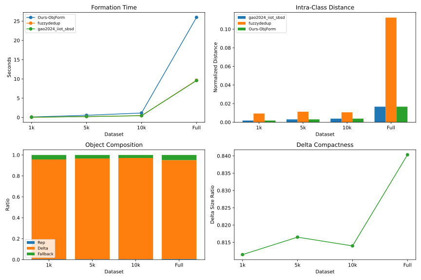

Exp.3 在 Exp.2 的对象形成结果之上统计主体存储与可验证元数据开销。为了避免只看总体数值而忽略开销来源，下面几张图分别从有效节省率、本文方案内部组成和不同方案总存储对比三个角度展示结果。整体趋势表明，相似类对象能够带来存储压缩收益，而对象级证书、认证器和 AuditMHT 等可验证元数据构成了为公共审计额外付出的成本。

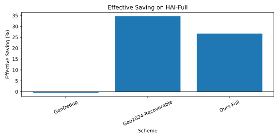

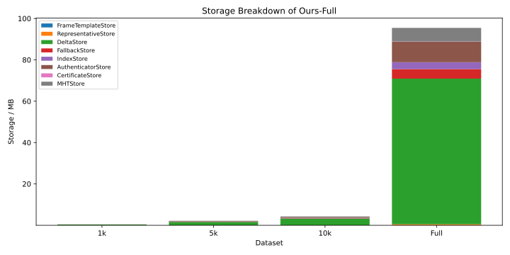

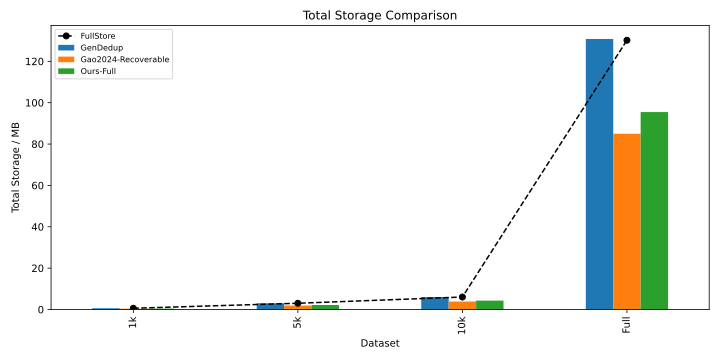

### D. 归一化审计核心对照口径

为回答 RQ2，本文采用归一化审计核心对照口径。`Record-Level-PDP` 是直接实现的记录级 possession 审计核心；`Miao2024 audit-core adaptation` 和 `Liu2025 audit-core adaptation` 是在统一 payload 接口上的审计核心适配，并加入与原方案审计阶段相关的 auxiliary metadata 开销建模。这些结果用于比较审计核心开销和能力覆盖，不用于声称与原论文完整系统性能公平比较，也不声称覆盖原论文中的 IBBE、RCE、PBFT、Fabric、Bloom filter、PoW 或所有权转移等外围协议。

| Scheme                         | Reproduction level            | Compared scope                                                 |
| ------------------------------ | ----------------------------- | -------------------------------------------------------------- |
| Record-Level-PDP               | direct audit core             | record payload possession                                      |
| Miao2024 audit-core adaptation | audit-core adaptation         | aggregate shared-audit core                                    |
| Liu2025 audit-core adaptation  | audit-core adaptation         | fine-grained audit core                                        |
| Ours-FastAudit                 | full implementation component | lightweight payload audit with certificate/basic state binding |
| Ours-FullAudit                 | full implementation           | payload, mapping and chain-state audit                         |

归一化审计核心分解如下：

| Scheme                         | Implemented in Exp4                                  | Modeled auxiliary overhead                                                                                                                        | Excluded native components                                                                                             |
| ------------------------------ | ---------------------------------------------------- | ------------------------------------------------------------------------------------------------------------------------------------------------- | ---------------------------------------------------------------------------------------------------------------------- |
| Record-Level-PDP               | record-level payload possession                      | none                                                                                                                                              | none                                                                                                                   |
| Miao2024 audit-core adaptation | shared audit core with authenticator dedup semantics | shared audit digest, dedup authenticator reference, batch audit log digest, group/public-key reference                                            | IBBE, RCE, PBFT, Fabric deployment, full key-management workflow                                                       |
| Liu2025 audit-core adaptation  | fine-grained dedup-aware payload audit core          | fine-grained block index digest, dedup block reference, Bloom/matrix commitment digest, dynamic-audit auxiliary digest, ownership-state reference | Bloom filter construction workflow, RCE workflow, PoW, ownership transfer protocol, full fine-grained dedup deployment |

这些辅助字段进入 proof size 和 compact binary estimate，用于避免把不同归一化对照简化为完全相同的 payload proof；被排除组件属于访问控制、共识部署、所有权或完整系统流程，不属于本文实验四的对象级 FullAudit 阶段。

功能能力边界如下：

| Scheme                         | Payload possession | Mapping consistency                     | Chain-state consistency     | On-chain FullAudit path  |
| ------------------------------ | ------------------ | --------------------------------------- | --------------------------- | ------------------------ |
| Record-Level-PDP               | yes                | no                                      | no                          | no                       |
| Miao2024 audit-core adaptation | yes                | no                                      | no                          | no                       |
| Liu2025 audit-core adaptation  | yes                | no                                      | no                          | normalized EVM path only |
| Ours-FastAudit                 | yes                | partial certificate/basic state binding | partial basic state binding | no                       |
| Ours-FullAudit                 | yes                | yes                                     | yes                         | yes                      |

因此，ProofSize 和 VerifyTime 表中的对照行只用于归一化审计核心开销分析，不能解释为与 Ours-FullAudit 在对象级安全语义上的等价竞争。

链上对照进一步区分原生实现和归一化 EVM 路径。`Ours-FullAudit` 是本文方案的原生链上验证；`Ours normalized-EVM path for Liu2025 audit core` 和 `Ours normalized-EVM path for Pan2026 audit core` 仅表示在本文合约接口下的 normalized EVM-path 测量，不能解释为 Liu2025 或 Pan2026 的原生 gas。

### E. 在线审计性能

在线审计实验继续回答 RQ2，评估对象级证明生成、验证和通信开销。论文主图使用 Full scale，并在相同对象和相同挑战规模下比较归一化 audit-core 对照与本文正常模式 `Ours-FullAudit-multiproof`，挑战规模为 $c\in{8,16,32,64,128,300}$。`Ours-FastAudit` 只作为轻量链下变体，在单独的 audit-mode trade-off 图中报告。

Full 规模下，`Ours-FullAudit` 因额外返回 AuditMHT multiproof 和映射绑定元数据，证明大小高于仅验证 payload possession 的归一化 audit-core 对照，但能够验证对照方案不覆盖的对象级映射一致性和链上状态一致性。以 $c=300$ 为例，`Ours-FullAudit-multiproof` 的证明生成时间为 1,074.57 ms，验证时间为 1,338.91 ms，证明大小为 428,843 bytes；归一化 audit-core 对照的证明生成时间为 1,031.94--1,105.34 ms，验证时间为 1,315.42--1,400.04 ms，证明大小为 388,181--388,722 bytes。该额外通信开销对应 $\mathsf{MapCons}$ 和 $\mathsf{StateCons}$ 的能力增量，而不是在相同安全语义下的全面性能竞争。

按协议字段宽度进行的证明体积分解统计进一步区分聚合认证器、挑战元数据、Merkle proof、证书/状态和根绑定等部分。该分析用于定位 FullAudit 额外通信主要来自映射绑定元数据与 AuditMHT proof，而不是来自 pairing 聚合证明本身。以 Full 规模 $c=300$ 为例，compact binary 估算下 `Ours-FullAudit-multiproof` 为 35,712 bytes，而归一化 audit-core 对照为 32,048--32,208 bytes，说明协议字段编码后的对象级绑定额外开销约为 3.5--3.7 KB。

`Ours-FastAudit` 不作为主安全方案参与同语义对照，而是作为轻量链下变体单独报告。Full 规模 $c=300$ 下，`Ours-FastAudit` 的证明大小为 387,868 bytes，compact binary 估算为 32,048 bytes，验证时间为 1,340.31 ms。该结果说明，在不返回 AuditMHT multiproof 的情况下，轻量 payload audit 的通信开销接近归一化 audit-core 对照；完整对象级结论仍由 FullAudit 给出。

所有 Full 规模 online audit 行均通过验证，即 `verified=True`，说明当前实现能够在最大对象规模下生成并验证完整对象级审计证明。

下面的在线审计图从时间和通信两个维度展开。验证时间图用于观察 FullAudit 与各归一化 audit-core 对照在相同挑战规模下的计算差异；序列化证明大小图反映当前原型输出的保守通信成本；compact proof size 图则展示去除 JSON、十六进制字符串和调试字段后的协议字段规模；audit mode trade-off 图用于单独说明 FastAudit 与 FullAudit 的安全语义和通信开销差异。

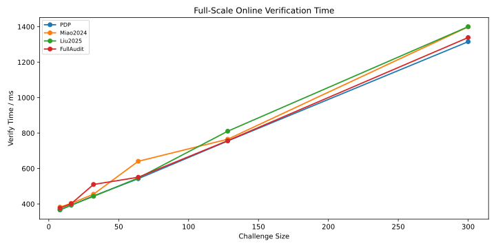

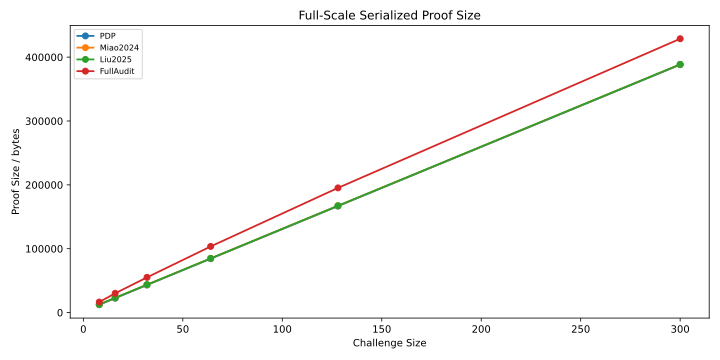

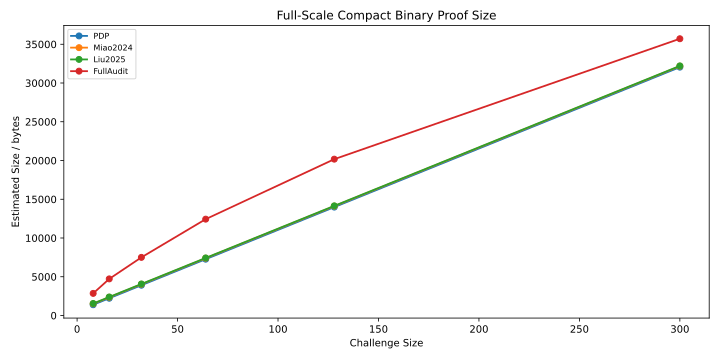

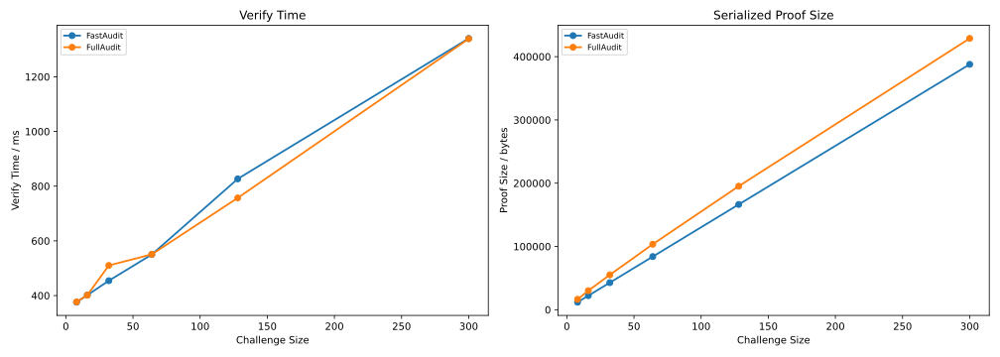

### F. Merkle Multiproof 优化

为回答 RQ3，本实验比较 FullAudit single-path opening 与 AuditMHT multiproof。结果表明，multiproof 随挑战规模增大而提供更明显的证明压缩：

| Challenge size | Proof reduction |
| -------------: | --------------: |
|              8 |           22.5% |
|             64 |           34.2% |
|            300 |           41.3% |

当 $c=300$ 时，被挑战叶覆盖最大对象的全部 300 个 audit leaves，multiproof 不再需要额外 proof nodes，但仍显著减少重复路径传输。因此，AuditMHT multiproof 是降低 FullAudit 通信开销的主要优化。

该图属于本文方案内部优化实验，不与归一化 audit-core 对照直接比较；审计核心对照主要体现在 Full-scale verify time、serialized proof size、compact proof size 和 batch scalability 图中。FastAudit 与 FullAudit 的差异由单独的 audit-mode trade-off 图报告。

下图进一步展示 multiproof 相对 single-path opening 的压缩效果。随着挑战规模增大，多条 Merkle 路径之间的共享节点增多，重复路径传输被消除，因此证明大小下降更加明显。

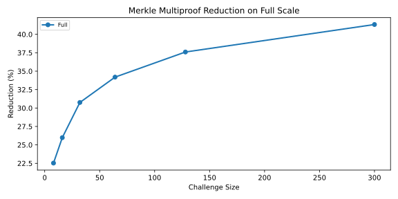

### G. 批量审计扩展性

为回答 RQ4，批量审计实验在不同 batch object count 下测量对象批量审计时间和单位记录通信开销。Full 规模下最大 batch 覆盖 1,190 个对象。主图比较 `Ours-FullAudit` 与归一化 audit-core 对照，结果显示 `Ours-FullAudit` 的单位记录通信开销更高，但 batch audit 可以在 Full 数据集上完成，证明对象级审计流程能够覆盖完整对象集合。

在最大 batch 下，`Ours-FullAudit` 的 batch audit time 为 458,604.76 ms，batch proof size 为 17,549,024 bytes，单位记录通信开销为 2,059.68 bytes/record。归一化 audit-core 对照的 batch audit time 为 458,187.85--472,228.92 ms，batch proof size 为 13,470,029--14,113,819 bytes，单位记录通信开销为 1,590.24--1,664.33 bytes/record。`Ours-FastAudit` 作为轻量变体的 batch proof size 为 13,076,139 bytes，单位记录通信开销为 1,544.91 bytes/record。

该实验不用于声称 `Ours-FullAudit` 在 batch 性能上超过归一化 audit-core 对照，而是用于展示在增加对象级映射和状态绑定后，系统仍保持可运行的批量审计能力。

批量审计图将对象数量扩展到 Full 数据集的 1,190 个对象，用于展示对象级审计在完整数据规模上的可运行性。图中的通信开销差异主要来自 FullAudit 额外携带映射绑定和状态绑定材料，而不是来自聚合认证器本身。

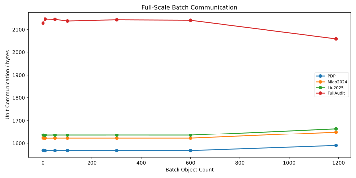

### H. 链上 FullAudit 开销

为回答 RQ5，链上实验在 Ganache 本地区块链上测量合约操作 gas。链上 `VerifyFullAudit` 使用默认挑战规模 $c=8$，并执行以下检查：

1. proof round 与链上最新 challenge round 一致；
2. challenged indexes 与链上随机挑战派生结果一致；
3. indexed AuditMHT multiproof 重建根等于 $\rho\_\tau^{audit}$；
4. compact certificate、对象版本、状态令牌和更新计数器与当前链上状态一致；
5. 合约通过地址 `0x08` 的 BN254/alt\_bn128 pairing precompile 验证 `sigma_agg`、`mu_vector` 和聚合认证基。

Full 规模下，`Ours-FullAudit` 的 `VerifyFullAudit` gas 为 2,241,581，链上 calldata 为 5,764 bytes，proof input 为 5,184 bytes，multiproof 相对 single-path 的 calldata saving 为 52.8%。同一对象状态下，`PublishObject` gas 为 60,325，`RequestAudit` gas 为 99,768，`UpdateRoot` gas 为 32,207。所有链上验证行均满足 `success=True` 和 `accepted=True`。

链上对照图仅展示 `VerifyFullAudit`。在相同合约接口和 EVM 输入规范下，`Ours normalized-EVM path for Liu2025 audit core` 的 `VerifyFullAudit` gas 为 1,959,483，`Ours normalized-EVM path for Pan2026 audit core` 的 `VerifyFullAudit` gas 为 2,100,194。这两行用于衡量归一化审计核心路径，不表示相关方案原论文的原生链上 gas。

需要强调的是，链上 gas 结果只报告当前实际实现的 $c=8$ 默认挑战设置；本文不声称已经测量链上 gas 随 $c=8,16,32,64,128,300$ 的完整变化曲线。理论上，`VerifyFullAudit` gas 随挑战规模增长主要来自 challenged leaves 解码、indexed multiproof 节点哈希、$B\_\tau$ 聚合基重建和固定次数的 pairing precompile 调用，其中 pairing precompile 调用次数为常数级，不随 $c$ 线性增加。

链上开销图只聚焦 `VerifyFullAudit` 路径，用于说明本文合约在真实 EVM 执行环境中的验证成本。对象发布、挑战请求和 root update 等操作已在正文数值中报告，不再作为重复图展示。

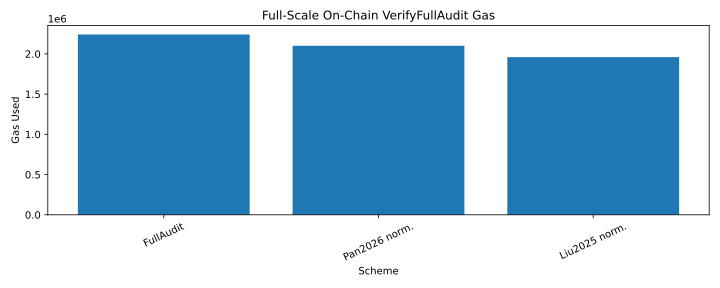

### I. 动态 Root 更新开销

动态更新实验补充报告链上 root update transaction cost，用于说明生命周期状态写入的合约成本。对于 insert、modify 和 delete 触发的对象状态更新，合约执行 `updateRoot` 并记录新版本根、状态令牌和更新计数器。Full 规模下各类 dynamic update 的 gas 为 37,807--37,819，所有动态更新交易均满足 `success=True`。

该结果表示链上 root update 交易成本，不是完整动态更新成本。本文不将该实验解释为本地 AuditMHT 重构、对象根重算和链上提交的全流程动态更新性能。

### J. 讨论

能力边界如下。本文方案能够在 Full 规模 HAI 数据上完成对象级公共审计，且 FastAudit、FullAudit 和归一化 audit-core 对照均能生成可验证证明。Ours-FastAudit 是轻量 payload audit 组件；Ours-FullAudit 相比记录级或归一化 audit-core 对照引入额外 proof size，但该开销换取了对象级 mapping consistency 和 chain-state consistency。AuditMHT multiproof 显著降低 FullAudit 证明大小，是本文方案在通信开销上的关键优化。Representative 在相似类中具有更强语义中心性，因此本文通过 $\rho\_\tau^{rep}$、统一 AuditMHT、认证标签上下文和对象根将其与 delta/fallback 上下文绑定；但当前协议不把每轮 FullAudit 强制命中 representative 作为默认语义，也不引入加权挑战分布。若部署方需要 deterministic representative coverage，可将 $idx\_\tau^{rep}$ 固定加入挑战集合；该代表优先挑战扩展会改变 proof size、gas 和检测概率，需要单独评估，本文实验不将其作为默认配置。

实验边界如下。当前实验只使用 HAI `train1.csv`，因此结果说明本文原型在该 IIoT/ICS 数据集上的可运行性，不覆盖所有 IoT 数据分布。归一化 audit-core 对照只比较审计核心路径，不能解释为相关方案完整系统性能公平比较。Metadata 构建时间反映当前 Python reference prototype 的离线构建开销，不代表在线审计延迟。链上 gas 只报告当前实现的 $c=8$ 默认挑战规模，尚未测量链上 gas 随更大挑战规模变化的曲线。Dynamic root update 只报告合约 `updateRoot` 交易成本，不代表本地 AuditMHT 重构、对象根重算和链上提交的完整动态更新成本。

部署边界如下。本文公共审计层验证对象级存储和状态完整性，不公开验证隐藏明文语义；分类正确性、差分边界有效性和重构可靠性仍需 User/Gateway 抽样复核。链上 FullAudit 已在 Ganache/Solidity 环境下完成真实验证，但链上对照行应理解为 normalized EVM path，而非相关方案原论文的原生 gas。损坏发现能力由安全性分析和随机挑战概率给出。对于 $n$ 个可审计块中存在 $d$ 个损坏块、一次挑战 $c$ 个块的情形，理论命中概率为

$$
P_{detect}=1-\frac{\binom{n-d}{c}}{\binom{n}{c}}
$$

该概率仅描述随机挑战命中损坏块的覆盖能力；未被挑战叶和隐藏语义属性不属于该轮公共审计覆盖范围。

## VII. 结论

本文提出了一种面向相似性 IoT 数据去重的证书绑定对象级公共审计方案，将相似类建模为 representative-delta/fallback-mapping-state 对象，并通过对象根绑定代表根、统一审计根、策略哈希、形成摘要和对象状态。本文的核心贡献是对象级上下文绑定和公共审计语义：认证标签显式绑定对象、payload/mapping 认证版本、位置和策略上下文，状态令牌通过版本、前序根和更新计数器形成链上状态哈希链，链上 FullAudit 通过 AuditMHT multiproof 和 EVM BN254 pairing precompile 验证被挑战 representative 持有性、delta/fallback payload 持有性、映射一致性和链上状态一致性；FastAudit 仅作为链下轻量 payload 审计变体；SampleCheck 只对被抽样记录声明语义正确性。

实验结果表明，本文原型能够在 HAI Full 规模上完成对象级公共审计，并在链下证明生成、验证、批量审计和链上 `VerifyFullAudit` 路径上保持可运行性。Ours-FullAudit 相比只验证 payload possession 的归一化审计核心对照引入额外通信开销，但该开销对应 mapping consistency 和 chain-state consistency 的能力增量。本文不声称公开验证隐藏明文语义，也不将附录中的 S-PoW 接口作为完整访问控制系统或对象审计核心定理的一部分。

## 附录 A：可选 S-PoW 访问控制接口

S-PoW 接口是一个可选访问控制模块，用于后续数据分析者或用户需要访问相似类对象的场景。它不是本文主贡献，不参与对象审计定理，也不参与实验评估；禁用该接口不影响代表持有性、payload 持有性、映射一致性或链上状态一致性。其完整所有权可靠性依赖所选 $\mathsf{SimTag}$、$\mathsf{FE}$ 与 S-PoW primitive 的安全模型。令 $\mathsf{SimTag}$ 表示所选相似标签函数，$\mathsf{FE}$ 表示对应模糊提取器。给定记录标签

$$
t_{\ell}=\mathsf{SimTag}(r_{\ell}).
$$

接口生成

$$
(\kappa_{\tau},P_{\tau})=\mathsf{FE.Gen}(t_{\ell}),
$$

并发布访问验证所需的公共材料：

$$
pk_{\tau}^{own}=g^{\kappa_{\tau}},\qquad
h_{\tau}=H_2(\tau\parallel pk_{\tau}^{own}).
$$

请求者持有相似记录 $r\_{\ell'}$ 时，使用辅助数据 $P\_\tau$ 重构候选密钥：

$$
\kappa'_{\tau}=\mathsf{FE.Rep}(\mathsf{SimTag}(r_{\ell'}),P_{\tau}).
$$

验证者据此执行所选 S-PoW 实例的挑战响应检查。具体挑战格式、误接受率、误拒绝率、辅助数据泄露和所有权可靠性由所选 $\mathsf{SimTag}$、$\mathsf{FE}$ 与 S-PoW primitive 的安全模型决定。

因此，本节仅给出与对象审计正交的访问控制接口。S-PoW 的完整所有权可靠性证明遵循所选底层 primitive，不出现在本文对象审计定理中。

## 参考文献

\[gao2024] Y. Gao, L. Chen, J. Han, S. Yu, and H. Fang, “Similarity-Based Secure Deduplication for IIoT Cloud Management System,” _IEEE Transactions on Dependable and Secure Computing_, vol. 21, no. 4, pp. 2242–2255, 2024.

\[miao2024] Y. Miao, K. Gai, L. Zhu, K.-K. R. Choo, and J. Vaidya, “Blockchain-Based Shared Data Integrity Auditing and Deduplication,” _IEEE Transactions on Dependable and Secure Computing_, vol. 21, no. 4, pp. 3688–3703, 2024.

\[jiang2023] T. Jiang, X. Yuan, Y. Chen, K. Cheng, L. Wang, X. Chen, and J. Ma, “FuzzyDedup: Secure Fuzzy Deduplication for Cloud Storage,” _IEEE Transactions on Dependable and Secure Computing_, vol. 20, no. 3, pp. 2466–2481, 2023.

\[talasila2019] P. Talasila and D. E. Lucani, “Generalized Deduplication: Lossless Compression by Clustering Similar Data,” in _Proceedings of the IEEE_, 2019.

\[liu2025] B. Liu, X. Zhang, X. Yang, Y. Zhang, J. Xue, and R. Zhou, “Blockchain-Assisted Fine-Grained Deduplication and Integrity Auditing for Outsourced Large-Scale Data in Cloud Storage,” _IEEE Internet of Things Journal_, vol. 12, no. 12, pp. 21662–21678, 2025.

\[zhang2023] Q. Zhang, D. Sui, J. Cui, C. Gu, and H. Zhong, “Efficient Integrity Auditing Mechanism With Secure Deduplication for Blockchain Storage,” _IEEE Transactions on Computers_, vol. 72, no. 8, pp. 2365–2376, 2023.

\[zhang2025] Q. Zhang, S. Qian, J. Cui, H. Zhong, F. Wang, and D. He, “Blockchain-Based Privacy-Preserving Deduplication and Integrity Auditing in Cloud Storage,” _IEEE Transactions on Computers_, vol. 74, no. 5, pp. 1717–1728, 2025.

\[fvcdedup2022] S. Jiang, J. Liu, Y. Zhou, and Y. Fang, “FVC-Dedup: A Secure Report Deduplication Scheme in a Fog-Assisted Vehicular Crowdsensing System,” _IEEE Transactions on Dependable and Secure Computing_, vol. 19, no. 4, pp. 2727–2741, 2022.

\[geobd22021] R. K. Barik, S. S. Patra, R. Patro, S. N. Mohanty, and A. A. Hamad, “GeoBD2: Geospatial Big Data Deduplication Scheme in Fog Assisted Cloud Computing Environment,” in _Proceedings of INDIACom_, 2021.

\[boafft2020] S. Luo, G. Zhang, C. Wu, S. U. Khan, and K. Li, “Boafft: Distributed Deduplication for Big Data Storage in the Cloud,” _IEEE Transactions on Cloud Computing_, vol. 8, no. 4, pp. 1199–1211, 2020.

\[ateniese2007] G. Ateniese, R. Burns, R. Curtmola, J. Herring, L. Kissner, Z. Peterson, and D. Song, “Provable Data Possession at Untrusted Stores,” in _Proceedings of ACM CCS_, 2007.

\[juels2007] A. Juels and B. S. Kaliski Jr., “PORs: Proofs of Retrievability for Large Files,” in _Proceedings of ACM CCS_, 2007.

\[shacham2008] H. Shacham and B. Waters, “Compact Proofs of Retrievability,” in _Proceedings of ASIACRYPT_, 2008.

\[bellare2013] M. Bellare, S. Keelveedhi, and T. Ristenpart, “Message-Locked Encryption and Secure Deduplication,” in _Proceedings of EUROCRYPT_, 2013.

\[dupless2013] S. Keelveedhi, M. Bellare, and T. Ristenpart, “DupLESS: Server-Aided Encryption for Deduplicated Storage,” in _Proceedings of USENIX Security_, 2013.

\[pow2011] S. Halevi, D. Harnik, B. Pinkas, and A. Shulman-Peleg, “Proofs of Ownership in Remote Storage Systems,” in _Proceedings of ACM CCS_, 2011.

\[manku2007] G. S. Manku, A. Jain, and A. Das Sarma, “Detecting Near-Duplicates for Web Crawling,” in _Proceedings of WWW_, 2007.

\[dodis2008] Y. Dodis, R. Ostrovsky, L. Reyzin, and A. Smith, “Fuzzy Extractors: How to Generate Strong Keys from Biometrics and Other Noisy Data,” _SIAM Journal on Computing_, vol. 38, no. 1, pp. 97–139, 2008.

\[chen2015] R. Chen, Y. Mu, G. Yang, and F. Guo, “BL-MLE: Block-Level Message-Locked Encryption for Secure Large File Deduplication,” _IEEE Transactions on Information Forensics and Security_, vol. 10, no. 12, pp. 2643–2652, 2015.

\[tian2022] G. Tian _et al._, “Blockchain-Based Secure Deduplication and Shared Auditing in Decentralized Storage,” _IEEE Transactions on Dependable and Secure Computing_, vol. 19, no. 6, pp. 3941–3954, 2022.

\[pan2026] C. Pan _et al._, “Blockchain-Enabled Efficient Deduplication and Mixed Auditing for Dynamic Cloud Data,” _IEEE Transactions on Dependable and Secure Computing_, vol. 23, no. 2, pp. 3554–3568, 2026.

\[zhu2026] C. Zhu, Y. Lu, N. Xia, J. Li, and Y. Sun, “A Lightweight Blockchain-Assisted Certificateless Cloud Data Integrity Auditing Scheme Without Third-Party Auditor,” _IEEE Transactions on Information Forensics and Security_, vol. 21, pp. 976–989, 2026.

\[edgeauditiot] C. Pan, L. Zhou, L. Huang, J. Chen, K. Zhang, and A. Fu, “A Privacy-Preserving Delegable Auditing Scheme with Edge-Assisted Deduplication in IoT,” in _Proceedings of CSS 2025_, LNCS 16195, pp. 152–167, 2026.
