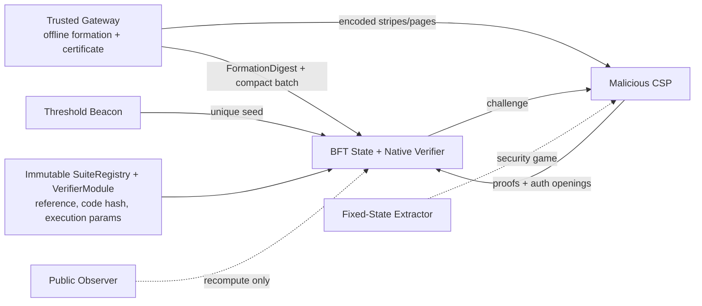
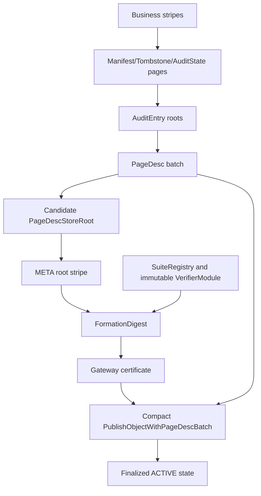
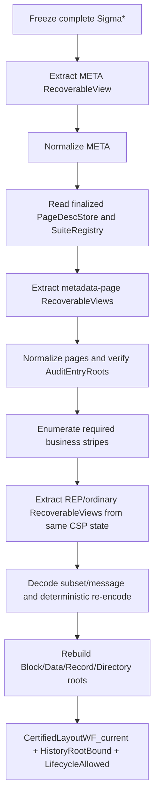
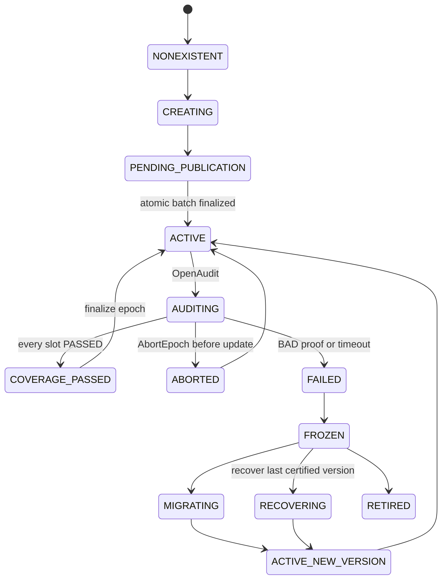

# 面向相似性去重物联网对象的依赖感知公开审计与条件性可恢复性框架

**作者：** 匿名作者

## 摘要

相似性去重把物联网记录表示为唯一 representative、依赖 representative 的 delta 和独立 fallback，在降低存储冗余的同时引入跨条带恢复依赖。普通扁平文件审计不能保证记录映射、实际被审计条带、代表依赖、文件级公开验证状态和对象版本属于同一可恢复状态。本文提出面向 representative--delta 星形对象的依赖感知公开审计与条件性可恢复性框架。方案由认证记录绑定派生 LINK/REP-LINK 挑战，使映射证明唯一决定实际接受的业务条带和 representative；以 META、当前 PageDescStore 和页面内部认证条目启动分页元数据及 ordinary stripe 的完整公开验证状态；以唯一阈值信标和无放回状态机提供固定输入的全部目标调度。对象初始形成由可信 Gateway 在链下完成并签名认证，BFT 状态机仅重算交易中可见的描述符根、版本、suite 引用和生命周期状态，并原子发布获证对象。执行所需的参数、规范编码、挑战规则和验证逻辑固化在不可变 VerifierModule 中，外部来源工件仅用于学术与工程溯源，不属于协议执行输入。在固定 CSP 状态、对象头、共识状态、PageDescStore、SuiteRegistry 和随机预言机表的同一快照下，统一 extractor 将完整码字、可解码子集或原始消息规范化为消息和完整编码表示，重建当前对象认证根并输出当前获证对象及其 SidHistoryRoot 承诺，得到条件性的公开参数固定状态可提取性。完整历史 sid 集合的一致性由独立 CSMS 状态转换定理保证，不被并入当前对象恢复。底层 RPDP 仅需满足公开验证、可判定的选择性上下文绑定和 fixed-state 提取，并声明恢复输出模式与 extractor 权限。本文给出参数化组合证明，并在原始对称 pairing 模型下给出 Shacham--Waters 的候选理论适配；该适配不被解释为现代 Type-3 部署实例。

## 关键词

物联网数据去重，依赖感知公开审计，条件性可恢复性，认证元数据，组合安全

---

# I. 引言

物联网（Internet of Things, IoT）和工业物联网（Industrial IoT, IIoT）平台正在持续产生大规模结构化感知记录，例如温度、湿度、气体浓度、振动、电流、电压和设备状态等。与普通非结构化文件不同，这类记录通常遵循固定模式，并按照稳定的采样周期生成。同一设备在相邻时间窗口内产生的数据，或同一区域内同类型设备采集的数据，往往并非字节级完全一致，却在数值分布、字段结构和变化趋势上高度接近。已有 IIoT 相似去重研究也观察到常规工业感知数据具有固定结构和显著相似性 [gao2024]。这一特征使 IoT 数据更适合按照“相似对象”进行管理，而不是仅按照完全重复文件或数据块进行处理。

云存储为 IoT 数据的长期保存、集中分析和跨域共享提供了便利，但数据一旦被外包，所有者便失去对云端副本的直接控制。云服务提供商（Cloud Service Provider, CSP）可能因硬件故障、软件错误、攻击入侵或节省成本而删除、篡改或回放旧版本数据。因此，远程完整性审计成为外包存储安全中的基本机制。已有 PDP/PoR 及其公共审计扩展能够通过随机挑战验证外包文件或密文块是否仍被保存 [ateniese2007, juels2007, shacham2013]；进一步地，区块链和智能合约被引入审计过程，用于替代或监督集中式第三方审计者，提供公开挑战、证明验证和审计结果记录 [zhang2023, tian2022, zhu2026]。

与此同时，数据去重被广泛用于降低云端存储冗余。传统安全去重通常依赖收敛加密或消息锁定加密，使相同明文产生可去重的密文，并通过所有权证明限制未持有数据的用户滥用源端去重接口 [bellare2013, dupless2013, pow2011]。但其适用对象主要是完全相同的文件或数据块。对于 IoT 场景，这种精确去重并不足够：大量常规感知记录只是在时间、位置或传感环境上存在轻微差异，仍然包含明显的近似重复内容。Gao *et al.* 针对 IIoT 数据的结构化与周期性特点提出 IIoT-Simhash、边缘侧相似去重框架和相似性所有权证明 [gao2024]；FuzzyDedup 利用相似保持哈希、模糊提取器、FuzzyMLE 和 FuzzyPoW 支持相似文件、分块或数据块的安全去重 [jiang2023]。这些工作说明相似去重能够显著降低存储和传输开销，但没有把去重后形成的依赖对象作为公开可提取性审计对象。

相似去重改变了完整性审计的对象形态。云端保存的不再是每条原始记录的独立副本，而是 representative、delta/fallback payload、对象目录、局部索引、认证器和状态令牌的组合。delta 只记录相对于 representative 的差异；若 representative 丢失或被替换，即使所有 delta payload 仍存在，相似类中的依赖记录也可能无法恢复。现有区块链辅助去重审计方案主要验证精确文件或块的概率持有性 [miao2024, zhang2023, zhang2025, liu2025, pan2026]，不能直接推出包含 representative 依赖、映射和版本状态的完整相似类对象可恢复。

直接把相似类序列化后运行普通 PoR 仍然不足。该做法虽然可以恢复扁平字节串，却难以对 representative、metadata 和 ordinary payload 配置不同冗余，并会使局部记录更新触发大范围重编码。另一方面，当 mapping opening 与 stripe PoR challenge 独立生成时，恶意 CSP 可以提交记录位于 stripe $A$ 的认证路径，却使用 stripe $B$ 的有效 PoR 响应；即使多个根由同一证书绑定，只要认证 opening 没有决定实际挑战域，两套证明分别有效仍不能证明本轮验证的是同一依赖边。更强的多根基线可以让认证 mapping 派生实际挑战，因此本文不把“多个根”本身视为缺陷，而把问题进一步推进到：如何认证完整必要 stripe 集合、如何在不提前公开完整顺序的情况下逐一覆盖 ordinary 条带与 metadata pages，以及如何把逐 stripe extractor 组合为依赖图恢复。

为说明该缺口，考虑一个含 1 条 representative、90 条 delta 和 9 条 fallback 的对象。若 CSP 删除 representative 条带，却保留全部 delta/fallback、旧目录和真实认证材料，则普通均匀块审计可能连续多轮只命中仍然存在的条带；即使某条 delta 的本地数据证明通过，该记录仍因代表缺失而无法恢复。本文的 LINK 域验证被抽样记录所属业务条带，REP-LINK 域把任意被抽样 delta 同轮绑定到当前 representative；无放回 coverage 最终调度全部普通业务条带与必要元数据页；固定状态 CurrentDataDAR 再检查这些局部输出能否重建同一个认证对象。该例子贯穿后续对象模型、挑战生成、上下文绑定、coverage 和组合提取定理。

由此形成三个相互依赖的设计挑战。第一，认证记录映射必须唯一决定本轮实际接受的业务条带和 representative 条带，否则成员证明与 PoR 证明可以分别正确却语义错绑。第二，metadata page 本身也可能由恶意 CSP 删除，提取器必须在尚未恢复页面内容前，从已最终确认的公共状态获得完整页面描述符和文件级公开验证状态。第三，META、页面、REP 和普通业务条带的局部 extractor 必须从同一逻辑对象版本和同一固定 prover 状态开始，不能把多个时刻分别成功的响应拼接成对象恢复。本文的三项主要贡献分别对应上述三项挑战。

本文关注的问题是：在不重新设计相似分类算法、且不公开隐藏明文语义的前提下，如何对唯一 representative、依赖它的 delta 和独立 fallback 所构成的深度一星形依赖对象提供公开审计、无遗漏调度和条件性可恢复性，同时保留有界 stripe 更新能力。本文严格区分两类结论。真实链上 operational audit 提供单轮依赖绑定、阈值随机驱动的无放回 coverage 和调用者状态安全；它没有 `Reset`/rewind 能力，因而不直接推出完整对象可恢复。独立地，在标准固定全局状态黑盒提取模型下，若每个必要 stripe 满足其注册 RPDP profile 的固定状态提取前提，则逐 stripe extractor、RS 解码、`BlockRoot` 和当前认证根重建给出条件性的公开参数固定状态可提取性 $\mathsf{CurrentDataDAR}$。所有者进一步提供对象密钥和私有恢复材料时，才能验证 AEAD、delta 明文重构和私有形成关系，得到 $\mathsf{OwnerDAR}$；恢复表示仍由当前 ACTIVE 链状态授权并可继续提供服务时，得到 $\mathsf{CurrentDAR}$；FROZEN 状态只允许恢复最后获证版本以支持迁移或灾难恢复。

本文的主要贡献如下。

- **依赖对象安全模型。** 本文形式化唯一 representative、依赖它的 delta 和独立 fallback 构成的深度一星形对象，分别定义当前获证布局关系 `CertifiedLayoutWF_current`、历史根绑定 `HistoryRootBound`、用途相关生命周期关系 `LifecycleAllowed`、私有良构关系 `LayoutWF_priv`、当前对象恢复 `CurrentDataDAR`、所有者明文恢复 `OwnerDAR` 和当前链授权扩展 `CurrentDAR`。令 $\mathsf{Dep}(\ell)$ 为恢复记录 $\ell$ 所需的条带集合，并定义
  $$
  \mathsf{Impact}(g)=|\{\ell:g\in\mathsf{Dep}(\ell)\}|,
  \qquad
  \mathsf{RecoveryLoss}(S)=|\{\ell:\mathsf{Dep}(\ell)\cap S\neq\varnothing\}|.
  $$
  对 representative 条带，$\mathsf{Impact}(g_{rep})$ 等于 representative 自身及全部依赖 delta 的数量，刻画了条带规模与恢复损失之间的放大差异。历史 sid 不复用作为独立的 `HistoricalConsistencyValid` 状态性质处理，不强行纳入每次当前对象提取。
- **认证依赖挑战与可启动枚举。** 本文构造一条从获证记录依赖到实际 RPDP 验证上下文的认证解析链：认证记录绑定唯一派生 LINK/REP-LINK 目标，当前描述符状态在页面被恢复前提供 metadata page 的启动输入，页面内部认证条目则向在线验证者提供 ordinary stripe 的完整文件级公开状态。由此，映射、被审计条带、版本和公开验证状态不能分别正确却语义错绑。
- **固定状态组合恢复与一致更新。** 挑战者在首个提取 challenge 前保存 prover 的同一全局状态，先提取 META 根和元数据页，再提取 REP 与普通业务条带，把 `RecoverableView` 规范化为消息和完整码字，最后重建当前 DataRoot、RecordRoot、StripeDirectoryRoot、PageDescStoreRoot，并输出获证的 `SidHistoryRoot` 承诺。普通 payload 修改仅更新目标业务条带、对应清单页、对应公开验证状态页和 META 根；链上通过单一 update digest 与新证书拒绝新旧元数据混合状态。threshold-BLS 无放回调度作为 operational coverage 机制，不被表述为新的可恢复性原语。

本文其余部分组织如下。第 II 节讨论相似去重、公共 PoR、动态审计和认证元数据的相关工作；第 III 节定义导入原语及其注册合同；第 IV 节给出系统、对象、威胁和安全模型；第 V 节概述核心机制与状态不变量；第 VI 节给出具体构造；第 VII 节证明上下文绑定、多轮审计、原子状态切换和条件性对象恢复；第 VIII 节分析理论复杂度、部署边界和实验要求；第 IX 节总结全文。

# II. 相关工作

## A. 相似数据去重

安全去重最初主要关注完全重复数据。消息锁定加密使相同明文产生可去重密文 [bellare2013]；DupLESS 使用服务器辅助密钥生成缓解低熵数据上的离线枚举 [dupless2013]；所有权证明限制攻击者仅凭标签声明拥有完整文件 [pow2011]。BL-MLE 将消息锁定加密扩展到块级去重，并同时考虑块密钥管理、文件级/块级去重和所有权证明 [chen2015]。

相似数据去重进一步处理近似重复内容。Generalized Deduplication 将数据表示为基准项和偏差项 [talasila2019]；FuzzyDedup 组合相似保持哈希、模糊提取器、FuzzyMLE 和 FuzzyPoW [jiang2023]；Gao *et al.* 面向 IIoT 设计 IIoT-Simhash、边缘侧相似去重和相似性所有权证明 [gao2024]。这些研究解决了相似性判定、密文去重或所有权验证，但通常没有定义恶意 CSP 上 representative、delta/fallback 和认证映射的联合可提取性。

## B. 公共可恢复性审计、动态 PoR 与认证元数据

Ateniese *et al.* 提出 PDP [ateniese2007]；Juels 和 Kaliski 提出 PoR [juels2007]；Shacham 和 Waters 给出具有完整提取证明的紧凑公共 PoR [shacham2013]。其公开方案在原始对称 bilinear-group 模型和随机预言机模型中证明 Part-One soundness，并进一步给出固定 prover 的提取和纠删码恢复论证。本文不把该构造未经证明地转换为 Type-3 pairing；附录 J 只在原论文模型内给出理论接口映射。Hanser 和 Slamanig 的 robust PDP 同时考虑公开与私有验证 [hanser2013]，但其公开 ePrint 页面仍标记 `minor bug`，因此在完成版本、勘误和接口核验前不作为本文已注册实例。

动态 PoR/PDP 说明外包文件能够在认证状态下支持更新。Shi *et al.* 通过分层认证和编码实现块级动态 PoR [shi2013]；Anthoine *et al.* 分析动态 PoR 的服务端时间—空间权衡 [anthoine2021]。这些工作主要证明单文件或单编码状态的更新与提取，通常假设验证元数据和文件目录在提取前可用。本文进一步处理多个相互依赖业务条带、分页公开元数据、页面启动状态和对象级认证根的组合恢复。

认证字典和元数据保存系统关注目录内容自身的完整性。IntegrityCatalog 将完整性目录作为一等对象并通过持久认证字典和保存节点支持目录恢复 [chondros2014]；Dahlberg *et al.* 给出稀疏 Merkle 树的成员、非成员证明和缓存策略 [dahlberg2016]。这些结构可以证明目录或集合状态，但不自动提供业务数据的 PoR 提取。本文因此把当前页面描述符、页面内容根、业务目录和历史 sid 集合分别建模，并明确各层的可用性与安全职责。

## C. 去重、相似数据与区块链完整性审计

Tian *et al.* 提出区块链安全去重与共享审计 [tian2022]；Miao *et al.* 支持共享数据完整性审计和认证器去重 [miao2024]；Liu *et al.* 通过稀疏树和承诺支持细粒度去重审计 [liu2025]；Pan *et al.* 支持动态云数据的混合审计和去重 [pan2026]。这些工作主要验证精确文件、块或共享数据关系，没有把 representative--delta 恢复依赖同当前业务条带、页面描述符和对象根联合建模。

2025 年的直接邻近工作已经研究相似数据上的可搜索完整性审计以及去中心化多副本可搜索审计 [miao2025similar,miao2025multi]。这些方案分别关注关键词结果、相似文件集合、认证器检索、多副本和区块链可信审计。本文不支持加密关键词搜索，也不声称替代这些联合搜索—审计方案；本文的差异是把相似去重后的 representative、delta/fallback、分页验证状态和恢复依赖作为一个当前对象，研究其 fixed-state 条件性组合恢复。

## D. 本文定位

本文从 Gateway 最终获证的 representative-centered 存储表示开始，不重新设计相似分类算法，也不提出新的底层 PoR。核心贡献是定义依赖对象对导入原语的密码学充分条件，并证明这些条件如何与分页元数据、当前共识状态、在线调度、动态生命周期和对象级恢复组合。核心协议使用单一对象级 RPDP suite；不同 suite 只能通过完整对象重新实例化切换。

底层条带原语只承担三项密码学性质：

$$
\mathsf{RPDP}^{\star}=\bigl(\mathsf{PublicVerifiable},\mathsf{ContextBound},\mathsf{FixedStateExtractable}\bigr).
$$

页面描述符和公开状态的可获得性由外层 `ResolvePublicStateOnline/Extract` 关系保证，而不是被错误地写成底层 PoR 的密码学性质。ordinary stripe 在线验证时，完整文件级公开状态由 `AuditStateEntryOpening` 认证到页面 `AuditEntryRoot`，而非假设验证者已经持有完整 AuditStatePage。附录 J 将原始 Shacham--Waters 公共 PoR 映射为 `SW-Sym-Theory`。该映射严格保留原论文的对称 pairing 群、文件标签、安全假设和提取定理，只说明抽象接口在原模型中存在理论候选；它不是现代 Type-3 部署实例，也不提供链上字节和运行时间结论。

为隔离 coverage 增量，定义完整协议基线 `StrongRandomAudit`：它采用与本文相同的对象、分页元数据、RPDP suite、证明域和更新规则，唯一差异是 coverable slot 独立有放回抽样且不维护 SwapMap。令 $m_{cov}=m_o+n_{meta\_page}$，均匀抽样 $T$ 个 slot 后

$$
\Pr[\exists g\text{ omitted}]\le m_{cov}\left(1-\frac1{m_{cov}}\right)^T\le m_{cov}e^{-T/m_{cov}}.
$$

有放回完整覆盖时间的期望为 $m_{cov}H_{m_{cov}}$；本文无放回调度在恰好 $m_{cov}$ 个成功且全部通过的 slot 后形成 `CoveragePass`。该结论只比较调度，不替代底层 extractor。

| 具体工作/方案 | 验证对象 | 元数据启动 | fixed-state 提取 | 依赖对象恢复 | 动态语义 |
|---|---|---|---|---|---|
| Shacham--Waters [shacham2013] | 单个纠删编码文件 | file tag 预先可用 | 有 | 无 | 静态文件 |
| Shi *et al.* [shi2013] | 动态单文件 | 客户端/认证层次状态 | 有 | 无 | 块级动态 |
| IntegrityCatalog [chondros2014] | 完整性目录和快照 | catalog preservers | 非业务数据 PoR | 无 | 目录更新 |
| Miao *et al.* [miao2025similar] | 相似数据的搜索结果与审计集合 | 搜索索引与链状态 | 面向搜索结果正确性与完整性，不给出本文对象级 META-first extractor | 搜索集合，不是去重依赖恢复 | 可搜索/动态 |
| Miao *et al.* [miao2025multi] | 多副本可搜索审计集合 | 搜索与副本状态 | 面向搜索结果与副本责任，不恢复 representative-centered 对象 | 多副本责任，不是 REP--DELTA 恢复 | 多副本/去中心化 |
| Pan *et al.* [pan2026] | 动态去重云数据 | 文件/审计状态 | 证明动态去重数据的审计正确性，但不定义本文的分页启动与多组件固定快照恢复 | 不建模代表依赖 | 动态/混合审计 |
| 本文框架 | 当前 representative-centered 对象 | META + 当前 `PageDescStore` | 每组件 fixed-state | 是 | 条带/页面/对象原子切换 |

| 方案族 | 公开持久状态 | 完整证明增长 | 更新放大 | 分布式状态 |
|---|---|---|---|---|
| Static public PoR | file tag/public key | challenge/query size | replacement retag | none |
| Dynamic PoR | root/position/version | challenge + witness | affected blocks/hierarchy | none |
| Authenticated catalog | catalog root/snapshots | lookup/update path | catalog update | preservers/log |
| 本文框架 | object roots、当前 PageDesc、single suite、coverage state | logical domains + RPDP proof + record/directory/AuditEntry openings | business stripe + constant pages；REP change touches all DELTA | beacon、SwapMap、consensus state |

从安全语义看，最近邻差异进一步表现为：

| 工作 | 恶意 CSP | 元数据可用性来源 | 公开状态来源 | fixed-state extractor | 动态原子性 |
|---|---|---|---|---|---|
| Shacham--Waters [shacham2013] | 是 | file tag 预持有 | file tag/public key | 明确 | 静态文件 |
| Shi *et al.* [shi2013] | 是 | 客户端认证状态 | 客户端/层次状态 | 明确 | 动态结构内定义 |
| IntegrityCatalog [chondros2014] | 目录节点恶意/失效 | catalog preservers | 目录快照 | 面向目录，不是业务 PoR | 目录级 |
| Miao *et al.* [miao2025similar] | 是 | 搜索索引与链状态 | 方案内索引/认证器 | 面向搜索审计目标 | 方案内 |
| 本文 | CSP/Edge--CSP 合谋 | 当前共识 PageDescStore + 恢复页面 | ObjectHeader/PageDesc/AuditEntry opening | 每组件公开 fixed-state | 对象、页面和历史根原子切换 |

本文的细粒度动态性来自外层 stripe/page 分割：被修改组件重新执行完整 `Preprocess`。该性质不应被误解为底层 `SW-Sym-Theory` 本身提供动态 PoR。

# III. 预备知识与导入接口

本节只给出后续组合定理实际依赖的原语和公开状态接口。相似分类、分页对象、链上生命周期和依赖挑战属于本文设计，不作为预备知识隐藏。

## A. 系统式纠删码、认证结构与历史集合

外层编码使用系统式 $[N,k]$ Reed--Solomon 码。对规范条带表示 $M$，编码得到 $C=\mathsf{RS.Encode}_{N,k}(M)$；任意不少于 $k$ 个一致编码块可唯一恢复 $M$。恢复后必须确定性重编码并检查完整 `BlockRoot`，防止把不一致的局部解码结果当作获证条带。

目录、记录、数据和页面认证结构统一满足固定根绑定。若在同一已认证根下为两个不同叶值、不同计数或不同规范顺序生成均可接受 opening，则沿两条验证路径向上取首个输入不同但父哈希相同的节点，得到底层哈希碰撞。正文分别记其优势为

$$
\mathsf{Adv}_{Dir}^{bind},\quad
\mathsf{Adv}_{Record}^{bind},\quad
\mathsf{Adv}_{Data}^{bind},\quad
\mathsf{Adv}_{Page}^{bind}.
$$

历史 sid 集合采用固定深度压缩稀疏 Merkle 集合（Compressed Sparse Merkle Set, CSMS）[dahlberg2016]。设 $sid\in\{0,1\}^{d_{sid}}$，叶位置由 sid 本身或其规范哈希唯一确定。非空叶和空叶分别为

$$
L_{used}(sid)=H_0(\textsf{SID\_USED}\parallel sid),\qquad
L_{empty}=H_0(\textsf{SID\_EMPTY}).
$$

空子树摘要按固定递归预计算。CSMS 提供

$$
\mathsf{HSet.Setup},\ \mathsf{ProveMem},\ \mathsf{ProveNonMem},\ \mathsf{Append},\ \mathsf{VerifyAppend}.
$$

`Append` 只允许把空叶变为已使用叶，不定义删除。成员、非成员和追加见证的安全性归约到哈希抗碰撞。

## B. 可注册 RPDP 接口

核心对象只绑定一个 RPDP suite。可注册公开审计原语的语法为

$$
\mathsf{RPDP}^{\star}=(\mathsf{KeyGen},\mathsf{BindFileID},\mathsf{Preprocess},\mathsf{Challenge},\mathsf{Prove},\mathsf{PublicVerify},\mathsf{Extract}).
$$

注册 profile 必须满足三项密码学条件：

1. `PublicVerifiable`：诚实 `Preprocess/Challenge/Prove` 的输出由公开验证者接受；
2. `ContextBound`：native file id、文件级公开验证状态、对象级 suite 和被审计编码表示不能跨获证上下文替换；
3. `FixedStateExtractable`：在挑战者固定并重绕同一 prover 状态、保持同一公共状态快照和随机预言机表的游戏中，满足明确 admissibility 条件的 prover 可由期望多项式时间 extractor 输出 profile 声明的可恢复视图。

为避免把不同 PoR/PDP 的 extractor 输出强行等同为完整码字，profile 必须声明

$$
OutputMode_t\in\{\mathsf{FULL\_CODEWORD},\mathsf{DECODABLE\_SUBSET},\mathsf{MESSAGE}\},
$$

以及

$$
ExtractorAccess_t\in\{\mathsf{PUBLIC},\mathsf{OWNER\_ASSISTED}\}.
$$

统一可恢复视图为

$$
RecoverableView_i\in\left\{C_i,\ \{(j,C_{i,j})\}_{j\in S_i},\ M_i\right\}.
$$

其中 `DECODABLE_SUBSET` 要求 $|S_i|\ge k_i$ 且坐标满足注册 RS profile。外层规范化算法

$$
\mathsf{NormalizeRecoveredComponent}(RecoverableView_i,OutputMode_i,CodeParam_i)
\rightarrow(M_i,\widehat C_i)
$$

分别执行完整码字解码、子集解码或消息重编码，并总是输出规范消息 $M_i$ 与规范完整码字 $\widehat C_i=\mathsf{RS.Encode}(M_i)$。`CurrentDataDAR` 只允许使用 $ExtractorAccess_t=\mathsf{PUBLIC}$ 的 profile；owner-assisted profile 仅能进入 `OwnerDAR`。

页面启动可重建性不被列为 RPDP 密码学性质。外层系统定义两个确定性关系：

$$
\mathsf{ResolvePublicStateOnline}(OH,ChainState,PageDescStore,ProofBody,componentID,type)
\rightarrow(desc,nativeFileID,FilePublicState),
$$

$$
\mathsf{ResolvePublicStateExtract}(OH,ChainState,PageDescStore,recoveredPages,componentID,type)
\rightarrow(desc,nativeFileID,FilePublicState).
$$

REP/META 的文件级公开状态由 ObjectHeader 获得；metadata page 的完整 `PageDesc` 由当前最终确认的 `PageDescStore` 获得；ordinary business stripe 在线验证时由 proof 携带的认证 `AuditStateEntry` 获得，在 fixed-state 提取时由已恢复并认证的完整 AuditStatePage 获得。关系缺失、根不匹配、版本不一致或摘要不一致时输出 $\bot$。

外层 DataRoot 不参与 operational RPDP proof 验证。安全绑定通过以下链条实现：Gateway 只对正确编码向量执行 `Preprocess`；`FileContext` 包含 `BlockRoot`；`nativeFileID=BindFileID(FileContext)` 实际进入底层标签和验证；ObjectHeader、StripeDesc/PageDesc、AuditStateEntry 和证书认证 `FileContext`、文件级公开状态及对象级 suite。DataRoot 只用于 fixed-state 恢复后对规范完整码字重建和验证。

## C. 唯一阈值随机信标

核心框架只依赖抽象信标

$$
\mathsf{UTB}=(\mathsf{Setup},\mathsf{Share},\mathsf{VerifyShare},\mathsf{Combine},\mathsf{VerifyOutput},\mathsf{DeriveSeed}),
$$

并要求公开可验证、低于阈值时不可预测、固定输入输出唯一以及 retry 输入不变。附录 B 给出 threshold-BLS 与 DKG 的静态腐化候选实例；主组合定理不把 DKG 实现细节混入对象恢复定理。

## D. 规范编码、VerifierModule、单一 RPDP suite 与状态层次

所有哈希、签名、信标输入、对象头、页面描述符和 proof 均采用带长度前缀的规范编码与独立域标签。协议执行所需的全部参数、解析规则、挑战规则和确定性验证逻辑固化在不可变执行模块

$$
\begin{aligned}
VerifierModule_t=(&SerializationRules_t,ExecutionParams_t,ChallengeRules_t,\\
&PublicVerify_t,ExtractInterface_t,ResourceLimits_t).
\end{aligned}
$$

模块内容地址为

$$
VerifierCodeHash_t=H_0(\textsf{VERIFIER\_MODULE}\parallel enc(VerifierModule_t)).
$$

版本化、不可覆盖的 `SuiteRegistry` 保存

$$
\begin{aligned}
SuiteRegistry[registryID,key\_epoch]=(&profileID,key\_epoch,pk,VerifierCodeHash,\\
&SuiteParamsDigest,SourceRecordHash,status,\\
&activationHeight,retirementHeight).
\end{aligned}
$$

其中 `VerifierCodeHash/SuiteParamsDigest` 唯一决定协议执行；`SourceRecordHash` 仅绑定原论文、证明说明、测试向量、实现来源和审计记录，不作为 `PublicVerify/Extract` 的执行输入。注册时必须验证 module 的规范编码、参数摘要和测试向量。`ACTIVE` suite 可用于新对象；`DEPRECATED` suite 不能用于新对象但必须继续支持旧对象审计、恢复和迁移；`REVOKED` suite 触发相关对象进入 `FROZEN -> MIGRATING`。任何仍被未退休对象引用的 module 不得从共识执行环境中裁剪。

一个对象版本只绑定精简引用

$$
ObjectSuiteRef=(profileID,key\_epoch,registryID,SuiteParamsDigest,VerifierCodeHash),
$$

$$
ObjectSuiteStateDigest=H_0(\textsf{OBJECT\_RPDP\_PROFILE}\parallel enc(ObjectSuiteRef)).
$$

验证者调用

$$
\mathsf{ResolveSuiteExecutionState}(ObjectSuiteRef)
\rightarrow(pk,VerifierModule,ExecutionParams)
$$

并要求 registry entry、module hash、参数摘要、激活高度和状态一致。该算法不得访问 `SourceRecordHash` 指向的外部工件。每个业务条带或 metadata page 只保存文件级状态

$$
FilePublicState_g=(nativeFileID_g,PublicAuditState_g,component\_ver_g,BlockRoot_g).
$$

REP、META、所有 metadata pages 和 ordinary stripes 均使用同一 suite。切换 profile/key epoch 必须创建新对象版本并重新执行全部组件的 `Preprocess`；多 profile 混合对象不进入核心构造和主定理。旧 registry entry 和对应 VerifierModule 不可覆盖。

对象级 `data_ver` 表示当前获证对象版本；业务条带使用独立 `stripe_ver`，元数据页使用独立 `page_ver`；`state_ver` 表示 provider、冻结和生命周期授权状态。对象更新使旧 challenge 失效，而未修改页面无需重新生成底层标签。对象生命周期至少包括

$$
\mathsf{NONEXISTENT},\mathsf{CREATING},\mathsf{PENDING\_PUBLICATION},\mathsf{ACTIVE},\mathsf{AUDITING},\mathsf{FROZEN},\mathsf{MIGRATING},\mathsf{RECOVERING},\mathsf{RETIRED}.
$$

只有最终确认的 `ACTIVE` 对象可开启新审计；`AUDITING` 对象只能完成、失败或中止当前 epoch；`FROZEN` 对象只能恢复最后获证版本、迁移或退休；`CREATING/PENDING_PUBLICATION` 不对外暴露为可验证对象。

| 状态 | 维护者 | 公开性 | 变化条件 | 上层绑定 |
|---|---|---|---|---|
| `ObjectSuiteRef/SuiteRegistry/VerifierModule` | governance + BFT execution environment | public, versioned immutable | 全对象重新实例化 | ObjectHeader/all descriptors |
| `StripeDesc/BlockRoot` | Gateway/CSP | public | 条带内容变化 | StripeDirectoryRoot/ObjectHeader |
| `PageDesc/page_ver` | Gateway + BFT state | current consensus state | 页面内容变化 | `PageDescStoreRoot`/ObjectHeader |
| `ActiveBindingRoot` | Gateway/BFT state | public root | 活动记录变化 | RecordRoot |
| `SidHistoryRoot` | Gateway/BFT state | public root | sid 首次分配 | RecordRoot/ChainState |
| `data_ver/state_ver` | BFT state | public | 对象/授权状态变化 | StateToken/ChallengeState |
| `ChallengeState/SwapMap` | BFT state | public transient state | audit epoch | lifecycle state |

`ResolvePublicStateOnline/Extract` 的公共辅助输入是最终确认的 $(OH,ChainState,PageDescStore,SuiteRegistry)$ 及可解析的 VerifierModule；该可用性是系统执行条件，不被伪装成底层 RPDP 密码性质。

# IV. 系统模型与问题定义

本节定义系统实体、认证对象、敌手能力和安全目标。审计对象不是无结构字节串，而是由 representative、metadata、delta 和 fallback stripe 构成的依赖图。三个稳定认证命名空间分别承诺编码块、记录索引和 stripe 目录；安全性来自同一对象证书、`BlockRoot` 和认证 binding 的联合上下文，而不是来自把所有叶合并到同一棵树。

## A. 系统架构、信任边界与版本

系统由 User/Gateway、Edge、CSP、Blockchain/Smart Contract 和唯一阈值随机信标委员会构成。CSP 直接向 BFT 状态机提交 proof；共识节点调用获证 `VerifierCodeHash` 唯一确定的不可变 VerifierModule，并在核对 `SuiteParamsDigest` 后执行确定性验证和状态转换。任何公共观察者均可根据当前共识状态、认证 opening、ObjectHeader、注册 RPDP suite 和信标输出重算结果，但观察者的结论不替代共识验证。

| Entity | Responsibility | Security trust | Liveness role |
|---|---|---|---|
| User/Gateway | 复核相似类，执行保护、编码、RPDP 预处理、页面形成和对象签名 | **可信形成根**；不在本文中被审计 | 形成、更新、迁移和所有者恢复时上线 |
| Edge | 在授权临时伪名上形成候选 representative/delta/fallback | 半可信；无最终签名和 RPDP 私钥 | 不影响已发布对象审计 |
| CSP | 保存编码块、ProverState、页面内容和认证节点；生成证明 | 恶意 prover | 对最终确认 challenge 承担 deadline |
| Contract/BFT state machine | 保存对象状态、完整 active `PageDescStore`、coverage 交换表、challenge 和不可裁剪的 active/legacy VerifierModule；由共识节点执行确定性验证 | 条件于共识安全、module 完整性和确定执行 | 链停机只影响活性 |
| Threshold beacon committee | 为固定输入产生唯一 seed | 静态腐化至多 $f_B<t_B$ | 至少 $t_B$ 个 qualified 成员在线 |

信标安全与活性要求

$$
0\le f_B<t_B\le n_B-f_B.
$$

DKG 输出为

$$
(PK_B,\mathcal Q_B,\{VK_i\}_{i\in\mathcal Q_B},TranscriptDigest_B),
$$

并由

$$
beacon\_key\_epoch=H_0(\textsf{BEACON\_KEY\_EPOCH}\parallel enc(PK_B,\mathcal Q_B,\{VK_i\},TranscriptDigest_B))
$$

固定。只有 qualified set 中不同成员的规范份额可计数；成员集合、验证键或公钥变化必须创建新 key epoch，不能作为相同请求的 retry。

对象使用三个单调版本：`data_ver` 在获证存储表示变化时递增；`state_ver` 在冻结、解冻、provider 或生命周期授权变化时递增；局部 `stripe_ver/page_ver` 仅在对应组件内容变化时递增。`StateToken` 绑定 `data_ver/state_ver/provider/status/epoch/slot/ObjectSuiteRef/ChallengeStateHash`。 对象初始创建依次经过 `CREATING` 和 `PENDING_PUBLICATION`；只有原子批量交易最终确认后才进入 `ACTIVE`。`AUDITING` 期间 `data_ver` 固定，任何数据更新必须先 `AbortEpoch`。对象级 RPDP suite 由 `ObjectSuiteRef` 指向不可变 `SuiteRegistry` 条目；ObjectHeader 只签名引用和 `SuiteParamsDigest`。切换 suite 必须全量重处理对象并创建新 `data_ver`，旧 registry 条目不得覆盖。

链状态假设固定为

$$
ChainAssumption=(FinalityDepth,DeadlineUnit,ConcurrentRule,CurrentStateAvailability).
$$

challenge 只有达到 `FinalityDepth` 后才开始计时；deadline 使用区块高度；同一对象的审计、更新和 provider 变更由 `state_ver` 串行化。`CurrentStateAvailability` 要求当前最终确认的 ObjectHeader、ChainState、全部 active `PageDescStore` entry、被当前或未退休对象引用的 SuiteRegistry entry 与 VerifierModule 可被验证者读取且不被裁剪。已退休 descriptor 的长期历史可用性不属于 `CurrentDataDAR`。

Gateway 公钥由不可覆盖的版本化注册表

$$
GatewayKeyRegistry[gatewayID,key\_epoch]=(pk_G,status,activationHeight,retirementHeight)
$$

管理。新对象和新更新使用当前 ACTIVE key epoch；已有证书始终由其签名时的旧公钥验证，旧 key entry 在相关对象退休前不得裁剪。Gateway 密钥泄漏恢复和恶意 Gateway 不属于本文对抗目标，但 key 轮换和旧证书解析属于协议可执行性要求。

Gateway 为 Edge 生成一次性任务伪名；只有 Gateway 接受候选类后才生成高熵公共对象标识 $\tau$。Edge 不获得对象伪名密钥、记录密钥、RPDP 处理密钥或对象签名权。

## B. Representative-Centered 对象与公开/私有存储视图

### 1) 原始记录、秘密伪名与稳定 key

输入记录为

$$
r_\ell=(RID_\ell,t_\ell,dev_\ell,X_\ell,b_\ell,creation\_nonce_\ell).
$$

形成任务首先使用一次性批次密钥生成 $(RID_\ell^{tmp},sid_\ell^{tmp})$，仅用于 candidate 分组和 tie-break。Gateway 复核类成员后采样唯一高熵 `object_nonce`，并生成

$$
\tau=\mathsf{HMAC}_{K_F}(\textsf{OBJECT\_ID}\parallel enc(FID,policy\_epoch,object\_nonce)).
$$

随后派生对象级 $K_\tau^{id},K_\tau^{com},K_\tau^{form}$，并计算

$$
RID_\ell^\star=\mathsf{HMAC}_{K_\tau^{id}}(\textsf{RID}\parallel enc(RID_\ell)),
$$

$$
sid_\ell=\mathsf{HMAC}_{K_\tau^{id}}(\textsf{SID}\parallel enc(RID_\ell,creation\_nonce_\ell)),
$$

$$
rc_\ell=\mathsf{HMAC}_{K_\tau^{com}}(\textsf{RECORD}\parallel enc(r_\ell)).
$$

对象发布后 sid 不因插入、删除、迁移或 compaction 改变；重复 sid、tombstone sid 复用和 key 冲突必须拒绝。

### 2) 逻辑依赖对象

相似前端输出一个唯一 representative、若干 delta 和 fallback。逻辑关系

$$
DG_\tau=(V_\tau,E_\tau,type,parent)
$$

是以唯一 representative 为根、深度为一的星形依赖对象：每个 delta 恰有一条指向 representative 的边，fallback 无依赖。本文不声称支持任意 DAG、多层 delta 或多个 representative，也不证明相似分类或 representative 选择在业务语义上最优。

### 3) 公开与私有存储视图

公开存储视图定义为

$$
SV_\tau^{pub}=(\mathcal G_\tau,\mathcal R_\tau,MetaRootIndex_\tau^{pub},\mathcal M_\tau^{auth}),
$$

包括所有编码 ciphertext blocks、RPDP 状态的公共上下文、RecordBinding、公开 LocalIndex、StripeDesc、三个认证根、META 公开索引、对象头和证书。私有恢复视图为

$$
SV_\tau^{priv}=(K_\tau^{obj},\{K_\ell^{enc}\},K_{meta}^{enc},\mathcal P_\tau,MetaPayload_\tau^{plain},Transcript_\tau^{form}),
$$

包括对象/记录密钥、representative/delta/fallback 明文、私有 META 和形成转录。

stripe 分为唯一 REP、唯一 META、DELTA 集合和 FALLBACK 集合。初始形成按 $(storage\_type,sid)$ 升序执行类型隔离 next-fit；更新不重新排序旧记录。stripe id 为

$$
g=H_0(\textsf{STRIPE\_ID}\parallel enc(FID,\tau,type_g,creation\_seq_g)),
$$

其中 `creation_seq` 单调且不复用。

### 4) 记录级 Payload、依赖上下文与 RecordBinding

对象密钥为

$$
K_\tau^{obj}=\mathsf{KDF}(K_F,\textsf{OBJECT\_KEY}\parallel enc(FID,\tau,key\_epoch_\tau)).
$$

每条业务记录使用独立密钥

$$
K_\ell^{enc}=\mathsf{KDF}(K_\tau^{obj},\textsf{RECORD\_KEY}\parallel enc(sid_\ell)).
$$

`payload_ver` 在明文 payload 改变时递增；`binding_ver` 在位置、状态、类型或依赖上下文改变时递增。nonce 由记录密钥和单调 `payload_ver` 确定性派生并禁止回退：

$$
nonce_\ell=\mathsf{Trunc}_{96}\left(
\mathsf{KDF}(K_\ell^{enc},\textsf{NONCE}\parallel enc(payload\_ver_\ell))
\right).
$$

Gateway 先保护 representative。对任意业务记录，类型相关公开引用和承诺为

$$
dep\_ref_\ell=
\begin{cases}
repRID_\tau^\star,&storage\_type_\ell=\Delta,\\
RID_\ell^\star,&storage\_type_\ell=REP,\\
\bot,&storage\_type_\ell=FALLBACK,
\end{cases}
$$

$$
dep\_commit_\ell=
\begin{cases}
rep\_commit_\tau,&storage\_type_\ell\in\{REP,\Delta\},\\
\bot,&storage\_type_\ell=FALLBACK.
\end{cases}
$$

其中 representative 必须首先加密并计算 $payload\_commit_{rep}$ 和

$$
rep\_commit_\tau=H_3(\textsf{REP\_COMMIT}\parallel enc(FID,\tau,repRID_\tau^\star,payload\_commit_{rep})).
$$

类型相关依赖上下文为

$$
dep\_ctx_\ell=
\begin{cases}
(repRID_\tau^\star,rep\_commit_\tau),&storage\_type_\ell=\Delta,\\
(RID_\ell^\star,\bot),&storage\_type_\ell=REP,\\
(\bot,\bot),&storage\_type_\ell=FALLBACK.
\end{cases}
$$

记录 associated data 不包含位置、stripe 版本或对象级 `data_ver`：

$$
AD_\ell=enc(FID,\tau,key\_epoch_\tau,sid_\ell,payload\_ver_\ell,storage\_type_\ell,dep\_ctx_\ell).
$$

$$
C_\ell^{pay}=\mathsf{AEAD.Enc}_{K_\ell^{enc}}(nonce_\ell,payload_\ell;AD_\ell),
$$

$$
payload\_commit_\ell=H_0(\textsf{PAYLOAD}\parallel enc(storage\_type_\ell,nonce_\ell,C_\ell^{pay})).
$$

公开 RecordBinding 为

$$
\begin{aligned}
RecordBinding_\ell=(&RID_\ell^\star,sid_\ell,rc_\ell,record\_status_\ell,
 storage\_type_\ell,payload\_ver_\ell,binding\_ver_\ell,\\
&payload\_commit_\ell,g_\ell,off_\ell,len_\ell,cap_\ell,dep\_ref_\ell,dep\_commit_\ell).
\end{aligned}
$$

RecordRoot 只管理 REP、DELTA 和 FALLBACK 业务记录；META 不生成 synthetic RecordBinding，也不参与 record ordinal sampling。representative 的身份或 payload 任一变化都改变所有 delta 的 $dep\_ctx$，属于 dependency-root update，必须重新生成全部 DELTA；fallback 保持不变。

### 5) META 根、当前 PageDescStore、分页公开元数据与历史集合

公开元数据采用分页结构。META 根条带为

$$
MetaRootStripe_\tau=(MetaRootIndex_\tau^{pub},MetaPayload_\tau^{enc}).
$$

ObjectHeader 随证书公开唯一 REP 和 META 根条带的完整描述符以及受限启动状态：

$$
CriticalDescriptorSet_\tau=(StripeDesc_{rep},StripeDesc_{meta}),
$$

$$
CriticalAuditBootstrap_\tau=(FilePublicState_{rep},FilePublicState_{meta}),
$$

并要求关键文件级公开状态总大小不超过 $B_{critical}^{max}$。关键状态不得只保存摘要，也不得依赖 CSP 或未认证仓库临时提供。

公开元数据分为三类按规范编码字节分页的页面：

$$
ManifestPage_j=\{BootEntry_g\}_{g\in\mathcal G_j},
$$

$$
AuditStateEntry_g=(g,nativeFileID_g,FilePublicState_g,PublicAuditStateDigest_g,stripe\_ver_g),
$$

$$
AuditEntryLeaf_g=H_0(\textsf{AUDIT\_ENTRY}\parallel enc(AuditStateEntry_g)),
$$

$$
AuditStatePage_j=(PageHeader_j,\{AuditStateEntry_g\}_{g\in\mathcal G_j},AuditEntryRoot_j),
$$

$$
TombstonePage_j=\{TombstoneBinding_\ell\}_{sid_\ell\in\mathcal T_j}.
$$

`AuditEntryRoot_j` 是页面内部条目认证根。它允许在线验证者在不恢复完整 AuditStatePage 的情况下，验证 proof 携带的单个或多个 `AuditStateEntry`；fixed-state extractor 在恢复完整页面后重算同一根。

注册策略给出条目上限和字节上限 $(B_M,B_A,B_T,B_M^{byte},B_A^{byte},B_T^{byte})$；分页器以字节上限为硬约束并采用规范 next-fit。每个页面维护独立 `page_ver_p`。页面 gid 和 native file id 为

$$
g_p=H_0(\textsf{META\_PAGE}\parallel enc(FID,\tau,page\_type,page\_index,creation\_seq_p)),
$$

$$
nativeFileID_p=\mathsf{BindFileID}(H_0(\textsf{PAGE\_CONTEXT}\parallel enc(FID,\tau,g_p,page\_type,page\_index,page\_ver_p,BlockRoot_p,ObjectSuiteStateDigest))).
$$

全局 `data_ver` 不进入页面 native file id；页面内容、编码参数或对象级 suite 变化时递增 `page_ver_p`。

对象级共享参数与页面级文件状态分离。页面文件状态为

$$
PageFileState_p=(nativeFileID_p,PublicAuditState_p,page\_ver_p,BlockRoot_p).
$$

页面描述符为

$$
\begin{aligned}
PageDesc_p=(&pageID_p,g_p,page\_type,page\_index,creation\_seq_p,status_p,\\
&CodeParamHash_p,PageFileState_p,PublicAuditStateDigest_p,AuditEntryRoot_p,ObjectSuiteStateDigest).
\end{aligned}
$$

其中 `AuditEntryRoot_p` 对 audit-state 页面取页面内部条目根，对其他页面取域分离的规范空根。完整 ordinary `FilePublicState_g` 不复制进入 PageDescStore。

所有当前 active `PageDesc_p` 完整保存在共识状态

$$
PageDescStore_\tau=\{pageID_p\mapsto PageDesc_p\},
$$

并满足

$$
PageDescStoreRoot_\tau=\mathsf{SparseMerkleMapRoot}(PageDescStore_\tau).
$$

规范 key 为

$$
pageKey_p=H_0(\textsf{PAGE\_KEY}\parallel enc(FID,\tau,page\_type,page\_index)),
$$

叶为

$$
H_0(\textsf{PAGE\_DESC}\parallel pageKey_p\parallel enc(PageDesc_p)).
$$

核心协议不依赖历史事件日志启动当前页面。验证者调用

$$
\mathsf{GetPageDesc}(FID,\tau,pageID)
\rightarrow(PageDesc_p,\pi_p,FinalizedStateRef)
$$

并在 ObjectHeader 认证的 `PageDescStoreRoot` 下验证当前 entry。当前 active entry 不得被裁剪；退休 entry 的永久历史保存不属于 `CurrentDataDAR`。

对 ordinary 条带 $g$，清单项为

$$
\begin{aligned}
BootEntry_g=(&g,type_g,CodeParam_g,CodeHash_g,BlockRoot_g,FileContextHash_g,NativeFileIDHash_g,\\
&PublicAuditStateDigest_g,AuditPageID_g,AuditOffset_g,stripe\_ver_g,status_g,creation\_seq_g,\\
&ObjectSuiteStateDigest).
\end{aligned}
$$

META 根公开索引保存分页内容根、计数和策略；`PageDescStoreRoot` 由 ObjectHeader 直接认证，并在原子发布/更新时与 META 同版本切换：

$$
\begin{aligned}
MetaRootIndex_\tau^{pub}=(&meta\_schema\_ver,serialization\_ver,n_\tau^{active},n_\tau^{recent\_tomb},n_\tau^{ordinary},\\
&g_{rep},g_{meta},ManifestPageRoot,AuditStatePageRoot,TombstonePageRoot,\\
&SidHistoryRoot,manifest\_page\_count,audit\_page\_count,tombstone\_page\_count,\\
&PagePolicyHash,LayoutManifestHash,PolicyHash,CodeSuiteHash,ObjectSuiteStateDigest).
\end{aligned}
$$

将 `PageDescStoreRoot` 从 META 内容中移出，避免同一目录根在 META 和 ObjectHeader 中双重承诺；原子状态机同时验证 `PageDescStoreRoot`、META BlockRoot 和 ObjectHeader，因而不能把一组页面描述符与另一 META 页面集合混合。

令 $n_{meta\_page}$ 为当前 active manifest、audit-state 和 tombstone pages 数量，并令

$$
m_{cov}=m_o+n_{meta\_page}.
$$

metadata page 不计入 ordinary 业务条带数，但进入 coverable 集合和 StripeDirectoryRoot。

所有曾分配 sid 的历史集合由 CSMS 承诺：

$$
SidHistoryRoot_\tau=\mathsf{CSMS.Root}(S_{used}).
$$

初始形成把所有 sid 设为已使用叶。插入必须提供旧根下的非成员证明和从空叶到已使用叶的追加见证；删除不执行移除。`CurrentDataDAR` 只恢复 active records、近期 tombstone pages 和 `SidHistoryRoot` commitment；sid 永不复用由 `HistoricalConsistencyValid` 状态转换性质保证。

对象初始发布不逐项调用 `PublishPageDesc`。Gateway 在链下生成全部业务条带、metadata pages 和 PageDesc，计算候选 `PageDescStoreRoot`，再生成 META、顶层根、ObjectHeader 和证书；随后一次调用 `PublishObjectWithPageDescBatch`，由 BFT 状态机重算 PageDescStoreRoot，检查 MetaDescriptor、ObjectHeader、FormationDigest、证书、suite 引用和生命周期字段，并原子写入 `PageDescStore` 和对象状态；页面内容和数据根正确性由可信 Gateway 证书认证。`CREATING/PENDING_PUBLICATION` 状态不得开启审计。普通业务内容变化只修改目标业务条带、包含其 entry 的 manifest/audit-state 页面、对应 PageDesc、META 根条带和相关认证路径；未修改页面保持原 `page_ver/nativeFileID/PublicAuditState`。

### 6) 规范 stripe、外层 RS、单一 RPDP suite 与 StripeDesc

业务条带规范表示为

$$
M_g=enc(StripeHeader_g,LocalIndex_g,PayloadArea_g).
$$

LocalIndex 按 sid 升序保存完整 active RecordBinding；记录使用稳定 extent，删除立即移除 active binding 并规范零填充原 extent。对象恢复层使用唯一外层系统式编码：

$$
C_g\leftarrow\mathsf{RS.Encode}_{N_g,k_g}(M_g).
$$

注册 RPDP profile 必须把 $C_g$ 直接视为 outsourced encoded file；若候选原语强制执行不可关闭的第二层纠删编码，则不得直接注册，除非重新定义对象恢复输出并给出组合证明。块承诺为

$$
BLeaf_{g,b}=H_0(\textsf{BLOCK}\parallel enc(g,b,CodeHash_g,C_{g,b})),
$$

$$
BlockRoot_g=\mathsf{MerkleRoot}_{canon}(BLeaf_{g,1},\ldots,BLeaf_{g,N_g}).
$$

对象绑定单一 `ObjectSuiteRef`。共享 suite 参数只保存一次；每个组件只产生文件级状态

$$
FilePublicState_g=(nativeFileID_g,PublicAuditState_g,component\_ver_g,BlockRoot_g).
$$

外层文件上下文为

$$
FileContext_g=H_0(\textsf{RPDP\_CONTEXT}\parallel enc(FID,\tau,g,type_g,component\_ver_g,CodeHash_g,BlockRoot_g,ObjectSuiteStateDigest)).
$$

注册 suite 必须给出规范

$$
nativeFileID_g=\mathsf{BindFileID}(FileContext_g)
$$

并证明该标识或其不可替换派生值实际进入底层标签和公开验证。对 `SW-Sym-Theory`，使用独立随机预言机域

$$
name_g=H_{name}(\textsf{SW\_NAME}\parallel FileContext_g)
$$

作为原方案随机文件名；在 ROM 中，对首次出现且不同的 FileContext，该值均匀且独立，跨上下文相同 name 的事件归约到随机预言机碰撞。

Gateway 调用

$$
(PublicAuditState_g,ProverState_g,RecoverableAuditState_g)
\leftarrow\mathsf{RPDP.Preprocess}(sk_{profile},nativeFileID_g,C_g).
$$

摘要为

$$
NativeFileIDHash_g=H_0(\textsf{NATIVE\_FILE\_ID}\parallel enc(nativeFileID_g)),
$$

$$
PublicAuditStateDigest_g=H_0(\textsf{PUBLIC\_AUDIT\_STATE}\parallel enc(PublicAuditState_g)).
$$

在线和提取阶段使用不同的确定性解析算法：

$$
\mathsf{ResolvePublicStateOnline}(componentID,type,OH,ChainState,PageDescStore,ProofBody),
$$

$$
\mathsf{ResolvePublicStateExtract}(componentID,type,OH,ChainState,PageDescStore,recoveredPages).
$$

两者均输出

$$
(nativeFileID,PublicAuditState,ObjectSuiteRef,component\_ver,BlockRoot)
$$

或 $\bot$。REP/META 来自 ObjectHeader；metadata page 来自当前 `PageDescStore`；ordinary stripe 在线时由 `AuditStateEntryOpening` 验证到对应 PageDesc 的 `AuditEntryRoot`，提取时由恢复后的 AuditStatePage 重算条目根并读取。解析器同时检查 $g$、native file id、stripe/page version、BlockRoot、public-state digest、suite digest 和当前授权版本。

operational proof 不提交 DataRoot leaf opening。Gateway 的可信形成检查、`FileContext` 中的 BlockRoot、native file id 的底层密码绑定、公开状态摘要和对象签名共同固定被审计编码向量。DataRoot 仅在 `CurrentDataDAR` 中由完整恢复编码向量重建。

条带描述符为

$$
\begin{aligned}
StripeDesc_g=(&g,type_g,CodeParam_g,CodeHash_g,BlockRoot_g,FileContextHash_g,NativeFileIDHash_g,\\
&PublicAuditStateDigest_g,ObjectSuiteStateDigest,component\_ver_g,status_g,creation\_seq_g).
\end{aligned}
$$

其中业务条带的 `component_ver` 为 `stripe_ver`，metadata page 的 `component_ver` 为 `page_ver`。

### 7) 三个稳定认证命名空间

**DataRoot.** 稳定 key 和叶为

$$
k_{g,b}^{data}=H_2(\textsf{DATA\_KEY}\parallel enc(FID,\tau,g,b)),
$$

$$
L_{g,b}^{data}=H_3(\textsf{DATA\_LEAF}\parallel enc(FID,\tau,g,type_g,stripe\_ver_g,b,CodeHash_g,BlockRoot_g,BLeaf_{g,b})).
$$

其根为 $DataRoot_\tau$。DataRoot 不进入每轮 RPDP proof；它在对象发布时认证完整编码表示，并在 fixed-state 恢复后验证重建结果。

**RecordRoot.** active 业务记录以 sid 为 key 进入 `ActiveBindingRoot`；近期删除证明进入 `TombstonePageRoot`；所有曾分配 sid 由 CSMS 的 `SidHistoryRoot` 承诺：

$$
RecordRoot_\tau=H_3(\textsf{RECORD\_ROOT}\parallel enc(ActiveBindingRoot_\tau,TombstonePageRoot_\tau,SidHistoryRoot_\tau,n_\tau^{active},n_\tau^{recent\_tomb})).
$$

record ordinal sampling 只解析 `ActiveBindingRoot`。新 sid 分配必须验证 CSMS 非成员证明和追加见证；删除不从历史集合移除 sid。

**StripeDirectoryRoot.** 目录叶为

$$
(h_g,o_g,w_g,m_g)=\left(
H_3(\textsf{DIR\_LEAF}\parallel enc(StripeDesc_g)),
\mathbf 1[active\land type_g\in\{\Delta,FALLBACK,MANIFEST\_PAGE,AUDIT\_PAGE,TOMBSTONE\_PAGE\}],
\mathbf 1[active]N_g,1\right),
$$

根为

$$
StripeDirectoryRoot_\tau=(h_{dir},m_{cov},N_\tau^{active},n_\tau^{stripe}).
$$

五层元数据认证结构的职责严格区分：`PageDescStore` 在提取前提供页面描述符和公开状态；页面内容根验证恢复页面字节；StripeDirectoryRoot 提供 operational ordinal 和条带状态；META 根绑定页面根、数量和策略；ObjectHeader 绑定对象版本和所有顶层根。删除任一层均存在不同攻击，不把这些根笼统称为“重复认证”。

### 8) 当前布局、历史根、生命周期与私有良构关系

`CertifiedLayoutWF_current` 只描述某一当前获证对象版本，不验证完整历史叶。关系

$$
\mathsf{CertifiedLayoutWF}_{current}(SV_\tau^{pub},OH,ChainState)=1
$$

当且仅当：

1. 目录中恰有一个当前 REP 和一个当前 META，所有当前组件属于同一 `data_ver`；
2. ObjectHeader 中的关键描述符、关键文件级公开状态、`PageDescStoreRoot`、当前根和 `ObjectSuiteRef` 与最终确认状态一致；
3. gid、active sid、$(g,b)$、page id 和 ordinal 唯一，类型、版本与状态一致；
4. 每个 active 业务 binding 与 LocalIndex 完全一致，并指向类型相容的当前条带；
5. 每个 active ordinary 条带在唯一 ManifestPage 中出现一个 BootEntry，并在唯一 AuditStatePage 中出现一个 AuditStateEntry；该条目的 $g$、native file id、stripe version、BlockRoot 和 public-state digest 由页面 `AuditEntryRoot` 认证；
6. 当前 `PageDescStore` 中每个 active metadata page 恰有一个完整 PageDesc，认证根等于 ObjectHeader 中的 `PageDescStoreRoot`；
7. META 中的当前页面内容根、页面数量和策略与 PageDescStore 中 active 页面集合逐项一致；
8. active sid 只出现在 ActiveBindingRoot；近期删除 sid 可在当前 TombstonePage 中打开，但不要求恢复全部历史 sid 叶；
9. coverable ordinal 和 weighted block ordinal 无重复、无遗漏，全部 count 正确；
10. 每个 BlockRoot 等于当前恢复编码块的规范根，offset、len、cap、extent、零填充和序列化一致；
11. 全部组件使用同一 `ObjectSuiteRef`，且 `ResolveSuiteExecutionState` 能从不可变 SuiteRegistry 和 VerifierModule 得到一致执行参数；
12. 全部当前编码块、active binding、当前分页元数据、PageDescStore 和目录重建 DataRoot、RecordRoot、StripeDirectoryRoot 及 ObjectHeader。

`HistoryRootBound` 只检查当前获证状态中的 `SidHistoryRoot` 承诺一致：

$$
\mathsf{HistoryRootBound}(OH,META,RecordState,ChainState)=1
$$

当且仅当 ObjectHeader、META、记录历史状态字段和当前 ChainState 绑定同一 `SidHistoryRoot`。该关系不枚举或验证全部历史叶。

用途相关生命周期关系为

$$
\mathsf{LifecycleAllowed}(status,purpose).
$$

其中

$$
\begin{aligned}
\mathsf{LifecycleAllowed}(status,\mathsf{AUDIT})&\iff status=\mathsf{ACTIVE},\\
\mathsf{LifecycleAllowed}(status,\mathsf{RECOVERY})&\iff status\in\{\mathsf{ACTIVE},\mathsf{AUDITING},\mathsf{FROZEN}\}.
\end{aligned}
$$

`HistoricalConsistencyValid` 是独立状态性质：CSMS 从规范初始根开始，每次新 sid 分配验证旧根下非成员并执行空叶到 used 叶的合法追加，删除不移除历史叶，最终根等于当前 `SidHistoryRoot`。它由独立 History Consistency 游戏保证，不由当前对象 extractor 重建。

`LayoutWF_priv` 在 `CertifiedLayoutWF_current` 基础上进一步要求：全部业务和 META ciphertext 的 AEAD tag 有效；公开 storage type 与解密类型一致；delta 依赖当前 representative；fallback 无代表依赖；delta 恢复原记录；私有形成承诺与形成转录一致。

ObjectHeader 为

$$
\begin{aligned}
ObjectHeader_\tau=(&FID,\tau,data\_ver_\tau,object\_key\_epoch,g_{rep},g_{meta},lifecycle\_status,\\
&StripeDesc_{rep},StripeDesc_{meta},CriticalAuditBootstrap_\tau,CriticalDescDigest_\tau,\\
&DataRoot_\tau,RecordRoot_\tau,StripeDirectoryRoot_\tau,PageDescStoreRoot_\tau,\\
&SidHistoryRoot_\tau,rep\_commit_\tau,ObjectSuiteRef,\psi_{\tau,data\_ver},PolicyHash,AuthCtxHash).
\end{aligned}
$$

`CertifiedPublicObject` 表示证书真实、`CertifiedLayoutWF_current=1`、`HistoryRootBound=1` 且当前生命周期被相应用途允许；`CertifiedOwnerObject` 再要求 `LayoutWF_priv=1`。初始对象的 PageDescStore、META、ObjectHeader 和证书只能通过原子批量发布同时成为可见状态。

## C. 威胁模型

- $\mathcal A_{CSP}$ 控制存储状态和证明算法，可删除块、只保留标签、回放旧版本、拼接 opening，或在 operational 轮次间自适应更新状态。
- $\mathcal A_{EC}$ 控制 Edge 并与 CSP 合谋，可形成错误 candidate，但不能伪造 Gateway 证书、秘密伪名、形成承诺或 RPDP 状态。
- $\mathcal A_{AUD}$ 控制 scheduler、relayer 或公开调用者，尝试覆盖预算、重放状态、制造并发 challenge 或利用交易异常错误冻结。
- 信标敌手可静态腐化至多 $f_B$ 个成员并选择 withholding；达到重构阈值的合谋不再满足前视不可预测性假设。

Operational audit 允许 CSP 在轮次间进行多项式状态更新，不提供 `Reset`。条件性 retrievability 使用独立 fixed-state 黑盒接口：挑战者在首个提取 challenge 前保存 prover 的完整机器状态 $st^\star$，每次查询均从同一状态重绕。冻结后允许的外部 I/O 仅包括只读公共参数、当前最终确认链状态和随机预言机；不允许访问私有恢复服务、另一个 CSP 的数据接口或在挑战之间变化的外部数据 oracle。因此定理证明从固定逻辑状态可提取，而不证明物理位置。

| 安全目标 | CSP | Edge+CSP | 恶意 caller | 信标腐化集 | 公共观察者 |
|---|---:|---:|---:|---:|---:|
| 对象/页面上下文绑定 | attack | attack | replay | — | verify |
| LINK/REP-LINK 单轮一致性 | attack | attack | reorder | — | verify |
| Scheduling/CoveragePass | withhold proof | collude | retry/replay | predict/withhold | verify |
| CurrentDataDAR | fixed-state prover | collude | — | — | conditional extract |
| HistoricalConsistencyValid | stale state | malformed candidate | replay update | — | verify roots |
| 机密性泄漏边界 | observe | collude | observe | observe | observe |

## D. 安全定义

### 1) Operational opening 与上下文语义

`OpenRecord`、`OpenStripe` 和 `OpenPageDesc` 分别验证记录、条带目录和当前 PageDescStore opening。单轮 proof 不公开完整编码块，也不提交 DataRoot leaf opening。`CertAuthentic` 验证 ObjectHeader 和 Gateway 签名；`CertCurrentlyAuthorized` 进一步验证当前 provider、ACTIVE/AUDITING 状态和 `data_ver/state_ver`。BFT 状态机直接调用 `VerifierCodeHash` 对应的确定性模块；公共观察者只能重算。

对 sampled record $\ell$，$\mathsf{RoundDepBind}(\ell)=1$ 要求认证 RecordBinding 指向的 gid 与认证 StripeDesc 一致；LINK 域绑定 $(sid_\ell,binding\_ver_\ell,g_\ell,BlockRoot_{g_\ell})$；若为 delta，REP-LINK 还绑定当前 $(repRID^\star,rep\_commit,g_{rep},BlockRoot_{rep})$。

定义语义坏事件 $\mathsf{SemanticRoundBad}(tr)=1$：被接受转录出现对象版本错配、LINK/REP-LINK 指向错误、proof 使用不同 native file id/文件级公开状态、challenge 不是由当前 seed 和 domain id 派生、proof 来自旧 provider/旧 StateToken 或对象并非 `AUDITING`。定义

$$
\mathsf{RoundContextSoundness}:\Longleftrightarrow
\Pr[\mathsf{VerifyAudit}=1\land\mathsf{SemanticRoundBad}=1]\le\mathsf{negl}(\lambda).
$$

### 2) SchedulingComplete 与 CoveragePass

一个 coverage epoch 对每个 coverable ordinal 维护 `UNSEEN/SCHEDULED/PASSED/FAILED` 状态。$\mathsf{SchedulingComplete}=1$ 只表示每个 ordinal 恰被无放回选择一次；$\mathsf{CoveragePass}=1$ 还要求全部 slot 在 deadline 内通过、不存在 FAILED 且 epoch 为 `COVERAGE_PASSED`。proof timeout 或确定性 BAD 使对象进入 `FROZEN` 并终止当前 epoch。`AUDITING` 期间禁止改变 `data_ver`；紧急更新必须先执行 `AbortEpoch`。

### 3) RPDP 密码性质、恢复输出与外层状态解析

框架只接受满足以下密码性质的 profile：

- $\mathsf{PV\text{-}Correct}$：诚实 proof 公开验证正确；
- $\mathsf{CTX\text{-}Bind}$：在选择性两上下文游戏中，敌手只获得源上下文的 prover state 和目标上下文的公开状态，仍不能回答目标上下文的新 challenge；
- $\mathsf{FS\text{-}Extract}$：挑战者保存并重绕同一 prover 状态；若接受概率满足 $\epsilon\in\mathcal E_t$，则期望时间 $T_t(\epsilon)$ 的 extractor 以失败概率 $\delta_t(\epsilon)$ 输出 profile 声明的 `RecoverableView`。

每个 profile 必须声明 $OutputMode_t$ 与 $ExtractorAccess_t$。`CurrentDataDAR` 仅接受 $ExtractorAccess_t=\mathsf{PUBLIC}$ 的 profile；owner-assisted 输出只能用于 `OwnerDAR`。外层 `ResolvePublicStateOnline/Extract`、`ResolveSuiteExecutionState` 和 `NormalizeRecoveredComponent` 是对象系统关系，不是底层 RPDP 密码性质。治理可检查 module hash、参数摘要、格式、registry 引用、测试向量和资源上限，但不能由合约自动验证密码学证明。

### 4) StateFresh 与用途相关生命周期

定义规范状态令牌

$$
\begin{aligned}
StateToken=H_0(&\textsf{STATE\_TOKEN}\parallel objectID\parallel data\_ver\parallel state\_ver\\
&\parallel epochID\parallel slotID\parallel provider\parallel status\\
&\parallel ObjectSuiteRef\parallel ChallengeStateHash).
\end{aligned}
$$

`StateFresh` 覆盖旧 `data_ver/state_ver/provider/suite`、已 ABORTED epoch、已 FAILED slot、过期 ChallengeState、未最终确认状态、RETIRED 对象和错误 StateToken 的重放。本文采用条件理想状态机模型：在 BFT safety、确定性执行、finality 和正确部署 VerifierModule 的条件下，

$$
\mathsf{Adv}_{StateFresh}=0.
$$

链一致性破坏、finality 失败和 verifier 实现缺陷属于外部系统假设，不被冒充为本文密码学归约。

### 5) 获证版本有效性、CurrentDataDAR 与历史一致性

完整目标快照为

$$
\Sigma_\tau^\star=(st_{CSP}^\star,OH^\star,ChainState^\star,PageDescStore^\star,SuiteRegistry^\star,RO^\star).
$$

`AuthorizedVersionValid` 定义为

$$
\begin{aligned}
\mathsf{AuthorizedVersionValid}={}&\mathsf{CertAuthentic}\land
\mathsf{LastCertifiedNonRetired}\land\mathsf{CertifiedLayoutWF}_{current}\\
&\land\mathsf{HistoryRootBound}\land
\mathsf{LifecycleAllowed}(status,\mathsf{RECOVERY})\\
&\land\mathsf{SuiteExecutionResolvable}.
\end{aligned}
$$

其中 `SuiteExecutionResolvable` 要求从当前或历史不可变 registry entry 和 VerifierModule 得到完整执行参数。`CurrentActiveValid` 在此基础上额外要求 $status=\mathsf{ACTIVE}$，只有该谓词允许开启新审计 epoch。

方案满足 `CurrentDataDAR`，若对任意 PPT prover，挑战者锁定同一 $\Sigma_\tau^\star$，且 META、由当前 PageDescStore 枚举的全部 metadata pages、REP 和所有当前 ordinary 条带均满足各自公开 profile 的 fixed-state 提取前提，则存在统一期望多项式时间 extractor 输出当前获证对象、全部当前根和 `SidHistoryRoot` 承诺，并使 `AuthorizedVersionValid=1`。该性质是“公开参数固定状态可提取性”：它依赖公开状态、不可变 VerifierModule、随机预言机和 prover 黑盒重绕，不等于一次普通下载。

`HistoricalConsistencyValid` 独立保证 CSMS 追加历史的正确性。`CurrentDataDAR` 不恢复或验证完整历史 sid 集合，只验证恢复对象绑定的 `SidHistoryRoot` 与获证状态一致。组合推论为：若 `CurrentDataDAR=1` 且 `HistoricalConsistencyValid=1`，则当前对象可恢复，且其历史根来自合法追加状态；这仍不推出历史数据内容长期可下载。

### 6) OwnerDAR、CurrentDAR 与范围边界

owner/Gateway 使用私有视图验证 AEAD、delta 明文重构和私有形成关系，得到 `OwnerDAR`。owner-assisted profile 的恢复输出也只在该层使用。恢复表示仍由当前最终确认 ACTIVE ChainState 授权并可继续提供服务时，得到 `CurrentDAR`。FROZEN 对象可恢复最后一个获证版本以支持迁移或灾难恢复，但不能开启新审计 epoch。因此

$$
\mathsf{OperationalAccept}\not\Rightarrow\mathsf{CurrentDataDAR},\qquad
\mathsf{SchedulingComplete}\not\Rightarrow\mathsf{CurrentDataDAR},\qquad
\mathsf{CoveragePass}\not\Rightarrow\mathsf{CurrentDataDAR}.
$$

### 7) 机密性边界

公开泄漏包括对象/条带/页面数量、类型、长度、版本、挑战域、认证根、native file id、文件级公开状态、proof size、更新时序和 coverage 状态。内部相似标签不公开；秘密键控的记录标识不提供直接低熵相等性测试。框架不隐藏流量模式，也不证明分类语义、delta 最优性或公开审计状态不可链接。

## E. 主要符号

| Symbol | Meaning |
|---|---|
| $SV^{pub},SV^{priv}$ | 公开认证存储视图与所有者私有恢复视图 |
| $ManifestPage,AuditStatePage,TombstonePage$ | 提取清单页、带内部条目认证根的公开审计状态页和近期 tombstone 页 |
| $AuditStateEntry,AuditEntryRoot$ | ordinary 文件级公开状态条目及页面内部认证根 |
| $PageDescStore,PageDescStoreRoot$ | 当前共识状态中的完整页面描述符映射及其稀疏 Merkle 根 |
| $VerifierModule,SuiteRegistry$ | 不可变协议执行模块与版本化 suite 注册表 |
| $RecoverableView,OutputMode,ExtractorAccess$ | 底层恢复输出、输出类型和 extractor 权限 |
| $FileContext,nativeFileID$ | 外层获证上下文和实际进入底层密码计算的文件标识 |
| $DataRoot,RecordRoot,StripeDirectoryRoot$ | 当前编码块、记录和条带目录的认证根 |
| $\mathsf{CertifiedLayoutWF}_{current}$ | 当前获证对象布局关系，不包含完整历史叶 |
| $\mathsf{HistoryRootBound},\mathsf{HistoricalConsistencyValid}$ | 当前历史根承诺绑定与独立 CSMS 追加一致性 |
| $\mathsf{LifecycleAllowed},StateToken$ | 用途相关生命周期关系与防重放状态令牌 |
| $\Sigma_\tau^\star$ | 固定 CSP 状态、对象头、链状态、PageDescStore、SuiteRegistry/VerifierModule 和随机预言机表的目标快照 |
| $\mathsf{RPDP}^{\star}$ | 满足公开验证、选择性上下文绑定和 fixed-state 提取的公开 RPDP profile |
| $ObjectSuiteRef$ | 对象级 suite 引用 |
| $\mathsf{SchedulingComplete},\mathsf{CoveragePass}$ | 所有目标已被调度和所有目标均已通过 |
| $\mathsf{CurrentDataDAR}$ | 最后获证未退休版本的公开参数 fixed-state 当前对象提取性质 |
| $SidHistoryRoot$ | 基于 CSMS 的已使用 sid 历史根承诺 |
| $n_B,t_B,f_B$ | 信标委员会规模、阈值和静态腐化上限 |

# V. 总体设计

本方案只保留四个核心机制：依赖派生挑战、认证公开状态与分页启动、固定输入无放回调度和同一快照下的组合提取。CSMS、唯一阈值信标、SuiteRegistry/VerifierModule 和 BFT 状态机是支撑组件，不被列为新的底层密码创新。

### 系统架构与信任边界


```mermaid
flowchart LR
    G[Trusted Gateway
offline formation + certificate] -->|FormationDigest + compact batch| BFT[BFT State + Native Verifier]
    G -->|encoded stripes/pages| C[Malicious CSP]
    C -->|proofs + auth openings| BFT
    Q[Threshold Beacon] -->|unique seed| BFT
    BFT -->|challenge| C
    REG[Immutable SuiteRegistry + VerifierModule
reference, code hash, execution params] --> BFT
    O[Public Observer] -. recompute only .-> BFT
    X[Fixed-State Extractor] -. security game .-> C
```

Gateway 负责离线形成语义并签名 `FormationDigest`；BFT 共识节点只验证紧凑发布批次中可见的根、版本、registry 引用和生命周期切换。公共观察者不充当可信验证中介，CSP 是恶意 prover，fixed-state extractor 只存在于安全游戏或维护恢复阶段。

### 原子对象形成和状态依赖


```mermaid
flowchart TD
    BS[Business stripes] --> MP[Manifest/Tombstone/AuditState pages]
    MP --> AR[AuditEntry roots]
    AR --> PD[PageDesc batch]
    PD --> PR[Candidate PageDescStoreRoot]
    PR --> META[META root stripe]
    META --> FD[FormationDigest]
    REG[SuiteRegistry and immutable VerifierModule] --> FD
    FD --> CERT[Gateway certificate]
    CERT --> PUB[Compact PublishObjectWithPageDescBatch]
    PD --> PUB
    PUB --> ACT[Finalized ACTIVE state]
```

中间 `CREATING/PENDING_PUBLICATION` 状态不可审计。Gateway 按

$$
\text{business stripes}
\rightarrow\text{authenticated metadata pages}
\rightarrow PageDescStoreRoot
\rightarrow META
\rightarrow FormationDigest/Cert
$$

形成对象；BFT 不重新读取业务条带或页面内容，只从紧凑批次重算 `PageDescStoreRoot`，检查 ObjectHeader、证书、suite 引用、版本、provider 和资源上限，并原子写入最终状态。

### 在线公开状态认证与审计时序

```mermaid
sequenceDiagram
    participant Caller
    participant BFT as BFT State/Verifier
    participant Beacon
    participant CSP
    Caller->>BFT: OpenAudit(current ACTIVE object)
    BFT->>Beacon: fixed request input
    Beacon-->>BFT: unique output
    BFT->>CSP: certified challenge domains
    CSP-->>BFT: RPDP proofs + Record/Stripe/PageDesc/AuditEntry openings
    BFT->>BFT: verify AuditEntry -> AuditEntryRoot -> PageDescStoreRoot
    BFT->>BFT: ResolvePublicStateOnline + RPDP verify
    alt all domains valid
        BFT->>BFT: slot PASSED
    else BAD/timeout
        BFT->>BFT: slot FAILED; object FROZEN
    end
```

ordinary stripe 的完整 `FilePublicState` 不被假设为验证者预持有，而是由 proof 中的 `AuditStateEntryOpening` 认证获得。

### 固定状态组合提取时序


```mermaid
flowchart TD
    S[Freeze complete Sigma*] --> M[Extract META RecoverableView]
    M --> NM[Normalize META]
    NM --> PDS[Read finalized PageDescStore and SuiteRegistry]
    PDS --> P[Extract metadata-page RecoverableViews]
    P --> NP[Normalize pages and verify AuditEntryRoots]
    NP --> E[Enumerate required business stripes]
    E --> R[Extract REP/ordinary RecoverableViews from same CSP state]
    R --> N[Decode subset/message and deterministic re-encode]
    N --> ROOT[Rebuild Block/Data/Record/Directory roots]
    ROOT --> V[CertifiedLayoutWF_current + HistoryRootBound + LifecycleAllowed]
```

### 生命周期状态机


```mermaid
stateDiagram-v2
    [*] --> NONEXISTENT
    NONEXISTENT --> CREATING
    CREATING --> PENDING_PUBLICATION
    PENDING_PUBLICATION --> ACTIVE: atomic batch finalized
    ACTIVE --> AUDITING: OpenAudit
    AUDITING --> COVERAGE_PASSED: every slot PASSED
    COVERAGE_PASSED --> ACTIVE: finalize epoch
    AUDITING --> ABORTED: AbortEpoch before update
    ABORTED --> ACTIVE
    AUDITING --> FAILED: BAD proof or timeout
    FAILED --> FROZEN
    FROZEN --> RECOVERING: recover last certified version
    FROZEN --> MIGRATING
    MIGRATING --> ACTIVE_NEW_VERSION
    RECOVERING --> ACTIVE_NEW_VERSION
    ACTIVE_NEW_VERSION --> ACTIVE
    FROZEN --> RETIRED
```

### 核心不变量

| 不变量 | 含义 |
|---|---|
| I1 | 每个对象版本恰有一个 `ObjectSuiteRef`，且其 SuiteRegistry 条目和 VerifierModule 不可覆盖 |
| I2 | 每个 active page id 恰有一个 current PageDesc |
| I3 | 每个 ordinary stripe 恰有一个 manifest entry 和一个经 `AuditEntryRoot` 认证的 AuditStateEntry |
| I4 | ordinary 在线验证输入必须经 `AuditStateEntryOpening` 获得，不能仅使用摘要 |
| I5 | `AUDITING` 期间 `data_ver` 不可改变；更新前必须 `AbortEpoch` |
| I6 | `FAILED` epoch 永远不能进入 `CoveragePass` |
| I7 | 新对象版本不继承旧 SwapMap、slot status 或 challenge |
| I8 | `PageDescStoreRoot`、META、对象三根和 ObjectHeader 只通过原子状态转换切换 |
| I9 | FROZEN 版本满足 RECOVERY 生命周期但不可开启新审计；RETIRED 版本不再属于 CurrentDataDAR |

## A. 攻击—机制—定理映射

| 攻击/失败面 | 机制 | 首要认证量 | 安全结果 | 主要成本 |
|---|---|---|---|---|
| representative 被删除 | REP-LINK + critical REP domain | RecordBinding/StripeDesc | Round Soundness | 额外独立域 proof |
| ordinary public state 被替换 | AuditStateEntry opening | AuditEntryRoot/PageDescStoreRoot | CCB/Round Soundness | entry multiproof |
| 页面验证状态丢失 | current PageDescStore + state parsing | PageDescStoreRoot/FilePublicState | CurrentDataDAR | 共识状态存储 |
| 目录遗漏 ordinary stripe | manifest pages + page roots | active stripe set | CertifiedLayoutWF_current/CurrentDataDAR | 分页与页面提取 |
| 信标重抽样/遗漏 | UTB + SwapMap | fixed input/StateToken | Scheduling/Coverage | $O(m_{cov})$ state |
| 恢复过程中更换状态 | complete $\Sigma^\star$ | CSP + chain + registry + RO | CurrentDataDAR | 多轮理论提取 |
| sid 被复用 | CSMS append-only state | SidHistoryRoot | HistoricalConsistencyValid | 最坏 $d_{sid}|H|$ witness |

## B. Metadata 认证职责

`SidHistoryRoot` 只认证“某 sid 是否曾经使用”，不承诺对应历史 payload 或 tombstone 内容长期可下载，因此

$$
\mathsf{HistoricalConsistencyValid}\not\Rightarrow\mathsf{HistoricalDataAvailability}.
$$

| 结构 | 唯一职责 |
|---|---|
| `AuditEntryRoot` | 在线认证 ordinary stripe 的完整文件级公开状态 |
| `PageDescStore` | 页面提取前获得页面级 public state、BlockRoot 和 AuditEntryRoot |
| 页面内容根/BlockRoot | 恢复后验证页面规范字节和完整码字 |
| `StripeDirectoryRoot` | operational ordinal、条带状态和 stripe descriptor |
| META | 页面内容根、计数、清单和分页策略 |
| ObjectHeader/Certificate | 绑定对象版本、suite 引用、顶层根和生命周期授权 |

## C. 端到端阶段

1. Gateway 验证候选依赖对象并形成业务条带；
2. 生成 Manifest、Tombstone 和带 AuditEntryRoot 的 AuditState pages；
3. 生成 PageDescStoreRoot、META、顶层根和 ObjectHeader；
4. 原子批量发布对象；
5. 在线 proof 通过 AuditState entry opening 获得 ordinary public state；
6. 失败时冻结对象；
7. fixed-state extractor 对每个 RecoverableView 规范化、重编码并重建对象根。

# VI. 方案构造

## A. 算法接口

| Algorithm | Executor | Purpose |
|---|---|---|
| `Setup/RegisterRPDPProfile/RegisterPolicy` | Gateway + governance | 注册 RPDP 三项密码性质、OutputMode、ExtractorAccess、single-suite 参数、分页、RS 和资源上限 |
| `RegisterSuiteVersion/ResolveSuiteExecutionState` | governance + BFT state | 建立不可变 SuiteRegistry/VerifierModule 并解析对象级执行输入 |
| `RegisterGatewayKey/RotateGatewayKey` | governance + Gateway | 注册版本化 Gateway 验证键并保持旧证书可解析 |
| `BSetup/ShareEval/ShareVerify/Combine` | beacon committee | 建立固定 key epoch 和唯一 round seed |
| `PreparePseudonyms/AuthorizeEdge` | Gateway | 生成临时伪名并签发形成授权 |
| `FormDependencyObject` | Edge | 输出 representative、delta/fallback 和候选布局 |
| `ProtectAndCommit` | Gateway | 复核、业务条带、带 AuditEntryRoot 的 metadata pages、CSMS 和候选对象状态 |
| `PublishObjectWithPageDescBatch` | relayer + BFT state | 重算 PageDescStoreRoot，验证紧凑获证状态并原子建立 ACTIVE 状态 |
| `UpdatePageDescBatch/GetPageDesc/RetirePageDescBatch` | Gateway + BFT state | 管理当前 PageDescStore |
| `OpenAuditStateEntry/VerifyAuditStateEntry` | CSP + BFT verifier | 为 ordinary stripe 提供完整文件级公开状态和页面内认证 opening |
| `ResolvePublicStateOnline` | BFT verifier | 从 ObjectHeader、PageDescStore 或 AuditStateEntry opening 解析在线验证输入 |
| `ResolvePublicStateExtract` | conditional extractor | 从固定公共快照和恢复页面解析提取输入 |
| `OpenAudit/FulfillRoundSeed` | caller + beacon + BFT | 固定输入并无放回选择 coverable 目标 |
| `SubmitAuditProof` | CSP | 直接向 BFT verifier module 提交独立域证明和认证 opening |
| `AbortEpoch` | Gateway/BFT state | 在改变 data_ver 前终止当前 audit epoch |
| `FreezeTargetSnapshot/ResetCSPState` | conditional extractor | 固定完整 $\Sigma^\star$ 并重绕 CSP 状态 |
| `NormalizeRecoveredComponent` | conditional extractor | 将完整码字、可解码子集或消息统一为规范消息和完整码字 |
| `ExtractCurrentObject` | conditional extractor | META-first 当前对象组合提取 |
| `AuthorizedUpdate` | Gateway + BFT state | 原子更新条带、AuditEntryRoot、页面、PageDescStore、CSMS、META 和证书 |

## B. Setup、单一 RPDP suite、唯一阈值信标与 Edge 授权

`RegisterRPDPProfile` 要求精确来源、VerifierModule 规范、native file id 绑定、挑战分布、状态格式、fixed-state extractor 陈述和资源边界。公开合同为

$$
\begin{aligned}
RPDPProfile_t=(&SourceRecord_t,VerifierModuleSpec_t,FileIDBinding_t,ChallengeSuite_t,StateFormat_t,\\
&OutputMode_t,ExtractorAccess_t,ExtractableRegion_t,ExtractionStatement_t,ResourceBounds_t).
\end{aligned}
$$

适配器接口为：

```text
RPDP.KeyGen(1^lambda, profile) -> public key, immutable VerifierModule and secret state
RPDP.BindFileID(FileContext, profile) -> native_file_id
RPDP.Preprocess(sk, native_file_id, C_g) ->
    (PublicAuditState_g, ProverState_g, RecoverableAuditState_g)
RPDP.Challenge(seed, native_file_id, profile, domain_id) -> chal_g
RPDP.Prove(pk, C_g, ProverState_g, chal_g) -> pi_g
RPDP.PublicVerify(pk, native_file_id, PublicAuditState_g, chal_g, pi_g) -> {0,1}
RPDP.Extract(P*, fixed_snapshot, profile) -> RecoverableView_g
NormalizeRecoveredComponent(RecoverableView_g, OutputMode_g, CodeParam_g) -> (M_g, C_hat_g)
```

`RegisterSuiteVersion` 写入不可覆盖的 `SuiteRegistry`，并把 `SerializationRules/ExecutionParams/ChallengeRules/PublicVerify/ExtractInterface/ResourceLimits` 固化到 `VerifierCodeHash` 唯一确定的不可变 VerifierModule。`SourceRecordHash` 只绑定论文、证明、测试向量和实现来源，不进入协议执行。ObjectHeader 仅保存 `ObjectSuiteRef` 和摘要。所有对象组件使用一个 suite；profile 轮换属于 `FullObjectReinstantiation`。附录 J 的 `SW-Sym-Theory` 声明 `OutputMode=DECODABLE_SUBSET`、`ExtractorAccess=PUBLIC`，且仅在原始对称 pairing 模型中给出候选理论映射，不是核心部署 profile。

`RegisterGatewayKey` 将 Gateway 公钥、key epoch、生效高度和状态写入不可覆盖的 `GatewayKeyRegistry`。`RotateGatewayKey` 只改变后续签名 epoch，不重签旧对象；旧证书验证始终解析其原始 key epoch。

## C. Candidate Formation 与 PreStoreCheck

Edge 在临时伪名记录上选择 representative，验证每条 delta 的精确 `Recover`，按类型 next-fit 生成 candidate。Gateway 重新执行代表选择、delta/fallback、最终 sid/gid 和 packing，并构造 $SV_\tau^{pub},SV_\tau^{priv}$。

`PreStoreCheck` 验证公开布局、AEAD、delta 明文重构和外层 RS 参数；只有通过检查且能够由 `ResolveSuiteExecutionState` 解析完整 VerifierModule 的业务条带和页面才执行 single-suite RPDP `Preprocess`。Gateway 是可信形成根，该假设不由 CSP 安全定理替代。

## D. ProtectAndCommit 与原子初始发布

对象形成严格按依赖顺序执行：

```text
ProtectAndCommit(candidate, records, object_suite, page_policy):
    1. verify candidate and recompute REP/DELTA/FALLBACK
    2. protect records; build business stripe plaintexts
    3. RS-encode and RPDP-preprocess business stripes
    4. construct Manifest/Tombstone pages and authenticated AuditState pages
       (including AuditEntryRoot for every audit-state page)
    5. RS-encode and RPDP-preprocess metadata pages
    6. construct full PageDesc batch and candidate PageDescStoreRoot
    7. append all newly allocated sid values to CSMS
    8. construct and RPDP-preprocess META
    9. construct DataRoot, RecordRoot and StripeDirectoryRoot
   10. construct FormationDigest, ObjectHeader and Gateway certificate
   11. output compact PublicationBatch; do not expose an ACTIVE object yet
```

Gateway 签名的形成摘要为

$$
\begin{aligned}
FormationDigest=H_0(&\textsf{FORMATION}\parallel objectID\parallel data\_ver\parallel state\_ver\\
&\parallel RecordRoot\parallel DataRoot\parallel StripeDirectoryRoot\\
&\parallel PageDescStoreRoot\parallel METABlockRoot\parallel SidHistoryRoot\\
&\parallel ObjectSuiteRef\parallel PolicyDigest\parallel ProtocolVersion).
\end{aligned}
$$

`FormationDigest` 认证 Gateway 已经在链下检查 `CertifiedLayoutWF_current`、`HistoryRootBound`、页面内容与 `AuditEntryRoot`、编码块与 `BlockRoot`、业务目录和当前顶层根。它不意味着 BFT 重算上述离线数据关系。

紧凑发布批次为

$$
\begin{aligned}
Batch_{create}=(&PageDescBatch,MetaDescriptor,ObjectHeader,Cert,\\
&InitialProvider,PolicyWitness,ProtocolVersion).
\end{aligned}
$$

其中 `MetaDescriptor` 只包含 BFT 发布检查需要的 META 文件标识、版本、BlockRoot、public-state 摘要和页面计数/根摘要，不包含完整 META 或业务页面内容。 `PolicyWitness=(PolicyEntry,PolicyOpening,PolicyRegistryRoot)` 绑定 page/stripe 数量上限、页面字节上限、RS 参数摘要、challenge 域数量、proof-body 上限、信标参数、允许的更新规模、允许的 suite 状态和协议版本；BFT 验证 opening 和 `PolicyDigest`。仍被未退休对象引用的旧 PolicyEntry 不得裁剪。

```text
PublishObjectWithPageDescBatch(batch):
    require object state = NONEXISTENT or CREATING
    set transient state PENDING_PUBLICATION
    parse all fields by canonical encoding
    resolve immutable ObjectSuiteRef and VerifierModule from SuiteRegistry
    require registry status = ACTIVE and module/code/parameter digests match
    verify page ids are unique and descriptor versions/types are legal
    recompute PageDescStoreRoot from canonical PageDescBatch
    require ObjectHeader binds that root, MetaDescriptor, FormationDigest,
            InitialProvider, PolicyDigest and all object versions
    verify Gateway certificate over ObjectHeader/FormationDigest
    verify object uniqueness, lifecycle transition and resource bounds
    atomically write PageDescStore, ObjectHeader, provider and ACTIVE state
    on any failure rollback every transient write
```

BFT **不**重算业务条带、metadata page 内容、`AuditEntryRoot`、页面 `BlockRoot`、`RecordRoot` 或 `DataRoot`；这些离线形成关系由可信 Gateway 的 `FormationDigest/Cert` 认证。部分描述符写入、未获证对象头或未完成批量交易均不能开启审计。

## E. PageDescStore、AuditState 条目认证与公开状态解析

核心 `PageDescStore` 使用固定深度 sparse Merkle map。`UpdatePageDescBatch` 只接受相同 page id 上严格递增的 `page_ver`，并与新 META/ObjectHeader 同批提交。`GetPageDesc` 返回 current finalized entry、成员 opening 和 state reference；active entry 不得被裁剪。

对 audit-state 页面，PageDesc 的 `AuditEntryRoot` 认证页面内部 ordinary 文件状态。CSP 可执行：

```text
OpenAuditStateEntry(g, AuditStatePage_p):
    locate the unique AuditStateEntry_g at AuditOffset_g
    return (AuditStateEntry_g, pageID_p, entryIndex_g, auditEntryOpening_g)
```

BFT verifier 执行：

```text
VerifyAuditStateEntry(g, opening, PageDesc_p, BootEntry_g):
    verify PageDesc_p under current PageDescStoreRoot
    verify opening to PageDesc_p.AuditEntryRoot
    require entry.g = g
    require entry.stripe_ver = BootEntry_g.stripe_ver
    require H(entry.FilePublicState) = BootEntry_g.PublicAuditStateDigest
    require native file id, BlockRoot and suite reference agree with StripeDesc/BootEntry
```

在线解析：

```text
ResolvePublicStateOnline(componentID, type, OH, ChainState, PageDescStore, ProofBody):
    if type in {REP, META}:
        read FilePublicState from OH.CriticalAuditBootstrap
    elif type is METADATA_PAGE:
        read PageDesc from finalized PageDescStore and verify its root under OH
    else:
        verify AuditStateEntryOpening carried in ProofBody
        read FilePublicState from the authenticated AuditStateEntry
    resolve ObjectSuiteRef and immutable VerifierModule from SuiteRegistry
    verify component version, BlockRoot, suite digest and state digest
    return complete file-level verification input or bottom
```

提取解析：

```text
ResolvePublicStateExtract(componentID, type, OH, ChainState, PageDescStore, recoveredPages):
    use OH for REP/META and PageDescStore for metadata pages
    for an ordinary stripe, read the entry from the recovered AuditStatePage
    recompute AuditEntryRoot and require equality with PageDesc
    resolve the same immutable SuiteRegistry entry and VerifierModule
    return the same verification tuple or bottom
```

两个解析器输出相同语义的 $(nativeFileID,PublicAuditState,ObjectSuiteRef,component\_ver,BlockRoot)$，但输入来源不同。该过程是外层认证关系，不是底层 RPDP 算法。

## F. 固定输入信标、无放回 Scheduling 与 CoveragePass

EpochState 保存对象双版本、`next_pos`、SwapMap digest、`scheduled_count`、`passed_count` 和 epoch status。只有 `ACTIVE` 对象能创建 epoch；创建后对象进入 `AUDITING`。每个 slot 计算规范 `StateToken`，round 输入绑定对象根、single suite、provider、epoch/slot、位置、SwapMap、ChallengeStateHash 和该 token。相同输入 retry 不得改变任何字段。

challenge 建立时 slot 进入 `SCHEDULED`；proof 接受后进入 `PASSED`；BAD/timeout 进入 `FAILED`、冻结对象并终止 epoch。当全部 ordinal 被选择时 `SchedulingComplete=1`；只有全部 slot 均为 PASSED 时 `CoveragePass=1`。

`AUDITING` 期间任何改变 `data_ver` 的更新均被拒绝。紧急更新必须先调用：

```text
AbortEpoch(epoch):
    require lifecycle = AUDITING and no FAILED attribution pending
    invalidate all pending challenges
    archive epoch as ABORTED
    clear transient SwapMap/slot state
    set lifecycle = ACTIVE
```

## G. Challenge Domains 与独立公开验证

record、LINK、REP-LINK、critical REP/META、coverage 和可选 risk 域均使用规范 domain id。对域 $d$，BFT verifier 先解析目标组件的获证文件级状态，再计算

$$
chal_d=\mathsf{RPDP.Challenge}(R_{round},nativeFileID_{g(d)},ObjectSuiteRef,domain\_id_d).
$$

CSP 对每个域生成独立 proof。对于涉及 ordinary stripe 的域，CSP 同时提交该条带的 `AuditStateEntryOpening`；多个条目位于同一 AuditStatePage 时使用页面内 multiproof。规范证明体不含逐挑战 DataRoot opening：

$$
\begin{aligned}
ProofBody=(&ChallengeId,ObjectHeader,\{d,g(d),chal_d,\pi_d\}_{d\in\mathcal D},\\
&RecordOpenings,StripeOpenings,PageDescOpenings,AuditStateOpenings,\\
&RecordMultiProof,DirectoryMultiProof,PageDescMultiProof,AuditEntryMultiProof,StateToken).
\end{aligned}
$$

BFT 验证顺序为：

1. 检查最终确认的 `AUDITING` 状态、双版本、provider、deadline，并重算规范 `StateToken`；
2. 验证 ObjectHeader、证书、`ObjectSuiteRef`、SuiteRegistry 条目和顶层根；
3. 重算全部逻辑域；
4. 验证 record、stripe 和 current PageDescStore openings；
5. 对每个 ordinary 目标验证 `AuditStateEntryOpening` 到对应 PageDesc 的 `AuditEntryRoot`，并核对完整 public state digest、native file id、BlockRoot、stripe version 和 suite digest；
6. 派生 LINK/REP-LINK；
7. 调用 `ResolvePublicStateOnline`；
8. 逐域执行 `RPDP.PublicVerify`；
9. 全部接受时把 slot 标为 PASSED；BAD/timeout 时标为 FAILED 并冻结对象。

公共观察者可以重算以上结果，但不向共识提供受信任的验证判定。确定性拒绝码至少区分 malformed encoding、stale version、state conflict、bad certificate、bad page descriptor、bad audit entry、bad record binding、RPDP reject、timeout 和 resource overflow。

## H. Fixed-State 条件性恢复

完整目标快照为 $\Sigma^\star$。目标版本满足 `AuthorizedVersionValid`，因此可以处于 ACTIVE、AUDITING 或 FROZEN，但不能已退休。Extractor 先解析不可变 VerifierModule 并提取 META；验证 $OH^\star$、SuiteRegistry/VerifierModule 和当前 `PageDescStore^\star`；提取 metadata pages；重算每个 AuditStatePage 的 `AuditEntryRoot`；从 manifest 枚举 ordinary stripes；从同一 $st_{CSP}^\star$ 分别提取 REP 和 ordinary stripes；最后对每个 `RecoverableView` 执行 `NormalizeRecoveredComponent`、根重建和对象有效性检查。

每个组件 extractor 调用前只重置 CSP 状态：

$$
P_i^\star\leftarrow\mathsf{Reset}(st_{CSP}^\star),
$$

而 $OH^\star,ChainState^\star,PageDescStore^\star,SuiteRegistry^\star$ 及其 VerifierModule、$RO^\star$ 保持只读不变。一个组件 extractor 的修改状态不得传递给下一个组件。`CurrentDataDAR` 仅调用 `ExtractorAccess=PUBLIC` 的 profile；owner-assisted profile 的输出留给 `OwnerDAR`。

## I. 动态更新、失败与生命周期

普通业务条带更新按以下顺序执行：锁定旧 ACTIVE 状态；重建目标业务条带；重建唯一 manifest entry 和 AuditStateEntry；重算对应 `AuditEntryRoot`；重建 manifest/audit-state 页面；递增对应 page version；计算新 PageDesc batch/root；重建 META 和顶层根；签发新 ObjectHeader；通过一次 `AuthorizedUpdate` 原子切换。未修改页面保持原 file state，未修改 suite registry 条目保持不变。

插入额外验证 CSMS 非成员和追加见证；删除不从历史集合移除 sid。representative 更新重建 REP、全部 DELTA 和相关页面。profile 迁移是 `FullObjectReinstantiation`，不是普通动态操作；新的 suite version 必须先进入 SuiteRegistry。 若 suite 状态从 ACTIVE/DEPRECATED 变为 REVOKED，所有引用该 suite 的未退休对象由治理状态转换进入 FROZEN，并只能执行恢复、迁移或退休；不得继续开启审计。

生命周期为：

```text
NONEXISTENT -> CREATING -> PENDING_PUBLICATION -> ACTIVE
ACTIVE -> AUDITING -> COVERAGE_PASSED -> ACTIVE
AUDITING -> ABORTED -> ACTIVE
AUDITING -> FAILED -> FROZEN
FROZEN -> MIGRATING/RECOVERING -> ACTIVE_NEW_VERSION -> ACTIVE
FROZEN -> RETIRED
```

FAILED epoch 的 SwapMap 保留到归责完成，随后清理；新版本 coverage 从零开始，旧 slot 不继承。FROZEN 状态允许对最后获证版本运行 `CurrentDataDAR`，但不能开启新 audit epoch。`FreezeAndAssess` 可作为维护过程在固定快照下估计各组件 $\epsilon_i$ 是否进入注册的 $\mathcal E_i$；该过程不属于在线审计协议，也不自动给出恢复结论。

BFT 拒绝码和状态动作固定如下：

| 拒绝码 | 触发条件 | 状态动作 |
|---|---|---|
| `ERR_MALFORMED_ENCODING` | 非规范编码、重复字段或无效长度 | reject；不改变对象状态 |
| `ERR_STALE_VERSION` | 旧 data/state/component version | reject；不冻结 |
| `ERR_STATE_CONFLICT` | 并发更新或 provider/StateToken 冲突 | reject 或基于新状态重试；不冻结 |
| `ERR_BAD_CERTIFICATE` | ObjectHeader/FormationDigest 证书无效 | reject；不冻结现有对象 |
| `ERR_BAD_PAGE_DESC` | PageDesc opening、root 或版本错误 | 当前 slot FAILED；归责 CSP 时 FROZEN |
| `ERR_BAD_AUDIT_ENTRY` | AuditState entry/opening 与 descriptor 不一致 | 当前 slot FAILED；对象 FROZEN |
| `ERR_BAD_RECORD_BINDING` | Record/Stripe/依赖 opening 不一致 | 当前 slot FAILED；对象 FROZEN |
| `ERR_RPDP_REJECT` | 底层公开验证失败 | 当前 slot FAILED；对象 FROZEN |
| `ERR_TIMEOUT` | 最终确认 deadline 前无有效 proof | 当前 slot FAILED；对象 FROZEN |
| `ERR_RESOURCE_LIMIT` | caller 请求或 CSP 响应超过治理上限 | caller 超限仅 reject；CSP 超限按恶意响应处理 |
| `ERR_SUITE_MODULE_MISSING` | registry 引用存在但不可解析 VerifierModule | 系统配置错误；reject，不归责 CSP |
| `ERR_SUITE_PARAMS_MISMATCH` | module hash、参数摘要或 registry entry 不一致 | reject；治理/部署错误 |
| `ERR_SUITE_DEPRECATED_FOR_NEW_OBJECT` | 新对象引用 DEPRECATED suite | reject；旧对象仍可审计、恢复或迁移 |
| `ERR_SUITE_REVOKED` | 当前对象引用 REVOKED suite | 对象进入 FROZEN 并要求迁移 |
| `ERR_POLICY_UNAVAILABLE` | 当前或旧对象所需 PolicyEntry/opening 不可解析 | 系统状态错误；reject，不归责 CSP |


# VII. 正确性与安全性分析

## A. 假设、游戏与统一事件记号

本文使用 Gateway 筿名 EUF-CMA、规范哈希抗碰撞、Sparse-Merkle PageDescStore/StripeDirectory/AuditEntryMap/RecordRoot 固定根绑定、suite/context 规范绑定、CSMS 成员—非成员—追加绑定、系统式 RS 唯一解码、抽象 UTB 安全和区块链最终一致性。正文中的各认证结构 binding 优势已经封装其规范哈希碰撞事件，主优势界不再重复加入同一哈希碰撞项。底层条带原语满足公开验证、上下文绑定和 fixed-state 提取三项密码性质。令 $q_{obj},q_{upd},q_{open},q_H$ 分别表示对象创建、更新、认证 opening 和随机预言机查询数；所有安全游戏均在多项式查询范围内运行。

### Game PV：公开验证正确性

挑战者运行 profile 的 `KeyGen/Preprocess`，按注册挑战分布生成 challenge，并由诚实 prover 生成 proof。若 `PublicVerify` 拒绝则输出 1。正确性优势记为 $\mathsf{Adv}_{PV}^{corr}$。

### Game CCB：Certified Context Binding

统一上下文为

$$
ctx=(FileContextHash,nativeFileID,PublicAuditStateDigest),
$$

其中 `FileContextHash` 是规范 `FileContext` 的域分离摘要。挑战者维护最终确认的 ObjectHeader、SuiteRegistry/VerifierModule、RecordRoot、StripeDirectory、PageDescStore、AuditEntryRoot 和生命周期状态。提供创建、合法更新、Record/Stripe/Page/AuditEntry opening、Header 和 suite 查询。敌手自适应选择两个已记录、不同且均合法的 $ctx_0\ne ctx_1$。若其使同一外层认证材料在两个上下文下同时接受，或把只属于 $ctx_0$ 的 descriptor、AuditStateEntry、公开状态、native file id 或证书在 $ctx_1$ 下接受，则获胜。挑战者只依据记录状态和确定性验证算法判断。

### Game RCS：选择性 RPDP Context Soundness

对每个注册 profile $t$ 定义可判定的两阶段游戏 $\mathsf{Game}^{ctx}_{RPDP,t}$：

1. 敌手先提交 $(ctx_0,M_0,ctx_1,M_1)$，且 $ctx_0\ne ctx_1$；
2. 挑战者分别执行 `Preprocess`，得到 $(PSt_0,PubSt_0)$ 与 $(PSt_1,PubSt_1)$；
3. 敌手获得 $PSt_0,PubSt_0,PubSt_1$ 和公开 VerifierModule，但不获得 $PSt_1$；
4. 敌手可查询 $ctx_0$ 的 challenge/proof、非目标上下文和随机预言机，不能查询 $ctx_1$ 目标 challenge 的诚实 proof；
5. 挑战者生成 $chal^\star\leftarrow\mathsf{Challenge}(ctx_1)$，敌手输出 $\pi^\star$；
6. 若

$$
\mathsf{PublicVerify}(pk,nativeFileID_1,PublicAuditState_1,chal^\star,\pi^\star)=1,
$$

则敌手获胜。

该获胜事件不使用“证明能力来源”等不可判定条件。若 profile 只证明选择性 CTX 安全，正文主定理也只声明选择性上下文安全；自适应目标扩展必须单独给出选择性到自适应归约。另定义 `CrossContextReplay` 子游戏，禁止同一 proof 在两个不同上下文下同时接受，但该子游戏不替代完整 CTX 游戏。

### Game FS：固定状态可提取

敌手输出目标 prover 程序和状态。挑战者固定

$$
\Sigma^\star=(st_{CSP}^\star,OH^\star,ChainState^\star,PageDescStore^\star,SuiteRegistry^\star,RO^\star),
$$

并要求 `SuiteRegistry^\star` 可解析完整不可变 VerifierModule。每次 extractor 查询前恢复 $st_{CSP}^\star$；其余公共状态、执行模块和随机预言机表保持不变。若接受概率 $\epsilon\in\mathcal E_t$，而 extractor 未在期望时间 $T_t(\epsilon)$ 内输出满足注册 `OutputMode` 恢复关系的 `RecoverableView`，则敌手获胜；失败函数为 $\delta_t(\epsilon)$。`CurrentDataDAR` 只调用 $ExtractorAccess_t=\mathsf{PUBLIC}$ 的 profile。

### 外层状态解析关系

$$
\mathsf{ResolvePublicStateOnline}(OH,ChainState,PageDescStore,ProofBody,componentID,type),
$$

$$
\mathsf{ResolvePublicStateExtract}(OH,ChainState,PageDescStore,recoveredPages,componentID,type).
$$

二者是确定性系统关系，不是密码学游戏。前者对 ordinary stripe 验证 `AuditStateEntryOpening`；后者从恢复后的 AuditStatePage 重算 `AuditEntryRoot`。二者必须输出相同语义的文件级验证元组。

### Game StateFresh：链状态与 challenge 新鲜性

挑战者维护 object/data/state version、provider、suite、lifecycle、epoch、slot、ChallengeState、finality height 和 abort/failure history。敌手若使状态机接受引用旧版本、旧 provider、旧 suite、ABORTED epoch、FAILED slot、过期 ChallengeState、未最终确认状态、RETIRED 对象或错误 StateToken 的 proof/状态转换，则获胜。本文条件于 BFT safety、确定性执行、finality 和正确部署 VerifierModule，故在主定理中令

$$
\mathsf{Adv}_{StateFresh}^{multi}=0.
$$

### Game O：自适应多轮 Operational Soundness

挑战者维护多个 audit epoch、每个 epoch 的 slot、固定信标输入、StateToken、challenge transcript、PASSED/FAILED 状态和生命周期。敌手可以根据过去 transcript 自适应响应、延迟、拒绝服务或请求合法更新；`AUDITING` 期间的数据更新必须先 `AbortEpoch`。若某一最终确认 slot 接受了与当前获证对象上下文不一致的 proof，且此前没有触发合法版本切换、FAILED 或 FROZEN，则敌手获胜。retry 必须保持相同固定输入，不能产生新的目标选择机会。

### Game B：信标、Scheduling 与 CoveragePass

挑战者固定对象版本、provider、目录根、position、SwapMap、policy、key epoch 和 StateToken。若 adversary 在获得阈值输出前预测 seed，或通过 retry 改变输入重抽样，或使重复/遗漏 ordinal 被记为 `SchedulingComplete/CoveragePass`，则获胜。

### Game D：CurrentDataDAR

挑战者锁定同一 $\Sigma^\star$ 和最后一个获证未退休版本。若 META、current PageDescStore 枚举的全部 metadata pages、REP 和当前 ordinary stripes 均满足各自公开 profile 的 FS-Extract 前提，而统一 extractor 不能输出当前获证对象、全部当前根和 `SidHistoryRoot` 承诺，使 `AuthorizedVersionValid=1`，则敌手获胜。完整历史 sid 叶不属于该游戏输出。

### Game H：CSMS History Consistency

若攻击者使同一 sid 被重新分配、非法追加被接受，或新 SidHistoryRoot 未与 RecordRoot/ObjectHeader/ChainState 原子一致，则获胜。该游戏只证明追加历史和根转换，不保证历史数据内容可用。

## B. 正确性

**引理 1（诚实形成正确性）。** 若可信 Gateway 按规范生成业务条带、认证 metadata pages、PageDesc batch、CSMS、META 和三个顶层根，则其签名的 `FormationDigest` 对应一个满足 $\mathsf{CertifiedLayoutWF}_{current}=1$ 且 $\mathsf{HistoryRootBound}=1$ 的离线对象状态。

**证明。** 该结论直接来自 Gateway 可信形成假设与确定性 `PreStoreCheck/ProtectAndCommit`：页面内容先确定 `AuditEntryRoot/BlockRoot`，完整 PageDesc batch 再确定 `PageDescStoreRoot`，随后形成 META、当前根、`FormationDigest` 和证书。它不是对恶意 Gateway 的密码学保证。$\square$

**引理 2（诚实原子状态发布正确性）。** 若 BFT 收到由诚实 Gateway 形成的紧凑 `PublicationBatch`，则 `PublishObjectWithPageDescBatch` 要么回滚全部状态，要么原子写入与 ObjectHeader 一致的 `PageDescStoreRoot`、provider、suite 引用、版本和 `ACTIVE` 生命周期。

**证明。** BFT 只对批次中可见字段执行规范解码、descriptor 唯一性、registry、签名、根和状态转换检查；`PageDescStoreRoot` 由 batch 直接重算。原子状态机保证任一检查失败时不存在部分可见对象。$\square$

**引理 3（诚实审计正确性）。** 对任一合法 AUDITING ChallengeState，诚实 CSP 生成的独立域 proof、Record/Stripe/PageDesc openings 和 ordinary 条带 `AuditStateEntryOpening` 均被 BFT verifier 接受，相应 slot 进入 PASSED。

**引理 4（诚实更新正确性）。** `AuthorizedUpdate` 生成的新业务条带、AuditStateEntry、AuditEntryRoot、页面版本、PageDescStoreRoot、CSMS root、META、顶层根和证书能够原子替换旧状态；未修改页面和 registry 条目保持原文件状态。

## C. 外层获证上下文与在线轮次绑定

### 1) Certified Context Binding

**定理 1（Certified Context Binding）。** 对任意 PPT 敌手，

$$
\begin{aligned}
\mathsf{Adv}_{CCB}^{\mathcal A}\le{}&
\mathsf{Adv}_{Sig}^{euf}
+\mathsf{Adv}_{StripeDir}^{bind}
+\mathsf{Adv}_{PageDesc}^{bind}\\
&+\mathsf{Adv}_{AuditEntry}^{bind}
+\mathsf{Adv}_{Record}^{bind}
+\mathsf{Adv}_{SuiteCtx}^{bind}.
\end{aligned}
$$

**证明。** 归约者维护对象表、版本表、ObjectHeader、PageDescStore、AuditEntry map、Record/Stripe roots 和 suite registry。`CreateObject/UpdateObject` 查询通过真实 Gateway 签名 oracle 回答，opening 查询由诚实认证映射生成；目标锁定后拒绝改变目标对象版本的更新，但继续回答其他对象和其他版本查询。

- $G_0$ 为真实 CCB 游戏。
- $G_1$ 在目标对象头未由签名 oracle 返回时拒绝。若 $G_0$ 与 $G_1$ 可区分，归约者输出该未查询的有效对象头和证书，构成 EUF-CMA 伪造。自适应目标无需预猜，因为签名 oracle 记录全部已签发消息。
- $G_2$ 固定 Record、StripeDirectory 和 PageDescStore 的规范叶。若相同固定根认证两个不同叶，归约者比较两条路径并取自叶向根第一个不同但父摘要相同的节点，输出哈希碰撞。opening 查询数只影响认证映射归约的运行时间，不引入目标猜测损失。
- $G_3$ 固定 ordinary stripe 的 `AuditStateEntry`。若相同 `AuditEntryRoot` 接受不同 $g/nativeFileID/stripe\_ver/FilePublicState$，同样从首个分歧节点得到条目树碰撞；若完整状态与 BootEntry 摘要不同但摘要相同，则得到规范哈希碰撞。
- $G_4$ 固定 `ObjectSuiteRef`、registry entry、BlockRoot 和 PublicAuditStateDigest。若相同 registry id/key epoch 解析为不同条目，则违反 registry 不可覆盖状态机；若不同规范字段产生同一摘要，则得到哈希碰撞。

在 $G_4$ 中，所有通过验证的外层字段唯一确定 $(FileContextHash,nativeFileID,PublicAuditStateDigest)$。同一材料若在 $ctx_0\ne ctx_1$ 下接受，必然触发上述某一首次坏事件。按首次坏事件分割概率空间并使用并合界得到结论。其中 $\mathsf{Adv}_{SuiteCtx}^{bind}$ 封装 registry/module 不可变性以及 FileContext/public-state 摘要的规范哈希绑定。主文保留抽象 binding 优势；附录若将其展开到哈希碰撞，则不再额外重复加入同一碰撞事件。$\square$

### 2) SW 理论适配的上下文引理

**引理 5（SW-Name Binding）。** 在独立随机预言机域中令

$$
name=H_{name}(\textsf{SW\_NAME}\parallel enc(FileContext)).
$$

不同 FileContext 产生相同 name 仅在随机预言机/哈希碰撞事件中发生。

**引理 6（SW-Tag/Block Context Binding）。** 若 file tag 签名固定 $(name,n,\text{注册文件参数})$，且认证器使用 $H(name\parallel i)$，则把一个已签名文件状态迁移到不同 name、块数或索引上下文，必须伪造 file-tag 签名、制造随机预言机碰撞，或破坏 SW Part-One soundness。

**定理 2（`SW-Sym-Theory` 选择性 Context Adaptation）。** 在原始对称 pairing 模型、附录 F 的选择性两上下文游戏和附录 J 的限制下，

$$
\mathsf{Adv}_{SW}^{ctx}
\le
\mathsf{Adv}_{H_{name}}^{coll}
+\mathsf{Adv}_{FileTagSig}^{euf}
+\mathsf{Adv}_{SW}^{sound}.
$$

该定理只给出选择性两上下文理论映射，不自动推出自适应目标安全、现代 Type-3 安全或具体部署效率。

### 3) RPDP Context Soundness

**定理 3（选择性 RPDP Context Soundness）。** 条件于 CCB 固定的外层上下文和注册 profile 的选择性 CTX 安全，

$$
\mathsf{Adv}_{RCS}^{\mathcal A}\le\mathsf{Adv}_{RPDP,t}^{ctx}.
$$

**证明。** 归约者直接参加注册 profile 的 $\mathsf{Game}^{ctx}_{RPDP,t}$，把底层 $ctx_1$ 的 native file id、public state 和 challenge 嵌入外层目标，并用真实 Gateway/认证映射密钥回答所有外层查询。敌手在游戏开始前提交 $ctx_0,ctx_1$；归约者将 $ctx_1$ 嵌入目标 native file id/public state，把 $ctx_0$ prover state 和辅助查询转发到底层游戏。敌手从未获得 $ctx_1$ prover state 或目标 challenge 的诚实 proof。若其生成在 $ctx_1$ 下接受的 proof，归约者原样输出。CCB 已固定签名、目录、PageDesc 和 AuditEntry，因此这些事件不在本归约中重复计算。$\square$

### 4) 单轮与多轮 Operational Soundness

**定理 4（单轮 Operational Context Soundness）。** 对任意 PPT 敌手，条件于有效当前 StateToken，

$$
\mathsf{Adv}_{Round}^{\mathcal A}
\le
\mathsf{Adv}_{CCB}^{\mathcal A}
+\sum_{d\in\mathcal D}\mathsf{Adv}_{RPDP,d}^{ctx}
+\mathsf{Adv}_{StateFresh}.
$$

**推论 1（自适应多轮 Operational Soundness）。** 若 CCB 与 StateFresh 游戏原生支持完整多查询 transcript，系统最多执行 $q_{epoch}$ 个 epoch、每个 epoch 最多 $q_{slot}$ 个最终确认 slot、每个 slot 最多 $d_{max}$ 个独立 RPDP 域，则

$$
\begin{aligned}
\mathsf{Adv}_{Op}^{multi}\le{}&
\mathsf{Adv}_{CCB}^{multi}
+q_{epoch}q_{slot}d_{max}\mathsf{Adv}_{RPDP}^{ctx}
+\mathsf{Adv}_{StateFresh}^{multi}.
\end{aligned}
$$

在本文条件理想状态机模型下 $\mathsf{Adv}_{StateFresh}^{multi}=0$。证明定位首次非法接受 slot；此前 transcript 作为辅助输入保留。全局 CCB 和 StateFresh 事件不对每个 slot 重复放大，只有底层独立 RPDP 域在单会话安全下按位置联合界；若具体 profile 提供并发多会话安全，则直接替换为其并发优势。

**命题 1（依赖损失放大）。** 对星形依赖对象，若损坏集合包含 representative 条带，则 $\mathsf{RecoveryLoss}(S)\ge1+n_\Delta$。该命题是风险计量，不被列为新的密码学贡献。

## D. 信标、调度和生命周期

**推论 2（由注册 UTB 得到 seed 安全）。** 若注册信标满足阈值前不可预测、规范唯一输出和公开份额验证，则

$$
\mathsf{Adv}_{SeedPred}\le\mathsf{Adv}_{UTB}^{forge}+2^{-\kappa}.
$$

该结论是对外部 UTB 安全合同的条件调用，不是本文对 DKG 或 threshold-BLS 的独立归约。

**命题 2（同输入抗重抽样）。** retry 保持输入、key epoch、对象双版本、position、SwapMap 和 StateToken 不变。

**定理 5（Scheduling 与 CoveragePass）。** 条件于有效固定 seed 和目录 ordinal binding，惰性 Fisher--Yates 在 $m_{cov}$ 个有效 slot 后得到 coverable 集合的排列。只有每个 slot 均由有效 proof 转为 PASSED 时 `CoveragePass=1`；任一 FAILED 使对象 FROZEN。`AbortEpoch` 只能产生 ABORTED 状态，不能产生 CoveragePass。

## E. CurrentDataDAR 组合定理

统一 extractor 使用完整快照

$$
\Sigma^\star=(st_{CSP}^\star,OH^\star,ChainState^\star,PageDescStore^\star,SuiteRegistry^\star,RO^\star),
$$

其中 `SuiteRegistry^\star` 必须解析全部当前组件所需的不可变 VerifierModule。

```text
ExtCurrentObject(P*, target):
    Sigma* <- FreezeTargetSnapshot(P*, target)
    require last certified, non-retired version
    resolve all immutable VerifierModules
    extract and normalize META from ResetCSPState(Sigma*)
    verify META and current PageDescStore*
    extract, normalize and verify every current metadata page
    parse current manifest and authenticated ordinary public states
    extract and normalize REP and every current ordinary stripe
    rebuild current page roots, AuditEntry roots, DataRoot, RecordRoot,
            StripeDirectoryRoot and PageDescStoreRoot
    require CertifiedLayoutWF_current = 1
    require HistoryRootBound = 1
    require LifecycleAllowed(status, RECOVERY) = 1
    output current object and SidHistoryRoot commitment
```

令 $\mathcal I_{current}=\{meta,rep\}\cup\mathcal P_{current}\cup\mathcal G_{ordinary,current}$。

**引理 7（Current bootstrap completeness）。** 在 ObjectHeader、PageDescStoreRoot 和 META BlockRoot 均固定时，成功规范恢复 META 后，当前 PageDescStore 中的 active descriptors 唯一确定全部必要 metadata pages。

**引理 8（Current enumeration completeness）。** 成功恢复并认证所有当前 Manifest/AuditState/Tombstone pages 后，规范 manifest 唯一确定当前 ordinary stripe 集，AuditState entries 唯一确定其 native file id、版本和文件级公开状态。

**引理 9（Component normalization）。** 若 $\mathsf{ValidRecoverableView}_i(view,ctx_i)=1$，则 `NormalizeRecoveredComponent` 输出唯一规范消息 $M_i$ 和码字 $\widehat C_i$。对于 `DECODABLE_SUBSET`，互异且一致的至少 $k_i$ 个坐标由系统式 RS 唯一解码。

**引理 10（Current root reconstruction）。** 若所有当前组件均规范恢复，则可唯一重建当前页面根、AuditEntry roots、DataRoot、RecordRoot、StripeDirectoryRoot 和 PageDescStoreRoot，并验证 `CertifiedLayoutWF_current=1`。

**引理 11（History commitment preservation）。** 恢复输出中的 `SidHistoryRoot` 与 ObjectHeader、META、记录状态和 ChainState 中的承诺相同，即 `HistoryRootBound=1`；该引理不枚举或验证完整历史叶。

**引理 12（Snapshot consistency）。** 每个组件 extractor 都从同一 $st_{CSP}^\star$ 重置，ObjectHeader、ChainState、PageDescStore、SuiteRegistry/VerifierModule 和随机预言机表只读不变，因此不能拼接不同版本或不同 prover 状态的局部结果。

**定理 6（Paged-Metadata-Bootstrapped CurrentDataDAR）。** 若目标是最后一个获证且未退休版本，$\mathsf{LifecycleAllowed}(status,\mathsf{RECOVERY})=1$；所有当前必要组件使用 `ExtractorAccess=PUBLIC` 的 profile 并满足各自 fixed-state 提取前提；$|\mathcal I_{current}|$ 为多项式；公共快照与 VerifierModule 可读取且固定，则

$$
\begin{aligned}
\Pr[\mathsf{ExtCurrentObjectFail}]\le{}&
\sum_{i\in\mathcal I_{current}}\delta_i(\epsilon_i)
+\mathsf{Adv}_{Sig}^{euf}\\
&+\mathsf{Adv}_{CurrentRoot}^{bind}
+\mathsf{Adv}_{PageDesc}^{bind}
+\mathsf{Adv}_{AuditEntry}^{bind}.
\end{aligned}
$$

其总期望时间为

$$
\mathbb E[T_{obj}]
=\sum_{i\in\mathcal I_{current}}\mathbb E[T_i(\epsilon_i)]
+T_{normalize}+T_{parse}+T_{decode}+T_{rebuild}.
$$

**证明。** 引理 7 和 8 完成当前页面与业务条带枚举；引理 9 将每个底层恢复输出规范化；引理 10 重建当前对象根；引理 11 只验证历史根承诺；引理 12 排除跨快照拼接。若最终 `AuthorizedVersionValid` 失败，取证书、当前根、PageDesc 或 AuditEntry 的首次失败层；若外层均未失败，则至少一个底层 extractor 未输出有效 view，计入对应 $\delta_i(\epsilon_i)$。完整历史叶不属于失败事件，故不加入 `HistoricalConsistencyValid` 优势。$\square$

**推论 3（当前恢复与历史一致性的组合）。** 若 `CurrentDataDAR=1` 且 `HistoricalConsistencyValid=1`，则当前对象可恢复，且输出的 `SidHistoryRoot` 来自合法 append-only CSMS 状态；该结论不保证历史数据内容长期可下载。

该定理不验证 AEAD 明文，不证明物理本地存储，也不由 online CoveragePass 自动触发。`FreezeAndAssess` 只能估计 $\epsilon_i\in\mathcal E_i$，不等同于恢复成功。

## F. 原子发布、更新与历史一致性

定义原子状态转换

$$
State_v\xrightarrow{Request,Witness_v,Cert_{v+1}}State_{v+1}.
$$

**定理 7（Atomic State Publication）。** 在签名不可伪造、PageDescStore 固定根绑定和 BFT 原子执行下，攻击者不能使不完整 PageDesc batch、错误候选 `PageDescStoreRoot`、错误 suite 引用、错误版本或部分状态写入成为 ACTIVE。

**证明。** 状态机只验证紧凑批次中可见字段：规范 descriptor 集、candidate root、ObjectHeader、FormationDigest、证书、registry 引用、provider、版本和资源上限。若接受状态与 batch 中首个可见字段不一致，则产生 PageDescStore 绑定破坏、签名伪造、registry 不可变性破坏或状态版本冲突；若只写入部分字段，则违反原子状态转换语义。$\square$

**定理 8（Gateway-Certified Formation Soundness）。** 条件于 Gateway 可信形成假设，有效 Gateway 证书认证的 `FormationDigest` 对应满足 $\mathsf{CertifiedLayoutWF}_{current}=1$ 且 $\mathsf{HistoryRootBound}=1$ 的离线对象状态。该定理不抵抗恶意 Gateway，不声称 BFT 重算页面内容、`AuditEntryRoot`、`BlockRoot`、`RecordRoot` 或 `DataRoot`。

**命题 3（Post-Publication Acceptance Soundness）。** 在定理 8 的形成前提下，若被替换的业务条带、页面、公开状态或目录关系参与后续认证 opening、RPDP challenge 或 fixed-state reconstruction，则攻击者不能在保持相关上下文接受的同时隐藏该替换，除非破坏相应底层或认证结构假设。该命题不声称未被抽样或未被提取的数据会被即时检测。

**定理 9（Manifest-Consistent Atomic Update）。** 攻击者不能使新业务条带配旧 Manifest/AuditState entry、新页面配旧 PageDesc、新 PageDescStore 配旧 META、新 CSMS root 配非法追加或新 ObjectHeader 配旧 ChainState 的混合状态成为 ACTIVE。

**证明中的代表性 case：新 AuditStateEntry＋旧 AuditEntryRoot。** 新 `FilePublicState_g` 或 `stripe_ver_g` 改变规范 entry leaf。若状态机仍接受旧 `AuditEntryRoot` 下的新 opening，则从新旧认证路径的首个分歧节点得到哈希碰撞；若攻击者同时替换 PageDesc 以携带新 root，则 candidate `PageDescStoreRoot` 改变，必须同步进入新 ObjectHeader 和证书；若仍沿用旧对象头，则发生签名/根绑定失败；若提交新对象头但旧 ChainState，则违反版本 freshness。其他业务条带、页面、CSMS、META 和 provider case 按同一“首个不一致层”原则归约。由于更新一次提交全部新状态，不能把不同交易的局部结果拼接为 ACTIVE。$\square$

**定理 10（History Consistency）。** 若初始 sid 全部设为 CSMS 已使用叶，每次新 sid 分配验证旧根下非成员并执行合法空叶到已使用叶转换，删除不执行移除，则任何已分配 sid 不能重新分配，除非哈希碰撞、Gateway 签名伪造或链状态一致性被破坏。

**命题 4（Caller/Lifecycle Safety）。** 旧版本 proof、无效信标、未建立 ChallengeState 的 timeout、ABORTED 或 FAILED epoch 不能被当作 CoveragePass；迁移/恢复后必须创建新版本和新 coverage epoch。FROZEN 版本可用于恢复，但不能开启新审计。

## G. 主张边界

OperationalAccept、SchedulingComplete 和 CoveragePass 均不推出 CurrentDataDAR；fixed-state extraction 证明固定逻辑快照上的可提取访问，不证明物理位置；CurrentDataDAR 条件于当前共识状态、SuiteRegistry 和不可变 VerifierModule 可用，不验证明文语义；HistoricalConsistencyValid 不保证无限历史内容持续可下载；UTB 只覆盖声明的静态腐化模型。`SW-Sym-Theory` 只在原始对称 pairing 模型中提供理论映射，不支撑现代 Type-3 或具体链上效率主张。

# VIII. 性能分析与评估设计

## A. 参与方—阶段成本矩阵

| 阶段 | Gateway/Owner | CSP | Beacon | BFT verifier/state | Public observer/extractor | 通信/持久状态 |
|---|---|---|---|---|---|---|
| Suite 注册 | 提交 profile/version、VerifierModule 与来源 hash | 无 | 无 | 保存不可变 registry entry/module 并执行测试向量 | 可读取 module 与来源记录 | 公钥、摘要、module 和来源 hash 一次存储 |
| 初始形成 | 完整离线形成、FormationDigest 与签名 | 接收并保存状态 | 无 | 重算 PageDescStoreRoot，验证 header/cert/registry/版本并原子写状态 | 可重算可见字段 | 紧凑 PublicationBatch + PageDescStore |
| OpenAudit | 可选 caller | 无 | 产生唯一输出 | 固定双版本、SwapMap、challenge | 可观察 | ChallengeState/slot state |
| Prove/Verify | 无 | 每域 Prove + AuditEntry opening | 无 | 逐域确定性验证并写 PASSED/FAILED | 可重算 | proofs + four classes of multiproof |
| 普通更新 | 业务条带、Manifest/AuditEntry、页面、META、证书 | 替换受影响状态 | 无 | 原子更新 roots/descriptors | 可观察 | changed pages + state writes |
| 失败/迁移 | 授权恢复或迁移 | 停止旧证明 | 无 | FROZEN/cleanup/new version | 可观察 | attribution + new publication |
| CurrentDataDAR | owner 可后续解密 | fixed-state oracle | 无 | 提供只读 snapshot、registry 和 VerifierModule | 运行公开参数 extractor | 多轮理论查询、suite 解析、子集解码和矩阵状态 |

## B. Proof size 与验证代价

令 $\mathcal D_{ord}\subseteq\mathcal D$ 为目标为 ordinary stripe 的逻辑域集合，$U_{audit}$ 为这些目标涉及的不同 AuditStatePage 数。完整 proof body 上界为

$$
\begin{aligned}
|ProofBody|\le{}&
\sum_{d\in\mathcal D}B_{\pi,profile}
+|RecordOpenings|+|StripeOpenings|+|PageDescOpenings|\\
&+\sum_{g\in targets(\mathcal D_{ord})}|AuditStateEntry_g|
+|AuditEntryMultiProof|\\
&+|RecordMultiProof|+|DirectoryMultiProof|+|PageDescMultiProof|\\
&+|Header|+|Cert|+|ChallengeContext|+|Serialization|.
\end{aligned}
$$

若同一 ordinary stripe 被多个逻辑域引用，其 `AuditStateEntry` 只发送一次；同一 AuditStatePage 中多个 entry 使用一个 multiproof。若页面内认证树含 $B_A$ 个条目，单项 opening 为 $O(\log B_A)$ 个摘要；multiproof 必须按实际共享路径字节报告。

对象级 suite 参数不在 PageDesc、AuditStateEntry 和每个域中重复；ProofBody 只携带 `ObjectSuiteRef`，BFT 从不可变 SuiteRegistry 解析 VerifierModule 和完整执行参数。代数 proof 可以由固定数量群元素/标量组成，但完整公开输入随逻辑域数、ordinary 目标数和认证 multiproof 增长。验证成本分别为

$$
T_{verify}=T_{cert}+T_{registry}+T_{record}+T_{directory}+T_{page}+T_{auditEntry}+\sum_{d\in\mathcal D}T_{RPDP,d}+T_{stateWrite}.
$$

同一 stripe 的多个语义域当前仍提交独立 RPDP proof。实验只测量重复 REP-LINK 比例和潜在合并收益，核心方案不引入批量 RPDP 聚合。

## C. SuiteRegistry/VerifierModule、PageDescStore、分页元数据、CSMS 与 Coverage

metadata page 数满足

$$
P_{meta}=O\!\left(\frac{|Manifest|}{B_M^{byte}}+\frac{|AuditStateTable|}{B_A^{byte}}+\frac{|RecentTombstones|}{B_T^{byte}}\right).
$$

对象当前共识状态成本拆为

$$
Storage_{current}=|ObjectSuiteRef|+\sum_{p=1}^{P_{meta}}|PageDesc_p|+|ChainState|+|SwapMap|,
$$

registry 与执行模块的全局摊销成本为

$$
\begin{aligned}
Storage_{suite}=\sum_{v\in registered\ suites}(&|pk_v|+|SuiteParamsDigest_v|+|VerifierCodeHash_v|\\
&+|SourceRecordHash_v|+|status_v|+|height_v|)+\sum_v|VerifierModule_v|.
\end{aligned}
$$

`SourceRecordHash` 不进入执行路径；共识执行环境必须缓存所有 ACTIVE、DEPRECATED 且仍被未退休对象引用的 VerifierModule。实验应报告 module 大小、节点缓存、版本切换和旧 module 保留成本。

AuditStatePage 内的完整 ordinary public states 存在 CSP 页面数据中；PageDescStore 只保存页面级 public state 和 `AuditEntryRoot`，避免把 ordinary states 复制到共识状态。PageDescStore 使用固定深度 sparse Merkle map；单项成员/更新证明最坏随 map 深度线性增长，批量更新应报告 multiproof 后真实成本。

CSMS 最坏成员/非成员/追加见证为

$$
B_{CSMS}^{worst}=d_{sid}|H|+O(1).
$$

若 $d_{sid}=256$ 且 $|H|=32$ bytes，仅兄弟摘要上界约为 8 KiB；实际压缩证明不能替代理论最坏值。

SwapMap 最坏保存 $O(m_{cov})$ live entries。StrongRandomAudit 的期望完整覆盖为 $m_{cov}H_{m_{cov}}$；本文在 $m_{cov}$ 个全部成功 slot 后 CoveragePass。总成本必须比较

$$
Cost_{proof}+Cost_{AuditEntry}+Cost_{SwapMap}+Cost_{PageDescStore}+Cost_{updates}+Cost_{failure}
$$

与有放回重复 proof 成本。

## D. 动态更新、原子发布与恢复成本

紧凑初始发布批次的通信上界为

$$
\begin{aligned}
|Batch_{create}|={}&
\sum_{p=1}^{P_{meta}}|PageDesc_p|
+|MetaDescriptor|+|ObjectHeader|+|Cert|\\
&+|InitialProvider|+|PolicyWitness|+|ProtocolVersion|+|Serialization|.
\end{aligned}
$$

BFT 初始发布不处理业务块和页面字节，其计算成本为

$$
T_{publish}^{BFT}=O(P_{meta})\cdot T_H+T_{sig}+T_{registry}+T_{policy}+T_{stateWrite},
$$

而 Gateway 离线形成成本单独包括全部 RS、RPDP `Preprocess`、页面认证树、三个对象根和证书生成。实验必须分别报告二者，不能把 Gateway 离线形成成本解释为链上发布成本。

| Operation | 主要成本 |
|---|---|
| initial publication | Gateway 离线形成全部对象；链上只提交 PageDesc batch、MetaDescriptor、ObjectHeader、FormationDigest/Cert、provider 和 policy witness，一次原子状态写入 |
| ordinary modification | 目标业务条带、一个 manifest entry、一个 AuditStateEntry、对应页面和 AuditEntryRoot、PageDesc、META 和顶层根 |
| insertion | ordinary update + CSMS non-membership/append witness |
| deletion | 业务条带、相关页面和近期 tombstone page；CSMS 不删除 |
| representative update | REP、全部 DELTA、相关 AuditState entries/pages、META 和顶层根 |
| profile migration | `FullObjectReinstantiation`：新 suite registry reference 下全部组件重新 Preprocess |
| AbortEpoch | challenge cleanup、SwapMap/slot 清理和状态写入 |
| failure/migration | attribution、FROZEN 状态、公开恢复/替代 provider 和新对象版本发布 |
| CurrentDataDAR | 对每个组件运行 profile extractor；子集解码、规范重编码和全部根重建 |

普通修改的渐进成本为

$$
O\!\left(|C_g|+B_M^{byte}+B_A^{byte}+|C_{meta}|+\log B_A+\log P_{meta}+\log N_{record}+\log N_{stripe}\right).
$$

其中 $\log B_A$ 对应 AuditEntryRoot 更新。该上界不等于常数时间：目标业务条带、AuditStatePage 和 META 条带仍需重新编码/标签，BFT 节点还会重复执行状态验证。

### 规范字段字节核算表

在选择具体 adapter 后，必须逐字段给出以下结构的规范字节数，不得仅报告渐进复杂度：

| 结构 | 必须核算的字段 |
|---|---|
| `AuditStateEntry` | stripe id、native file id、完整文件级公开状态、版本、BlockRoot、suite reference |
| `PageDesc` | page key/type/index/version、BlockRoot、页面文件状态摘要、AuditEntryRoot、状态标志 |
| `ObjectSuiteRef` | profile id、key epoch、registry id、参数摘要、verifier code hash |
| `ObjectHeader` | 对象双版本、三个顶层根、PageDescStoreRoot、META/REP 启动状态、FormationDigest、policy/provider 引用 |
| `ChallengeContext/StateToken` | 对象、版本、epoch/slot、provider、suite、信标输入摘要、ChallengeStateHash 和 deadline |
| `PolicyWitness` | PolicyEntry、PolicyOpening、PolicyRegistryRoot、版本和规范 proof 编码 |
| `VerifierModule` | 规范编码、执行参数、挑战规则、验证/提取接口和资源限制 |
| `RecordBinding/StripeDesc` | 记录/条带 id、类型、位置、版本、BlockRoot 和公开状态摘要 |
| Merkle proof | 节点摘要、方向/索引编码、multiproof 去重元数据 |

BFT 系统级验证成本还需报告

$$
Cost_{consensus}=n_{consensus}\cdot T_{verify}+Cost_{stateWrite}+Cost_{finality},
$$

并分别记录失败交易、超限响应和 verifier upgrade 的成本。

## E. `O-32` 外层约束与 `SW-Sym-Theory` 参数映射

`O-32` 仅固定外层约束：$m_o\le32$、$P_{meta}\le16$、$m_{cov}\le48$、$c_R=2$、$c_{cov}=2$、$c_{risk}=0$、信标 $(7,4,3)$、页面字节上限和 proof-body 目标 cap。新增 AuditState entry 与 multiproof 后，必须重新计算 cap；未选择现代具体 adapter 前，不声称满足字节 cap 或链上时限。

`SW-Sym-Theory` 声明

$$
OutputMode_{SW}=\mathsf{DECODABLE\_SUBSET},\qquad ExtractorAccess_{SW}=\mathsf{PUBLIC}.
$$

其理论参数为：编码文件有 $n$ 个块、每块 $s$ 个 $\mathbb Z_p$ sector；challenge 从 $n$ 个块中无放回选 $l$ 个索引，系数取自集合 $B\subseteq\mathbb Z_p$。对 well-behaved、$\epsilon$-admissible prover，令外层 RS 码率为 $\rho$，

$$
\omega_{SW}=\frac{1}{|B|}+\frac{(\rho n)^l}{(n-l+1)^l},
$$

$$
\mathcal E_{SW}=\{\epsilon:\epsilon-\omega_{SW}>1/\operatorname{poly}(\lambda)\},
$$

$$
Q_{SW}(\epsilon)=O\!\left(\frac{n}{\epsilon-\omega_{SW}}\right),
$$

$$
T_{SW}(\epsilon)=O\!\left(n^2s+\frac{(1+\epsilon n^2)n}{\epsilon-\omega_{SW}}\right).
$$

Theorem 4.3 输出至少 $\rho n$ 个一致编码块构成的 `DECODABLE_SUBSET`，外层 `NormalizeRecoveredComponent` 使用同一 rate-$\rho$ RS profile 解码并规范重编码。$\delta_{SW}(\epsilon)$ 只在原论文假设下声明为可忽略，不用于现代参数选择，也不与 `O-32` 组成可部署 profile。

## F. 部署边界和实验要求

主部署模型为应用专用 BFT 或联盟链中的原生确定性 verifier module。必须明确：suite/profile 生效高度、registry 条目与 VerifierModule 不可变规则、旧 proof 的执行模块、REVOKED/DEPRECATED 语义、恶意 profile 注册治理、全体共识节点重复执行成本、最大交易/区块输入和失败交易费用。公链或 optimistic fraud-proof 模型不进入当前核心方案。

实验至少报告：Gateway 离线形成与紧凑 PublicationBatch/PolicyWitness 的分离成本；VerifierModule 大小、缓存和旧版本保留；ordinary proof 中 AuditStateEntry/opening/multiproof 分项；普通/REP/profile 更新；SuiteRegistry、PageDescStore 和 CSMS 状态；BFT 节点验证时间；coverage/StrongRandomAudit 总成本；BAD/timeout/AbortEpoch/迁移清理；`RecoverableView` 子集规模和 CurrentDataDAR 模拟 extractor 查询规模。任何“高效”“轻量”结论必须相对于明确基线和变量。

## G. 局限性

本文框架条件于可信 Gateway、当前链状态、SuiteRegistry 与不可变 VerifierModule 可用、抽象 UTB 和满足三项性质的公开 RPDP profile。Gateway 证书认证离线形成正确性，BFT 只保证紧凑获证状态的原子一致切换；Gateway 恶意或密钥泄漏不在本文对抗范围。`SW-Sym-Theory` 只提供原始对称 pairing 模型中的候选理论映射；在选择性 CTX 适配和现代 Type-3 adapter 未完成时，论文不能声称形成端到端部署实例。AuditStateEntry opening 修复在线公开状态输入，但增加 proof 通信和页面更新成本；PageDescStore 把启动可用性转化为共识状态成本；CSMS 证明最坏可达数 KiB；representative 更新和 profile 迁移仍是全依赖重构；CurrentDataDAR 证明固定逻辑快照上的可提取访问，不证明物理位置或持续服务。

# IX. 结论

本文研究相似性去重后 representative、delta 和 fallback 构成的依赖对象，指出普通扁平文件审计无法同时证明记录映射、代表依赖、ordinary 文件级公开状态和被审计编码表示属于同一获证版本。方案以 LINK/REP-LINK 绑定依赖边，以当前 PageDescStore 启动 metadata pages，并通过认证 AuditState entry 向在线验证者提供 ordinary stripe 的完整公开验证状态；唯一阈值信标和无放回状态机提供固定输入的在线全部目标调度与通过语义。

系统采用明确的信任和执行分层。可信 Gateway 在链下完成当前对象形成、检查 `CertifiedLayoutWF_current/HistoryRootBound` 并对 `FormationDigest` 签名；BFT 状态机只重算紧凑批次中可见的 PageDescStore 根，验证对象头、证书、suite、policy、版本、provider 和生命周期，并原子切换获证状态。协议执行所需的序列化、参数、挑战规则、验证和提取接口固化在不可变 VerifierModule 中，`SourceRecordHash` 只用于来源与工件溯源。发布后，恶意 CSP 不能在相关 opening、RPDP challenge 或 fixed-state reconstruction 被触发时保持错误组件继续接受。

底层 RPDP 只承担公开验证、可判定的选择性上下文绑定和 fixed-state 提取，并显式声明 `OutputMode`、`ExtractorAccess` 和 `ValidRecoverableView`。在完整固定快照下，统一 extractor 规范化各类恢复视图，重建当前对象认证根，验证 `CertifiedLayoutWF_current`、`HistoryRootBound` 和 RECOVERY 生命周期，并输出当前获证对象及其 `SidHistoryRoot` 承诺，得到条件性的公开参数固定状态可提取性。FROZEN 对象可以恢复最后获证版本，但不能开启新审计。完整历史 sid 集合不由 `CurrentDataDAR` 恢复；其 append-only 一致性由独立 `HistoricalConsistencyValid` 定理保证，历史数据内容长期可用性不在本文范围。

原始 Shacham--Waters 映射仅在对称 pairing 模型下给出候选理论 profile、上下文适配、admissibility 和提取复杂度边界，不被表述为现代 Type-3 或链上部署实例。因此，本文的核心结果仍是一个参数化组合框架及其对象级安全边界。完整 TDSC 系统实例还需导入具有已发表现代安全证明的具体 RPDP adapter，并通过端到端实验验证 VerifierModule、紧凑发布、AuditState openings、proof body、共识状态、多轮审计、动态更新和恢复成本。

# 附录 A. 认证树、PageDescStore、CSMS 与无偏抽样

所有认证结构固定 key width、空叶、内部节点编码、整数宽度和域标签。若在同一根下为不同叶、不同计数或不同规范顺序生成均可接受 opening，则沿路径取首个输入不同但父摘要相同的节点，得到哈希碰撞。

`PageDescStore` 是当前共识状态中的认证映射。其完整 active entries 必须可读，根等于 ObjectHeader 中的 `PageDescStoreRoot`；META 只绑定页面内容根、页面数量和分页策略。该结构只保证当前描述符可用；退休 entry 的永久历史保存不属于 CurrentDataDAR。

CSMS 深度为 $d_{sid}$。空叶摘要递归预计算；成员和非成员 proof 都是从目标叶到根的兄弟摘要路径。`VerifyAppend(root,root',sid,w)` 同时验证旧叶为空、新叶等于 $H(\textsf{SID\_USED}\parallel sid)$，并使用同一路径重算新 root。若同一旧根接受矛盾状态或非法追加，则存在哈希碰撞。

`HashToRange` 使用拒绝采样消除模偏差；partial Fisher--Yates 在位置 $j$ 从剩余区间均匀选择并交换。调度序列是排列；proof 通过状态由独立 slot 状态机维护。

# 附录 B. 唯一阈值信标的 Threshold-BLS/DKG 候选实例

正文只依赖抽象 UTB。候选实例采用 Boldyreva 型 threshold-BLS [boldyreva2003] 和 Gennaro *et al.* DKG [gennaro1999]。DKG 输出

$$
(PK_B,\mathcal Q_B,\{VK_i\},TranscriptDigest_B).
$$

非 qualified 成员、重复索引、非规范编码、非子群点和旧 key epoch 份额均拒绝。安全性条件化于 DKG correctness、qualified-set agreement 和静态腐化。

在 tEUF 游戏中，敌手静态获得不超过 $f_B<t_B$ 个秘密份额，可查询其他输入完整签名和目标输入上的腐化份额，但不能查询目标完整签名。若预测者未查询正确输出哈希，只能以 $2^{-\kappa}$ 猜测 seed；若查询，reduction 扫描查询表并用公开验证提取目标阈值签名。因此

$$
\mathsf{Adv}_{SeedPred}\le\mathsf{Adv}_{TBLS}^{tEUF,<t_B}+2^{-\kappa}.
$$

合法状态转换为：

```text
NONE -> PENDING(I)
PENDING(I) -> FULFILLED(I,R)
PENDING(I) -> RETRYABLE(I) -> PENDING(I)
```

retry 保持 input、key epoch、qualified-set digest、coverage position、SwapMap、对象双版本和 StateToken 不变。

# 附录 C. StrongRandomAudit 完整基线

StrongRandomAudit 复用本文的对象、single RPDP suite、PageDescStore、Record/LINK/REP-LINK/Critical 域、公开验证、生命周期和动态更新。它删除 `next_pos/SwapMap`，只把 coverage 选择替换为固定信标 seed 下的独立有放回抽样。slot 同样维护 SCHEDULED/PASSED/FAILED，故它与本文的安全差异只在遗漏概率和重复 proof 成本，不在 failure semantics。

# 附录 D. PageDescStore、AuditEntryRoot、CSMS 与原子更新

## D.1 Sparse-Merkle PageDescStore、AuditEntryRoot 与原子初始发布

```text
BuildAuditStatePage(entries):
    require canonical unique stripe ids and offsets
    for each entry:
        leaf <- H(AUDIT_ENTRY || enc(entry))
    root <- MerkleRoot(leaf list)
    return page bytes and root

BuildPageDescStoreRoot(PageDescBatch):
    require canonical unique page keys
    for each descriptor:
        require ACTIVE status, ObjectSuiteRef digest and resource bounds
        leaf <- H(PAGE_DESC || pageKey || enc(PageDesc))
    return SparseMerkleMapRoot(leaves)

PublishObjectWithPageDescBatch(batch):
    require object not ACTIVE and no prior finalized version
    enter transient PENDING_PUBLICATION
    canonical-decode PageDescBatch, MetaDescriptor, ObjectHeader and witnesses
    resolve immutable ObjectSuiteRef and VerifierModule from SuiteRegistry
    require registry status/module/code/parameter digests are valid
    root <- BuildPageDescStoreRoot(batch.PageDescBatch)
    require root = batch.ObjectHeader.PageDescStoreRoot
    require ObjectHeader binds MetaDescriptor, FormationDigest,
            provider, policy digest and all versions
    verify PolicyEntry opening under PolicyRegistryRoot
    verify Gateway certificate over ObjectHeader/FormationDigest
    verify descriptor uniqueness, lifecycle transition and resource limits
    atomically store PageDescStore, ObjectHeader, provider and ACTIVE state
    on any failure rollback all transient writes

UpdatePageDescBatch(oldState, newDescriptors, newMETA, newHeader, cert):
    require current object ACTIVE and no AUDITING epoch
    require every changed page_ver increases by exactly one
    require unchanged pages and registry reference are byte-identical
    recompute new PageDescStoreRoot
    verify new header/FormationDigest/certificate and authorized state transition
    atomically replace all affected state

OpenAuditStateEntry(g, page):
    return entry, page id, entry index and Merkle opening

GetPageDesc(objectID, pageID):
    return finalized descriptor, sparse-Merkle opening and state reference
```

BFT 不读取完整业务条带、metadata pages 或编码块，因此不重算 `AuditEntryRoot/BlockRoot/RecordRoot/DataRoot`。这些关系由 Gateway 的 `FormationDigest/Cert` 认证，并在后续 opening、RPDP 验证和 fixed-state 重建中受到约束。初始对象不使用单项 `PublishPageDesc`；`CREATING/PENDING_PUBLICATION` 状态不可被 `OpenAudit` 读取。

## D.2 固定深度压缩稀疏 Merkle 集合

设 sid 域为 $\{0,1\}^{d_{sid}}$。叶和空子树使用独立域标签：

$$
Leaf_{used}(sid)=H(\textsf{SID\_USED}\parallel sid),\qquad
Empty_0=H(\textsf{SID\_EMPTY}),
$$

$$
Empty_{h+1}=H(\textsf{SID\_NODE}\parallel h\parallel Empty_h\parallel Empty_h).
$$

接口为 `Setup/ProveMem/VerifyMem/ProveNonMem/VerifyNonMem/Append/VerifyAppend`。`Append` 只允许把默认空叶替换为 used 叶，不提供删除。压缩格式可省略默认兄弟节点，但最坏通信仍按 $d_{sid}|H|$ 报告。

## D.3 并发、更新和生命周期

插入请求绑定

$$
(oldSidHistoryRoot,state\_ver,update\_nonce,sid).
$$

两个请求基于同一旧根并发时，状态机只接受先完成最终确认的一项；其余请求必须基于新根重新生成见证。

规范更新摘要为

$$
\begin{aligned}
UpdateDigest=H_0(&\textsf{OBJECT\_UPDATE}\parallel objectID\parallel old/new\ data\_ver\\
&\parallel old/new\ state\_ver\parallel changedStripeDigest\\
&\parallel changedManifestDigest\parallel changedAuditEntryDigest\\
&\parallel old/new\ AuditEntryRootDigest\parallel changedPageDescDigest\\
&\parallel old/new\ RecordRoot\parallel old/new\ DataRoot\\
&\parallel old/new\ StripeDirectoryRoot\parallel old/new\ PageDescStoreRoot\\
&\parallel old/new\ SidHistoryRoot\parallel old/new\ METADigest\\
&\parallel ObjectSuiteRef\parallel provider\parallel updateNonce).
\end{aligned}
$$

状态机先验证旧状态，再验证局部转换，最后一次写入全部新状态。`AUDITING` 状态不能直接执行数据更新，必须先 `AbortEpoch`。AuditEntry multiproof 按 page id、entry index、树层和方向规范排序；重复 entry 和 sibling 只编码一次，跨页 proof 分组后按 page key 排序。

# 附录 E. 全局 Fixed-State 当前对象提取接口

```text
FreezeTargetSnapshot(P*, target) ->
    Sigma*=(st_CSP*, OH*, ChainState*, PageDescStore*, SuiteRegistry*, RO*)
ResetCSPState(st_CSP*)
ReadFinalizedPublicSnapshot(Sigma*)
ResolveSuiteExecutionState(ObjectSuiteRef) -> (pk, VerifierModule, ExecutionParams)
RespondRPDP(nativeFileID, challenge)
NormalizeRecoveredComponent(view, output_mode, code_param)
```

目标必须是最后一个获证且未退休的版本，且 `LifecycleAllowed(status,RECOVERY)=1`。每次底层 extractor 查询前只恢复同一完整 CSP 状态。ObjectHeader、当前链状态、PageDescStore、SuiteRegistry、被引用的 VerifierModule 和随机预言机表保持相同且只读；每次挑战使用新的 extractor randomness。禁止私有数据恢复服务、另一个 CSP 数据接口和可在挑战之间变化的外部 data oracle。`CurrentDataDAR` 只使用 `ExtractorAccess=PUBLIC` 的 profile；owner-assisted 访问留给 OwnerDAR。该模型证明公开参数下固定逻辑快照的可提取访问，不证明物理本地持有。

# 附录 F. 可注册 RPDP Profile 合同

具体 adapter 必须提交：精确来源、版本和勘误；`KeyGen/BindFileID/Preprocess/Challenge/Prove/PublicVerify/Extract` 的算法和定理映射；native file id 的底层密码绑定；共享参数和文件级公开状态的规范格式；不可变 VerifierModule；`OutputMode`、`ExtractorAccess`、admissibility 集合 $\mathcal E_t$、`ValidRecoverableView` relation、期望时间 $T_t(\epsilon)$ 和失败函数 $\delta_t(\epsilon)$；外层 RS 兼容性；测试向量、module/code/source hash 和资源上限。

## F.1 选择性 ContextBound 注册游戏

```text
Phase 1 — target commitment:
    adversary submits legal (ctx0,M0,ctx1,M1), ctx0 != ctx1

Setup:
    (pk,sk) <- KeyGen
    (PSt0,PubSt0) <- Preprocess(ctx0,M0)
    (PSt1,PubSt1) <- Preprocess(ctx1,M1)
    give adversary PSt0, PubSt0, PubSt1 and public VerifierModule
    never reveal PSt1

Auxiliary queries:
    allow challenge/proof queries for ctx0
    allow non-target context and random-oracle queries
    never return an honest proof for the final ctx1 target challenge

Target:
    chal* <- Challenge(ctx1)
    adversary returns pi*

Win:
    PublicVerify(pk,nativeFileID1,PubSt1,chal*,pi*) = 1
```

上下文统一为

$$
ctx=(FileContextHash,nativeFileID,PublicAuditStateDigest).
$$

合法更新必须产生新的 context；旧 context 只验证旧版本。profile 必须明确该安全是选择性还是具有单独证明的自适应版本，并说明是否支持多会话并发。`CrossContextReplay` 可作为额外子游戏，但不能代替上述目标上下文伪造游戏。

## F.2 RecoverableView、extractor 权限与执行模块

`OutputMode=DECODABLE_SUBSET` 时，合同必须给出最小坐标数、索引互异性、坐标一致性和解码 profile；同一索引的冲突值、不同 context 或不同 fixed snapshot 的坐标不得合并。`ExtractorAccess=PUBLIC` 时，必须说明 extractor 不需要 owner/Gateway secret，只使用公开状态、不可变 VerifierModule、随机预言机和 prover 黑盒交互。

Suite 以不可变 registry entry 和 VerifierModule 发布；完整执行参数不得只存在于 `SourceRecordHash` 指向的外部工件。`SourceRecordHash` 仅用于来源、证明、测试向量和实现审计。BFT 能检查规范格式、module/code hash、参数摘要、registry 引用、测试向量结果和资源上限，但不能自动验证密码学定理。未满足三项密码性质、未声明恢复输出/权限或执行模块不可解析的候选不可注册。

# 附录 G. Certified Context Binding 与 RPDP Context Soundness

## G.1 CCB 状态和 Oracle

挑战者维护对象表、版本表、已签发 ObjectHeader、最小 SuiteRegistry entry、Record/Stripe roots、PageDescStore 和 AuditEntry maps。Oracle 为：

- `CreateObject`: 运行诚实形成和紧凑原子发布；
- `UpdateObject`: 目标锁定前允许合法更新，锁定后只允许不改变目标对象/版本的更新；
- `OpenRecord/OpenStripe/GetPageDesc/OpenAuditStateEntry`: 返回当前获证 opening；
- `ReadHeader/ResolveSuiteExecutionState`: 返回最终确认公共状态、registry entry 和不可变 VerifierModule。

敌手可自适应选择 $ctx_0\ne ctx_1$。目标锁定时记录全部 target roots、版本和 registry entry；之后目标对象的 `data_ver/component_ver` 不得改变。

## G.2 完整 Game hops

- $G_0$：真实 CCB。
- $G_1$：拒绝未由签名 oracle 返回的目标 ObjectHeader。归约者记录所有签名查询；敌手首次输出新有效签名即构成 EUF-CMA 伪造。
- $G_2$：固定 Record、StripeDirectory 和 PageDescStore 叶。对于同根不同叶的两条 opening，比较路径并输出首个父摘要相同而子输入不同的哈希碰撞。
- $G_3$：固定 AuditStateEntry。若同一 `AuditEntryRoot` 接受不同 entry，则按相同方法输出碰撞；若完整状态与 BootEntry 摘要不同但摘要相同，则输出规范哈希碰撞。
- $G_4$：固定 ObjectSuiteRef、registry entry、BlockRoot 和 public-state digest。registry id/key epoch 不可覆盖；不同字段同摘要给出哈希碰撞。

每个 game 的 oracle 回答与真实分布一致，目标为自适应选择，无需预猜对象。首次坏事件划分避免重复计算优势。

## G.3 RCS Reduction

归约者参加附录 F 的选择性 ContextBound 游戏。敌手在开始时提交 $ctx_0,ctx_1$；归约者把 $ctx_1$ 的 public state/target challenge 嵌入外层上下文，只向敌手提供 $ctx_0$ prover state，并真实生成 Gateway 签名、Record/Directory/PageDesc/AuditEntry 结构。若敌手产生在 $ctx_1$ 下接受的 proof，归约者原样输出。CCB 已固定外层结构，因此 reduction 只损失底层 profile 的上下文优势。

## G.4 多轮组合

挑战者维护 $(epoch,slot,domain)$ transcript。定位首次非法接受 slot 后，将其嵌入单轮定理；此前 transcript 作为辅助输入保留。retry 不改变固定输入，FAILED/FROZEN 结束当前 ACTIVE epoch。全局 CCB 与 StateFresh 游戏直接处理多查询 transcript；若底层 profile 仅给出单会话安全，则只对 $q_{epoch}q_{slot}d_{max}$ 个 RPDP 域位置使用联合界；若 profile 给出并发多会话安全，则直接调用其并发优势。

# 附录 H. Paged-Metadata-Bootstrapped CurrentDataDAR

```text
ExtCurrentObject(P*, target):
    Sigma* <- FreezeTargetSnapshot(P*, target)
    require last certified, non-retired version
    require LifecycleAllowed(status, RECOVERY)
    modules <- ResolveSuiteExecutionState(ObjectSuiteRef)
    metaView <- ExtComponent(ResetCSPState(Sigma*), META, modules)
    require ValidRecoverableView(metaView, ctx_meta)
    normalize and verify META
    descriptors <- PageDescStore*
    require SparseMerkleMapRoot(descriptors)=OH*.PageDescStoreRoot
    for each active metadata page descriptor p:
        view[p] <- ExtComponent(ResetCSPState(Sigma*), p, modules)
        require ValidRecoverableView(view[p], ctx_p)
        normalize and verify page p
    recompute current AuditEntry roots and parse current manifest
    extract and normalize REP from ResetCSPState(Sigma*)
    for each current manifest-listed ordinary stripe g:
        extract, validate and normalize view[g] from ResetCSPState(Sigma*)
    rebuild current object roots
    require CertifiedLayoutWF_current
    require HistoryRootBound
    output current object and SidHistoryRoot commitment
```

证明分为六层：

1. **Current bootstrap completeness**：META 和 current PageDescStore 唯一确定当前 metadata page 集；
2. **Current enumeration completeness**：当前 Manifest/AuditState pages 唯一确定当前 ordinary stripe 集和文件级公开状态；
3. **View validity/normalization**：每个 recoverable view 只包含同一 context 和同一快照的一致坐标，并唯一规范化；
4. **Current root reconstruction**：全部当前组件恢复后唯一重建当前对象根；
5. **History commitment preservation**：输出的 `SidHistoryRoot` 与获证状态一致，但不枚举完整历史叶；
6. **Snapshot consistency**：全部组件来自同一 CSP 状态、公共状态、VerifierModule 和随机预言机表。

各底层 extractor 的失败保持为真实函数 $\delta_i(\epsilon_i)$。组合失败只计入当前组件和当前根的首次坏事件；完整历史一致性不属于该 extractor 的失败目标。总期望时间为各组件期望提取时间加 suite 解析、状态解析、view 校验、子集解码和当前根重建时间。

# 附录 I. `O-32` 外层对象配置

`O-32` 固定 $m_o\le32$、$P_{meta}\le16$、$m_{cov}\le48$、$c_R=2$、$c_{cov}=2$、$c_{risk}=0$、信标 $(7,4,3)$、每类页面 16 KiB 字节上限、关键公开状态总上限 4 KiB，以及 proof-body 目标 cap 256 KiB。所有组件使用单一 RPDP suite。该配置只约束外层资源；在选择现代具体 adapter 并计算全部字段前，不声称满足 cap 或可部署。

# 附录 J. `SW-Sym-Theory` 原始 Shacham--Waters 公共 PoR 理论适配

## J.1 导入边界

本适配器严格映射 Shacham and Waters, “Compact Proofs of Retrievability,” 公共方案及 Theorems 4.2、4.3、4.8 [shacham2013]。保留原论文的对称 bilinear group、文件标签签名、随机预言机和 bilinear-group CDH 假设。本文不把其公式改写为 Type-3 pairing，不指定 BLS12-381/RFC 9380 编码，也不据此声称现代部署安全。

该理论 profile 声明

$$
OutputMode_{SW}=\mathsf{DECODABLE\_SUBSET},\qquad
ExtractorAccess_{SW}=\mathsf{PUBLIC}.
$$

“PUBLIC”表示理论 extractor 只使用公开 file tag、公开验证参数、随机预言机和与 prover 的交互，不需要 Gateway 的 file-tag 签名私钥；若具体实现需要额外秘密，则不得以该访问级别注册。

## J.2 算法映射

| 框架接口 | 原论文映射 |
|---|---|
| `KeyGen` | `Pub.Kg`：生成公开验证参数、sector bases 和文件标签签名密钥 |
| `BindFileID` | $name=H_{name}(\textsf{SW\_NAME}\parallel enc(FileContext))$，进入 file tag 和 $H(name\parallel i)$ |
| `Preprocess` | `Pub.St`：把外层 RS 编码向量视为已纠删编码文件块，生成认证器和 file tag |
| `Challenge` | 原方案 $l$ 个不同索引及来自 $B\subseteq\mathbb Z_p$ 的系数 |
| `Prove` | `Pub.P`：输出聚合认证器和 $s$ 个 sector 线性响应 |
| `PublicVerify` | `Pub.V` 原始对称 pairing 验证式 |
| `Extract` | Theorem 4.3 输出至少 $\rho n$ 个一致编码块坐标，形成 `DECODABLE_SUBSET` |
| `Normalize` | 使用同一 rate-$\rho$ RS profile 解码原消息并规范重编码 |

外层 RS 是原方案所需的 erasure encoding，adapter 不执行第二层编码。独立随机预言机 $H_{name}$ 对不同、首次查询的规范 FileContext 输出均匀独立 name；name 碰撞作为随机预言机/哈希碰撞事件处理。

## J.3 上下文适配和三项密码性质

- `PublicVerifiable`：由 Pub.St/Pub.P/Pub.V 正确性；
- `SW-Name`：不同 FileContext 得到相同 name 归约到 $H_{name}$ 碰撞；
- `SW-Tag`：file tag 签名固定 name、块数和原方案要求的文件参数；跨 name/块数迁移产生签名伪造；
- `SW-BlockContext`：认证器使用 $H(name\parallel i)$，将响应绑定到文件名和块索引；
- `ContextBound`：在附录 F 的选择性游戏中，敌手只获得源上下文认证状态和目标公开状态；由 SW-Name、SW-Tag、SW-BlockContext 和 Theorem 4.2 的 Part-One soundness 组合。该映射不自动给出自适应目标安全；
- `FixedStateExtractable`：Theorem 4.2 先得到 well-behaved prover；Theorem 4.3 对 $\epsilon$-admissible prover提取 $\rho n$ 个编码块；外层 Normalize 使用 rate-$\rho$ RS 恢复消息。

上下文优势满足

$$
\mathsf{Adv}_{SW}^{ctx}
\le
\mathsf{Adv}_{H_{name}}^{coll}
+\mathsf{Adv}_{FileTagSig}^{euf}
+\mathsf{Adv}_{SW}^{sound}.
$$

页面/ordinary 文件状态如何被在线认证获得由外层 `ResolvePublicStateOnline/Extract` 保证，不被列为 SW 密码性质。

## J.4 Admissibility、knowledge error 与提取复杂度

设编码文件有 $n$ 个块，每块 $s$ 个 sector，challenge 选择 $l$ 个不同索引，系数集合为 $B$，外层 RS 码率为 $\rho$。原 Theorem 4.3 定义

$$
\omega_{SW}=\frac1{|B|}+\frac{(\rho n)^l}{(n-l+1)^l}.
$$

当

$$
\epsilon-\omega_{SW}>0
$$

且该差值非可忽略时，可恢复至少 $\rho n$ 个编码块。本文据此定义

$$
\mathcal E_{SW}=\{\epsilon:\epsilon-\omega_{SW}>1/\operatorname{poly}(\lambda)\}.
$$

交互复杂度为

$$
Q_{SW}(\epsilon)=O\!\left(\frac{n}{\epsilon-\omega_{SW}}\right),
$$

总体时间为

$$
T_{SW}(\epsilon)=O\!\left(n^2s+\frac{(1+\epsilon n^2)n}{\epsilon-\omega_{SW}}\right).
$$

原论文在相应密码假设下把 Part-One 失败和最终恢复失败界定为可忽略，但没有给出现代具体参数下统一的数值 $\delta_{SW}$。因此本文只写

$$
\delta_{SW}(\epsilon)=\mathsf{negl}(\lambda)
$$

并保留其条件和来源，不把它人为分配为任意目标失败预算。

## J.5 解析成本与限制

若文件块有 $s$ 个 sector，则代数响应由一个 $G$ 元素和 $s$ 个 $\mathbb Z_p$ 标量组成：

$$
B_\pi=|G|+s|\mathbb Z_p|.
$$

query 含 $l$ 个索引—系数对；提取还需要保存足够的独立响应、恢复至少 $\rho n$ 个编码块并执行 RS 解码。由于本适配器不指定现代对称 pairing 实现、规范字节编码和 BFT verifier，它只提供理论参数映射；任何 Type-3/现代链部署都需要新的已发表构造或完整独立证明。

# 参考文献

[miao2025similar] Y. Miao, K. Gai, Y.-A. Tan, L. Zhu, and W. Meng, “Blockchain-Assisted Searchable Integrity Auditing for Large-Scale Similarity Data With Arbitration,” *IEEE Transactions on Dependable and Secure Computing*, vol. 22, no. 6, pp. 6012–6027, 2025, doi: 10.1109/TDSC.2025.3579124.

[miao2025multi] Y. Miao, K. Gai, J. Yu, L. Zhu, and D. Niyato, “Collaborative and Searchable Integrity Auditing for Multi-Copy Data in Decentralized Storage,” *IEEE Transactions on Dependable and Secure Computing*, vol. 22, no. 6, pp. 7585–7599, 2025.

[dahlberg2016] R. Dahlberg, T. Pulls, and R. Peeters, “Efficient Sparse Merkle Trees: Caching Strategies and Secure (Non-)Membership Proofs,” in *Secure IT Systems—NordSec 2016*, LNCS, pp. 199–215, 2016; full version: Cryptology ePrint Archive, Report 2016/683.


[gao2024] Y. Gao, L. Chen, J. Han, S. Yu, and H. Fang, “Similarity-Based Secure Deduplication for IIoT Cloud Management System,” *IEEE Transactions on Dependable and Secure Computing*, vol. 21, no. 4, pp. 2242–2255, 2024.

[miao2024] Y. Miao, K. Gai, L. Zhu, K.-K. R. Choo, and J. Vaidya, “Blockchain-Based Shared Data Integrity Auditing and Deduplication,” *IEEE Transactions on Dependable and Secure Computing*, vol. 21, no. 4, pp. 3688–3703, 2024.

[jiang2023] T. Jiang, X. Yuan, Y. Chen, K. Cheng, L. Wang, X. Chen, and J. Ma, “FuzzyDedup: Secure Fuzzy Deduplication for Cloud Storage,” *IEEE Transactions on Dependable and Secure Computing*, vol. 20, no. 3, pp. 2466–2481, 2023.

[talasila2019] S. R. K. P. Talasila and D. E. Lucani, “Generalized Deduplication: Lossless Compression by Clustering Similar Data,” in *Proceedings of the 2019 IEEE 8th International Conference on Cloud Networking (CloudNet)*, pp. 1–4, 2019, doi: 10.1109/CloudNet47604.2019.9064140.

[liu2025] B. Liu, X. Zhang, X. Yang, Y. Zhang, J. Xue, and R. Zhou, “Blockchain-Assisted Fine-Grained Deduplication and Integrity Auditing for Outsourced Large-Scale Data in Cloud Storage,” *IEEE Internet of Things Journal*, vol. 12, no. 12, pp. 21662–21678, 2025.

[zhang2023] Q. Zhang, D. Sui, J. Cui, C. Gu, and H. Zhong, “Efficient Integrity Auditing Mechanism With Secure Deduplication for Blockchain Storage,” *IEEE Transactions on Computers*, vol. 72, no. 8, pp. 2365–2376, 2023.

[zhang2025] Q. Zhang, S. Qian, J. Cui, H. Zhong, F. Wang, and D. He, “Blockchain-Based Privacy-Preserving Deduplication and Integrity Auditing in Cloud Storage,” *IEEE Transactions on Computers*, vol. 74, no. 5, pp. 1717–1728, 2025.


[ateniese2007] G. Ateniese, R. Burns, R. Curtmola, J. Herring, L. Kissner, Z. Peterson, and D. Song, “Provable Data Possession at Untrusted Stores,” in *Proceedings of ACM CCS*, 2007.

[juels2007] A. Juels and B. S. Kaliski Jr., “PORs: Proofs of Retrievability for Large Files,” in *Proceedings of ACM CCS*, 2007.


[shacham2013] H. Shacham and B. Waters, “Compact Proofs of Retrievability,” *Journal of Cryptology*, vol. 26, pp. 442–483, 2013, doi: 10.1007/s00145-012-9129-2.

[hanser2013] C. Hanser and D. Slamanig, “Efficient Simultaneous Privately and Publicly Verifiable Robust Provable Data Possession from Elliptic Curves,” in *Proceedings of the 10th International Conference on Security and Cryptography (SECRYPT)*, pp. 15–26, 2013, doi: 10.5220/0004496300150026; full version: Cryptology ePrint Archive, Report 2013/392, last revision July 25, 2013 (IACR page notes a minor bug).

[boldyreva2003] A. Boldyreva, “Threshold Signatures, Multisignatures and Blind Signatures Based on the Gap-Diffie-Hellman-Group Signature Scheme,” in *Public Key Cryptography—PKC 2003*, LNCS 2567, pp. 31–46, 2003, doi: 10.1007/3-540-36288-6_3.

[gennaro1999] R. Gennaro, S. Jarecki, H. Krawczyk, and T. Rabin, “Secure Distributed Key Generation for Discrete-Log Based Cryptosystems,” in *Advances in Cryptology—EUROCRYPT ’99*, LNCS 1592, pp. 295–310, 1999, doi: 10.1007/3-540-48910-X_21.


[bellare2013] M. Bellare, S. Keelveedhi, and T. Ristenpart, “Message-Locked Encryption and Secure Deduplication,” in *Proceedings of EUROCRYPT*, 2013.

[dupless2013] S. Keelveedhi, M. Bellare, and T. Ristenpart, “DupLESS: Server-Aided Encryption for Deduplicated Storage,” in *Proceedings of USENIX Security*, 2013.

[pow2011] S. Halevi, D. Harnik, B. Pinkas, and A. Shulman-Peleg, “Proofs of Ownership in Remote Storage Systems,” in *Proceedings of ACM CCS*, 2011.


[chen2015] R. Chen, Y. Mu, G. Yang, and F. Guo, “BL-MLE: Block-Level Message-Locked Encryption for Secure Large File Deduplication,” *IEEE Transactions on Information Forensics and Security*, vol. 10, no. 12, pp. 2643–2652, 2015.

[tian2022] G. Tian *et al.*, “Blockchain-Based Secure Deduplication and Shared Auditing in Decentralized Storage,” *IEEE Transactions on Dependable and Secure Computing*, vol. 19, no. 6, pp. 3941–3954, 2022.

[pan2026] C. Pan *et al.*, “Blockchain-Enabled Efficient Deduplication and Mixed Auditing for Dynamic Cloud Data,” *IEEE Transactions on Dependable and Secure Computing*, vol. 23, no. 2, pp. 3554–3568, 2026.

[zhu2026] C. Zhu, Y. Lu, N. Xia, J. Li, and Y. Sun, “A Lightweight Blockchain-Assisted Certificateless Cloud Data Integrity Auditing Scheme Without Third-Party Auditor,” *IEEE Transactions on Information Forensics and Security*, vol. 21, pp. 976–989, 2026.


[shi2013] E. Shi, E. Stefanov, and C. Papamanthou, “Practical Dynamic Proofs of Retrievability,” in *Proceedings of the 2013 ACM SIGSAC Conference on Computer & Communications Security (CCS)*, pp. 325–336, 2013, doi: 10.1145/2508859.2516669.

[anthoine2021] G. Anthoine, J.-G. Dumas, M. de Jonghe, A. Maignan, C. Pernet, M. Hanling, and D. S. Roche, “Dynamic Proofs of Retrievability With Low Server Storage,” in *30th USENIX Security Symposium (USENIX Security 21)*, pp. 537–554, 2021.

[chondros2014] N. Chondros and M. Roussopoulos, “A Distributed Integrity Catalog for Digital Repositories,” *CoRR*, abs/1403.1180, 2014.
