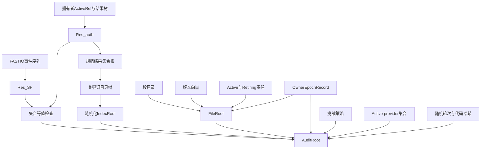
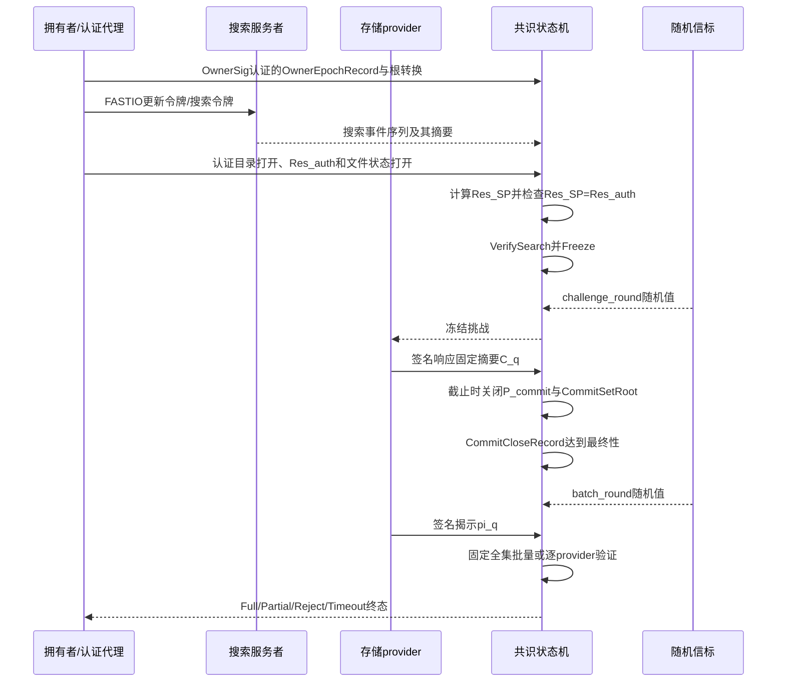
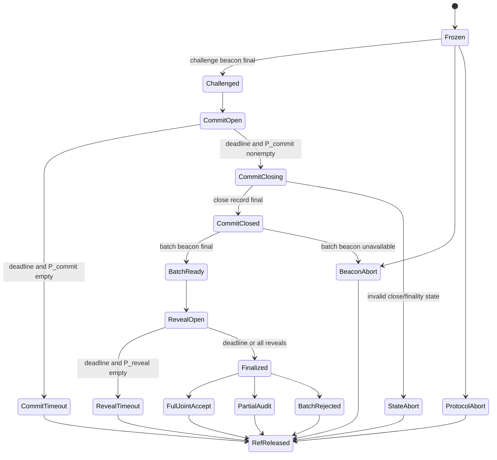
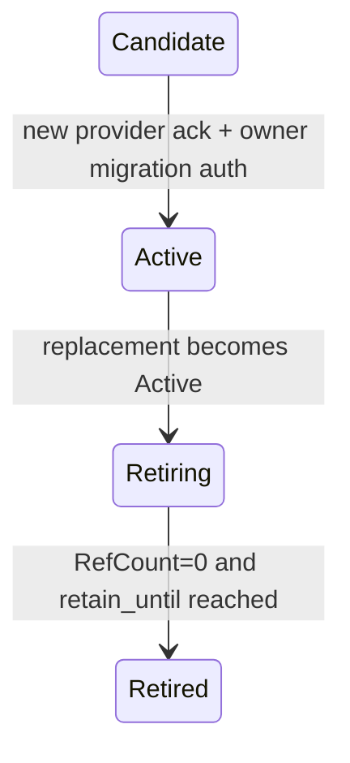
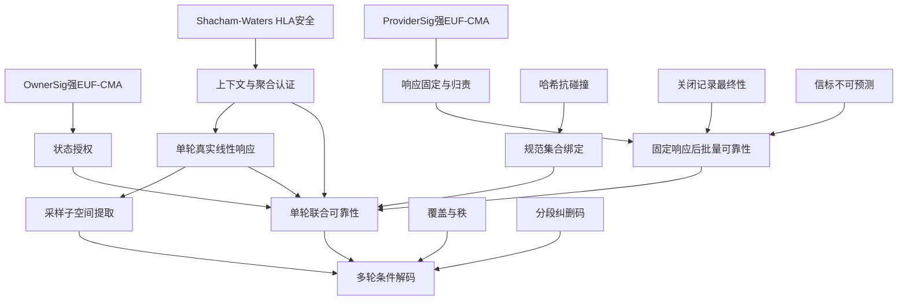

# 面向加密去中心化存储的可验证搜索—多副本联合审计

## 摘要

加密去中心化存储需要同时验证关键词检索完整性、多副本挑战响应真实性以及公开状态一致性。已有工作已经实现可搜索多副本审计，因此本文不把“同时支持搜索和多副本”作为创新，而聚焦动态多提供者环境中仍需被单独形式化的联合语义：搜索服务者可能只返回仍能通过审计的结果子集，搜索证明、文件证明和provider责任可能引用不同版本，多个提供者可能在已知批量系数后协调错误，或者通过选择性不承诺、不揭示破坏审计终态。本文提出一种冻结状态下的可验证搜索—多副本联合审计协议。方案复用前向私有动态可搜索加密执行隐私检索，并由拥有者维护外层认证结果状态；验证模块首先比较搜索服务者导出的结果集合与拥有者认证打开的完整活动集合，随后把搜索快照、文件当前状态、全部活动副本、provider责任、挑战策略、随机轮次和验证代码冻结到统一`AuditRoot`。数据线性认证与状态授权相互分离：公开线性同态认证器负责副本数据标签和单轮线性响应验证，标准数字签名负责绑定拥有者时期化数据审计公钥、关键词状态和根转换。每个provider先生成可独立验证的局部响应并提交签名的响应固定摘要；承诺集合达到共识最终性后，未来随机信标才派生批量系数。协议显式区分冻结、承诺和揭示provider集合，并输出完整接受、部分审计、承诺超时、揭示超时或批量拒绝等终态。安全分析在哈希抗碰撞、签名不可伪造、同态认证安全、共识最终性和信标不可预测等标准条件下证明单轮联合挑战可靠性。该结论保证本轮挑战响应对应冻结数据的真实线性组合；进一步地，对同一冻结状态反复调用高成功率响应者，可提取挑战矩阵行空间确定的采样子空间。完整文件解码仍需覆盖、秩和纠删码阈值，不由一次接受推出。最终批量判定使用固定数量的聚合等式，但拥有者认证状态、完整打开见证、局部响应、签名、共识前处理和在线轮次仍随查询规模增长。

**关键词：** 去中心化存储；可验证搜索；多副本审计；挑战响应健全性；采样子空间可提取性；前向隐私；区块链

---

## 1 引言

### 1.1 研究背景

数据拥有者把加密文件外包至去中心化存储网络后，不再直接控制远程数据。存储提供者可能因设备故障、软件异常或经济动机删除、篡改或仅保存部分数据。PDP和PoR通过随机抽查文件块，使验证者无需下载完整文件即可检查远程响应[5-8]。多副本机制进一步提高可用性和容灾能力，但要求不同副本在数据、标签、挑战和责任状态中可区分，否则多个提供者可以共享一份数据并声称保存了多个副本[4,9-11]。

当系统同时支持加密关键词搜索时，仅验证返回文件的数据响应并不足以证明检索正确。恶意搜索服务者可以遗漏匹配文件、插入不匹配文件、重放旧结果，或者只返回其仍能正确响应审计的文件。Song等以统一证明同时验证搜索结果和返回文件完整性[1]；Miao等进一步提出无Cloud Combiner的可搜索多副本协作审计，以基于证书的多副本认证器、匹配认证器的索引标签和区块链提高搜索结果与审计结果可信度[49]。因此，本文不再把“可搜索、多副本、去中心化审计”本身作为新颖点。

本文研究的是上述能力在动态多提供者环境中的进一步联合安全边界：搜索服务者导出的结果是否等于拥有者认证的当前完整活动集合；搜索结果、文件版本和副本责任是否来自同一最终确认快照；永久副本身份和可迁移provider责任是否被分离；批量系数是否在局部响应固定后产生；部分提供者退出时，完整接受、部分审计和责任失败是否被严格区分。Zhang等的多副本批量审计[2]、Li等的多云多副本PDP[4]以及Zhu等的证书无关审计[3]分别提供了批量、责任和身份安全基础，但不能单独替代这一冻结联合语义。

区块链能够保存不可篡改的活动根、期限和裁决结果，并由确定性验证模块替代固定第三方审计者。然而，把搜索证明、文件证明和副本日志简单并列到链上并不能自动获得联合安全：不同证明可能引用不同状态；公开稳定关键词叶还会把未来更新关联到历史搜索，从而破坏插入前向隐私。

### 1.2 直接组合攻击示例

设关键词 $w$ 在状态 $S_0$ 下对应三个活动文件

$$
Res_w^{S_0}=\{f_1,f_2,f_3\}.
$$

其中 $f_1$ 和 $f_2$ 的副本完整，而 $f_3$ 的一个活动副本已被删除。若系统先由搜索服务者返回结果、再只审计返回文件，则搜索服务者与存储提供者可以合谋返回 $\{f_1,f_2\}$，并为这两个文件生成完全合法的数据挑战响应证明。搜索证明没有认证全集，数据证明又只覆盖返回集合，因此两个局部模块均可能接受，但“返回集合是完整匹配集合”的联合陈述为假。

进一步地，假设 $f_2$ 在搜索之后从版本 $v$ 更新到 $v+1$，副本责任也从提供者 $P_2$ 迁移到 $P_4$。若搜索证明仍引用版本 $v$，数据证明引用版本 $v+1$，且副本责任来自迁移后的状态，那么每个根或标签可能单独有效，但它们不属于同一快照。若多个提供者在批量系数公开后生成响应，还可能选择相反误差使聚合等式成立。由此，本文需要认证的不是若干孤立事实，而是一个不可拆分的冻结联合陈述。

### 1.3 研究问题

本文研究：在不依赖固定可信第三方审计者的加密去中心化存储中，如何使公开验证者在同一最终确认查询上下文中确认：

1. 搜索服务者导出的集合与拥有者认证打开的关键词完整活动集合完全一致；
2. 每个结果文件的当前版本、全部活动副本和对应provider责任均进入挑战；
3. 索引根、文件根、副本分配、密钥时期、挑战策略、随机轮次和验证代码在证明完成前不可替换；
4. 多个提供者不能在看到批量系数后协调错误抵消；
5. 提供者不承诺或不揭示时，其他提供者仍能形成可验证证据，但部分结果不能被解释为全部副本通过；
6. 中继者可以代为提交消息，但不能获得拥有者授权或冒充登记提供者；
7. 历史搜索不应额外揭示未来插入属于哪个已搜索关键词。

本文的核心安全结论是单轮挑战响应健全性，而不是一次审计后的完整文件持有或可恢复。

### 1.4 设计挑战

**直接近邻之后的创新边界。** 既有TDSC工作已经支持可搜索多副本协作审计[49]。本文必须把差异落实到可形式化的安全语义，而不是继续使用功能勾选式创新：完整活动集合、同快照责任、响应固定时序和部分退出终态必须分别进入算法与定理。

**搜索双视图与数据状态的统一语义。** 搜索服务者返回的事件解释结果与拥有者认证打开的结果集合来自不同主体。协议必须显式定义并比较二者，随后才把一致结果与文件当前根、活动副本和provider责任共同冻结。

**副本真实性与责任可迁移性的兼容。** `copy_id`必须永久进入数据、标签和挑战上下文；provider身份则由带时期和状态的责任叶绑定。迁移过程中旧责任需要进入`Retiring`，直至引用旧责任的冻结查询终止，避免在途查询因迁移而失去责任主体。

**状态授权与数据线性认证的职责分离。** 拥有者状态签名只负责审计公钥注册、关键词状态和根转换；数据层采用与原始安全证明群模型一致的公开同态认证器。本文不再为状态授权引入KGC和Type-I/Type-II证书无关公钥替换模型，从而把联合证明集中到状态签名不可伪造、数据认证和响应可提取性三个相互独立的性质。

**多提供者批量与归责。** 局部响应必须在批量系数产生前被承诺固定；承诺集合还必须先达到共识最终性。批量失败和选择性不揭示需要不同验证路径，并形成不可混淆的终态。

**动态状态与隐私。** 文件和索引状态必须经拥有者授权原子切换；外层认证目录由拥有者维护，搜索服务者只看到底层前向私有索引。该设计提供强完整集合认证，但明确支付owner-assisted搜索和线性客户端认证状态的代价。

### 1.5 主要贡献

1. **完整活动集合与同快照多副本责任冻结。** 在已有可搜索多副本审计[49]基础上，本文显式区分搜索服务者结果$Res_{SP}$和拥有者认证结果$Res_{auth}$，要求二者相等后才生成`SearchSnapshot`。协议进一步把活动全集、文件当前根、段与版本状态、全部`Active`副本责任、挑战策略、随机轮次和验证代码冻结到同一`AuditRoot`，从协议语义上消除结果子集替换和跨版本、跨责任混合。

2. **可迁移责任与部分失败下的可归责审计。** 数据和标签永久绑定`copy_id`，provider责任由$(provider\_ref,assignment\_epoch,status)$绑定。迁移引入`Candidate/Active/Retiring/Retired`状态，旧provider在在途查询结束前继续承担冻结责任。协议显式区分$P_{frozen}$、$P_{commit}$和$P_{reveal}$，并输出`FullJointAccept`、`PartialAudit`、`CommitTimeout`、`RevealTimeout`或`BatchRejected`，避免把部分响应解释为全部活动副本通过。

3. **最终确认承诺后的随机批量与分层单轮安全。** 每个provider先生成可独立验证的局部线性响应并签署不隐藏的响应固定摘要；`CommitSetRoot`达到共识最终性后，未来信标才派生批量系数。固定承诺集合可执行随机批量验证，选择性不揭示则转入逐provider验证。本文给出统一的单轮联合挑战可靠性定理，并把多轮结论严格限定为高成功率响应者的采样子空间提取及覆盖、秩和纠删码阈值下的条件解码。

### 1.6 代价与适用边界

为获得强联合语义，方案需要拥有者维护与活动关键词—文件关系数线性增长的外层认证状态，并在普通挑战响应之外增加承诺关闭最终确认和第二次随机化。搜索属于owner-assisted公开可验证搜索：SP承担加密索引保存和事件检索，拥有者或受信代理提供当前认证打开。最终批量判定的等式数量固定，但每个provider仍需提交独立响应和签名，完整搜索与文件状态打开也随查询规模增长。

本文不证明一次随机挑战后的完整文件持有或完整文件可恢复，不处理历史数据审计秘密密钥或状态签名秘密密钥泄露后的前向安全，也不证明副本位于特定物理设备。其目标是在明确支付客户端状态、在线轮次和公开见证代价的条件下，建立可审计的完整活动集合、同快照责任和单轮真实线性响应。

### 1.7 论文结构

第2节讨论相关工作；第3节给出预备知识、抽象认证接口和状态记号；第4节定义系统模型、攻击者和安全目标；第5节说明总体设计、算法集合和终态语义；第6节给出具体构造；第7节分析正确性和理论开销；第8节给出安全定义与证明；第9节讨论实现和部署边界；第10节总结全文。完整伪代码、状态不变量、具体认证实例及多轮条件解码扩展置于补充材料。

---

## 2 相关工作

### 2.1 可证明数据持有与可恢复性证明

Ateniese等提出PDP模型，以随机抽查验证不可信存储中的远程数据[5]。Juels和Kaliski提出PoR，强调从高成功率证明者中恢复完整文件[6]；Shacham和Waters进一步给出基于BLS型同态认证器的紧凑PoR，以随机线性组合降低通信开销[7,24]。Wang等进一步发展了公开审计与隐私保护审计[12,13]。Erway等通过认证字典支持动态块操作[8]；后续工作研究了公平动态PoR、ORAM辅助动态PoR、可用性层和困难性放大[32-35,40]，Shi等说明纠删码布局、认证结构与更新接口必须协同设计[41]。这些工作奠定了随机审计、同态聚合和知识提取基础，但不处理搜索结果全集、多副本责任或链上冻结状态。

### 2.2 多副本、多云与去中心化审计

Curtmola等通过副本特定变换防止一个副本冒充多个副本[9]，后续研究进一步讨论协作多云、分布式复制和动态责任场景[10,11,39]。Li等把多副本分布到不同云服务器，并定义`RepGen`、`ProofGen`、`ProofAggre`和`Verify`等接口[4]；但其模型依赖可信TPA和云组织者，且固定服务器身份进入标签，不适合频繁责任迁移。Zhang等使用多项式承诺实现多文件、多副本批量审计，并在批量失败后逐provider定位责任[2]；其重点是批量和链上效率，不认证关键词完整活动集合。Miao等消除Cloud Combiner，使用基于证书的多副本认证器、与认证器匹配的索引标签以及区块链执行可搜索协作审计[49]，是本文必须直接比较的最近邻。

本文不把“搜索+多副本+区块链”作为新增功能，而关注Miao等公开贡献之外需要被独立形式化的动态联合语义：$Res_{SP}=Res_{auth}$、搜索—文件—provider责任同快照、`assignment_epoch`迁移、响应承诺后随机系数以及部分provider退出终态。二者不是简单的功能替代关系：本文获得更强状态与时序语义，同时承担更大的客户端状态和在线轮次。

### 2.3 可验证搜索与搜索—审计联合方案

可搜索对称加密从静态关键词隐私扩展到动态更新、访问泄露、前向和后向隐私[14-21]。FASTIO以对称原语实现插入前向隐私并优化输入输出效率[21]。Guo等支持前向私有可验证合取查询[42]；Guo等利用区块链实现公开可验证和前向私有搜索[43]；Zhu等同时考虑动态数据集的前向、后向隐私和结果验证[44]。

Song等在加密去中心化存储中以关键词关联标签和统一证明同时验证搜索结果与返回文件完整性[1]，明确区分`Search`、`Verify.Search`和`Verify.Audit`。Miao等进一步面向多副本去中心化存储，提出无Cloud Combiner的协作可搜索审计，并以证书型认证器、索引标签和区块链提高审计可信度与搜索结果完整性[49]。因此，Song是统一搜索—审计证明基线，Miao则是本文直接的可搜索多副本基线。

本文的差异不依赖“是否支持搜索或多副本”，而在于：动态搜索结果必须同时满足SP事件语义和拥有者认证活动集合；查询必须冻结当前文件版本和provider分配时期；provider局部响应在批量系数产生前被签名承诺；provider缺失被分解为完整、部分和责任失败终态。相关工作比较同时报告这些更强语义所增加的owner认证状态和多阶段时延。

### 2.4 身份与状态授权

证书无关密码通过KGC部分私钥与用户自选秘密值同时避免证书管理和完全密钥托管[22,23]，已有工作将其用于动态公开审计、密钥暴露抵抗和所有权转移[3,36-38,45]。Zhu等明确区分标签不可伪造和审计证明不可伪造，并指出仅证明标签安全不能覆盖删除数据后继续生成审计响应的攻击[3]。这些工作说明身份授权、数据认证与响应可提取性应分层建模。

本文最终构造不采用证书无关状态认证。原因是状态层只需认证时期化数据审计公钥、关键词状态和根转换；在链上能够登记拥有者签名公钥并记录密钥时期的部署中，标准EUF-CMA签名已经满足该职责。删除KGC和Type-I/Type-II证书无关攻击模型可以降低系统实体、密钥材料和归约复杂度，同时不削弱本文关于搜索全集、冻结责任和后置批量随机性的核心贡献。证书无关方案仍作为相关身份模型和复杂度基线。

### 2.5 区块链状态、认证数据结构与随机信标

Merkle树和认证数据结构可把大型状态压缩为短根[25,26]。以太坊等区块链平台说明了确定性智能合约和公开账本的基本执行模型[27]；但区块链共识状态机即使保存活动根、期限、位图和最终结果，也不能凭透明性自动提供隐私或联合安全。随机信标提供公开可验证、不可预测和抗单方偏置的输出[28]。本文只要求信标在预定轮次前对存储攻击者不可预测且不能被其单独偏置；若信标不可用，查询进入不可逆中止状态，而不是更换轮次复用同一查询。

### 2.6 与最接近工作的安全语义比较

| 方案 | 主要目标 | 搜索结果语义 | 多副本与责任 | 状态/时序机制 | 证明结论 |
|---|---|---|---|---|---|
| Song等[1] | 单节点搜索—审计统一证明 | 验证搜索结果与返回文件 | 不涉及多provider责任 | 文件动态状态进入统一证明 | 搜索正确性与审计证明 |
| Miao等[49] | 无Cloud Combiner的可搜索多副本协作审计 | 区块链保证搜索结果完整性，索引标签匹配多副本认证器 | 多副本、多CS协作 | 公开贡献集中于CO消除、证书型认证器和高效索引标签 | 认证器、索引标签与审计结果安全 |
| Li等[4] | 多云多副本PDP | 不适用 | 固定副本—服务器绑定 | 云组织者聚合 | 多副本挑战响应证明 |
| Zhang等[2] | 多文件、多副本批量审计 | 不适用 | 多SSP与失败定位 | 批量后定位 | PCS知识健全与审计健全 |
| 本文 | 动态完整活动集合—副本责任联合审计 | 要求$Res_{SP}=Res_{auth}$并冻结完整活动集合 | 永久`copy_id`、可迁移`assignment_epoch`和责任状态 | 同快照`AuditRoot`、最终确认承诺、后置随机批量、部分退出终态 | 单轮联合挑战响应健全性 |

表中只记录Miao等已明确公开的目标、机制和结论；对其未在公开安全接口中单独声明的性质，不直接标记为“不支持”。本文也不以否定最近邻方案作为创新前提，而是把双视图活动全集、同快照责任、关闭记录最终性、响应固定后的随机批量和部分退出终态写成可独立检验的接口、状态机与联合定理。若最近邻正文包含等价机制，最终稿应据其算法和定理进一步收缩相应贡献，而不能仅依据功能表主张首创。

### 2.6.1 直接近邻的证据边界

本文对Miao等[49]采用分级核验口径：由正式发表信息能够确认的CO消除、基于证书的多副本认证器、与认证器匹配的索引标签、区块链搜索完整性和协作审计记为“明确支持”；只有在其算法、状态变量或安全定理中能够定位对应接口时，才进一步判断是否覆盖同快照冻结、provider责任时期、响应固定时序或部分退出语义；无法由可核验定义确认的项目记为“未单独声明”，而不等同于“不支持”。因此，本文的新颖性不依赖对最近邻作负面推断，而落在自身明确给出的$Res_{SP}=Res_{auth}$、`AuditRoot`联合快照、`assignment_epoch`责任状态、`CommitCloseDigest`最终性和分层终态接口，以及覆盖这些接口的联合安全定理。若某一最近邻机制与上述接口等价，则相应内容只作为实现选择或对比项，不再单列为创新。

### 2.7 功能与成本边界比较

| 方案 | 客户端认证状态 | 完整证明/输入增长 | 在线阶段 | provider失败语义 |
|---|---|---|---|---|
| Song等[1] | 关键词最新状态 | 随结果和文件块处理增长 | 搜索与统一验证 | 单节点失败 |
| Miao等[49] | 多副本审计和搜索索引状态 | 认证器和索引标签随数据/副本生成 | 协作搜索与审计 | 以无CO协作审计为中心 |
| Li等[4] | 副本分配表 | 聚合证明较短，生成随副本增长 | 一轮挑战响应 | 依赖云组织者 |
| Zhang等[2] | 文件和承诺参数 | 链上核心较短，生成随文件/副本增长 | 一轮审计 | 批量失败后逐SSP |
| 本文 | FASTIO状态、`ActiveRel`和认证树节点 | 最终等式固定；局部响应、打开见证和前处理随$r,L,R,P,M$增长 | 搜索双视图、冻结、挑战、承诺关闭、批量随机化、揭示 | Full/Partial/CommitTimeout/RevealTimeout/Reject |

本文的增量安全语义并非免费：owner-assisted搜索需要$O(N_{rel}+N_{ADSnode})$认证状态，承诺关闭必须等待共识最终性，完整查询包含两个未来随机阶段。后续实验必须把这些代价与Miao等[49]、Song等[1]和Zhang等[2]分别比较。

---

## 3 预备知识、认证原语与状态记号

### 3.1 模块化认证架构

本文使用三个职责独立的认证模块：

1. **公开线性同态认证器`PV-HLA`：** 认证副本数据块并支持随机线性聚合；
2. **拥有者状态签名`OwnerSig`：** 认证拥有者时期记录、关键词状态和根转换；
3. **提供者签名`ProviderSig`：** 认证provider注册、迁移确认、响应固定摘要和揭示消息。

这种分离不把数据同态标签复用于普通状态消息，也不为状态层引入KGC。`OwnerEpochRecord`把活动拥有者签名公钥与数据审计公钥绑定，`AuditRoot`再绑定活动时期记录，因此攻击者不能把自选HLA验证密钥或旧状态签名插入既有查询。

### 3.2 公开线性同态认证器及固定理论实例

定义

$$
\mathsf{PV\mbox{-}HLA}=(\mathsf{KeyGen_D},\mathsf{Tag_D},\mathsf{Aggregate_D},\mathsf{Verify_D}).
$$

本文固定采用Shacham--Waters公开可验证PoR中的素数阶对称双线性群实例[7]，不在同一构造中并列未经证明的Type-3移植。令$G,G_T$为阶为素数$p$的循环群，$g,u\in G$，存在非退化双线性映射

$$
e:G\times G\rightarrow G_T.
$$

本文采用该构造原安全证明中的计算Diffie--Hellman假设：给定$(g,g^a,g^b)$，任意概率多项式时间算法计算$g^{ab}$的概率可忽略；$H_D:\{0,1\}^*\rightarrow G$在随机预言机模型中分析。该假设只服务于固定的对称群实例，不被重新命名为跨群或辅助输入假设。

数据审计秘密为$a_e\leftarrow\mathbb Z_p^*$，公开验证密钥为

$$
V_e=g^{a_e}\in G.
$$

对规范数据上下文$ctx_i$和消息块$m_i\in\mathbb Z_p$，标签为

$$
\sigma_i=(H_D(ctx_i)u^{m_i})^{a_e}\in G.
\tag{1}
$$

给定挑战系数$v_i$，聚合器计算

$$
\sigma=\prod_i\sigma_i^{v_i},\qquad
\mu=\sum_i v_im_i\pmod p,
\tag{2}
$$

验证者计算$A=\prod_iH_D(ctx_i)^{v_i}$并检查

$$
e(\sigma,g)\stackrel{?}{=}e(Au^\mu,V_e).
\tag{3}
$$

规范编码器$Enc_D$把`DataCtx`单射映射到底层Shacham--Waters文件—块消息域；编码包含长度前缀、类型标记和固定字节序，不先把两个不同上下文压缩为同一短标识。若具体实现额外预哈希该编码，则预哈希碰撞必须单独计入$Adv_{HashState}$。补充材料C.1给出查询保持的适配引理。

本文使用两类分开的性质。第一，`HLA-Auth`保证攻击者不能为新上下文、不同消息或错误聚合关系生成有效标签。第二，`SampledSubspace`把高成功率响应者视为黑盒，通过多轮独立挑战提取其能够回答的线性子空间。后者不是由标签EUF自动推出，而在第8.6节单独定义。

本稿非实验部分固定式(1)--(3)的群模型。后续实验必须使用与该模型一致的具体配对参数并报告安全级别、群元素字节和配对实现；若改用Type-3曲线，必须整体替换公式、假设和安全定理，而不能只更换库。

### 3.3 标准状态签名

定义

$$
\mathsf{OwnerSig}=(\mathsf{KeyGen_O},\mathsf{Sign_O},\mathsf{Verify_O})
$$

和

$$
\mathsf{ProviderSig}=(\mathsf{KeyGen_P},\mathsf{Sign_P},\mathsf{Verify_P})
$$

为强EUF-CMA安全数字签名。参考部署采用Ed25519；理论分析只依赖强EUF-CMA。拥有者生成

$$
(sk^{state}_e,pk^{state}_e)\leftarrow\mathsf{KeyGen_O}(1^\lambda).
$$

所有状态消息首先规范编码为

$$
M=\mathsf{Encode}(SystemDomainDigest,AuthDomain,owner\_id,e,object\_id,payload,seq,unique\_id),
$$

其中

$$
AuthDomain\in\{EpochRecord,KeywordState,IndexTransition,FileTransition,ReplicaMigration,Tombstone\}.
$$

签名为

$$
\tau_M=\mathsf{Sign_O}(sk^{state}_e,H(\textsf{StateMessage}\parallel M)).
\tag{4}
$$

验证者使用活动时期记录中的$pk^{state}_e$验证。`AuthDomain`、对象标识、序号和唯一更新标识阻止跨状态类型、跨对象和跨时期重解释。

### 3.4 拥有者时期记录与审计公钥绑定

系统在创世配置或治理注册中记录根拥有者签名公钥$pk^{root}_{owner}$。每个时期建立

$$
OwnerEpochRecord_e=(SystemDomainDigest,owner\_id,e,pk^{state}_e,V_e,DataAuthParamsDigest,status).
$$

定义

$$
OwnerEpochDigest_e=H(\textsf{OwnerEpochRecord}\parallel\mathsf{Encode}(OwnerEpochRecord_e)).
$$

拥有者使用当前有效的根签名密钥或上一时期状态密钥在`EpochRecord`域签署该记录；首个时期由$pk^{root}_{owner}$验证，后续时期由上一活动记录授权并要求时期严格递增。状态机检查签名、$pk^{state}_e$和$V_e$的群/密钥格式、参数摘要一致性、时期单调性和记录唯一性。

`DataAuthParamsDigest`固定$G,G_T,e,g,u,H_D$及编码套件。记录激活后，$pk^{state}_e$验证关键词状态和根转换，$V_e$验证该时期数据标签。任何替换$V_e$、状态公钥或认证参数的行为都必须通过合法时期转换；已冻结查询继续使用`AuditRoot`绑定的旧时期记录。

本文不建模旧数据审计秘密$a_e$、旧状态签名秘密或根签名秘密泄露后的历史安全。密钥暴露后可以建立新时期以保护未来状态，但历史时期保证取决于历史密钥是否保持秘密。

### 3.5 前向私有动态可搜索加密

底层隐私检索采用

$$
\mathsf{FPDSSE}=(\mathsf{Setup},\mathsf{Update},\mathsf{Token},\mathsf{Search}),
$$

默认实例为FASTIO[21]。FASTIO负责加密索引、关系事件和插入前向隐私；本文不依赖其内部地址或指针格式。搜索服务者保存FASTIO服务器状态 $EDB$，数据拥有者另外维护外层认证结果状态。

### 3.6 外层认证搜索状态

拥有者维护

$$
St_{AuthIndex}=(ActiveRel,ResultTrees,DirectoryTree,DirRoot,index\_seq,index\_nonce).
$$

其中

$$
ActiveRel[kw\_id,fid]\in\{\bot,rel\_nonce\}
$$

记录当前唯一活动关系。对每个活动关系定义规范集合键和叶

$$
rel\_key=H(\textsf{RelationKey}\parallel kw\_id\parallel fid\parallel rel\_nonce),
$$

$$
RelLeaf=H(\textsf{ResultLeaf}\parallel kw\_id\parallel fid\parallel rel\_nonce).
$$

关键词结果树以`rel_key`为固定长度键、以`RelLeaf`为叶值，按照第3.8节规范压缩规则重建`ResultSetRoot_w`。令`KwCtx_w`采用第6.2节的规范关键词状态编码。关键词目录键和叶分别定义为

$$
dir\_key=H(\textsf{DirectoryKey}\parallel owner\_id\parallel e\parallel kw\_id),
$$

$$
KeywordLeaf=H(\textsf{KeywordLeaf}\parallel\mathsf{Encode}(KwCtx_w)\parallel H(\kappa_w)).
$$

所有`KeywordLeaf`按`dir_key`进入固定深度稀疏目录树。更新阶段由拥有者先生成$\kappa_w$和`KeywordLeaf`，再计算`DirRoot`。链上只保存随机化目录根承诺

$$
IndexRoot=H(\textsf{IndexCommit}\parallel owner\_id\parallel e\parallel index\_seq\parallel index\_nonce\parallel DirRoot).
\tag{5}
$$

更新阶段不公开`DirRoot`、关键词目录键、叶或路径。搜索发生时，拥有者或其授权中继者提供当前打开材料。

### 3.7 分段纠删编码

文件先认证加密，再划分为固定容量逻辑段：

$$
F^{enc}=(Seg_1,\ldots,Seg_L).
$$

每个新段由文件内单调计数器产生永久不复用的`segment_id`。每段独立调用

$$
\mathsf{EC.Enc}_{seg}:\mathbb Z_p^{K_s}\rightarrow\mathbb Z_p^{n_s}.
$$

分段编码只提供更新局部性和条件恢复接口，不自动把一次审计变为PoR。只有在同一段获得不少于 $K_s$ 个可用编码符号时，才能恢复该段。

### 3.8 认证数据结构

- 文件活动段使用普通Merkle根`SegmentRoot`；
- 编码位置版本使用`VersionRoot`；
- 活动副本—provider责任使用`ReplicaRoot`；
- 关键词活动关系使用规范压缩稀疏Merkle集合；
- 关键词目录使用固定深度稀疏Merkle树。

规范压缩集合由完整键比特串唯一决定：禁止单子节点、插入顺序相关旋转和实现私有节点编号。空集合、叶和分支使用不同域标签。

### 3.9 其他原语与系统假设

统一系统域摘要定义为

$$
SystemDomainDigest=H(\textsf{SystemDomain}\parallel chain\_id\parallel network\_id\parallel module\_id\parallel protocol\_version\parallel verifier\_code\_hash\parallel CryptoSuiteDigest).
$$

本文使用PRF、KDF、认证加密、抗碰撞哈希、域分离哈希、EUF-CMA安全的provider签名，以及在预定轮次前不可预测且不能由存储攻击者单独偏置的随机信标。所有编码均采用长度前缀、类型标记和唯一字节序。

共识层采用确定性拜占庭状态机复制。任一共识时期内拜占庭投票权严格少于总投票权的$1/3$，已最终确认状态不回滚；活性要求网络最终同步。随机信标由阈值委员会产生，攻击者在达到重构阈值前不能预测输出，也不能由单一参与方选择性偏置输出。若共识节点、provider和信标参与者存在身份重叠，安全要求仍分别满足共识阈值和信标阈值；本文不假设这些角色彼此独立。

### 3.10 状态持有者

| 状态 | 维护者 | 位置 | 规模/说明 |
|---|---|---|---|
| FASTIO客户端状态 | 拥有者 | 链下秘密 | 按FASTIO定义 |
| `ActiveRel`、结果树和目录树 | 拥有者/受信认证代理 | 链下认证状态 | 与活动关系和ADS节点数线性 |
| `EDB` | 搜索服务者 | 链下 | 底层加密索引 |
| 副本数据和`PV-HLA`标签 | 各provider | 链下 | 按责任范围 |
| `OwnerEpochRecord` | 共识状态机 | 链上活动状态 | 绑定状态签名公钥和数据审计公钥 |
| `IndexRoot`、`FileRoot` | 共识状态机 | 链上活动状态 | 每拥有者/文件短根 |
| `ReplicaVector`中的Active/Retiring责任 | 拥有者、provider和共识状态机 | 根承诺+链下向量 | 新查询只读取Active，旧查询可引用Retiring |
| `FrozenAssignmentRefCount`、`PendingDisputeRefCount` | 共识状态机 | 链上责任计数/事件摘要 | 保护在途查询，终态或争议结束后释放 |
| `QueryState` | 共识状态机 | 链上临时状态 | 根、轮次、provider集合、关闭摘要和终态 |
| 完整打开见证 | 提交者/数据可用层 | 事务输入或链下归档 | 随查询规模增长 |

### 3.11 主要记号

| 记号 | 含义 |
|---|---|
| $owner\_id,e$ | 拥有者签名身份与密钥时期 |
| $pk^{state}_e$ | 时期化拥有者状态签名公钥 |
| $V_e\in G$ | 时期化公开数据审计公钥 |
| $kw\_id$ | 时期化关键词伪名 |
| $Res_{SP},Res_{auth}$ | SP事件解释结果与拥有者认证活动集合 |
| $ActiveRel[kw\_id,fid]$ | 当前唯一活动关系随机数 |
| $ResultSetRoot_w$ | 关键词活动全集根 |
| $DirRoot,IndexRoot$ | 内部目录根与链上随机化承诺 |
| $segment\_id,sid$ | 永久不复用的段标识 |
| $copy\_id_{f,j}$ | 永久不复用的副本标识 |
| $provider\_ref_q$ | provider身份、注册时期和签名公钥引用 |
| $assignment\_epoch,status$ | provider责任时期与Candidate/Active/Retiring/Retired状态 |
| $FrozenAssignmentRefCount,PendingDisputeRefCount$ | 冻结查询与争议窗口对责任时期的引用计数 |
| $SegmentRoot_f$ | 活动段目录根 |
| $VersionRoot_f$ | 活动编码位置版本根 |
| $ReplicaRoot_f$ | Active和必要Retiring责任根 |
| $FileRoot_f$ | 文件当前状态根 |
| $ChallengePolicyDigest$ | 挑战规模和范围摘要 |
| $AuditRoot$ | 冻结联合查询根 |
| $\Omega_q$ | provider$q$的冻结责任范围 |
| $\pi_q=(\sigma_q,\mu_q,LocalScopeDigest_q)$ | provider$q$的完整局部响应 |
| $C_q$ | 不隐藏的局部响应固定摘要 |
| $CommitCloseDigest$ | 最终确认的承诺集合关闭摘要 |
| $P_{frozen},P_{commit},P_{reveal}$ | 冻结、已承诺和已揭示provider集合 |
| $\beta_q$ | 承诺关闭最终确认后产生的批量系数 |

---

## 4 系统模型、攻击者与安全目标

### 4.1 系统实体

系统包含数据拥有者、搜索服务者、多个存储提供者、区块链共识状态机、随机信标、中继者和公开验证者。

- **拥有者：** 加密、编码和复制文件，生成数据审计密钥与状态签名密钥，维护外层认证搜索状态，并签名授权时期记录和根转换；
- **搜索服务者：** 保存FASTIO的$EDB$，可遗漏、插入、重放或拒绝返回事件；
- **存储提供者：** 保存副本数据和标签，可全部合谋、删除数据、保留标签、延迟或选择性退出；
- **共识状态机：** 保存拥有者时期记录、活动根、provider注册表、迁移引用计数、未完成查询的最小状态和最终结果，并执行确定性验证逻辑；
- **随机信标：** 在预定轮次产生唯一、公开可验证和阈值不可预测的输出；
- **中继者：** 可代为提交签名消息，但交易发送地址不代表拥有者或provider密码学身份；
- **公开验证者：** 可读取公开状态、搜索打开和审计转录并复核结果。

### 4.2 拥有者信任边界

本文假设拥有者诚实执行文件预处理、关键词关系语义、活动结果集合维护和状态授权。协议证明恶意搜索服务者、存储提供者或中继者不能把与拥有者已签名状态不一致的结果或数据响应作为有效证明接受。协议不判断拥有者是否主动登记错误文件、错误关键词或错误副本内容。

拥有者必须在线生成搜索令牌和当前外层认证打开，或者把认证状态交给受其信任的在线代理。代理可以保存认证树和提交拥有者预签名消息，但不能生成新的状态签名。

### 4.3 攻击者可见状态

| 攻击者 | FASTIO服务器视图 | 公开链转录 | 合法数据标签 | 数据预处理/删除 | 拥有者状态签名密钥 |
|---|---:|---:|---:|---:|---:|
| 联合存储攻击者 | 是 | 是 | 可持有全部真实标签 | 是 | 否 |
| 公开观察者 | 否 | 是 | 公开证明中可见部分 | 否 | 否 |
| 中继者 | 仅经授权消息 | 是 | 否 | 否 | 否 |
| 被攻破provider | 其责任范围 | 是 | 是 | 是 | 否 |

### 4.4 状态授权攻击者

状态授权攻击者可控制搜索服务者、全部provider、中继者和任意非目标拥有者账户，并可获得目标拥有者对自适应选择的非挑战状态消息的签名。其目标是在活动$OwnerEpochRecord$或合法时期转换下，为一个新鲜的`EpochRecord`、`KeywordState`、根转换、迁移或墓碑消息生成有效签名。

目标消息的新鲜性按$(AuthDomain,owner\_id,e,object\_id,seq,unique\_id,payload)$判断。签名公钥替换不作为独立密码学接口；变更时期化状态公钥必须由根公钥或上一活动时期合法授权。因此状态安全统一归约到`OwnerSig`的强EUF-CMA安全和时期链新鲜性。

### 4.5 存储与响应攻击者

攻击者可以在获得完整数据和真实标签后执行任意概率多项式时间预处理，保留任意多项式大小辅助状态，随后删除、压缩或重编码原始数据。它可以控制全部provider、共享历史材料、查看公开挑战和转录，并在看到批量系数后选择不揭示。

安全模型不尝试判断攻击者实际保存了何种物理表示。若攻击者以非可忽略概率正确回答同一冻结状态上的独立随机挑战，则第8.6节的黑盒提取器应能恢复其响应行为所确定的采样线性子空间。单轮接受只证明当前响应关系；完整文件解码还需要覆盖、秩和纠删码条件。

### 4.6 协议、共识和信标攻击

攻击者可重放、换序、延迟和丢弃消息，可以选择性不承诺或不揭示，但不能伪造诚实主体签名、修改已关闭承诺集合、改变最终确认状态，或单独偏置信标输出。

共识安全与活性分离：若拜占庭阈值或最终同步条件失效，协议可能无法终止；只有共识安全或最终性失效进入联合可靠性优势。若预定信标轮次不可用，查询进入`BeaconAbort`，不得改用其他轮次复用同一`query_id`。provider、共识节点和信标参与者可以身份重叠，但共识阈值与信标阈值必须分别成立。

定义$Adv_{Beacon}$为攻击者在不突破信标阈值和输出证明验证的条件下，能够在`CommitCloseRecord`最终确认前预测对应`batch_round`的有效输出，或在最终确认后使已接受输出相对于协议声明的条件均匀分布产生非可忽略偏差的优势。信标不可用只影响活性并进入`BeaconAbort`；伪造输出、提前预测或越过阈值偏置才进入$Adv_{Beacon}$。

### 4.7 联合泄露函数

搜索服务者也能读取公开链，因此隐私分析使用联合视图

$$
View_{SP}^{joint}=View_{FASTIO}\cup View_{chain}\cup View_{open}.
$$

对应泄露函数为

$$
\mathcal L_{joint}=(\mathcal L_{FASTIO},\mathcal L_{chain},\mathcal L_{open}).
$$

其中：

- $\mathcal L_{FASTIO}$由底层方案定义，包括搜索模式、访问模式、事件链长度和更新长度；
- $\mathcal L_{chain}$包括根更新时间、批次大小、文件根是否同批变化、provider集合、挑战、位图和终态；
- $\mathcal L_{open}$包括搜索时主动公开的目录路径、结果标识、结果规模及冻结文件和副本责任状态。

本文不声称隐藏上述信息，也不证明完整后向隐私。

### 4.8 安全目标

1. **底层检索隐私：** 在显式联合泄露函数下，FASTIO保持其关键词隐私和插入前向隐私，随机化`IndexRoot`不额外公开稳定关键词目录位置；
2. **搜索双视图一致性：** SP事件序列规范解释得到的$Res_{SP}$与拥有者认证打开的$Res_{auth}$相等；
3. **已认证活动全集：** $Res_{auth}$是冻结关键词结果根的唯一规范打开；
4. **状态新鲜性与同快照：** 时期记录、搜索根、文件根、Active副本责任和挑战策略来自同一最终确认状态；
5. **状态授权安全：** 攻击者不能伪造时期记录、关键词状态、根转换、迁移或墓碑签名；
6. **数据认证与单轮响应健全性：** 接受局部响应中的$\mu_q$等于冻结责任范围内真实挑战数据的线性组合；高成功率响应者进一步满足采样子空间可提取性定义；
7. **固定承诺后的批量可靠性：** 错误局部关系不能通过最终确认承诺集合之后产生的随机批量系数抵消；
8. **provider归责：** 承诺、揭示、迁移保留和超时事件归属于唯一登记provider；
9. **单轮联合挑战可靠性：** `FullJointAccept`同时保证搜索双视图、活动全集、冻结状态、全部Active副本责任和本轮线性响应；
10. **条件多轮解码：** 仅在覆盖、秩和分段纠删码条件满足时，声明已收集方程足以解码相应段。

### 4.9 非目标

协议不保证持续服务可用性，不证明副本位于特定物理设备，不阻止网络层转包，不验证拥有者登记数据的业务语义，也不把部分provider成功解释为全部副本通过。本文不证明一次审计后的完整文件持有或PoR可恢复性，不处理旧数据审计秘密$a_e$、旧状态签名秘密泄露后的历史时期安全，公开审计响应会泄露副本掩码数据的随机线性组合；内容机密性依赖认证加密和PRF掩码，而不是零知识审计。

### 4.10 直接组合失效与本文机制

| 直接组合方式 | 失败 | 本文机制 |
|---|---|---|
| 只信任SP搜索结果 | 可遗漏、插入或重放事件 | 比较$Res_{SP}$与$Res_{auth}$ |
| 只审计返回文件 | 可遗漏已损坏匹配文件 | 认证活动全集后冻结挑战 |
| 多副本共用上下文 | 一份数据冒充多个副本 | `copy_id`进入数据、标签和挑战 |
| 搜索根和文件根分别读取 | 混合快照 | 原子根转换与统一`AuditRoot` |
| provider迁移立即释放旧责任 | 在途查询失去责任主体 | Active/Retiring状态与保留期 |
| 未认证替换数据公钥 | 伪造者自选验证密钥 | `OwnerEpochRecord`以拥有者时期签名绑定$V_e$ |
| 先公布批量系数 | 多provider协调误差 | 最终确认完整局部响应承诺后随机化 |
| 中继地址作为身份 | 抢占位图或错误归责 | provider签名承诺和揭示 |
| 标签EUF等同完整持有 | 结论超过单轮证明 | 分开HLA认证、单轮关系与采样子空间提取 |

---

## 5 方案总体设计

### 5.1 核心联合陈述

对一个最终确认查询，只有当协议输出`FullJointAccept`时，本文才声明：

1. $Res_{SP}=Res_{auth}=Res$，且$Res$是冻结关键词的完整活动集合；
2. 每个结果文件的活动段、版本、全部`Active`副本和provider责任属于冻结快照；
3. 冻结时期的拥有者时期记录、状态签名公钥和数据审计公钥有效；
4. 承诺集合已经最终确认，全部冻结provider均按时承诺和揭示；
5. 每个provider的局部响应等于其冻结责任范围内本轮真实数据线性组合；
6. 不存在通过批量错误抵消获得接受的行为。

一次接受不证明所有未挑战块存在，也不自动证明完整文件可恢复。

### 5.2 六阶段协议结构

主协议按下列六个阶段组织，具体子算法在第6节定义。

1. **初始化与注册：** 建立拥有者状态签名密钥、独立数据审计密钥和provider注册表；
2. **外包与动态更新：** 加密、编码、生成副本和标准HLA标签，并原子更新索引根和文件根；
3. **搜索与结果验证：** FASTIO返回关系事件，拥有者提供外层全集认证打开；
4. **冻结与挑战：** 验证当前文件和副本责任，将全部上下文写入`AuditRoot`后等待挑战信标；
5. **局部证明、承诺与揭示：** 提供者先计算完整局部响应并承诺，未来信标再产生批量系数；
6. **批量验证、定位与终态：** 批量成功形成候选结果，批量失败逐提供者定位，最终依据三类provider集合产生完整、部分或失败终态。

### 5.3 状态结构



### 5.4 形式算法

$$
\begin{aligned}
\mathsf{Setup},\;&\mathsf{RegisterEpoch},\mathsf{RegisterProvider},\\
\mathsf{Outsource},\;&\mathsf{IndexUpdate},\mathsf{FileUpdate},\mathsf{MigrateProvider},\\
\mathsf{Token},\;&\mathsf{Search},\mathsf{VerifySearch},\\
\mathsf{Freeze},\;&\mathsf{Challenge},\mathsf{LocalProve},\mathsf{VerifyLocal},\\
\mathsf{Commit},\;&\mathsf{CloseCommitSet},\mathsf{BatchRandomize},\mathsf{Reveal},\\
\mathsf{VerifyBatch},\;&\mathsf{Finalize},\mathsf{ReleaseFrozenRefs}.
\end{aligned}
$$

`OwnerSig.KeyGen/Sign/Verify`、`ProviderSig.KeyGen/Sign/Verify`和`PV-HLA.KeyGen/Tag/Aggregate/Verify`作为底层原语调用，不再列为协议层的部分私钥或用户密钥生成算法。密钥全局迁移是维护扩展，不属于主联合协议。

### 5.5 端到端流程



### 5.6 三类provider集合

- $P_{frozen}$：由冻结副本责任唯一导出的全部提供者；
- $P_{commit}\subseteq P_{frozen}$：承诺截止前提交有效承诺的提供者；
- $P_{reveal}\subseteq P_{commit}$：揭示截止前提交有效揭示的提供者。

`FullJointAccept`的必要条件是

$$
P_{reveal}=P_{commit}=P_{frozen}.
\tag{6}
$$

批量随机系数以截止时固定的$P_{commit}$和`CommitSetRoot`为输入。若$P_{reveal}=P_{commit}$，批量验证覆盖这一在随机系数产生前已固定的集合；若$P_{reveal}\subsetneq P_{commit}$，揭示子集是在观察批量系数后形成的，协议不得直接对该自适应子集套用批量误判定理，而必须逐个执行`VerifyLocal`。未承诺和未揭示责任分别进入缺失位图，不能被聚合等式掩盖。

### 5.7 终态语义

| 终态 | 条件 | 可声明内容 |
|---|---|---|
| `FullJointAccept` | $P_{reveal}=P_{commit}=P_{frozen}$，所有非代数检查通过且固定全集批量验证接受 | 主联合安全陈述成立 |
| `PartialAudit` | $\varnothing\neq P_{reveal}$且三集合不全相等；所有被计入的揭示响应均通过适用的批量或局部验证 | 只认证已验证的揭示责任，并公开缺失集合 |
| `BatchRejected` | 至少一个揭示响应经局部回退被判定无效 | 输出无效提供者及证据 |
| `CommitTimeout` | $P_{commit}=\varnothing$ | 没有形成可验证挑战响应，记录全部缺失承诺 |
| `RevealTimeout` | $P_{commit}\neq\varnothing$且$P_{reveal}=\varnothing$ | 没有形成可验证揭示，记录承诺后退出 |
| `BeaconAbort` | 预定信标输出缺失或验证失败 | 查询不可换轮重试 |
| `StateAbort` | 冻结状态、规范编码、打开材料或关闭最终性不一致 | 查询拒绝并保留错误摘要 |
| `ProtocolAbort` | 资源上限、协议版本、代码哈希或消息状态机检查失败 | 不产生接受结论，并按终态规则释放责任引用 |

当部分提供者缺失但仍有有效揭示时，`PartialAudit`是主终态；`MissingCommit`和`MissingReveal`作为可归责故障集合附加到终态记录，而不是被解释为完整接受。

### 5.8 攻击—机制—定理—成本映射

| 攻击 | 机制 | 定理责任 | 主要代价 |
|---|---|---|---|
| SP结果遗漏/插入 | $Res_{SP}=Res_{auth}$ | 搜索双视图一致性 | 两个来源的结果解析与比较 |
| 认证集合错误打开 | 结果根和规范CSMT | 集合绑定 | owner的$O(N_{rel})$认证状态 |
| 旧状态/混合快照 | 原子根转换和AuditRoot | 状态新鲜性 | 冻结文件与责任打开 |
| 数据公钥替换 | OwnerSig认证时期记录 | 状态授权不可伪造 | 状态签名验证 |
| 跨副本冒充 | copy-specific数据、标签和挑战 | HLA响应健全性 | 每副本标签与挑战 |
| 迁移中责任逃逸 | Active/Retiring与查询引用 | 状态机不变量 | 旧provider保留期 |
| 留标签删数据/预处理压缩 | 单轮关系验证与多轮黑盒挑战 | 真实线性响应+采样子空间提取 | 公开$\mu_q$并增加重复挑战 |
| 批量错误抵消 | 最终确认承诺后随机系数 | 批量可靠性 | 第二信标与承诺轮次 |

---

## 6 具体构造

### 6.1 初始化、时期注册和提供者注册

系统初始化`PV-HLA`、`OwnerSig`和`ProviderSig`。拥有者执行`PV-HLA.KeyGen_D`生成数据审计密钥$(a_e,V_e)$，并执行`OwnerSig.KeyGen_O`生成时期化状态签名密钥$(sk^{state}_e,pk^{state}_e)$。

拥有者构造`OwnerEpochRecord_e`。首个时期由治理注册的根签名公钥授权，后续时期由上一活动时期密钥签名授权。共识状态机验证签名，检查时期单调递增、记录摘要未使用、$V_e$和$pk^{state}_e$格式及参数域一致后激活该记录。

每个存储提供者生成强EUF-CMA安全签名密钥对$(sk_q,pk_q)$并登记

$$
provider\_ref_q=(provider\_id_q,registry\_epoch_q,pk_q).
$$

注册交易必须证明对$sk_q$的控制，并绑定provider注册时期，防止中继地址或旧签名公钥占用责任槽位。

### 6.2 关键词标识、活动关系和状态认证

拥有者计算

$$
kw\_id=\mathsf{PRF}_{K_{kw,e}}(owner\_id\parallel e\parallel\mathsf{Normalize}(w)).
$$

对活动关系定义

$$
rel\_key=H(\textsf{RelationKey}\parallel kw\_id\parallel fid\parallel rel\_nonce).
$$

合法状态转换只有：

- 插入：当前值为$\bot$，采样新`rel_nonce`；
- 删除：事件随机数必须等于当前活动值，随后写回$\bot$；
- 重插：先删除旧关系，再使用从未复用的新随机数。

拥有者更新关键词规范CSMT和目录叶，形成

$$
KwCtx_w=(SystemDomainDigest,owner\_id,e,kw\_id,state\_seq_w,leaf\_nonce_w,ResultSetRoot_w).
$$

拥有者在`KeywordState`域对$KwCtx_w$执行`OwnerSig.Sign_O`得到$\kappa_w$，随后按第3.6节计算`dir_key`和`KeywordLeaf`，以固定深度稀疏目录树重建`DirRoot`，再按式(5)以新鲜`index_nonce`计算链上`IndexRoot`。目录叶同时绑定`ResultSetRoot_w`、状态序号、叶随机数和状态签名摘要；改变其中任一字段都需要新的目录根与链上根转换。

### 6.3 文件、段、版本和副本责任

文件认证加密后按段独立纠删编码。文件维护单调计数器`next_segment_counter`；新段标识为

$$
segment\_id=H(\textsf{SegmentID}\parallel owner\_id\parallel fid\parallel next\_segment\_counter\parallel nonce_{seg}).
$$

活动段向量和版本向量分别为

$$
SegmentVector_f=\{(pos,sid,valid\_length)\},
$$

$$
VersionVector_f=\{(sid,k,ver_{f,sid,k})\}.
$$

对应叶值规范定义为

$$
SegmentLeaf_{f,pos}=H(\textsf{SegmentLeaf}\parallel fid\parallel pos\parallel sid\parallel valid\_length),
$$

$$
VersionLeaf_{f,sid,k}=H(\textsf{VersionLeaf}\parallel fid\parallel sid\parallel k\parallel ver_{f,sid,k}).
$$

`SegmentRoot_f`按`pos`严格递增的完整活动段向量计算；`VersionRoot_f`按$(sid,k)$严格排序的完整活动位置向量计算。重复位置、缺失活动位置、无效长度或非单调版本均被拒绝。

每个副本具有永久不复用的`copy_id`。拥有者计算

$$
K_{f,j}=\mathsf{KDF}(K_{mask,e},owner\_id\parallel e\parallel fid\parallel copy\_id_{f,j}),
$$

$$
\rho_{f,j,sid,k}=\mathsf{PRF}_{K_{f,j}}(fid\parallel copy\_id_{f,j}\parallel sid\parallel k\parallel ver_{f,sid,k}),
$$

$$
m_{f,j,sid,k}=c_{f,sid,k}+\rho_{f,j,sid,k}\pmod p.
\tag{7}
$$

provider责任状态为

$$
status\in\{Candidate,Active,Retiring,Retired\}.
$$

责任叶规范定义为

$$
\begin{aligned}
ReplicaLeaf_{f,j,a}=H(&\textsf{ReplicaLeaf}\parallel fid\parallel copy\_id_{f,j}\parallel provider\_ref_{a}\\
&\parallel assignment\_epoch_{a}\parallel status_a\parallel retain\_until_a).
\end{aligned}
\tag{8}
$$

`ReplicaVector`按$(copy_id,assignment_epoch)$严格排序。对每个`copy_id`同时至多一个`Active`责任；`Candidate`不能进入新查询；`Retiring`只服务已经冻结并引用旧`assignment_epoch`的查询；`Retired`不承担任何新旧挑战。`ReplicaRoot`提交当前`Active`责任和仍处于保留期的`Retiring`责任。

迁移流程为：新provider以`Candidate`接收并验证数据和标签；其确认签名和拥有者`ReplicaMigration`域授权同时通过后，新责任变为`Active`，旧责任变为`Retiring`。只有当所有引用旧责任的冻结查询进入终态，或达到治理层规定的强制保留期限且未完成查询已被记录为责任失败后，旧责任才能变为`Retired`并从后续活动根中清理。

共识状态机为每个责任时期维护

$$
FrozenAssignmentRefCount[fid,copy\_id,assignment\_epoch]\in\mathbb N.
\tag{9}
$$

只有完整冻结记录达到最终性后，所引用责任的计数才增加；候选分块冻结不增加计数。查询进入任一不可逆终态后计数减少；若存在争议窗口，则引用先转入`PendingDisputeRefCount`，争议结束后再释放。`Retiring`转为`Retired`必须同时满足活动引用与争议引用均为零，且达到`retain_until`；超过最大查询生命周期的未完成查询先写入明确超时终态和责任失败日志，不能无限锁定旧provider。

文件元数据为

$$
\begin{aligned}
FileMeta_f=(&owner\_id,e,fid,OwnerEpochDigest_e,encrypted\_length,ECParams,\\
&next\_segment\_counter,SegmentRoot_f,VersionRoot_f,ReplicaRoot_f,file\_status).
\end{aligned}
\tag{10}
$$

并计算

$$
FileRoot_f=H(\textsf{FileState}\parallel\mathsf{Encode}(FileMeta_f)).
\tag{11}
$$

### 6.4 副本特定数据标签

数据上下文为

$$
DataCtx_i=(SystemDomainDigest,OwnerEpochDigest_e,fid,copy\_id_{f,j},sid,k,ver_{f,sid,k}).
$$

拥有者按式(1)计算

$$
\sigma_i=(H_D(DataCtx_i)u^{m_i})^{a_e}.
\tag{12}
$$

provider在接受外包前验证

$$
e(\sigma_i,g)\stackrel{?}{=}e(H_D(DataCtx_i)u^{m_i},V_e).
\tag{13}
$$

`provider_ref`不进入永久数据标签；当前责任由式(8)、`ReplicaRoot`和provider签名绑定。永久`copy_id`和单调版本保证跨文件、跨副本、跨段位置和跨版本标签不能被重新解释。

### 6.5 拥有者签名授权的原子状态转换

对一次原子更新，把所有受影响对象的旧根和新根编码为

$$
StateDeltaLeaf=H(\textsf{StateDeltaLeaf}\parallel object\_type\parallel object\_id\parallel old\_root\parallel new\_root),
$$

并按$(object\_type,object\_id)$规范排序计算`StateDeltaRoot`。状态转换上下文定义为

$$
\begin{aligned}
StateTransCtx=(&SystemDomainDigest,owner\_id,e,OwnerEpochDigest_e,update\_id,update\_type,\\
&old\_IndexRoot,new\_IndexRoot,StateDeltaRoot,deadline).
\end{aligned}
\tag{14}
$$

拥有者在与`update_type`一致的`AuthDomain`下使用活动$sk^{state}_e$签名该上下文。文件变更还要求受影响的新provider签署候选确认。共识状态机仅在以下条件同时满足时原子激活新根：

1. 拥有者状态签名在活动时期公钥下有效；
2. `OwnerEpochRecord`为活动时期记录；
3. `AuthDomain`与对象类型和操作一致；
4. 旧根等于当前活动根；
5. 必要provider确认签名齐全且注册时期有效；
6. `update_id`未使用且未过期；
7. 候选状态未进入中止终态。

搜索服务者不作为安全确认方；其拒绝保存FASTIO更新只造成可用性失败。

### 6.6 初始外包与动态文件更新

初始外包流程为：

1. 认证加密文件并分段纠删编码；
2. 生成永久段标识、版本、活动副本和`Candidate`责任；
3. 生成副本特定数据与HLA标签；
4. 构造`SegmentRoot`、`VersionRoot`、`ReplicaRoot`和`FileRoot`；
5. 将每个副本发送给候选provider；
6. provider验证式(13)并签署候选确认；
7. 拥有者签署状态转换；
8. 共识状态机把候选责任转为`Active`并原子激活文件根及索引根。

主协议支持段修改、追加、截断、新增副本、删除副本、provider迁移和文件墓碑。段修改只重编码受影响段并提高对应版本；副本重新创建必须使用新`copy_id`。provider迁移保留`copy_id`、数据和标签，但按第6.3节同时产生新`Active`和旧`Retiring`责任。文件墓碑禁止新查询，但已经冻结的查询继续按其`AuditRoot`和责任时期完成或超时。

### 6.7 关系更新、搜索与结果验证

关系更新同时执行FASTIO更新和拥有者外层认证状态更新。搜索时：

1. 拥有者生成FASTIO令牌；
2. SP返回关系事件序列`EventSequence`及摘要$EventDigest$；
3. 验证模块按FASTIO规范事件语义计算
   $$Res_{SP}=\mathsf{CanonicalInterpret}(EventSequence);$$
4. 拥有者或认证代理提交当前`DirRoot`、`index_nonce`、`dir_key`、`KeywordLeaf`、目录路径、规范活动关系集合及$\kappa_w$；
5. 验证模块由$kw_id$重算`dir_key`，由$KwCtx_w$与$\kappa_w$重算`KeywordLeaf`，验证目录路径和链上`IndexRoot`，再验证关键词状态签名，并由规范关系集合重建`ResultSetRoot`，得到
   $$Res_{auth}=\mathsf{OpenResultState}(ResultSetRoot_w,\pi_w);$$
6. 检查关系键严格递增、无重复、同一`fid`至多一个活动实例，并要求
   $$Res_{SP}=Res_{auth};\tag{15}$$
7. 若事件存在遗漏、插入、重复、失效删除、旧状态重放或集合不等，立即输出`StateAbort`。

通过后令$Res=Res_{SP}=Res_{auth}$，输出

$$
SearchSnapshot=(owner\_id,e,OwnerEpochDigest_e,kw\_id,IndexRoot,ResultSetRoot_w,state\_seq_w,EventDigest,Res).
\tag{16}
$$

因此SP的搜索结果不是被拥有者认证集合替代，而是与认证集合交叉检查。SP承担服务器端加密索引遍历；拥有者状态承担完整集合认证。

### 6.8 查询冻结

查询发起者提交规范挑战策略$PolicyItem_f=(fid,c_f,sampling\_mode_f,segment\_scope_f,replica\_scope_f)$。主配置要求`segment_scope`覆盖全部活动段、`replica_scope`覆盖每个`copy_id`的唯一`Active`责任；`Candidate`和`Retiring`不进入新查询。验证模块读取当前活动状态，检查完整文件元数据和向量，并从`ReplicaVector`唯一导出$P_{frozen}$。

定义`ProviderSetDigest`、`ChallengePolicyDigest`和

$$
StateDigest=H(\mathsf{SortUnique}(\{fid\parallel FileRoot_f\}_{f\in Res})).
$$

计算

$$
\begin{aligned}
AuditRoot=H(&\textsf{FrozenAudit}\parallel SystemDomainDigest\parallel query\_id\parallel owner\_id\parallel e\\
&\parallel OwnerEpochDigest_e\parallel kw\_id\parallel IndexRoot\parallel ResultSetRoot_w\parallel EventDigest\\
&\parallel StateDigest\parallel ProviderSetDigest\parallel ChallengePolicyDigest\parallel challenge\_round).
\end{aligned}
\tag{17}
$$

冻结交易达到最终性后，挑战信标轮次才生效。所有冻结责任引用具体`assignment_epoch`；后续迁移不改变既有查询责任。

冻结记录最终确认时，状态机对每个$(fid,copy\_id,assignment\_epoch)$执行`FrozenAssignmentRefCount += 1`并记录`query_id`事件。若分块冻结在最终组装前失败，不产生任何责任引用。

### 6.9 挑战生成

未来信标输出到达后计算

$$
seed_{chal}=H(\textsf{ChallengeSeed}\parallel AuditRoot\parallel ChallengePolicyDigest\parallel challenge\_round\parallel BeaconValue).
$$

对每个文件无放回抽取$c_f$个活动位置。同一文件全部副本共享位置集合，但使用副本特定系数

$$
v_i=H_p(\textsf{ChallengeCoefficient}\parallel seed_{chal}\parallel fid\parallel copy\_id_{f,j}\parallel sid\parallel k)\in\mathbb Z_p^*.
\tag{18}
$$

若预定轮次未产生合格信标值，查询进入`BeaconAbort`。

### 6.10 局部证明与独立验证

对provider$q$，冻结责任范围$\Omega_q$由冻结`assignment_epoch`和挑战确定性导出。provider计算

$$
\sigma_q=\prod_{i\in\Omega_q}\sigma_i^{v_i},\qquad
\mu_q=\sum_{i\in\Omega_q}v_im_i\pmod p.
\tag{19}
$$

验证者独立计算

$$
A_q=\prod_{i\in\Omega_q}H_D(DataCtx_i)^{v_i}.
$$

完整局部响应为

$$
\pi_q=(\sigma_q,\mu_q,LocalScopeDigest_q).
\tag{20}
$$

`VerifyLocal`从冻结状态重建$\Omega_q$和$A_q$，检查责任状态、`assignment_epoch`和范围摘要后验证

$$
e(\sigma_q,g)\stackrel{?}{=}e(A_qu^{\mu_q},V_e).
\tag{21}
$$

该验证不依赖其他provider，是单轮挑战响应健全性和失败定位的基础。它只证明本轮线性组合，不直接证明未挑战数据存在。

### 6.11 响应固定摘要与集合关闭

provider计算

$$
C_q=H(\textsf{LocalCommit}\parallel AuditRoot\parallel provider\_ref_q\parallel\mathsf{Encode}(\pi_q))
\tag{22}
$$

并签署

$$
CommitMsg_q=(SystemDomainDigest,query\_id,AuditRoot,provider\_ref_q,C_q,commit\_seq).
$$

$C_q$是响应固定摘要：只要求抗碰撞绑定，不声称隐藏局部响应。承诺截止时，状态机按`provider_ref`规范排序形成$P_{commit}$、`CommitSetRoot`和缺失位图。关闭记录定义为

$$
CommitCloseRecord=(AuditRoot,CommitSetRoot,CommitBitmap,MissingCommit,close\_height,close\_state\_hash),
$$

$$
CommitCloseDigest=H(\textsf{CommitClose}\parallel\mathsf{Encode}(CommitCloseRecord)).
\tag{23}
$$

关闭后不得增加、删除或替换响应固定摘要。`CommitCloseRecord`必须达到共识最终性后，状态机才确定`batch_round`并接受批量信标。未承诺者不阻止已承诺者形成证据，但不能被遗漏于最终责任记录。

### 6.12 批量随机化、揭示和批量验证

`CommitCloseRecord`最终确认后，对每个$q\in P_{commit}$计算

$$
\beta_q=H_p(\textsf{BatchCoefficient}\parallel AuditRoot\parallel CommitSetRoot\parallel CommitCloseDigest\parallel batch\_round\parallel BeaconValue\parallel provider\_ref_q)\in\mathbb Z_p^*.
\tag{24}
$$

provider揭示$\pi_q$并签署

$$
RevealMsg_q=(SystemDomainDigest,query\_id,AuditRoot,CommitCloseDigest,provider\_ref_q,H(\pi_q),reveal\_seq).
$$

验证模块检查响应固定摘要打开、provider签名、注册时期、`AuditRoot`和`LocalScopeDigest`，形成$P_{reveal}$。

若$P_{reveal}=P_{commit}$，则揭示集合在批量系数产生前已经固定。验证模块聚合

$$
\bar\sigma=\prod_{q\in P_{commit}}\sigma_q^{\beta_q},\qquad
\bar A=\prod_{q\in P_{commit}}A_q^{\beta_q},
$$

$$
\bar\mu=\sum_{q\in P_{commit}}\beta_q\mu_q\pmod p
\tag{25}
$$

并检查

$$
e(\bar\sigma,g)\stackrel{?}{=}e(\bar A u^{\bar\mu},V_e).
\tag{26}
$$

若式(26)失败，逐个执行式(21)定位无效provider。若$P_{reveal}\subsetneq P_{commit}$，揭示子集可能依赖已经公开的$\beta_q$，协议跳过批量接受路径，对每个揭示响应逐个执行式(21)。选择性不揭示不能改变$P_{commit}$，也不能产生`FullJointAccept`。

### 6.13 终态判定

1. 若$P_{commit}=\varnothing$，输出`CommitTimeout`；
2. 若承诺集合非空但未形成最终确认`CommitCloseRecord`，输出`StateAbort`或等待活性恢复，不得提前取批量随机数；
3. 若$P_{commit}\neq\varnothing$且$P_{reveal}=\varnothing$，输出`RevealTimeout`；
4. 若$P_{reveal}=P_{commit}=P_{frozen}$，所有非代数检查通过且式(26)接受，输出`FullJointAccept`；
5. 若固定集合批量失败，逐个验证；只要存在无效响应即输出`BatchRejected`；
6. 若$P_{reveal}\subsetneq P_{commit}$，逐个验证揭示响应；全部有效时输出`PartialAudit`并记录`MissingReveal`；
7. 若$P_{commit}\subsetneq P_{frozen}$且固定承诺集合全部揭示并验证有效，输出`PartialAudit`并记录`MissingCommit`；
8. 信标输出缺失或证明无效时输出`BeaconAbort`；冻结状态、搜索双视图、规范编码或关闭最终性不一致时输出`StateAbort`；资源上限、协议版本、代码哈希或消息状态机检查失败时输出`ProtocolAbort`。

`PartialAudit`公布已验证责任、$P_{frozen}\setminus P_{commit}$和$P_{commit}\setminus P_{reveal}$。`query_id`、挑战轮次、关闭摘要和批量轮次不得复用。

查询写入任一不可逆终态后，状态机对其全部冻结责任执行`FrozenAssignmentRefCount -= 1`；处于争议窗口的责任转入`PendingDisputeRefCount`。`ProtocolAbort`、`BeaconAbort`和资源上限中止同样必须形成终态并释放或转移引用，防止迁移责任永久锁定。

## 7 正确性与理论开销

### 7.1 正确性

**时期注册正确性。** 诚实根签名或上一时期状态签名通过强EUF-CMA签名验证，时期记录同时绑定状态签名公钥和数据审计公钥；时期单调性和唯一摘要阻止回滚与重放。

**数据标签正确性。** 由式(1)和双线性性，单标签满足式(13)；诚实聚合满足$\sigma_q=(A_qu^{\mu_q})^{a_e}$，从而式(21)成立。

**搜索双视图正确性。** 诚实SP返回FASTIO事件链，规范解释得到$Res_{SP}$；拥有者认证树打开得到$Res_{auth}$。二者均表示当前活动关系，故式(15)成立。空结果使用唯一空树根和空事件解释。

**动态更新正确性。** 关系插入、删除和重插满足唯一活动随机数；段修改只改变相应版本叶；新增副本使用新`copy_id`。迁移时新责任从`Candidate`变为`Active`，旧责任变为`Retiring`并继续服务引用旧时期的冻结查询；旧责任仅在冻结引用计数、争议引用计数均归零且达到保留期限后变为`Retired`。

**冻结正确性。** 文件向量和时期记录重建当前根；新查询只选择`Active`责任，冻结后的`assignment_epoch`不受后续迁移影响。

**承诺关闭正确性。** $P_{commit}$和`CommitSetRoot`在截止时确定，`CommitCloseDigest`达到最终性后才产生批量随机数，因此攻击者不能以候选关闭状态选择$\beta_q$。

**批量正确性。** 当$P_{reveal}=P_{commit}$时，将诚实局部等式提升到$\beta_q$次方并相乘得到式(26)。若揭示集合是严格子集，协议只逐个检查式(21)。

**异常路径正确性。** 未承诺、未揭示、批量失败、信标中止、搜索集合不等和状态错误均不能产生`FullJointAccept`。

### 7.2 参数

令：

- $N_{rel}$：活动关键词—文件关系数；
- $N_{dirnode}$：拥有者目录和结果树节点总数；
- $r$：查询结果文件数；
- $L=\sum_fL_f$：结果文件活动段总数；
- $R=\sum_fR_f$：结果文件活动副本总数；
- $P=|P_{frozen}|$：冻结不同提供者数；
- $P_c=|P_{commit}|$、$P_r=|P_{reveal}|$；
- $M=\sum_fc_fR_f$：本轮被挑战副本块总数；
- $u_w$：FASTIO返回的关键词事件链长度。

### 7.3 参与方—阶段复杂度

| 阶段 | 拥有者 | 搜索服务者 | 单个provider | 单验证节点 | 主要通信 |
|---|---|---|---|---|---|
| `IndexUpdate` | FASTIO更新、两类树路径、一次OwnerSig状态签名 | 保存更新事件 | — | 验证状态签名和根转换 | 更新令牌、短根和签名 |
| `Search` | 令牌、认证集合打开 | $O(u_w)$事件检索 | — | 解释$Res_{SP}$、重建$Res_{auth}$并比较 | 事件链、$O(r)$结果打开 |
| `Freeze` | 准备文件和责任打开 | — | — | $O(r+L+R+|VersionVector|)$ | 状态见证 |
| `LocalProve` | — | — | $O(|\Omega_q|)$群运算和标量组合 | — | 一个群元素、一个标量、范围摘要 |
| `Commit/Reveal` | — | — | 两次provider签名 | 位图、签名、承诺与关闭摘要验证 | 每provider一承诺一揭示 |
| `VerifyBatch` | — | — | — | $O(M+P_c)$前处理和一个双线性等式 | $O(P_c)$局部响应 |
| 失败定位 | — | — | — | 最多$P_r$次局部等式 | 无新增证明 |

若共识由$n_v$个验证节点重复执行确定性验证，系统总计算近似为$n_v$乘以单验证节点成本；论文不得只报告一个验证节点的代数开销。

### 7.4 客户端状态和更新成本

拥有者除FASTIO客户端状态外，还保存`ActiveRel`、结果CSMT和目录树节点，因此外层认证状态为

$$
O(N_{rel}+N_{dirnode}).
$$

关系更新包括FASTIO更新、一个结果集合路径更新、一个固定深度目录路径更新和一次拥有者签名状态认证。本文不宣称拥有者客户端状态为常数，也不宣称搜索可以在拥有者完全离线时执行。

### 7.5 搜索与冻结成本

搜索服务者成本由FASTIO的$O(u_w)$事件检索和解密链处理构成。完整结果验证需要对$r$个关系重建规范CSMT、验证目录路径、验证关键词状态认证，并对每个文件重建段、版本和副本根。因此冻结前处理至少为

$$
O(r+L+R+|VersionVector|),
$$

并非常数。

### 7.6 provider证明与验证成本

令$h_q=|\Omega_q|$、$M=\sum_qh_q$和$P_c=|P_{commit}|$。provider$q$生成局部响应时执行一个$h_q$项标签多标量乘和$h_q$次域乘加；若$H_D(DataCtx)$未缓存，验证端还需计算$h_q$次Hash-to-$G$和一个$h_q$项上下文多标量乘。固定集合批量验证将全部provider关系聚合为一个双线性等式；批量失败后，最多增加$P_c$次局部验证。

不计并行化、窗口预计算和多配对优化，核心操作上界为：

| 操作 | Hash-to-$G$ | $G$中标量乘/多标量乘 | 域乘加 | 配对检查 | 标准签名 |
|---|---:|---:|---:|---:|---:|
| 单块`Tag_D` | 1 | 2次标量乘+1次群加/乘 | — | 0 | 0 |
| `LocalProve(q)` | 0（标签已存） | 1个$h_q$项标签MSM | $h_q$ | 0 | 0 |
| `VerifyLocal(q)` | $h_q$（可缓存） | 1个$h_q$项上下文MSM+$u^{\mu_q}$ | $h_q$系数生成 | 2次配对或一次双配对积 | 1个揭示签名验证 |
| `Commit(q)` | 0 | 0 | 0 | 0 | 1个provider签名 |
| 固定集合`VerifyBatch` | $M$（可缓存） | 1个$P_c$项标签MSM+总计$M$项上下文MSM | $O(M+P_c)$ | 2次配对或一次双配对积 | $2P_c$个固定/揭示签名验证 |
| `IndexUpdate/FileUpdate` | 0 | 0 | 常数级哈希 | 0 | 1个OwnerSig状态签名及若干provider确认签名 |

单个局部响应含一个$G$群元素、一个标量和一个范围摘要。共识中的每个验证节点会重复执行相同签名、哈希和配对检查，因此网络总验证工作近似为单节点工作乘以验证节点数$n_v$，尽管墙钟时间可以并行。实验必须同时报告单节点成本和$n_v$节点总工作量。 

### 7.7 通信与链上状态

固定长度参考编码采用32字节哈希、32字节Ed25519公钥和64字节Ed25519签名。单个provider的响应固定记录至少包含`provider_ref`摘要32字节、$C_q$ 32字节和签名64字节；揭示记录另含签名64字节以及局部响应中的群元素、标量和范围摘要。`QueryState`固定部分约为若干32字节根和轮次字段，provider位图、承诺叶、揭示响应和状态打开随$P$、$M$和查询结果规模增长。最终字节数必须由选定对称配对参数的$|G|$、$|G_T|$和$|\mathbb Z_p|$确定。


完整公开输入包括事件链、认证结果打开、目录路径、文件状态、挑战策略、每个provider的承诺、签名和局部响应，总通信随$r,L,R,M,P$增长。链上永久状态主要是时期记录、活动短根、注册表和最终结果摘要；临时状态还包括`AuditRoot`、随机轮次、provider位图、`CommitSetRoot`、`CommitCloseDigest`、期限和终态。

设群元素、标量、哈希和签名编码长度分别为$|G|,|\mathbb Z_p|,|H|,|Sig|$，揭示阶段代数响应至少为

$$
P_r(|G|+|\mathbb Z_p|+|H|+|Sig|)
$$

字节。查询终态达到最终性后，完整临时状态必须在配置的`cleanup_delay`后清理，只永久保留`AuditRoot`、终态摘要、缺失责任摘要和争议所需证据哈希；垃圾回收本身消耗一次状态转换和事件日志。

### 7.8 在线轮次与时延

完整流程至少包含冻结最终确认、挑战信标、provider承诺、承诺关闭最终确认、批量信标、揭示以及最终验证确认。该时延是防止状态后选和批量错误抵消的代价，应与一次挑战响应基线分别比较。

### 7.9 抽样检测概率

若某副本共有$n$个位置，其中$d$个损坏，无放回挑战$c$个位置而未命中损坏块的概率为

$$
\frac{\binom{n-d}{c}}{\binom{n}{c}}.
$$

该概率只描述单轮检测，不等于完整文件持有或解码概率。

---

## 8 安全性分析

### 8.1 安全游戏分层

本文把联合安全分成相互独立的游戏：

1. `OwnerSig-EUF`：时期记录、关键词状态和根转换不可伪造；
2. `ProviderSig-EUF`：注册、迁移确认、响应固定摘要和揭示不可伪造；
3. `HLA-Auth`：新上下文、不同消息或错误聚合标签不可伪造；
4. `CSMT-Bind`：同一已认证结果根不能打开为两个不同规范活动集合；
5. `Beacon`：在`CommitCloseRecord`最终确认前，批量信标输出不可预测且不能由攻击者单独偏置；
6. `Batch|Fixed`：在固定响应集合和合格信标条件下，错误局部关系不能通过随机批量系数抵消；其纯代数误判优势至多为$1/(p-1)$；
7. `SampledSubspace|Auth`：在标签真实且状态固定时，高成功率响应者的接受转录可提取其可回答挑战行空间中的线性信息；
8. `JointChal`：`FullJointAccept`的完整联合陈述不能为假。

标签认证、单轮代数关系和多轮知识提取分别证明，避免把标签EUF直接解释为完整数据持有。

### 8.2 联合视图下的隐私边界

底层检索隐私继承FASTIO在其声明泄露下的安全。外层`IndexRoot`在打开前只公开随机化目录根承诺；搜索发生时，目录路径、结果标识、结果规模、文件根、provider集合、挑战和终态属于显式$\mathcal L_{open}$或$\mathcal L_{chain}$。本文不证明超出该联合泄露函数的完整可模拟前向隐私，也不声称后向隐私。

### 8.3 规范CSMT唯一表示和集合绑定

**定理1（规范唯一表示）。** 对任意规范活动关系集合$S$，第3.8节压缩规则产生唯一根$Root(S)$。

*证明要点。* 键使用完整固定长度比特串；空、叶和分支节点域分离；禁止单子分支和实现相关旋转。对键前缀长度归纳即可得到唯一树形和唯一节点编码。$\square$

**定理2（已认证根下集合绑定）。** 若攻击者对同一已认证`ResultSetRoot`给出两个不同规范集合$S\neq S'$且二者均验证，则可构造哈希碰撞。

该定理只处理结果集合结构。`AuditRoot`、`FileRoot`、`ReplicaRoot`、`CommitSetRoot`和协议消息摘要的碰撞统一计入$Adv_{HashState}$，避免重复记账。

### 8.4 状态授权与provider归责

**定理3（拥有者状态授权）。** 若`OwnerSig`强EUF-CMA安全，哈希抗碰撞，且时期链只接受严格递增的新鲜记录，则攻击者伪造时期记录、关键词状态、根转换、迁移授权或墓碑的优势满足

$$
Adv_{StateAuth}\le Adv_{OwnerSig}^{sEUF\mbox{-}CMA}+Adv_{Hash}.
\tag{27}
$$

*证明。* 把规范状态编码的哈希作为签名消息。若最终签名对应从未查询的新消息，直接构成强EUF-CMA伪造；若消息字节不同而摘要相同，构成哈希碰撞；若复用旧签名但被解释为新时期或新对象，`AuthDomain`、时期序号、当前旧根和唯一更新标识的确定性检查直接拒绝，不再引入未定义的计算优势项。$\square$

**定理4（provider不可栽赃）。** 在`ProviderSig`强EUF-CMA安全且`provider_ref`含注册时期的条件下，攻击者不能把迁移确认、响应固定摘要、揭示或超时责任归属于未签署该消息的诚实provider，除非伪造签名或产生消息摘要碰撞。

### 8.5 HLA上下文—消息认证与单轮关系健全性

定义`HLA-Auth`游戏。攻击者可自适应查询$(DataCtx,m)$的合法标签，最终输出规范集合$\{(DataCtx_i,m_i,v_i)\}$及聚合标签$\sigma$。验证者令$A=\prod_iH_D(DataCtx_i)^{v_i}$、$\mu=\sum_iv_im_i$并检查式(3)。若验证接受且至少一个$(DataCtx_i,m_i)$从未被标签预言机回答，攻击者获胜。该游戏只刻画新上下文、新消息及跨文件、跨副本、跨位置或跨版本标签伪造，不把真实标签条件下的错误响应或数据可提取性混入同一优势。

**定理5（HLA认证）。** 在式(1)--(3)对应的Shacham--Waters认证器安全条件、CDH假设和随机预言机模型下，任意`HLA-Auth`攻击者$\mathcal A$都可构造查询保持的底层攻击者$\mathcal B$，使

$$
Adv_{HLA\mbox{-}Auth}^{\mathcal A}
\le Adv_{SW\mbox{-}Auth}^{\mathcal B}+Adv_{Enc_D}.
$$

规范编码器$Enc_D$为单射时$Adv_{Enc_D}=0$；若实现采用额外预哈希，则该项由预哈希碰撞优势上界。完整适配见补充材料C.1。

`DataCtx`是对底层文件标识和块索引域的单射扩展，永久`copy_id`、`sid`和单调版本使跨文件、跨副本、跨位置和跨版本替换形成新的标签消息。全部挑战标签均为合法标签时，响应标量的唯一性由定理6单独处理；高成功率响应行为的多轮可提取性由定理7单独处理。

**定理6（单轮真实线性响应）。** 条件于聚合标签真实，若式(21)接受，则

$$
\mu_q=\sum_{i\in\Omega_q}v_im_i\pmod p.
\tag{28}
$$

*证明。* 真实标签满足$\sigma_q=(A_qu^{\mu_q^*})^{a_e}$，其中$\mu_q^*=\sum_i v_im_i$。若同一$\sigma_q,A_q,V_e$还对$\mu_q\neq\mu_q^*$接受，则

$$
e(u^{\mu_q-\mu_q^*},V_e)=1.
$$

由群阶为素数、$u$和$V_e$非单位及配对非退化，推出$\mu_q=\mu_q^*$，矛盾。该定理证明响应值唯一，不单独证明完整文件持有。$\square$

### 8.6 留标签条件下的采样子空间可提取性

定义静态冻结声明$DataStmt_q$，其包含`AuditRoot`、provider冻结范围、数据上下文集合和活动$V_e$。攻击者首先获得完整数据、真实标签和公开元数据，可执行任意概率多项式时间预处理并保留任意多项式大小状态$st_A$，随后进入挑战阶段。挑战者对同一$DataStmt_q$产生独立随机挑战向量$\mathbf v_t$；攻击者可返回响应或中止。只有通过`VerifyLocal`的响应被记录。

**定义1（采样子空间可提取性）。** 若对提取器产生的每个历史转录，攻击者下一轮的条件有效接受概率均至少为$\epsilon_{acc}>0$，则存在黑盒期望多项式时间提取器$\mathcal E$，在不读取攻击者内部存储表示的条件下，通过重复挑战获得矩阵

$$
V=\begin{bmatrix}\mathbf v_1\\ \cdots\\ \mathbf v_t\end{bmatrix}
$$

和

$$
\boldsymbol\mu=(\mu_1,\ldots,\mu_t)^T,
$$

满足$V\mathbf m=\boldsymbol\mu$；提取器输出$\operatorname{RowSpace}(V)$及其确定的线性信息。该定义不要求恢复攻击者的物理存储表示，也不在秩不足时声称恢复未确定坐标。

**定理7（采样子空间提取）。** 在定理5和定理6成立、冻结状态不变且挑战独立的条件下，任意满足上述条件接受率下界的响应者都满足定义1。收集$t$个接受方程的期望挑战次数至多为$t/\epsilon_{acc}$。若攻击者能够根据历史把后续条件接受率降到零，则只能对实际接受转录声明行空间线性信息，不能给出统一期望运行时间界。

*证明。* 每个接受转录直接公开$\mu_t$。由定理5排除错误上下文或标签替换，由定理6知$\mu_t=\langle\mathbf v_t,\mathbf m\rangle$。提取器反复产生独立挑战并保留接受行；达到$t$行后对$V$做高斯消元。它只能恢复行空间确定的信息，不能在秩不足时推出未确定坐标。选择性中止会降低条件接受率并增加期望调用次数，但不改变每个接受方程的真实性；若其使条件接受率不再有正下界，提取器只输出已收集行空间。$\square$

该定理允许攻击者保留真实标签和任意预处理状态，因而不依赖“攻击者只能保存标签”的不现实限制。其结论是接受转录的线性可提取性：若攻击者保留的压缩状态足以持续回答随机挑战，则这些回答本身提供相应真实方程；若其不能持续回答，则协议只产生超时、拒绝或有限秩证据。该定理不声称物理存储格式、一轮完整恢复或最小存储下界。

### 8.7 状态新鲜性、迁移保留与原子转换

**定理8（冻结状态新鲜性）。** 若状态签名不可伪造、根转换检查当前旧根、共识最终性成立且`AuditRoot`只读取最终确认活动状态，则攻击者不能把搜索根、文件根、数据审计公钥或provider责任替换为不同状态而仍保持同一`AuditRoot`有效，除非破坏$Adv_{StateAuth}$、$Adv_{HashState}$或最终性。

迁移期间，新查询只读取`Active`责任；旧查询引用的`Retiring`责任由`FrozenAssignmentRefCount`保持。引用计数和争议计数未归零前，旧责任不能合法进入`Retired`。因此迁移不会使已经冻结的查询失去可归责主体。

### 8.8 响应固定摘要与批量可靠性

$C_q$是绑定型响应固定摘要，不提供隐藏性。其安全目的仅是在批量系数产生前固定$\pi_q$。

**定理9（固定摘要绑定）。** 若哈希抗碰撞且provider签名强EUF-CMA，则同一$(AuditRoot,provider\_ref_q,C_q)$不能被打开为两个不同局部响应，也不能归属于未签署该摘要的provider。

**定理10（最终确认固定集合下的批量可靠性）。** 条件于`CommitCloseRecord`已经最终确认、响应固定摘要绑定且$P_{reveal}=P_{commit}$，并且批量信标输出在关闭前不可预测、在关闭后不能被攻击者偏置，$H_p$在包含不同`provider_ref`的域分离输入上被建模为随机预言机。于是，在固定公开转录和新信标值的条件下，各$\beta_q$为联合独立的$\mathbb Z_p^*$均匀值。对任意至少包含一个错误局部关系的固定响应集合，式(26)错误接受的条件概率至多为$1/(p-1)$；为简化记号可保守写为$O(1/p)$，记该纯代数优势为$Adv_{Batch\mid Fixed}\le 1/(p-1)$。

*证明要点。* 把每个错误局部等式写成$E_q\in G_T$。集合和$E_q$在$\beta_q$产生前已固定；至少一个$E_q\neq1$。固定其他系数后，至多一个$\beta_q\in\mathbb Z_p^*$使$\prod_qE_q^{\beta_q}=1$，故条件概率至多$1/(p-1)$。哈希碰撞、关闭记录回滚、provider签名伪造和信标失效分别由$Adv_{HashState}$、$Adv_{Finality}$、$Adv_{ProviderSig}$和$Adv_{Beacon}$记账，不重复并入$Adv_{Batch\mid Fixed}$。若揭示集合是严格子集，协议不调用该定理而逐个验证。$\square$

### 8.9 单轮联合挑战可靠性

定义`JointChal`游戏：攻击者控制SP、全部provider和中继者，可以获得合法状态签名和数据标签，执行任意数据预处理，并控制协议消息调度；但不能突破共识最终性、信标阈值或诚实签名密钥。攻击者获胜当系统输出`FullJointAccept`，但下列任一陈述为假：

1. $Res_{SP}=Res_{auth}$且为已认证活动全集；
2. 搜索、文件、版本、副本和provider责任来自同一冻结状态；
3. $P_{reveal}=P_{commit}=P_{frozen}$；
4. 至少一个局部响应不是冻结挑战的真实线性组合；
5. 至少一个责任事件未由相应provider授权。

**定理11（单轮联合挑战可靠性）。** 对任意概率多项式时间攻击者，

$$
\begin{aligned}
Adv_{JointChal}\le{}&Adv_{Finality}+Adv_{HashState}+Adv_{StateAuth}+Adv_{HLA\mbox{-}Auth}\\
&+Adv_{CSMT}+Adv_{ProviderSig}+Adv_{Beacon}+Adv_{Batch\mid Fixed}.
\end{aligned}
\tag{29}
$$

*证明序列。*

- $G_0$为真实游戏；
- $G_1$中止共识最终性或关闭记录最终性失败；
- $G_2$中止根、状态摘要或协议消息碰撞；
- $G_3$中止拥有者状态签名伪造；
- $G_4$中止HLA新上下文、不同消息或错误聚合伪造；
- $G_5$中止同一结果根打开为不同规范活动集合；
- $G_6$中止provider签名或责任归属伪造；
- $G_7$中止批量信标在关闭前可预测、被越过阈值偏置或输出证明无效；
- $G_8$使用定理10把固定集合批量接受还原为全部局部关系成立；
- $G_9$使用定理6得到每个$\mu_q$的真实线性关系。

在$G_9$中，若仍输出`FullJointAccept`，则五项联合陈述全部成立，攻击者不能获胜。各相邻游戏差由对应优势上界。采样子空间提取不是单轮获胜条件，因此不重复加入式(29)；它由定理7在多轮交互中单独给出。

### 8.10 归约记账与运行时间

设攻击者运行时间为$T$，状态签名查询数为$Q_s$，数据标签查询数为$Q_t$，搜索打开数为$Q_o$，provider消息数为$Q_p$，并发查询数为$Q_a$。记$W_i$为游戏$G_i$中的获胜事件，则游戏跳转满足

$$
|\Pr[W_0]-\Pr[W_1]|\le Adv_{Finality},
$$

$$
|\Pr[W_1]-\Pr[W_2]|\le Adv_{HashState},
$$

$$
|\Pr[W_2]-\Pr[W_3]|\le Adv_{StateAuth},
$$

$$
|\Pr[W_3]-\Pr[W_4]|\le Adv_{HLA\mbox{-}Auth},
$$

$$
|\Pr[W_4]-\Pr[W_5]|\le Adv_{CSMT},
$$

$$
|\Pr[W_5]-\Pr[W_6]|\le Adv_{ProviderSig},
$$

$$
|\Pr[W_6]-\Pr[W_7]|\le Adv_{Beacon},
$$

$$
|\Pr[W_7]-\Pr[W_8]|\le Adv_{Batch\mid Fixed}\le \frac{1}{p-1}.
$$

$$
|\Pr[W_8]-\Pr[W_9]|=0.
$$

在$G_9$中，定理6使错误线性响应事件概率为零；$G_8$到$G_9$只调用确定性的代数唯一性，不增加计算优势项。对上述不等式求和即得式(29)。

状态签名归约把最终新鲜状态消息直接作为强EUF-CMA伪造，因此无需猜测`AuthDomain`；provider签名归约同理从最终责任事件读取目标provider。CSMT归约从两个不同规范集合打开中提取首个不同节点哈希输入。批量归约在`CommitCloseDigest`最终确认后固定全部$E_q$，再把信标输出视为随机系数。各归约器仅增加规范编码、哈希、签名验证、群运算和至多$O(Q_s+Q_t+Q_o+Q_p+Q_a)$次状态机查询的多项式开销。若底层Shacham--Waters HLA归约需要猜测目标上下文，其查询损失严格沿用所选底层定理，不在联合层以未定义常数隐藏。

### 8.11 部分审计的安全语义

`PartialAudit`只证明$P_{reveal}$中逐个验证通过的provider在其冻结范围上的本轮线性关系，并公开`MissingCommit`和`MissingReveal`。它不证明全部活动副本通过，不进入定理11，也不能被上层应用等价解释为`FullJointAccept`。

### 8.12 多轮条件解码扩展

对同一最终确认文件状态执行多轮独立审计。设至少一轮发生错误完整接受的概率为$Adv_{Joint}^{(t)}$，则并合界给出

$$
Adv_{Joint}^{(t)}\le t\cdot Adv_{JointChal}.
\tag{30}
$$

在所有收集到的接受响应均真实的条件下，定理7给出线性方程组。只有当目标位置覆盖充分、挑战矩阵达到所需秩、每段获得不少于$K_s$个可用编码符号并且去除副本掩码后认证加密校验成功时，才可解码相应段。条件失败概率写为

$$
\Pr[DecodeFail]\le t\cdot Adv_{JointChal}+\delta_{cover}(t)+\delta_{rank}(t)+\delta_{decode}(t).
\tag{31}
$$

式(31)不是一次审计后的完整PoR声明，也不证明provider保存原始格式数据。

## 9 实现与部署约束

### 9.1 固定密码套件与参考部署边界

本稿固定使用第3.2节式(1)--(3)的Shacham--Waters对称双线性群实例，并要求实验、通信统计和实现代码使用同一群模型。`CryptoSuiteDigest`必须固定群阶、基域、嵌入度、生成元、Hash-to-$G$、序列化和安全级别。本文不把该公式机械迁移到BLS12-381等Type-3曲线，也不在同一实验中并列另一套未经等价证明的HLA。

拥有者状态签名和provider签名采用Ed25519，哈希与域分离采用SHA-256或SHA-512族中由`CryptoSuiteDigest`固定的版本。共识层采用CometBFT类应用专用BFT状态机[47]，`verifier_code_hash`进入`SystemDomainDigest`；协议升级只影响新查询，不能改变历史`AuditRoot`。若后续工作改用Type-3 HLA，应视为独立方案版本，整体替换公式、假设、安全定理、参数摘要和实验数据。

### 9.2 链上与链下职责

链上保存：`OwnerEpochRecord`、活动短根、注册表、查询根、随机轮次、期限、三类provider集合摘要、位图和最终结果摘要。链下保存：FASTIO数据库、拥有者认证树、文件和副本数据、完整标签及历史打开材料。完整搜索结果和文件向量可以作为事务输入或数据可用见证验证，但不永久复制到共识状态。

### 9.3 分块冻结、资源上限和清理

部署配置必须定义$r_{max},L_{max},R_{max},P_{max},M_{max}$、单交易见证字节上限$B_{max}$、单块群运算预算和`cleanup_delay`。在实验完成前，本文不人为给出缺乏依据的数值默认值；实现必须在启动时固定这些参数并纳入`CryptoSuiteDigest`或协议配置摘要。

超过单交易上限的查询使用分块冻结：每批提交结果文件状态，状态机维护累加根、批次编号和计数器；全部批次完成后才生成最终`AuditRoot`。候选分块状态不可被查询。任一批次错误或超时使查询进入`StateAbort`，已消耗计算和数据可用成本不能被隐藏。终态达到最终性并经过争议窗口后，临时向量、位图和承诺明细被清理，只保留短摘要和必要责任证据。

### 9.4 信标安全、关闭最终性和期限

挑战信标解决“冻结后再产生挑战”，批量信标解决“响应集合最终固定后再产生批量系数”。批量信标输入必须绑定`CommitCloseDigest`和其最终确认状态摘要。每个轮次绑定信标网络、轮次、输出证明和最终确认摘要；若任一预定轮次缺失，查询进入`BeaconAbort`，不得为同一`query_id`更换轮次。期限使用共识高度或最终确认时间。

### 9.5 中继者与身份边界

`owner_id`是拥有者协议身份及其状态签名身份，不等于交易发送地址。中继者可提交拥有者已认证的时期记录、根转换、提供者已签名的承诺或揭示，但不能生成相应认证。状态机依据`owner_id`、`OwnerEpochRecord`、`provider_ref`、注册时期和签名验证身份，而不是依据`msg.sender`推断协议角色。

### 9.6 owner-assisted搜索和客户端状态

拥有者维护`ActiveRel`、结果CSMT、目录树和根打开随机数，因此每次搜索需要拥有者在线，或由受信认证代理提交当前打开。该代理能读取认证状态，但不能生成`OwnerSig`授权；状态更新仍需要拥有者签名。方案应被定位为owner-assisted公开可验证搜索，而不是轻量无状态客户端搜索。客户端认证状态为$O(N_{rel}+N_{ADSnode})$，必须与Miao等[49]及其他直接基线分别比较。

### 9.7 可用性、迁移保留、归责和激励

provider可通过不承诺或不揭示使查询无法达到`FullJointAccept`，但不能阻止其他provider形成局部证据。迁移中的旧provider处于`Retiring`，必须服务已经冻结的旧责任；提前删除导致的超时或无效响应归属于旧`assignment_epoch`。惩罚、支付、服务等级、强制保留期限和争议处理属于治理层，需要独立设计，不由密码学自动强制。

### 9.8 实验需要验证的非功能代价

后续实验至少测量：

1. owner认证状态规模、更新耗时和$Res_{SP}=Res_{auth}$比较成本；
2. 结果数、段数、副本数和provider数对冻结耗时的影响；
3. 具体HLA实例的标签、局部证明、局部验证和批量验证；
4. 承诺关闭最终确认、第二信标和揭示造成的端到端时延；
5. 批量失败、选择性不揭示和部分provider不承诺时的成本；
6. provider迁移中`Retiring`保留状态的存储和查询影响；
7. 共识节点数$n_v$带来的重复验证放大；
8. 临时查询状态、分块冻结和垃圾回收字节成本；
9. 与Miao等[49]、Song等[1]和Zhang等[2]的功能、安全语义和成本对比。

---

## 10 结论

本文面向动态加密去中心化存储，研究已有可搜索多副本审计之后仍需独立形式化的联合语义。方案显式比较SP事件解释集合与拥有者认证活动集合，把搜索快照、文件当前状态、全部活动副本及provider责任冻结到统一`AuditRoot`；永久`copy_id`与可迁移`assignment_epoch`分离，迁移引用计数保护在途查询；每个provider先提交签名的响应固定摘要，关闭记录最终确认后再由未来信标派生批量系数；完整、部分和超时终态被严格区分。

认证架构采用公开线性同态认证器、拥有者状态签名和provider签名三个独立模块，不再为普通状态授权引入KGC和Type-I/Type-II证书无关模型。安全分析分别证明状态授权、数据上下文认证、单轮真实线性响应、固定集合批量可靠性和联合挑战可靠性。对高成功率响应者，黑盒提取器可恢复挑战矩阵行空间确定的采样子空间；完整文件解码仍依赖覆盖、秩和分段纠删码阈值。

该方案的代价同样明确：owner-assisted搜索需要与活动关系和认证树节点数线性增长的客户端状态；完整公开输入、局部响应和签名随查询规模增长；冻结、承诺关闭、第二信标和揭示引入多阶段最终性时延。本文不证明物理副本位置、持续可用性、一次审计后的完整文件恢复或历史密钥暴露安全。后续实验应重点量化这些增量安全语义带来的客户端状态、链上临时状态、共识重复计算和端到端时延。

## 补充材料A 主要算法伪代码

### A.1 时期注册

```text
RegisterEpoch(owner_id,e):
  OwnerSig.KeyGen -> (sk_state_e,pk_state_e)
  PVHLA.KeyGen -> (a_e,V_e)
  record <- (SystemDomainDigest,owner_id,e,pk_state_e,V_e,DataAuthParamsDigest,active)
  if e is the first epoch:
      tau_epoch <- RootOwnerSig.Sign(record)
  else:
      tau_epoch <- OwnerSig.Sign(sk_state_(e-1), record)
  submit (record,tau_epoch)
  state machine verifies the root/previous-epoch signature,
  key formatting, parameter digest, record uniqueness and epoch monotonicity
```

### A.2 关系更新

```text
IndexUpdate(op,w,fid):
  kw_id <- PRF(K_kw, owner_id || epoch || Normalize(w))
  enforce unique ActiveRel transition and never reuse rel_nonce
  token <- FASTIO.Update(op,w,fid,rel_nonce)
  update ResultTree[kw_id] and DirectoryTree
  form KwCtx
  tau_kw <- OwnerSig.Sign(sk_state_e, H(StateMessage || KeywordState || KwCtx))
  index_seq <- index_seq + 1; index_nonce <- fresh
  new_IndexRoot <- RootCommit(DirRoot,index_seq,index_nonce)
  sign StateTransCtx with sk_state_e and request atomic old_root -> new_root transition
```

### A.3 搜索验证和冻结

```text
VerifySearchAndFreeze(query_id,w,policy):
  events, EventDigest <- SP.Search(FASTIO.Token(w))
  Res_SP <- CanonicalInterpret(events)
  obtain owner-maintained directory opening, ResultTree opening, Res_auth and tau_kw
  verify active OwnerEpochRecord and OwnerSig state signature
  recompute dir_key and KeywordLeaf from kw_id, KwCtx and tau_kw
  require directory opening reconstructs active IndexRoot
  require canonical relation set reconstructs ResultSetRoot
  require Res_SP = Res_auth; set Res <- Res_SP
  for fid in Res:
      require segment, version and replica vectors reconstruct active FileRoot[fid]
      select only Active replica assignments for new query
  require policy covers every distinct fid and every Active replica
  derive P_frozen and freeze EventDigest, state, policy, provider set and challenge round into AuditRoot
  after the complete freeze record becomes final, increment FrozenAssignmentRefCount
```

### A.4 局部、承诺和批量流程

```text
LocalProve(q,AuditRoot,Chal):
  derive Omega_q from frozen assignment_epoch and challenge
  sigma_q <- product of authenticators raised to challenge coefficients
  mu_q <- linear combination of challenged replica blocks
  return pi_q=(sigma_q,mu_q,LocalScopeDigest_q)

Commit(q,pi_q):
  C_q <- H(AuditRoot || provider_ref_q || pi_q)
  sign and submit the non-hiding response-fixation digest C_q

CloseCommitSet(deadline):
  freeze P_commit, missing-commit bitmap and CommitSetRoot
  form CommitCloseRecord and wait until it reaches consensus finality
  set CommitCloseDigest and only then fix batch_round

BatchRandomize():
  derive beta_q from AuditRoot, CommitSetRoot, CommitCloseDigest and future beacon

Reveal(q):
  submit pi_q and reveal signature bound to CommitCloseDigest

VerifyBatch():
  verify openings and signatures; form P_reveal
  if P_reveal = P_commit:
      verify aggregate HLA equation over fixed committed set
      if aggregate fails, run VerifyLocal for each committed provider
  else:
      run VerifyLocal for each revealed provider
  FullJointAccept only if P_reveal=P_commit=P_frozen and fixed-set batch accepts
```

### A.5 查询与迁移状态机





责任引用规则：完整冻结最终确认时对每个冻结`assignment_epoch`增加`FrozenAssignmentRefCount`；任一不可逆查询终态减少引用，争议中的引用转入`PendingDisputeRefCount`；分块冻结失败不增加引用。

---

## 补充材料B 安全不变量与证明依赖

### B.1 核心不变量

1. 任一$(kw\_id,fid)$同时至多一个活动`rel_nonce`；
2. `segment_id`和`copy_id`永久不复用；
3. 搜索必须分别计算$Res_{SP}$和$Res_{auth}$并要求相等；
4. `OwnerEpochRecord`先于该时期标签、状态和查询激活；
5. 候选索引、文件或`Candidate`责任不能参与查询；
6. 对每个`copy_id`同时至多一个`Active`责任；
7. `Retiring`责任在旧冻结查询终止前不得提前释放；
8. 根转换引用当前活动旧根；
9. `AuditRoot`只读取最终确认活动状态；
10. $P_{commit}$关闭后不可增删，关闭记录最终确认后才产生批量系数；
11. 只有$P_{reveal}=P_{commit}$时适用固定集合批量定理；
12. 只有$P_{reveal}=P_{commit}=P_{frozen}$且批量有效时输出`FullJointAccept`；
13. 完整冻结最终确认时增加责任引用，任一不可逆终态释放或转移引用；
14. 查询和更新终态、标识及随机轮次不得复用。

### B.2 定理依赖



## 补充材料C 具体认证实例

### C.1 数据HLA与上下文适配

理论实例固定使用第3.2节式(1)--(3)的Shacham--Waters对称配对群关系。令

$$
Enc_D(DataCtx)=\mathsf{Encode}(SystemDomainDigest,owner\_id,key\_epoch,fid,copy\_id,sid,k,version).
$$

编码器使用类型标记、字段长度和固定字节序，并要求`copy_id`、`sid`永久不复用及`version`单调，因此两个不同合法数据上下文不会映射为同一字节串。底层认证器把$Enc_D(DataCtx)$整体作为文件—块标识输入$H_D$，不改变式(1)--(3)的代数结构。

**引理C.1（查询保持的上下文适配）。** 设$\mathcal A$在本文`HLA-Auth`游戏中进行$Q_t$次标签查询并输出成功聚合伪造。构造底层攻击者$\mathcal B$：对每个$(DataCtx,m)$查询，把$(Enc_D(DataCtx),m)$原样提交给Shacham--Waters标签预言机，并把返回标签转发给$\mathcal A$；最终把$\mathcal A$输出的规范上下文集合、系数、消息和聚合标签按相同编码提交给底层验证游戏。若本文验证接受且至少一个$(DataCtx,m)$未被查询，则单射性保证对应底层$(Enc_D(DataCtx),m)$同样新鲜。因此

$$
Adv_{HLA\mbox{-}Auth}^{\mathcal A}
\le Adv_{SW\mbox{-}Auth}^{\mathcal B}+Adv_{Enc_D},
$$

其中规范编码不预哈希时$Adv_{Enc_D}=0$；若实现增加预哈希，则该项至多为预哈希碰撞优势。$\mathcal B$的标签查询数仍为$Q_t$，运行时间只增加$O(Q_t)$次规范编码和最终聚合转写。本引理只转移认证器不可伪造性；单轮响应唯一性和多轮采样子空间可提取性仍分别由定理6和定理7给出。

任何Type-3实现均视为不同密码套件，必须替换公式、假设、适配引理和实验参数，而不能只替换曲线库。

### C.2 状态与provider签名

状态授权和provider归责均使用强EUF-CMA数字签名。首个`OwnerEpochRecord`由治理登记的根公钥授权，后续记录由上一活动时期密钥授权。`AuthDomain`、对象标识、时期、序号和唯一更新标识进入签名消息，阻止跨域和跨时期重解释。参考部署使用Ed25519，签名64字节，公钥32字节。

### C.3 采样子空间提取接口

提取器只对同一`AuditRoot`所引用的静态数据状态重复挑战。每个接受响应直接给出一个真实方程$\langle\mathbf v_t,\mathbf m\rangle=\mu_t$。提取器对接受行做增量高斯消元，并报告当前秩、已确定坐标和达到段解码阈值的符号集合。它不从拒绝或中止响应中推断数据。

### C.4 组合边界

`OwnerSig`证明谁授权了时期记录和状态转换；`ProviderSig`证明谁提交了响应固定摘要和揭示；`PV-HLA`证明数据上下文和聚合标签真实性；采样子空间游戏证明高成功率响应行为蕴含相应线性信息。`OwnerEpochRecord`和`AuditRoot`把这些陈述组合，但不形成新的单一密码学原语。

## 补充材料D 多轮条件解码

对同一活动文件状态调用高成功率响应者，收集通过单轮联合验证的独立挑战方程。对每个provider责任范围建立

$$
V\mathbf m=\boldsymbol\mu.
$$

提取器以增量高斯消元维护$\operatorname{rank}(V)$。若每轮条件接受概率均至少为$\epsilon_{acc}$，收集$t$个接受方程的期望挑战次数至多为$t/\epsilon_{acc}$。选择性中止只降低有效接受率，不改变接受方程的真实性。

只有当目标位置充分覆盖、目标子矩阵达到未知量维度、每个活动段获得至少$K_s$个可用编码符号，并且去除副本掩码后认证加密校验成功时，才可解码相应段。条件不满足时，只能声明已经提取挑战矩阵行空间中的线性信息，不能声称完整文件持有或恢复。

## 参考文献

[1] 宋明阳，华中云，郑逸峰，廖青，贾晓华，“在加密去中心化存储中利用单一证明实现可验证搜索与完整性审计”，《IEEE计算机汇刊》，第74卷，第8期，2025年，第2731-2744页，DOI：10.1109/TC.2025.3569182。

[2] 张庆阳，张志明，崔杰，钟宏，李阳，顾成杰，何德彪，“面向去中心化存储的高效区块链多副本数据完整性审计”，《IEEE并行与分布式系统汇刊》，第34卷，第12期，2023年，第3162-3175页，DOI：10.1109/TPDS.2023.3323155。

[3] 朱晨，卢阳，夏念，李继国，孙银霞，“无第三方审计者的轻量区块链辅助证书无关云数据完整性审计方案”，《IEEE信息取证与安全汇刊》，第21卷，2026年，第976-991页，DOI：10.1109/TIFS.2026.3652010。

[4] 李继国，严浩，张逸晨，“多云存储中的高效基于身份的多副本数据挑战响应证明”，《IEEE云计算汇刊》，第10卷，第1期，2022年，第356-370页，DOI：10.1109/TCC.2019.2929045。

[5] G. Ateniese，R. Burns，R. Curtmola，J. Herring，L. Kissner，Z. Peterson，D. Song，“不可信存储上的可证明数据持有”，第14届ACM计算机与通信安全会议，2007年，第598-609页，DOI：10.1145/1315245.1315318。

[6] A. Juels，B. S. Kaliski，“面向大文件的可恢复性证明”，第14届ACM计算机与通信安全会议，2007年，第584-597页。

[7] H. Shacham，B. Waters，“紧凑可恢复性证明”，亚洲密码学会议，2008年，第90-107页，DOI：10.1007/978-3-540-89255-7_7。

[8] C. C. Erway，A. Küpçü，C. Papamanthou，R. Tamassia，“动态可证明数据持有”，第16届ACM计算机与通信安全会议，2009年，第213-222页，DOI：10.1145/1653662.1653688。

[9] R. Curtmola，O. Khan，R. Burns，G. Ateniese，“多副本可证明数据持有”，第28届IEEE分布式计算系统国际会议，2008年，第411-420页，DOI：10.1109/ICDCS.2008.68。

[10] Y. Zhu，H. Hu，G.-J. Ahn，M. Yu，“多云存储中的协作式可证明数据持有”，《IEEE并行与分布式系统汇刊》，第23卷，第12期，2012年，第2231-2244页，DOI：10.1109/TPDS.2012.66。

[11] H. Wang，“多云存储中的基于身份分布式可证明数据持有”，《IEEE服务计算汇刊》，第8卷，第2期，2015年，第328-340页。

[12] Q. Wang，C. Wang，J. Li，K. Ren，W. Lou，“云存储安全中的公开可验证性与数据动态”，欧洲计算机系统安全研究会议，2009年，第355-370页。

[13] C. Wang，S. S. M. Chow，Q. Wang，K. Ren，W. Lou，“安全云存储的隐私保护公开审计”，《IEEE计算机汇刊》，第62卷，第2期，2013年，第362-375页。

[14] R. Curtmola，J. Garay，S. Kamara，R. Ostrovsky，“可搜索对称加密：改进定义与高效构造”，第13届ACM计算机与通信安全会议，2006年，第79-88页，DOI：10.1145/1180405.1180417。

[15] S. Kamara，C. Papamanthou，T. Roeder，“动态可搜索对称加密”，第19届ACM计算机与通信安全会议，2012年。

[16] E. Stefanov，C. Papamanthou，E. Shi，“低泄露的实用动态可搜索加密”，网络与分布式系统安全会议，2014年。

[17] D. Cash，J. Jaeger，S. Jarecki，C. Jutla，H. Krawczyk，M.-C. Roşu，M. Steiner，“面向超大数据库的动态可搜索加密：数据结构与实现”，网络与分布式系统安全会议，2014年。

[18] R. Bost，“Sophos：前向安全可搜索加密”，第23届ACM计算机与通信安全会议，2016年，DOI：10.1145/2976749.2978303。

[19] R. Bost，B. Minaud，O. Ohrimenko，“基于受限密码原语的前向与后向私有可搜索加密”，第24届ACM计算机与通信安全会议，2017年。

[20] M. Etemad，A. Küpçü，C. Papamanthou，D. Evans，“具有前向隐私的高效动态可搜索加密”，《隐私增强技术会议论文集》，2018年。

[21] X. Song，C. Dong，D. Yuan，Q. Xu，M. Zhao，“具有优化输入输出效率的前向私有可搜索对称加密”，《IEEE可靠与安全计算汇刊》，第17卷，第5期，2020年，第912-927页，DOI：10.1109/TDSC.2018.2822294。

[22] S. S. Al-Riyami，K. G. Paterson，“无证书公钥密码体制”，亚洲密码学会议，2003年，第452-473页，DOI：10.1007/978-3-540-40061-5_29。

[23] X. Huang，Y. Mu，W. Susilo，D. S. Wong，W. Wu，“重新审视无证书签名”，澳大利亚信息安全与隐私会议，2007年，第308-322页，DOI：10.1007/978-3-540-73458-1_23。

[24] D. Boneh，B. Lynn，H. Shacham，“基于韦伊配对的短签名”，亚洲密码学会议，2001年，第514-532页，DOI：10.1007/3-540-45682-1_30。

[25] R. C. Merkle，“基于传统加密函数的数字签名”，密码学年会，1987年，第369-378页，DOI：10.1007/3-540-48184-2_32。

[26] R. Tamassia，“认证数据结构”，欧洲算法研讨会，2003年，第2-5页，DOI：10.1007/978-3-540-39658-1_2。

[27] G. Wood，“以太坊：安全去中心化通用交易账本”，以太坊黄皮书，2025年修订版。

[28] E. Syta，P. Jovanovic，E. K. Kogias，N. Gailly，L. Gasser，I. Khoffi，M. J. Fischer，B. Ford，“可扩展抗偏置分布式随机性”，IEEE安全与隐私研讨会，2017年。

[29] A. Fiat，A. Shamir，“如何证明自己：身份协议与签名的实用方案”，密码学年会，1986年，第186-194页。

[30] M. Bellare，P. Rogaway，“随机预言机是实用的：高效协议设计范式”，第1届ACM计算机与通信安全会议，1993年。

[31] J.-S. Coron，“全域哈希的精确安全性”，密码学年会，2000年，第229-235页。

[32] Y. Dodis，S. Vadhan，D. Wichs，“通过困难性放大的可恢复性证明”，密码学理论会议，2009年，第109-127页。

[33] M. B. Paterson，D. R. Stinson，J. Upadhyay，“一般无条件安全可恢复性证明分析的编码理论基础”，《数学密码学杂志》，2013年。

[34] D. Cash，A. Küpçü，D. Wichs，“通过不经意随机存取机实现动态可恢复性证明”，欧洲密码学会议，2013年。

[35] K. D. Bowers，A. Juels，A. Oprea，“HAIL：云存储的高可用性与完整性层”，第16届ACM计算机与通信安全会议，2009年，第187-198页。

[36] Y. Ming，W. Shi，“面向云存储的高效隐私保护证书无关可证明数据持有”，《IEEE开放获取期刊》，第7卷，2019年，第122091-122105页。

[37] X. Zhang，X. Wang，D. Gu，J. Xue，W. Tang，“支持数据动态的条件匿名证书无关公开审计”，《IEEE网络与服务管理汇刊》，第19卷，第4期，2022年，第5333-5347页，DOI：10.1109/TNSM.2022.3189650。

[38] J. Yu，K. Ren，C. Wang，V. Varadharajan，“支持密钥暴露抵抗的云存储审计”，《IEEE信息取证与安全汇刊》，第10卷，第6期，2015年，第1167-1179页，DOI：10.1109/TIFS.2015.2400425。

[39] M. Etemad，A. Küpçü，“透明、分布式和复制型动态可证明数据持有”，应用密码学与网络安全会议，2013年。

[40] Q. Zheng，S. Xu，“公平动态可恢复性证明”，ACM数据与应用安全和隐私会议，2011年，第237-248页。

[41] E. Shi，E. Stefanov，C. Papamanthou，“实用动态可恢复性证明”，第20届ACM计算机与通信安全会议，2013年，第325-336页，DOI：10.1145/2508859.2516669。

[42] C. Guo，W. Li，X. Tang，K.-K. R. Choo，Y. Liu，“支持高效合取查询的前向私有可验证动态可搜索对称加密”，《IEEE可靠与安全计算汇刊》，第21卷，第2期，2024年，第746-763页，DOI：10.1109/TDSC.2023.3262060。

[43] Y. Guo，C. Zhang，C. Wang，X. Jia，“利用区块链实现公开可验证与前向私有的加密搜索”，《IEEE可靠与安全计算汇刊》，第20卷，第3期，2023年，第2111-2126页，DOI：10.1109/TDSC.2022.3173291。

[44] X. Zhu，J. Zhou，Y. Dai，P. Shen，S. K. Kermanshahi，J. Hu，“面向动态数据集、同时具有前向与后向隐私的可验证高效对称可搜索加密方案”，《IEEE可靠与安全计算汇刊》，第22卷，第3期，2025年，第2741-2755页，DOI：10.1109/TDSC.2024.3521423。

[45] X. Zhang，Q. Liu，B. Liu，Y. Zhang，J. Xue，“支持区块链多所有权转移的动态无证书外包数据审计机制”，《IEEE网络与服务管理汇刊》，第22卷，第2期，2025年，第2017-2030页，DOI：10.1109/TNSM.2025.3525462。

[46] A. Faz-Hernandez，S. Scott，N. Sullivan，R. S. Wahby，C. A. Wood，“哈希到椭圆曲线”，RFC 9380，互联网工程任务组，2023年。

[47] CometBFT项目，“CometBFT文档：面向确定性应用状态机的拜占庭容错复制与ABCI++接口”，Cosmos/CometBFT官方文档，2026年访问。

[48] drand项目，“drand密码学、协议规范与安全模型”，League of Entropy官方文档，2026年访问。

[49] Y. Miao, K. Gai, J. Yu, L. Zhu, D. Niyato, “Collaborative and Searchable Integrity Auditing for Multi-Copy Data in Decentralized Storage,” *IEEE Transactions on Dependable and Secure Computing*, vol. 22, no. 6, pp. 7585-7599, 2025, DOI: 10.1109/TDSC.2025.3597368.
