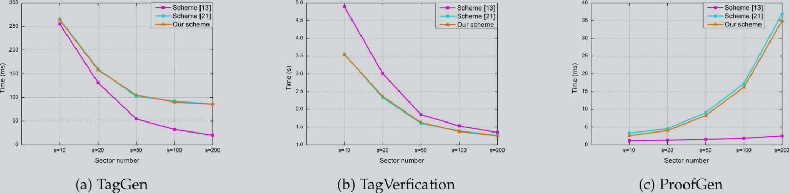
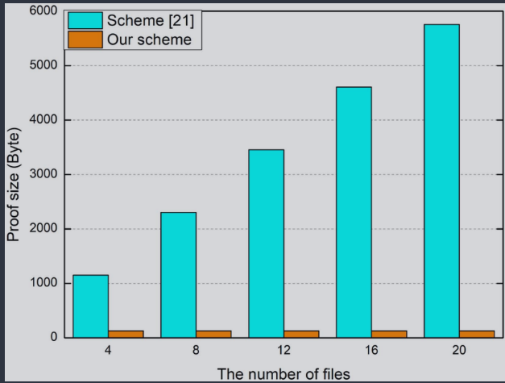
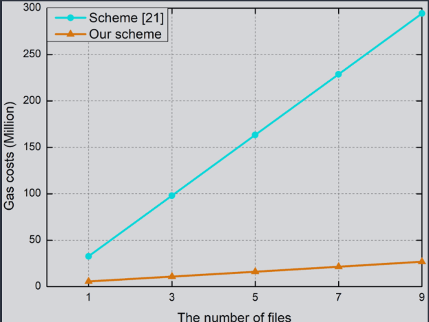

---
# ================= 全局配置 =================
theme: seriph
title: Efficient Blockchain-Based Data Integrity Auditing  for Multi-Copy in Decentralized Storage
info: |
  ## Slidev Presentation
  Presentation slides for developers.
transition: slide-left
mdc: true

layout: cover
hideInToc: true
background: https://cover.sli.dev
class: text-center
---

# Efficient Blockchain-Based Data Integrity Auditing  for Multi-Copy in Decentralized Storage

  IEEE Transactions on Dependable and Secure Computing(2023)

汇报人：张松伟
日期：1.30

---
hideInToc: true
layout: center
class: text-center
---

# 目录

<Toc minDepth="1" maxDepth="1" />

---
layout: default
---

# 方案背景

  在去中心化网络存储时代，<b>信息安全性</b>是核心挑战。
   
  目前的审计方案（PDP/POR）虽然解决了部分问题，但在<b>多副本存储</b>场景下存在漏洞：
  云服务商可能内部勾结，只存一份数据却收取多份费用。

  🚫 现存方案的三大核心缺陷

  

    
🤝

    
第三方不可信

    

      引入第三方审计员(TPA)带来了新的信任风险，审计员可能并不中立。
    

  

  

    
🛑

    
服务单点故障

    

      审计完全依赖第三方，一旦其发生故障，审计服务将完全停滞。
    

  

  

    
🛡️

    
信任假设不可靠

    

      预设“云管理者与服务商是诚实的”这一前提在现实中往往不成立。
    

  

---
layout: default
---

# 基础技术介绍

本方案基于以下两个核心密码学原语：

🧩

<h3 class="text-2xl font-bold text-blue-800 mb-4">PCS-PLONK</h3>

核心逻辑：

将程序的正确执行转化为<b>多项式约束问题</b>(Arithmetization)。

关键作用：

利用多项式承诺，验证者只需付出<b>极小的计算代价</b>，即可验证复杂逻辑是否成立。

📦

<h3 class="text-2xl font-bold text-purple-800 mb-4">PCS-MPAP</h3>

面临挑战：

涉及<b>多个多项式</b>在<b>多个点</b>上的验证，逐一证明效率极低。

解决方案：

<b>批量聚合证明 (Batching)</b>。一次性打包所有约束关系，大幅降低通信和验证开销。

---
layout: default
hideInToc: false
---

# PCS 方案全流程演示

1. Setup (初始化)
生成公开参数 SRS

⚙️

2. Commit (承诺)
P 计算多项式指纹

🔒

3. Open (打开)
V 发起挑战，P 生成证据

🧾

4. Verify (验证)
V 执行双线性配对检查

✅

Math Walkthrough: &alpha; = 5
Mocking KZG Protocol

1. Setup (上帝视角)

秘密参数: <b class="text-red-400">&alpha; = 5</b> (生成后立即销毁)

公开参数 SRS (映射到群上):

SRS0 = g1, SRS1 = g5, SRS2 = g25

2. Commit (Prover 计算)

多项式: <i>f1</i> = X+2, &nbsp; <i>f2</i> = 3X

利用 SRS 计算承诺 (盲算):

C1 = (g1)2 · (g5)1 = g2+5 = <b class="text-blue-300">g7</b>

C2 = (g1)0 · (g5)3 = <b class="text-blue-300">g15</b>

3. Create Witness (生成证据)

挑战点: <b>z=2</b>, 聚合权重 <b>v=4</b>

计算值: y1=4, y2=6

构造聚合多项式 & 商:

h(X) = (X-2) + 4(3X-6) = 13(X-2)

商 q(X) = h(X) / (X-2) = <b>13</b>

证据 W = (SRS0)13 = <b class="text-yellow-300">g13</b>

4. Verify (Verifier 验证)

聚合承诺: Cagg = g7·(g15)4 = g67

承诺差: D = g67 · g-28 = <b class="text-green-300">g39</b>

双线性配对检查: e(D, g) =? e(W, g&alpha;-z)

e(g39, g1) == e(g13, g3)

39 == 13 × 3 (成功)

---
layout: default
---

# 方案逻辑

  

---
layout: default
hideInToc: false
---

# 方案内容

本方案主要包含以下三个核心实施阶段：

  

    
🛠️

    <h3 class="text-xl font-bold text-blue-700 mb-4">1. 初始化阶段</h3>
    <ul class="list-none pl-0 space-y-2 text-sm opacity-90">
      <li class="flex items-center gap-2">
        

 密钥生成
      </li>
      <li class="flex items-center gap-2">
        

 副本生成
      </li>
      <li class="flex items-center gap-2">
        

 标签生成
      </li>
      <li class="flex items-center gap-2">
        

 标签验证
      </li>
    </ul>
  

  

    
🔍

    <h3 class="text-xl font-bold text-purple-700 mb-4">2. 审计阶段</h3>
    <ul class="list-none pl-0 space-y-2 text-sm opacity-90">
      <li class="flex items-center gap-2">
        

 区块链生成挑战
      </li>
      <li class="flex items-center gap-2">
        

 SSP生成自己的证明
      </li>
      <li class="flex items-center gap-2">
        

 智能合约自动验证
      </li>
    </ul>
  

  

    
⚡

    <h3 class="text-xl font-bold text-emerald-700 mb-4">3. 高效审计方案</h3>
    <ul class="list-none pl-0 space-y-2 text-sm opacity-90">
      <li class="flex items-center gap-2">
        

 挑战生成 (优化)
      </li>
      <li class="flex items-center gap-2">
        

 证明生成 (聚合)
      </li>
      <li class="flex items-center gap-2">
        

 智能合约证明验证
      </li>
    </ul>
  

---
layout: default
hideInToc: true
---

# 初始化阶段

## 1. 密钥生成

> $pk:=(v=g^x,u=g^{\alpha x},g,g^{\alpha},g^{{\alpha}^2}...g^{{\alpha}^{s-1}})$
>
> $sk:=(x,\alpha)$；$x,\alpha \in Z_p^*$
>
> 其中，公钥中的 $s$ 指文件副本个数；$x$ 是真正的私钥，$\alpha$ 是系统私钥，生成公钥之后就立即销毁。

## 2. 副本生成

> 副本计算：$Copy_i = \{m_{i,j,k}\}(1\le i \le N,1\le j\le n,1\le k\le s)$
>
>其中$m_{ijk}=E_K(b_{jk}||i)$，$b_{jk}$表示文件中第j块，第k个扇区。

## 3. 生成文件块标签

> $$\sigma_{ij} = (H(F_{id}||i||j)*g^{f_{m_{i,j}}(\alpha)})^x$$

其中 $f_{m_{i,j}}(\alpha)$ 由文件的第 $i$ 个副本的第 $j$ 个文件块的 $s$ 个块的扇区组成：

> $$f_{m_{i,j}}(X) = \sum_{k=1}^{s}m_{i,j,k}\cdot X^{k-1}$$

---
layout: default
hideInToc: true
---
# 初始化阶段
## 4. SSP验证标签
>`SSPi`需要对与用户提交的文件块标签进行验证,验证配对函数
>
$$e(\sigma_{ij}, g) = e\left( H(F_{id} \| i \| j) \cdot g^{f_{m_{ij}}(\alpha)}, v \right)$$
>
>由$\sigma_{ij} = (H(F_{id}||i||j)*g^{f_{m_{i,j}(\alpha)}})^x$带入$e(\sigma_{ij},g)$,  $g^x = v$可以直接得到：

$$e((H(F_{id}||i||j)*g^{f_{m_{i,j}(\alpha)}})^x,g) = e((H(F_{id}||i||j)*g^{f_{m_{i,j}(\alpha)}}),g^x)$$

---
layout: default
hideInToc: true
---

# 审计阶段

## 1. 生成挑战 $ChalGen(P ara, nounce) \to chal(Q,r,\gamma)$

>其中， 集合$Q = {(a_j,v_j)}$,$a_j$表示需要认证文件块的下标，$v_j$表示这个块对应的计算权重系数。
>
>r为PCS的评估点，$\gamma$用于隐藏直接生成的信息。这两个参数都是为随机生成的参数。

## 2. SSP证明生成$Proof_i(\sigma_i, w_i, s_i, R_i)$

>根据集合Q的权重与下标集合，进行聚合SSPi的认证标签

>$$\sigma_i = \left( \prod_{j=1}^{c} \sigma_{i a_j}^{v_j} \right)^{\gamma^{i-1}}$$

>计算挑战多项式
>$$f_{M_i}(X) = \sum_{j=1}^{c} v_j \cdot f_{m_{ia_j}}(X)$$
>
>其中，$f_{m_{ia_j}}(X)$计算方式为：
>$f_{m_{i,j}}(X) = \sum_{k=1}^{s}m_{i,j,k}*X^{k-1}$

---
layout: default
hideInToc: true
---

## 2. SSP证明生成$Proof_i(\sigma_i, w_i, s_i, R_i)$
>商多项式计算
>$$h_i(X) = \gamma^{i-1} \cdot \frac{f_{M_i}(X) - f_{M_i}(r)}{X - r}$$
>这个商多项式，后续用来计算在秘密私钥$\alpha$处的数值，即$w_i = g^{h_i(\alpha)}$.

>对于构造的信息进行隐藏
>
>$$\begin{cases}
s'_i = \gamma^{i-1} \cdot f_{M_i}(r) \\
R_i = v^{\varepsilon_i} = (g^x)^{\varepsilon_i} \\
s_i = s'_i + \varepsilon_i \cdot H'(R_i)
\end{cases}$$
>
>输出：$Proof_i = (\sigma_i, w_i, s_i, R_i)$

---
layout: default
hideInToc: true
---

## 3.合约自动验证：$Verify(pk, \{Proof_i\}, chal) \to result$
>计算文件配对函数：
>
>$$e(\sigma \cdot \eta, g) \cdot e(g^{-s}, v) = e(P, v) \cdot e(w, u \cdot v^{-r})$$

>计算单个文件块的配对函数：
>
>$$e(\sigma_i \cdot \eta_i, g) \cdot e(g^{-s_i}, v) = e(P_i, v) \cdot e(w_i, u \cdot v^{-r})$$

>其中，参数$\eta = \prod_{i=1}^{N} R_i^{H'(R_i)}$,$\eta_i =  R_i^{H'(R_i)}$;
>$w_i = g^{h_i(\alpha)}$,$w=\prod_{j=1}^dw_i$
>
>参数$P$计算：
>
>$$P=\prod_{i=1}^N(\prod_{j=1}^cH(F_{id}||i||j)^{v_j})^{\gamma^{i-1}}$$
>
>参数$P_i$计算:
>
>$$P_i = (\prod_{j=1}^cH(F_{id}||i||j)^{v_j})^{\gamma^{i-1}}$$

---
layout: default
hideInToc: true
---

# 高效审计(多文件审计)

## 1. 挑战生成：$ChalGen(Para, nounce) \rightarrow chal$
>$$chal = (\{Q_l\}, \{r_l\}, \gamma, z)$$
>
>$\{Q_l\}$是随机挑战集合，$\{r_l\}$是评估点的集合，$\gamma, z \in Z_p$

## 2.证明生成：$ProofGen(chal, \{f_{l, m_{ij}}(X)\}, pk) \rightarrow Proof_i$
>生成聚合认证标签：
>
>$$\sigma'_i = \prod_{l=1}^{d} \left( \prod_{\{a_j, v_j\} \in Q_l} \sigma_{l, i a_j}^{v_j} \right)^{\beta_l}$$

>计算参数多项式：
>
>$$\begin{cases}
F_i(X) = & \sum_{l=1}^{d} \gamma^{l-1} \cdot Z_{T \setminus S_l}(X)
\cdot (F_{l,M_i}(X) - F_{l,M_i}(r_l)) \\
H_i(X) = & \frac{F_i(X)}{Z_T(X)} \\
L_i(X) = & \sum_{l=1}^{d} \beta_l \cdot (F_{l,M_i}(X) - F_{l,M_i}(r_l))- Z_T(z) \cdot H_i(X)
\end{cases}$$

---
layout: default
hideInToc: true
---
## 2. 证明生成
>$$F_{l,M_i}(X) = \sum_{\{a_j,v_j\}\in Q_l} v_j \cdot f_{l,m_{ia_j}}(X)$$
>其中的$f_{l,m_{ia_j}}(X)$表示第$l$个文件的第$i$个副本$a_j$块的多项式，公式为：$f_{m_{ij}}(X) = \sum_{k=1}^{s} m_{ijk} \cdot X^{k-1}$
>
>$Z_S := \prod_{z \in S} (X - z)$
>
>$\beta_l = \gamma^{l-1} \cdot Z_{T \setminus S_l}(z)$

>计算证明参数：
>$$\begin{cases}
W_i = g^{H_i(\alpha)} \\
W'_i = g^{\frac{L_i(\alpha)}{\alpha-z}} \\
E_i = \sum_{l=1}^{d} \beta_l \cdot S_{l,i}
\end{cases}$$
>
>输出：$Proof_i = (\sigma'_i, W_i, W'_i, E_i)$

---
layout: default
hideInToc: true
---
## 3. 合约证明验证
>计算聚合参数：
>$$\begin{cases}
W = \prod_{i=1}^{N} W_i \\
W' = \prod_{i=1}^{N} W'_i \\
E = \sum_{i=1}^{N} E_i \\
\sigma' = \prod_{i=1}^{N} \sigma'_i
\end{cases}$$

>整体验证配对函数：
>
>$$e(\sigma', g) \cdot e(\psi, v) = e(\zeta, v) \cdot e(W', u \cdot v^{-z})$$
>其中，$\psi = g^{-E} \cdot W^{-Z_T(z)}$,$\zeta = \prod_{i=1}^{N} \prod_{l=1}^{d} \left( \prod_{\{v_j\} \in Q_l} H(F_{id} \| i \| j)^{v_j} \right)^{\beta_l}$

>单个证明配对验证(配对失败可以进行节点处罚):
>$$e(\sigma'_i, g) \cdot e(\psi_i, v) = e(\zeta_i, v) \cdot e(W'_i, u \cdot v^{-z})$$
>其中参数计算，$\psi_i=g^{-E_i} \cdot W_i^{-Z_T(z)}$,$\zeta_i = \prod_{l=1}^{d} \left( \prod_{\{v_j\} \in Q_l} H(F_{id} \| i \| j)^{v_j} \right)^{\beta_l}$

---
layout: default
hideInToc: false
---
# 实验结果
## Baseline
- Enabling secure and efficient decentralized storage auditing with blockchain
>只能验证一个副本。
- Efficient identity-based provable multi-copy data possession in multi-cloud storage
>基于数据持有性证明协议，但是副本都存储在同一个服务器上，验证时，需要对于副本分别验证，效率低下。
- 本文优势
> - 可以进行聚合计算，不需要对于各个副本进行单独计算。
> - 生成的证明大小固定，不随着文件数量的增多而增大。

- 本文不足
> - 设计的生成的证明大小确实固定，但是如果对于单个文件进行证明文件验证的代价比较大，文件越多，相对来说每个文件副本的代价就越小。
> - 智能合约运行双线性配对函数的开销比较大。
> - 性能对于扇区数量s依赖性高，需要权衡并自行调整s的大小，由于扇区大小固定，每一块的扇区数量增加，那么块会减少，然后认证标签就会减少，减少了标签生成与验证的时间，但是增加了证明生成的时间。

---
layout: default
hideInToc: true
---
# 参数生成时间
>优势就是证明生成的快一点。
>

---
layout: default
hideInToc: true
---

# 证明生成大小

